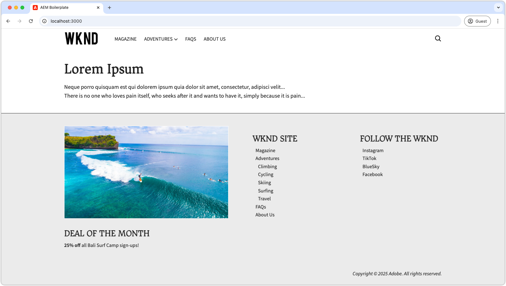
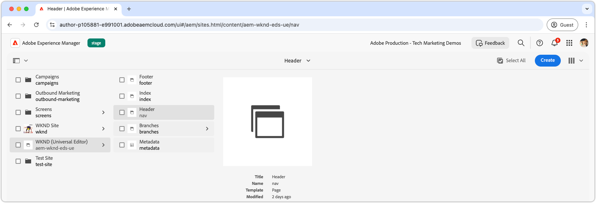
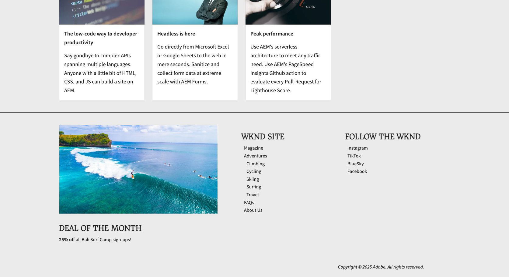

# Een kop- en voettekst ontwikkelen

{align="center"}

Kop- en voetteksten spelen een unieke rol in Edge Delivery Services (EDS), omdat ze rechtstreeks zijn gebonden aan de HTML `<header>` - en `<footer>` -elementen. In tegenstelling tot gewone pagina-inhoud worden ze afzonderlijk beheerd en kunnen ze onafhankelijk worden bijgewerkt zonder dat de gehele paginacache moet worden gewist. Tijdens de implementatie ervan in het codeproject leven als blokken onder `blocks/header` en `blocks/footer` , kunnen auteurs hun inhoud bewerken via speciale AEM-pagina&#39;s die elke combinatie van blokken kunnen bevatten.

## Koptekstblok

{align="center"}

De header is een speciaal blok dat is gebonden aan het Edge Delivery Services HTML `<header>` -element.
Het element `<header>` wordt leeg geleverd en via XHR (AJAX) gevuld naar een aparte AEM-pagina.
Hierdoor kan de koptekst onafhankelijk van pagina-inhoud worden beheerd en worden bijgewerkt zonder dat een volledige cache van alle pagina&#39;s hoeft te worden gewist.

Het headerblok is verantwoordelijk voor het aanvragen van het AEM-paginafragment dat de koptekstinhoud bevat, en het renderen ervan in het `<header>` -element.

[!BADGE &#x200B; /blocks/header/header.js]{type=Neutral tooltip="Bestandsnaam van codevoorbeeld hieronder."}

```javascript
import { getMetadata } from '../../scripts/aem.js';
import { loadFragment } from '../fragment/fragment.js';

...

export default async function decorate(block) {
  // load nav as fragment

  // Get the path to the AEM page fragment that defines the header content from the <meta name="nav"> tag. This is set via the site's Metadata file.
  const navMeta = getMetadata('nav');

  // If the navMeta is not defined, use the default path `/nav`.
  const navPath = navMeta ? new URL(navMeta, window.location).pathname : '/nav';

  // Make an XHR (AJAX) call to request the AEM page fragment and serialize it to a HTML DOM tree.
  const fragment = await loadFragment(navPath);
  
  // Add the content from the fragment HTML to the block and decorate it as needed
  ...
}
```

De functie `loadFragment()` doet een XHR (AJAX)-verzoek aan `${navPath}.plain.html` dat een EDS HTML-uitvoering van de HTML-pagina van de AEM-pagina retourneert die bestaat in de `<main>` -tag van de pagina, de inhoud verwerkt met de blokken die deze kan bevatten en de bijgewerkte DOM-structuur retourneert.

## Auteur van de koptekstpagina

Voordat u het headerblok gaat ontwikkelen, moet u eerst de inhoud ervan in de Universal Editor schrijven om iets tegen te gaan.

De koptekstinhoud woont in een speciale AEM-pagina met de naam `nav` .

{align="center"}

De koptekst schrijven:

1. De pagina `nav` openen in de Universal Editor
1. Vervang de standaardknoop met een **blok van het Beeld** die het embleem WKND bevatten
1. Werk het navigatiemenu in het **blok van de Tekst** door bij:
   - De gewenste navigatiekoppelingen toevoegen
   - Subnavigatie-items maken waar nodig
   - Alle koppelingen naar de startpagina (`/`) instellen

{align="center"}

### Publiceren voor voorvertoning

Met de pagina van de Kopbal die wordt bijgewerkt, [ publiceert de pagina aan voorproef ](../6-author-block.md).

Aangezien de koptekstinhoud op een eigen pagina staat (de `nav` -pagina), moet u die pagina specifiek publiceren voordat de koptekstwijzigingen van kracht worden. Als u andere pagina&#39;s publiceert die de koptekst gebruiken, wordt de koptekstinhoud op Edge Delivery Services niet bijgewerkt.

## HTML blokkeren

Om blokontwikkeling te beginnen, begin door de DOM structuur te herzien die door de voorproef van Edge Delivery Services wordt blootgesteld. Het DOM wordt uitgebreid met JavaScript en is opgemaakt met CSS, waardoor de basis wordt gelegd voor het maken en aanpassen van het blok.

Omdat de koptekst als een fragment wordt geladen, moeten we de HTML onderzoeken die door het XHR-verzoek wordt geretourneerd nadat deze in de DOM is geïnjecteerd en via `loadFragment()` is versierd. Dit kan worden gedaan door DOM in de ontwikkelaarshulpmiddelen van browser te inspecteren.


>[!BEGINTABS]

>[!TAB  DOM om te versieren ]

Hier volgt de HTML van de koptekstpagina nadat deze is geladen met behulp van de meegeleverde `header.js` en in de DOM is geïnjecteerd:

```html
<header class="header-wrapper">
  <div class="header block" data-block-name="header" data-block-status="loaded">
    <div class="nav-wrapper">
      <nav id="nav" aria-expanded="true">
        <div class="nav-hamburger">
          <button type="button" aria-controls="nav" aria-label="Close navigation">
            <span class="nav-hamburger-icon"></span>
          </button>
        </div>
        <div class="section nav-brand" data-section-status="loaded" style="">
          <div class="default-content-wrapper">
            <p class="">
              <a href="#" title="Button" class="">Button</a>
            </p>
          </div>
        </div>
        <div class="section nav-sections" data-section-status="loaded" style="">
          <div class="default-content-wrapper">
            <ul>
              <li aria-expanded="false">Examples</li>
              <li aria-expanded="false">Getting Started</li>
              <li aria-expanded="false">Documentation</li>
            </ul>
          </div>
        </div>
        <div class="section nav-tools" data-section-status="loaded" style="">
          <div class="default-content-wrapper">
            <p>
              <span class="icon icon-search">
                
              </span>
            </p>
          </div>
        </div>
      </nav>
    </div>
  </div>
</header>
```

>[!TAB hoe te om DOM  te vinden]

Het element `<header>` van de pagina zoeken en inspecteren in de webbrowser-ontwikkelaarsgereedschappen.

{align="center"}

>[!ENDTABS]


## JavaScript blokkeren

Het `/blocks/header/header.js` dossier van het [ AEM Boilerplate XWalk projectmalplaatje ](https://github.com/adobe-rnd/aem-boilerplate-xwalk) verstrekt JavaScript voor navigatie, met inbegrip van dropdown menu&#39;s en een ontvankelijke mobiele mening.

Hoewel het script van `header.js` vaak sterk is aangepast aan het ontwerp van een site, is het van essentieel belang dat de eerste regels in `decorate()` worden behouden, die het fragment van de koptekstpagina ophalen en verwerken.

[!BADGE &#x200B; /blocks/header/header.js]{type=Neutral tooltip="Bestandsnaam van codevoorbeeld hieronder."}

```javascript
export default async function decorate(block) {
  // load nav as fragment
  const navMeta = getMetadata('nav');
  const navPath = navMeta ? new URL(navMeta, window.location).pathname : '/nav';
  const fragment = await loadFragment(navPath);
  ...
```

De resterende code kan worden aangepast aan de behoeften van uw project.

Afhankelijk van de koptekstvereisten kan de tekstbouwsteencode worden aangepast of verwijderd. In deze zelfstudie gebruiken we de meegeleverde code en verbeteren we deze door een hyperlink toe te voegen rondom de eerste ontwerpafbeelding en deze te koppelen aan de homepage van de site.

De code van de sjabloon verwerkt het fragment van de koptekstpagina, ervan uitgaande dat het bestaat uit drie secties in de volgende volgorde:

1. **de sectie van het Merk** - bevat het embleem en is gestileerd met de `.nav-brand` klasse.
2. **sectie van Secties** - bepaalt het belangrijkste menu van de plaats en is gestileerd met `.nav-sections`.
3. **sectie van Hulpmiddelen** - omvat elementen zoals onderzoek, login/logout, en profiel, gestileerd met `.nav-tools`.

Als u de afbeelding van het logo wilt koppelen aan de startpagina, werkt u het blok JavaScript als volgt bij:

>[!BEGINTABS]

>[!TAB  Bijgewerkte JavaScript ]

De bijgewerkte code die de logoafbeelding met een koppeling naar de homepage van de site (`/`) verpakt, wordt hieronder weergegeven:

[!BADGE &#x200B; /blocks/header/header.js]{type=Neutral tooltip="Bestandsnaam van codevoorbeeld hieronder."}

```javascript
export default async function decorate(block) {

  ...
  const navBrand = nav.querySelector('.nav-brand');
  
  // WKND: Turn the picture (image) into a linked site logo
  const logo = navBrand.querySelector('picture');
  
  if (logo) {
    // Replace the first section's contents with the authored image wrapped with a link to '/' 
    navBrand.innerHTML = `<a href="/" aria-label="Home" title="Home" class="home">${logo.outerHTML}</a>`;
    // Make sure the logo is not lazy loaded as it's above the fold and can affect page load speed
    navBrand.querySelector('img').settAttribute('loading', 'eager');
  }

  const navSections = nav.querySelector('.nav-sections');
  if (navSections) {
    // WKND: Remove Edge Delivery Services button containers and buttons from the nav sections links
    navSections.querySelectorAll('.button-container, .button').forEach((button) => {
      button.classList = '';
    });

    ...
  }
  ...
}
```

>[!TAB  Oorspronkelijke JavaScript ]

Hieronder ziet u het origineel `header.js` dat op basis van de sjabloon is gegenereerd:

[!BADGE &#x200B; /blocks/header/header.js]{type=Neutral tooltip="Bestandsnaam van codevoorbeeld hieronder."}

```javascript
export default async function decorate(block) {
  ...
  const navBrand = nav.querySelector('.nav-brand');
  const brandLink = navBrand.querySelector('.button');
  if (brandLink) {
    brandLink.className = '';
    brandLink.closest('.button-container').className = '';
  }

  const navSections = nav.querySelector('.nav-sections');
  if (navSections) {
    navSections.querySelectorAll(':scope .default-content-wrapper > ul > li').forEach((navSection) => {
      if (navSection.querySelector('ul')) navSection.classList.add('nav-drop');
      navSection.addEventListener('click', () => {
        if (isDesktop.matches) {
          const expanded = navSection.getAttribute('aria-expanded') === 'true';
          toggleAllNavSections(navSections);
          navSection.setAttribute('aria-expanded', expanded ? 'false' : 'true');
        }
      });
    });
  }
  ...
}
```

>[!ENDTABS]


## CSS blokkeren

Werk `/blocks/header/header.css` bij om het op te maken volgens het merk van WKND.

We voegen de aangepaste CSS onder aan `header.css` toe om de zelfstudie beter te kunnen zien en begrijpen. Hoewel deze stijlen rechtstreeks in de CSS-regels van de sjabloon kunnen worden geïntegreerd, kunt u met behulp van afzonderlijke stijlen zien wat is gewijzigd.

Aangezien we onze nieuwe regels toevoegen na de oorspronkelijke set, laten we ze omlopen met een `header .header.block nav` CSS-kiezer om ervoor te zorgen dat ze voorrang hebben op de sjabloonregels.

[!BADGE &#x200B; /blocks/header/header.css]{type=Neutral tooltip="Bestandsnaam van codevoorbeeld hieronder."}

```css
/* /blocks/header/header.css */

... Existing CSS generated by the template ...

/* Add the following CSS to the end of the header.css */

/** 
* WKND customizations to the header 
* 
* These overrides can be incorporated into the provided CSS,
* however they are included discretely in thus tutorial for clarity and ease of addition.
* 
* Because these are added discretely
* - They are added to the bottom to override previous styles.
* - They are wrapped in a header .header.block nav selector to ensure they have more specificity than the provided CSS.
* 
**/

header .header.block nav {
  /* Set the height of the logo image.
     Chrome natively sets the width based on the images aspect ratio */
  .nav-brand img {
    height: calc(var(--nav-height) * .75);
    width: auto;
    margin-top: 5px;
  }
  
  .nav-sections {
    /* Update menu items display properties */
    a {
      text-transform: uppercase;
      background-color: transparent;
      color: var(--text-color);
      font-weight: 500;
      font-size: var(--body-font-size-s);
    
      &:hover {
        background-color: auto;
      }
    }

    /* Adjust some spacing and positioning of the dropdown nav */
    .nav-drop {
      &::after {
        transform: translateY(-50%) rotate(135deg);
      }
      
      &[aria-expanded='true']::after {
        transform: translateY(50%) rotate(-45deg);
      }

      & > ul {
        top: 2rem;
        left: -1rem;      
       }
    }
  }
```

## Ontwikkelvoorbeeld

Naarmate de CSS en JavaScript worden ontwikkeld, laadt de lokale ontwikkelomgeving van de AEM CLI de wijzigingen warm en gemakkelijk, zodat u snel en gemakkelijk kunt zien hoe code van invloed is op het blok. Houd de muisaanwijzer boven de CTA en controleer of de afbeelding van de taser in- en uitzoomt.

{align="center"}

## Uw code plaatsen

Zorg ervoor aan [ vaak ](../3-local-development-environment.md#linting) uw codescheidingen om het schoon en verenigbaar te houden. Regelmatige lijnen helpen vangstkwesties vroeg, die algemene ontwikkelingstijd verminderen. U kunt uw ontwikkelingswerk pas samenvoegen in de `main` -vertakking als alle problemen met koppelingen zijn opgelost.

```bash
# ~/Code/aem-wknd-eds-ue

$ npm run lint
```

## Voorvertoning in Universal Editor

Als u wijzigingen wilt weergeven in de AEM Universal Editor, voegt u deze toe, past u ze toe en duwt u ze door naar de vertakking Git-opslagplaats die door de Universal Editor wordt gebruikt. Dit zorgt ervoor dat de blokimplementatie de ontwerpervaring niet verstoort.

```bash
# ~/Code/aem-wknd-eds-ue

$ git add .
$ git commit -m "CSS and JavaScript implementation for Header block"
# JSON files are compiled automatically and added to the commit via a Husky pre-commit hook
$ git push origin header-and-footer
```

De wijzigingen zijn nu zichtbaar in de Universal Editor wanneer u de query-parameter `?ref=header-and-footer` gebruikt.

{align="center"}

## Voettekst

Net als de koptekst wordt de voettekstinhoud geschreven op een specifieke AEM-pagina, in dit geval de pagina Voettekst (`footer`). De voettekst volgt hetzelfde patroon van laden als een fragment en versierd met CSS en JavaScript.

>[!BEGINTABS]

>[!TAB  Voettekst ]

De voettekst moet worden geïmplementeerd met een lay-out met drie kolommen die het volgende bevat:

- Een linkerkolom met een promotie (afbeelding en tekst)
- Een middelste kolom met navigatiekoppelingen
- Een rechterkolom met koppelingen naar sociale media
- Een rij onderaan die alle drie kolommen met het auteursrecht overspannen

{align="center"}

>[!TAB  Voettekstinhoud ]

Gebruik het kolomblok in de Voettekst om het effect met drie kolommen te maken.

| Kolom 1 | Kolom 2 | Kolom 3 |
| ---------|----------------|---------------|
| Afbeelding | Kop 3 | Kop 3 |
| Tekst | Lijst met koppelingen | Lijst met koppelingen |

{align="center"}

>[!TAB  Voettekstcode ]

In de CSS hieronder wordt het voettekstblok met een lay-out van drie kolommen, een consistente spatiëring en een typografie gevuld. In de voettekstimplementatie wordt alleen de JavaScript gebruikt die door de sjabloon wordt verschaft.

[!BADGE &#x200B; /blocks/footer/footer.css]{type=Neutral tooltip="Bestandsnaam van codevoorbeeld hieronder."}

```css
/* /blocks/footer/footer.css */

footer {
  background-color: var(--light-color);

  .block.footer {
    border-top: solid 1px var(--dark-color);
    font-size: var(--body-font-size-s);

    a { 
      all: unset;
      
      &:hover {
        text-decoration: underline;
        cursor: pointer;
      }
    }

    img {
      width: 100%;
      height: 100%;
      object-fit: cover;
      border: solid 1px white;
    }

    p {
      margin: 0;
    }

    ul {
      list-style: none;
      padding: 0;
      margin: 0;

      li {
        padding-left: .5rem;
      }
    }

    & > div {
      margin: auto;
      max-width: 1200px;
    }

    .columns > div {
      gap: 5rem;
      align-items: flex-start;

      & > div:first-child {
        flex: 2;
      }
    }

    .default-content-wrapper {
      padding-top: 2rem;
      margin-top: 2rem;
      font-style: italic;
      text-align: right;
    }
  }
}

@media (width >= 900px) {
  footer .block.footer > div {
    padding: 40px 32px 24px;
  }
}
```


>[!ENDTABS]

## Gefeliciteerd!

U hebt nu onderzocht hoe kop- en voetteksten worden beheerd en ontwikkeld in Edge Delivery Services en Universal Editor. Je hebt geleerd hoe ze zijn:

- Gemaakt op speciale AEM-pagina&#39;s apart van de hoofdinhoud
- asynchroon geladen als fragmenten om onafhankelijke updates mogelijk te maken
- Decoratief met JavaScript en CSS om responsieve navigatie-ervaringen te creëren
- Naadloos geïntegreerd met de Universal Editor voor eenvoudig contentbeheer

Dit patroon biedt een flexibele en onderhoudsvriendelijke aanpak voor het implementeren van voor de hele site geldende navigatiecomponenten.

Voor meer beste praktijken en geavanceerde technieken, controleer de [ Universele documentatie van de Redacteur ](https://experienceleague.adobe.com/en/docs/experience-manager-cloud-service/content/edge-delivery/wysiwyg-authoring/create-block#block-options).
