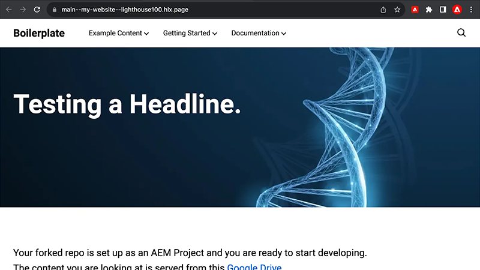
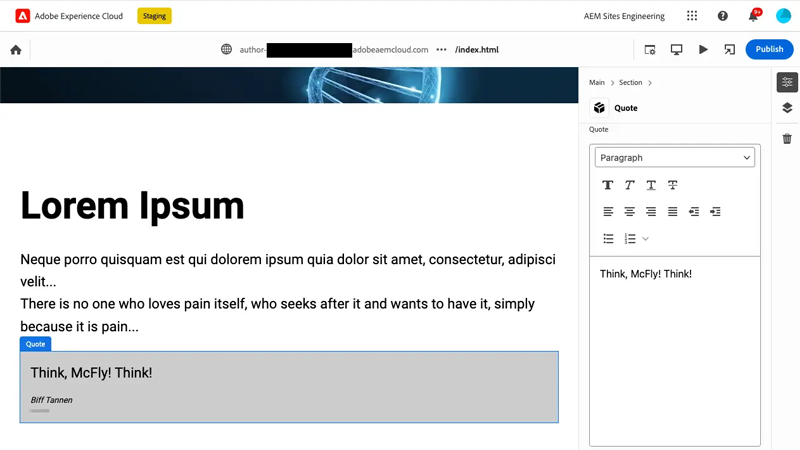

# Video&#39;s over Edge Delivery Services

Leer hoe u websites snel kunt maken met Edge Delivery Services.

>[!VIDEO](https://video.tv.adobe.com/v/3427989/?learn=on)

Herzie de [ documentatie ](https://experienceleague.adobe.com/en/docs/experience-manager-cloud-service/content/edge-delivery/overview) voor volledige details van Edge Delivery Services en zijn mogelijkheden.

## Zelfstudies voor ontwikkelaars van Edge Delivery Services

    <!-- Document-based authoring -->
    

      

        

          <figure class="image is-16by9">
            
          </figure>
        

        

          

            

              <a href="https://experienceleague.adobe.com/en/docs/experience-manager-cloud-service/content/edge-delivery/build/tutorial" title="Zelfstudie voor op documenten gebaseerde ontwerpwebsites"> op document-Gebaseerd het auteursrecht van de website zelfstudie </a>
            

            
Leer hoe u websites voor Edge Delivery Services maakt die zijn gemaakt met documentgebaseerde ontwerpfuncties.

            <a href="https://experienceleague.adobe.com/en/docs/experience-manager-cloud-service/content/edge-delivery/build/tutorial" class="spectrum-Button
              spectrum-Button--outline spectrum-Button--primary
              spectrum-Button--sizeM">
               Begin het leerprogramma 
            </a>
          

        

      

    

    <!-- Universal Editor -->
    

      

        

          <figure class="image is-16by9">
            
          </figure>
        

        

          

            

              <a href="https://experienceleague.adobe.com/en/docs/experience-manager-cloud-service/content/edge-delivery/wysiwyg-authoring/edge-dev-getting-started" title="Zelfstudie voor Universal Editor-website"> Universele de Websiteluzelfstudie van de Redacteur </a>
            

            
Leer hoe u websites voor Edge Delivery Services maakt die zijn gemaakt met Universal Editor.

            <a href="https://experienceleague.adobe.com/en/docs/experience-manager-cloud-service/content/edge-delivery/wysiwyg-authoring/edge-dev-getting-started" class="spectrum-Button
              spectrum-Button--outline spectrum-Button--primary
              spectrum-Button--sizeM">
               Begin het leerprogramma 
            </a>
          

        

      

    
    
  

## Aan de slag met Edge Delivery Services

    <!-- Prerequisites -->
    

      

        

          <figure class="image is-16by9">
            
          </figure>
        

        

          

            
5 minuten

            

              <a href="./developing/prerequisites.md" title="Vereisten"> de eerste vereisten van de Ontwikkelaar </a>
            

            
Wat je nodig hebt om te ontwikkelen met Edge Delivery Services.

            <a href="./developing/prerequisites.md" class="spectrum-Button
              spectrum-Button--outline spectrum-Button--primary
              spectrum-Button--sizeM">
               bekijk de video 
            </a>
          

        

      

    
 
    <!-- Setting up your Repository-->
    

      

        

          <figure class="image is-16by9">
            
          </figure>
        

        

          

            
1 minuut

            

              <a href="./developing/aem-boilerplate.md" title="Boilerplate-sjabloon gebruiken"> AEM Boilerplate </a>
            

            
Gebruik het AEM Boilerplate-sjabloon om de gegevensopslagruimte voor code in te stellen.

            <a href="./developing/aem-boilerplate.md" class="spectrum-Button
              spectrum-Button--outline spectrum-Button--primary
              spectrum-Button--sizeM">
               bekijk de video 
            </a>
          

        

      

    

    <!-- Linking Google Drive -->
    

      

        

          <figure class="image is-16by9">
            
          </figure>
        

        

          

            
1 minuut

            

              <a href="./developing/content-repository.md" title="Google Drive koppelen"> de Aandrijving van Google van de Verbinding </a>
            

            
Gebruik Google Drive als opslagplaats voor alle inhoud.

            <a href="./developing/content-repository.md" class="spectrum-Button
              spectrum-Button--outline spectrum-Button--primary
              spectrum-Button--sizeM">
               bekijk de video 
            </a>
          

        

      

    

    <!-- Link Sharepoint --->
    

      

        

          <figure class="image is-16by9">
            
          </figure>
        

        

          

            
1 minuut

            

              <a href="./developing/content-repository.md" title="Sharepoint koppelen"> Verbinding SharePoint </a>
            

            
Gebruik SharePoint als opslagplaats voor al uw inhoud.

            <a href="./developing/content-repository.md"
              class="spectrum-Button spectrum-Button--outline
              spectrum-Button--primary spectrum-Button--sizeM">
               bekijk de video 
            </a>
          

        

      

    

    <!-- Previewing and Publishing Content -->
    

      

        

          <figure class="image is-16by9">
            
          </figure>
        

        

          

            
1 minuut

            

              <a href="./developing/preview-and-publish.md" title="Voorvertonen en Publish-inhoud"> Voorproef en publiceer inhoud </a>
            

            
Inhoud voorvertonen en publiceren met de AEM Sidekick.

            <a href="./developing/preview-and-publish.md" class="spectrum-Button
              spectrum-Button--outline spectrum-Button--primary
              spectrum-Button--sizeM">
               bekijk de video 
            </a>
          

        

      

    

    <!-- Using the Sidekick -->
    

      

        

          <figure class="image is-16by9">
            
          </figure>
        

        

          

            
1 minuut

            

              <a href="./developing/sidekick.md" title="De Sidekick gebruiken"> Gebruik de AEM Sidekick </a>
            

            
Leer hoe u de AEM Sidekick gebruikt.

            <a href="./developing/sidekick.md" class="spectrum-Button
              spectrum-Button--outline spectrum-Button--primary
              spectrum-Button--sizeM">
               bekijk de video 
            </a>
          

        

      

    

 <!-- Document Structure -->
    

      

        

          <figure class="image is-16by9">
            
          </figure>
        

        

          

            
1 minuut

            

              <a href="./developing/document-structure.md" title="Documentstructuur"> de structuur van het Document </a>
            

            
De documentstructuur verkennen, inclusief standaardinhoud, secties en blokken 

            <a href="./developing/document-structure.md" class="spectrum-Button
              spectrum-Button--outline spectrum-Button--primary
              spectrum-Button--sizeM">
               bekijk de video 
            </a>
          

        

      

    
  
     <!--Local Development -->
    

      

        

          <figure class="image is-16by9">
            
          </figure>
        

        

          

            
2 minuten

            

              <a href="./developing/local-development.md" title="Lokale ontwikkeling"> Lokale ontwikkeling </a>
            

            
Vorm uw lokale ontwikkelomgeving.

            <a href="./developing/local-development.md" class="spectrum-Button
              spectrum-Button--outline spectrum-Button--primary
              spectrum-Button--sizeM">
               bekijk de video 
            </a>
          

        

      

    

    <!--Integrate with Git -->
    

      

        

          <figure class="image is-16by9">
            
          </figure>
        

        

          

            
2 minuten

            

              <a href="./developing/git.md" title="Integreren met Git"> integreren met Git </a>
            

            
Configureer Git en Edge Delivery Services.

            <a href="./developing/git.md" class="spectrum-Button
              spectrum-Button--outline spectrum-Button--primary
              spectrum-Button--sizeM">
               bekijk de video 
            </a>
          

        

      

    

## Hoe kan ik-video&#39;s

    <!--Create RSS Feeds -->
    

      

        

          <figure class="image is-16by9">
            
          </figure>
        

        

          

            
2 minuten

            

              <a href="./how-to/rss.md" title="RSS-feeds maken"> creeer RSS- voer </a>
            

            
Leer hoe u RSS-feeds maakt.

            <a href="./how-to/rss.md" class="spectrum-Button
              spectrum-Button--outline spectrum-Button--primary
              spectrum-Button--sizeM">
               bekijk de video 
            </a>
          

        

      

    

    <!--Social Media Sharing -->
    

      

        

          <figure class="image is-16by9">
            
          </figure>
        

        

          

            
2 minuten

            

              <a href="./how-to/social-media-sharing.md" title="Delen van sociale media"> Sociale Media die </a> delen
            

            
Leer hoe u uw inhoud optimaliseert voor het delen van sociale media.

            <a href="./how-to/social-media-sharing.md" class="spectrum-Button
              spectrum-Button--outline spectrum-Button--primary
              spectrum-Button--sizeM">
               bekijk de video 
            </a>
          

        

      

    

    <!--Delete a Page -->
    

      

        

          <figure class="image is-16by9">
            
          </figure>
        

        

          

            
2 minuten

            

              <a href="./how-to/delete-page.md" title="Pagina&apos;s verwijderen"> het Schrappen van Pagina's </a>
            

            
Leer hoe u pagina's verwijdert.

            <a href="./how-to/delete-page.md" class="spectrum-Button
              spectrum-Button--outline spectrum-Button--primary
              spectrum-Button--sizeM">
               bekijk de video 
            </a>
          

        

      

    
    
  

