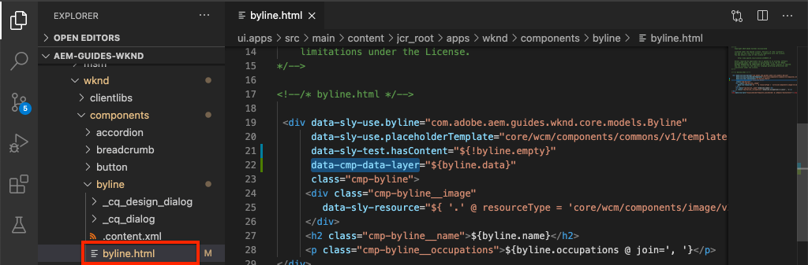
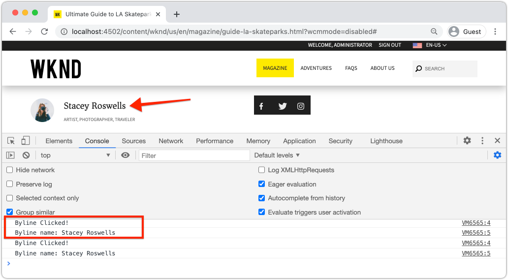

# De gegevenslaag voor de Adobe-client aanpassen met AEM componenten {#customize-data-layer}

Leer hoe u de gegevenslaag Adobe Client aanpast met inhoud van aangepaste AEM Componenten. Leer hoe te om APIs te gebruiken die door [AEM de Componenten van de Kern worden verstrekt om](https://experienceleague.adobe.com/docs/experience-manager-core-components/using/developing/data-layer/extending.html) uit te breiden en de gegevenslaag aan te passen.

## Wat u gaat maken


In dit leerprogramma zult u diverse opties onderzoeken om de Laag van Gegevens van de Cliënt van Adobe uit te breiden door WKND [Byline component](https://experienceleague.adobe.com/docs/experience-manager-learn/getting-started-wknd-tutorial-develop/custom-component.html) bij te werken. Dit is een douanecomponent en de lessen die in dit leerprogramma worden geleerd kunnen op andere douanecomponenten worden toegepast.

### Doelstellingen {#objective}

1. Injecteer componentgegevens in de gegevenslaag door een Sling Model en component HTML uit te breiden
1. Gebruik gegevenslaaghulpprogramma&#39;s van de Core Component om de inspanning te verminderen
1. Gegevenskenmerken van de kerncomponent gebruiken om deze aan te sluiten op bestaande gegevenslaaggebeurtenissen

## Vereisten {#prerequisites}

Een **lokale ontwikkelomgeving** is nodig om deze zelfstudie te voltooien. Screenshots en video worden gevangen gebruikend het AEM als Cloud Service SDK die op macOS loopt. Opdrachten en code zijn onafhankelijk van het lokale besturingssysteem, tenzij anders aangegeven.

**Nieuw bij AEM als Cloud Service?** Raadpleeg de  [volgende handleiding voor het instellen van een lokale ontwikkelomgeving met de AEM als Cloud Service-SDK](https://experienceleague.adobe.com/docs/experience-manager-learn/cloud-service/local-development-environment-set-up/overview.html).

**Nieuw bij AEM 6.5?** Raadpleeg de  [volgende handleiding voor het instellen van een lokale ontwikkelomgeving](https://experienceleague.adobe.com/docs/experience-manager-learn/foundation/development/set-up-a-local-aem-development-environment.html).

## De WKND-referentiesite downloaden en implementeren {#set-up-wknd-site}

Deze zelfstudie breidt de component Byline in de WKND-verwijzingssite uit. Klonen en de WKND-codebasis installeren in uw lokale omgeving.

1. Start een lokale QuickStart **auteur**-instantie van AEM die wordt uitgevoerd op [http://localhost:4502](http://localhost:4502).
1. Open een eindvenster en kloon de WKND codebasis gebruikend Git:

   ```shell
   $ git clone git@github.com:adobe/aem-guides-wknd.git
   ```

1. Implementeer de WKND-codebasis in een lokale instantie van AEM:

   ```shell
   $ cd aem-guides-wknd
   $ mvn clean install -PautoInstallSinglePackage
   ```

   >[!NOTE]
   >
   > Als u AEM 6.5 en het nieuwste servicepack gebruikt, voegt u het profiel `classic` toe aan de Maven-opdracht:
   >
   > `mvn clean install -PautoInstallSinglePackage -Pclassic`

1. Open een nieuw browservenster en meld u aan bij AEM. Open een pagina **Tijdschrift** als: [http://localhost:4502/content/wknd/us/en/magazine/guide-la-skateparks.html](http://localhost:4502/content/wknd/us/en/magazine/guide-la-skateparks.html).

   

   Er wordt een voorbeeld weergegeven van de component Naamregel die aan de pagina is toegevoegd als onderdeel van een ervaringsfragment. U kunt het fragment van de Ervaring op [http://localhost:4502/editor.html/content/experience-fragments/wknd/language-masters/en/contributors/stacey-roswells/byline.html](http://localhost:4502/editor.html/content/experience-fragments/wknd/language-masters/en/contributors/stacey-roswells/byline.html) bekijken
1. Open uw ontwikkelaarshulpmiddelen en ga het volgende bevel in **Console** in:

   ```js
   window.adobeDataLayer.getState();
   ```

   Inspect de reactie om de huidige staat van de gegevenslaag op een AEM plaats te zien. U moet informatie over de pagina en de afzonderlijke componenten bekijken.

   

   Merk op dat de component Byline niet in de Laag van Gegevens vermeld is.

## Het model voor bylineverkoop bijwerken {#sling-model}

Als u gegevens over de component in de gegevenslaag wilt injecteren, moet u eerst het Sling-model van de component bijwerken. Werk vervolgens de Java-interface en implementatie van het Sling Model van de Naamregel bij om een nieuwe methode `getData()` toe te voegen. Deze methode zal de eigenschappen bevatten wij in de gegevenslaag willen injecteren.

1. In winde van uw keus opent het `aem-guides-wknd` project. Navigeer naar de module `core`.
1. Open het bestand `Byline.java` om `core/src/main/java/com/adobe/aem/guides/wknd/core/models/Byline.java`.

   

1. Voeg een nieuwe methode aan de interface toe:

   ```java
   public interface Byline {
       ...
       /***
        * Return data about the Byline Component to populate the data layer
        * @return String
        */
       String getData();
   }
   ```

1. Open het bestand `BylineImpl.java` om `core/src/main/java/com/adobe/aem/guides/wknd/core/models/impl/BylineImpl.java`.

   Dit is de implementatie van de `Byline` interface en wordt uitgevoerd als het Verdelen Model.

1. Voeg de volgende instructies voor importeren toe aan het begin van het bestand:

   ```java
   import java.util.HashMap;
   import java.util.Map;
   import org.apache.sling.api.resource.Resource;
   import com.fasterxml.jackson.core.JsonProcessingException;
   import com.fasterxml.jackson.databind.ObjectMapper;
   import com.adobe.cq.wcm.core.components.util.ComponentUtils;
   ```

   De `fasterxml.jackson` APIs zullen worden gebruikt om de gegevens in series te vervaardigen die wij als JSON willen blootstellen. `ComponentUtils` van AEM de Componenten van de Kern zullen worden gebruikt om te controleren of wordt de gegevenslaag toegelaten.

1. Voeg de niet-geïmplementeerde methode `getData()` toe aan `BylineImple.java`:

   ```java
   public class BylineImpl implements Byline {
       ...
       @Override
       public String getData() {
           Resource bylineResource = this.request.getResource();
           // Use ComponentUtils to verify if the DataLayer is enabled
           if (ComponentUtils.isDataLayerEnabled(bylineResource)) {
   
               //Create a map of properties we want to expose
               Map<String, Object> bylineProperties = new HashMap<String,Object>();
               bylineProperties.put("@type", bylineResource.getResourceType());
               bylineProperties.put("name", this.getName());
               bylineProperties.put("occupation", this.getOccupations());
               bylineProperties.put("fileReference", image.getFileReference());
   
               //Use AEM Core Component utils to get a unique identifier for the Byline component (in case multiple are on the page)
               String bylineComponentID = ComponentUtils.getId(bylineResource, this.currentPage, this.componentContext);
   
               // Return the bylineProperties as a JSON String with a key of the bylineResource's ID
               try {
                   return String.format("{\"%s\":%s}",
                       bylineComponentID,
                       // Use the ObjectMapper to serialize the bylineProperties to a JSON string
                       new ObjectMapper().writeValueAsString(bylineProperties));
               } catch (JsonProcessingException e) {
   
                   LOGGER.error("Unable to generate dataLayer JSON string", e);
               }
   
           }
           // return null if the Data Layer is not enabled
           return null;
       }
   }
   ```

   In de bovenstaande methode wordt een nieuwe `HashMap` gebruikt om de eigenschappen te vangen die wij als JSON willen blootstellen. U ziet dat bestaande methoden zoals `getName()` en `getOccupations()` worden gebruikt. `@type` vertegenwoordigt het unieke middeltype van de component, staat dit een cliënt toe om gebeurtenissen en/of trekkers gemakkelijk te identificeren die op het type van component worden gebaseerd.

   `ObjectMapper` wordt gebruikt om de eigenschappen in series te vervaardigen en een koord van JSON terug te keren. Deze JSON-tekenreeks kan vervolgens in de gegevenslaag worden geïnjecteerd.

1. Open een terminalvenster. Bouw en stel enkel de `core` module gebruikend uw Maven vaardigheden op:

   ```shell
   $ cd aem-guides-wknd/core
   $ mvn clean install -PautoInstallBundle
   ```

## De HTML voor naamregel bijwerken {#htl}

Werk vervolgens `Byline` [HTL](https://experienceleague.adobe.com/docs/experience-manager-htl/using/htl/block-statements.html?lang=en#htl) bij. HTML (HTML Template Language) is de sjabloon die wordt gebruikt om de HTML van de component te renderen.

Een speciaal gegevensattribuut `data-cmp-data-layer` op elke AEMComponent wordt gebruikt om zijn gegevenslaag bloot te stellen.  JavaScript die door AEM de Componenten van de Kern wordt verstrekt zoekt dit gegevensattribuut, waarvan waarde met het Koord JSON zal worden bevolkt dat door de methode `getData()` van het Model van de Schrapping van de Byline is teruggekeerd, en injecteert de waarden in de laag van de Gegevens van de Cliënt van de Adobe.

1. In winde open het `aem-guides-wknd` project. Navigeer naar de module `ui.apps`.
1. Open het bestand `byline.html` om `ui.apps/src/main/content/jcr_root/apps/wknd/components/byline/byline.html`.

   

1. `byline.html` bijwerken om het `data-cmp-data-layer` attribuut op te nemen:

   ```diff
     <div data-sly-use.byline="com.adobe.aem.guides.wknd.core.models.Byline"
       data-sly-use.placeholderTemplate="core/wcm/components/commons/v1/templates.html"
       data-sly-test.hasContent="${!byline.empty}"
   +   data-cmp-data-layer="${byline.data}"
       class="cmp-byline">
       ...
   ```

   De waarde van `data-cmp-data-layer` is ingesteld op `"${byline.data}"`, waarbij `byline` het Sling-model is dat eerder is bijgewerkt. `.data` is de standaardnotatie voor het aanroepen van een Java Getter-methode in HTML van de methode die in de vorige oefening is  `getData()` geïmplementeerd.

1. Open een terminalvenster. Bouw en stel enkel de `ui.apps` module gebruikend uw Maven vaardigheden op:

   ```shell
   $ cd aem-guides-wknd/ui.apps
   $ mvn clean install -PautoInstallPackage
   ```

1. Ga terug naar de browser en open de pagina opnieuw met een component Byline: [http://localhost:4502/content/wknd/us/en/magazine/guide-la-skateparks.html](http://localhost:4502/content/wknd/us/en/magazine/guide-la-skateparks.html).

1. Open de ontwikkelaarsgereedschappen en inspecteer de HTML-bron van de pagina voor de component Byline:

   

   U zou moeten zien dat `data-cmp-data-layer` met het Koord van JSON van het het Verschilderen Model is bevolkt.

1. Open de de ontwikkelaarshulpmiddelen van browser en ga het volgende bevel in **Console** in:

   ```js
   window.adobeDataLayer.getState();
   ```

1. Navigeer onder de reactie onder `component` om de instantie van de `byline` component te vinden is toegevoegd aan de gegevenslaag:

   

   U zou een ingang als het volgende moeten zien:

   ```json
   byline-136073cfcb:
       @type: "wknd/components/byline"
       fileReference: "/content/dam/wknd/en/contributors/stacey-roswells.jpg"
       name: "Stacey Roswells"
       occupation: (3) ["Artist", "Photographer", "Traveler"]
       parentId: "page-30d989b3f8"
   ```

   Merk op dat de blootgestelde eigenschappen de zelfde die in `HashMap` in het het Schuiven Model worden toegevoegd zijn.

## Een klikgebeurtenis toevoegen {#click-event}

De gegevenslaag van de Cliënt van de Adobe is gebeurtenis gedreven en één van de gemeenschappelijkste gebeurtenissen om een actie teweeg te brengen is de `cmp:click` gebeurtenis. Met de AEM Core-componenten kunt u uw component eenvoudig registreren met behulp van het gegevenselement: `data-cmp-clickable`.

De klikbare elementen zijn gewoonlijk een knoop CTA of een navigatiekoppeling. Jammer genoeg heeft de component van de Byte geen van deze maar wij zullen het hoe dan ook registreren aangezien dit voor andere douanecomponenten zou kunnen gemeenschappelijk zijn.

1. Open de `ui.apps` module in uw winde
1. Open het bestand `byline.html` om `ui.apps/src/main/content/jcr_root/apps/wknd/components/byline/byline.html`.

1. `byline.html` bijwerken om het `data-cmp-clickable`-kenmerk op te nemen in het **name**-element van de Naamregel:

   ```diff
     <h2 class="cmp-byline__name" 
   +    data-cmp-clickable="${byline.data ? true : false}">
        ${byline.name}
     </h2>
   ```

1. Open een nieuwe terminal. Bouw en stel enkel de `ui.apps` module gebruikend uw Maven vaardigheden op:

   ```shell
   $ cd aem-guides-wknd/ui.apps
   $ mvn clean install -PautoInstallPackage
   ```

1. Ga terug naar de browser en open de pagina opnieuw met de component Byline toegevoegd: [http://localhost:4502/content/wknd/us/en/magazine/guide-la-skateparks.html](http://localhost:4502/content/wknd/us/en/magazine/guide-la-skateparks.html).

   Als u onze gebeurtenis wilt testen, voegen we handmatig JavaScript toe met behulp van de ontwikkelaarsconsole. Zie [De Laag van Gegevens van de Cliënt van de Adobe met AEMComponenten van de Kern gebruiken](data-layer-overview.md) voor een video over hoe te om dit te doen.

1. Open de de ontwikkelaarshulpmiddelen van browser en ga de volgende methode in **Console** in:

   ```javascript
   function bylineClickHandler(event) {
       var dataObject = window.adobeDataLayer.getState(event.eventInfo.path);
       if (dataObject != null && dataObject['@type'] === 'wknd/components/byline') {
           console.log("Byline Clicked!");
           console.log("Byline name: " + dataObject['name']);
       }
   }
   ```

   Deze eenvoudige methode moet de klik van de naam van de component Byline afhandelen.

1. Voer de volgende methode in de **Console** in:

   ```javascript
   window.adobeDataLayer.push(function (dl) {
        dl.addEventListener("cmp:click", bylineClickHandler);
   });
   ```

   De bovenstaande methode duwt een gebeurtenisluisteraar op de gegevenslaag om op de `cmp:click` gebeurtenis te luisteren en `bylineClickHandler` te roepen.

   >[!CAUTION]
   >
   > Het zal belangrijk **niet** zijn om browser door deze oefening te verfrissen, anders zal de console JavaScript worden verloren.

1. Klik in de browser met de **Console** geopend op de naam van de auteur in de component Byline:

   

   U zou het consolebericht `Byline Clicked!` en de naam van de Byline moeten zien.

   De gebeurtenis `cmp:click` is het eenvoudigst om in te sluiten. Voor complexere componenten en om ander gedrag te volgen is het mogelijk om douane javascript toe te voegen en nieuwe gebeurtenissen te registreren. Een goed voorbeeld hiervan is de Carousel-component, die een gebeurtenis `cmp:show` activeert wanneer een dia wordt geschakeld. Zie [broncode voor meer details](https://github.com/adobe/aem-core-wcm-components/blob/master/content/src/content/jcr_root/apps/core/wcm/components/carousel/v1/carousel/clientlibs/site/js/carousel.js#L219).

## Het hulpprogramma DataLayerBuilder gebruiken {#data-layer-builder}

Toen het het Verdelen Model [bijgewerkt ](#sling-model) vroeger in het hoofdstuk was, kozen wij om het Koord van JSON tot stand te brengen door `HashMap` te gebruiken en elk van de eigenschappen manueel te plaatsen. Deze methode werkt prima voor kleine eenmalige componenten, maar voor componenten die de AEM Core Components uitbreiden, kan dit in veel extra code resulteren.

Een hulpprogrammaklasse, `DataLayerBuilder`, bestaat om het grootste deel van het zware heffen uit te voeren. Hierdoor kunnen implementaties alleen de gewenste eigenschappen uitbreiden. Werk het Sling Model bij om `DataLayerBuilder` te gebruiken.

1. Keer aan winde terug en navigeer aan `core` module.
1. Open het bestand `Byline.java` om `core/src/main/java/com/adobe/aem/guides/wknd/core/models/Byline.java`.
1. Wijzig de `getData()` methode om een type van `ComponentData` terug te keren

   ```java
   import com.adobe.cq.wcm.core.components.models.datalayer.ComponentData;
   ...
   public interface Byline {
       ...
       /***
        * Return data about the Byline Component to populate the data layer
        * @return ComponentData
        */
       ComponentData getData();
   }
   ```

   `ComponentData` is een object dat wordt geleverd door AEM Core Components. Het resulteert in een Koord JSON, enkel zoals in het vorige voorbeeld, maar voert ook veel extra werk uit.

1. Open het bestand `BylineImpl.java` om `core/src/main/java/com/adobe/aem/guides/wknd/core/models/impl/BylineImpl.java`.

1. Voeg de volgende instructies voor importeren toe:

   ```java
   import com.adobe.cq.wcm.core.components.models.datalayer.ComponentData;
   import com.adobe.cq.wcm.core.components.models.datalayer.builder.DataLayerBuilder;
   ```

1. Vervang de methode `getData()` door het volgende:

   ```java
   @Override
   public ComponentData getData() {
       Resource bylineResource = this.request.getResource();
       // Use ComponentUtils to verify if the DataLayer is enabled
       if (ComponentUtils.isDataLayerEnabled(bylineResource)) {
   
           return DataLayerBuilder.extending(getImage().getData()).asImageComponent()
               .withTitle(this::getName)
               .build();
   
       }
       // return null if the Data Layer is not enabled
       return null;
   }
   ```

   De component Byline hergebruikt gedeelten van de component van de Kern van het Beeld om een beeld te tonen die de auteur vertegenwoordigen. In het bovenstaande fragment wordt [DataLayerBuilder](https://javadoc.io/doc/com.adobe.cq/core.wcm.components.core/latest/com/adobe/cq/wcm/core/components/models/datalayer/builder/ComponentDataBuilder.html) gebruikt om de gegevenslaag van de component `Image` uit te breiden. Hierdoor wordt het JSON-object vooraf gevuld met alle gegevens over de gebruikte afbeelding. Het doet ook enkele routinefuncties zoals het plaatsen van `@type` en het unieke herkenningsteken van de component. De methode is erg klein.

   De enige eigenschap breidde `withTitle` uit, die wordt vervangen door de waarde `getName()`.

1. Open een terminalvenster. Bouw en stel enkel de `core` module gebruikend uw Maven vaardigheden op:

   ```shell
   $ cd aem-guides-wknd/core
   $ mvn clean install -PautoInstallBundle
   ```

1. Terugkeren naar IDE en het `byline.html` bestand openen onder `ui.apps`
1. Werk HTL bij om `byline.data.json` te gebruiken om het `data-cmp-data-layer` attribuut te bevolken:

   ```diff
     <div data-sly-use.byline="com.adobe.aem.guides.wknd.core.models.Byline"
       data-sly-use.placeholderTemplate="core/wcm/components/commons/v1/templates.html"
       data-sly-test.hasContent="${!byline.empty}"
   -   data-cmp-data-layer="${byline.data}"
   +   data-cmp-data-layer="${byline.data.json}"
   ```

   Onthoud dat we nu een object van het type `ComponentData` retourneren. Dit object bevat een methode getter `getJson()` en dit wordt gebruikt om het kenmerk `data-cmp-data-layer` te vullen.

1. Open een terminalvenster. Bouw en stel enkel de `ui.apps` module gebruikend uw Maven vaardigheden op:

   ```shell
   $ cd aem-guides-wknd/ui.apps
   $ mvn clean install -PautoInstallPackage
   ```

1. Ga terug naar de browser en open de pagina opnieuw met de component Byline toegevoegd: [http://localhost:4502/content/wknd/us/en/magazine/guide-la-skateparks.html](http://localhost:4502/content/wknd/us/en/magazine/guide-la-skateparks.html).
1. Open de de ontwikkelaarshulpmiddelen van browser en ga het volgende bevel in **Console** in:

   ```js
   window.adobeDataLayer.getState();
   ```

1. Navigeer onder de reactie onder `component` om de instantie van de `byline` component te vinden:

   

   U zou een ingang als het volgende moeten zien:

   ```json
   byline-136073cfcb:
       @type: "wknd/components/byline"
       dc:title: "Stacey Roswells"
       image:
           @type: "image/jpeg"
           repo:id: "142658f8-4029-4299-9cd6-51afd52345c0"
           repo:modifyDate: "2019-10-25T23:49:51Z"
           repo:path: "/content/dam/wknd/en/contributors/stacey-roswells.jpg"
           xdm:tags: []
       parentId: "page-30d989b3f8"
       repo:modifyDate: "2019-10-18T20:17:24Z"
   ```

   Merk op dat er nu een `image` voorwerp binnen de `byline` componenteningang is. Dit heeft veel meer informatie over de activa in de DAM. Merk ook op dat `@type` en unieke identiteitskaart (in dit geval `byline-136073cfcb`) automatisch bevolkt zijn, evenals `repo:modifyDate` die erop wijst toen de component werd gewijzigd.

## Aanvullende voorbeelden {#additional-examples}

1. Een ander voorbeeld om de gegevenslaag uit te breiden kan worden bekeken door de `ImageList` component in de WKND codebasis te inspecteren:
   * `ImageList.java` - Java-interface in de  `core` module.
   * `ImageListImpl.java` - Verkoopmodel in de  `core` module.
   * `image-list.html` - HTML-sjabloon in de  `ui.apps` module.

   >[!NOTE]
   >
   > Het is iets moeilijker om douaneeigenschappen zoals `occupation` te omvatten wanneer het gebruiken van [DataLayerBuilder](https://javadoc.io/doc/com.adobe.cq/core.wcm.components.core/latest/com/adobe/cq/wcm/core/components/models/datalayer/builder/ComponentDataBuilder.html). Als u echter een Core-component uitbreidt die een afbeelding of pagina bevat, bespaart het hulpprogramma veel tijd.

   >[!NOTE]
   >
   > Als het bouwen van een geavanceerde Laag van Gegevens voor voorwerpen die door een implementatie opnieuw worden gebruikt, wordt het geadviseerd om de elementen van de Laag van Gegevens in hun eigen gegevenslaag specifieke Voorwerpen van Java uit te pakken. Bijvoorbeeld hebben de Componenten van de Kern van de Handel interfaces voor `ProductData` en `CategoryData` toegevoegd aangezien deze op vele componenten binnen een implementatie van de Handel konden worden gebruikt. Controleer [de code in de aem-cif-core-components repo](https://github.com/adobe/aem-core-cif-components/tree/master/bundles/core/src/main/java/com/adobe/cq/commerce/core/components/datalayer) voor meer informatie.

## Gefeliciteerd! {#congratulations}

U verkende enkel een paar manieren om de Laag van Gegevens van de Cliënt van de Adobe uit te breiden en aan te passen met AEM componenten!

## Aanvullende bronnen {#additional-resources}

* [Documentatie gegevenslaag Adobe-client](https://github.com/adobe/adobe-client-data-layer/wiki)
* [De Integratie van de Laag van gegevens met de Componenten van de Kern](https://github.com/adobe/aem-core-wcm-components/blob/master/DATA_LAYER_INTEGRATION.md)
* [Het gebruiken van de Laag van Gegevens van de Cliënt van Adobe en de Documentatie van de Componenten van de Kern](https://experienceleague.adobe.com/docs/experience-manager-core-components/using/developing/data-layer/overview.html)
