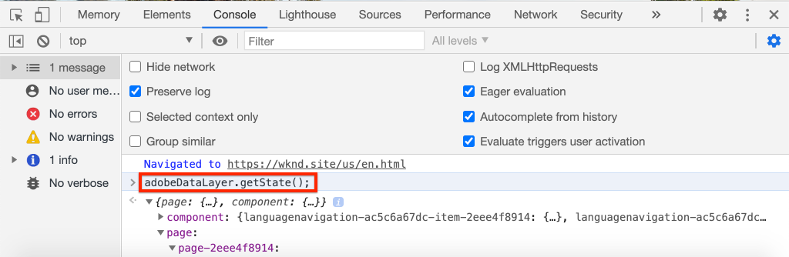
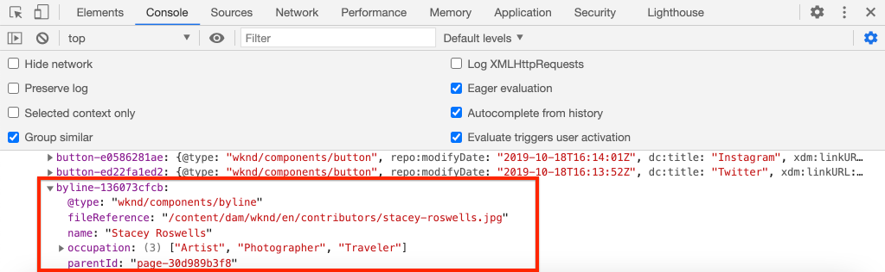

# De Adobe Client Data Layer aanpassen met AEM Components {#customize-data-layer}

Leer hoe u de Adobe Client Data Layer kunt aanpassen met inhoud van aangepaste AEM Components. Leer hoe te om APIs te gebruiken die door [&#x200B; worden verstrekt de Componenten van de Kern van AEM om &#x200B;](https://experienceleague.adobe.com/docs/experience-manager-core-components/using/developing/data-layer/extending.html?lang=nl-NL) uit te breiden en de gegevenslaag aan te passen.

## Wat u gaat bouwen


In dit leerprogramma, onderzoeken wij diverse opties om de Laag van Gegevens van de Cliënt van Adobe uit te breiden door de WKND [&#x200B; component van de Byline &#x200B;](https://experienceleague.adobe.com/docs/experience-manager-learn/getting-started-wknd-tutorial-develop/project-archetype/custom-component.html?lang=nl-NL) bij te werken. De _component van 0&rbrace; Byline &lbrace;is a **douanecomponent**&#x200B;en de lessen die in dit leerprogramma worden geleerd kunnen op andere douanecomponenten worden toegepast._

### Doelstellingen {#objective}

1. Injecteer componentgegevens in de gegevenslaag door een Sling Model en component HTML uit te breiden
1. Gebruik gegevenslaaghulpprogramma&#39;s van de Core Component om de inspanning te verminderen
1. Gegevenskenmerken van de kerncomponent gebruiken om deze aan te sluiten op bestaande gegevenslaaggebeurtenissen

## Vereisten {#prerequisites}

A **lokale ontwikkelomgeving** is noodzakelijk om dit leerprogramma te voltooien. Screenshots en video worden vastgelegd met de AEM as a Cloud Service SDK die op een macOS wordt uitgevoerd. Opdrachten en code zijn onafhankelijk van het lokale besturingssysteem, tenzij anders aangegeven.

**Nieuw aan AEM as a Cloud Service?** Controle uit de [&#x200B; volgende gids aan vestiging een lokale ontwikkelomgeving gebruikend AEM as a Cloud Service SDK &#x200B;](https://experienceleague.adobe.com/docs/experience-manager-learn/cloud-service/local-development-environment-set-up/overview.html?lang=nl-NL).

**Nieuw aan AEM 6.5?** Controle uit de [&#x200B; volgende gids aan vestiging een lokale ontwikkelomgeving &#x200B;](https://experienceleague.adobe.com/docs/experience-manager-learn/foundation/development/set-up-a-local-aem-development-environment.html?lang=nl-NL).

## De WKND-referentiesite downloaden en implementeren {#set-up-wknd-site}

Deze zelfstudie breidt de component Byline in de WKND-verwijzingssite uit. Klonen en de WKND-codebasis installeren in uw lokale omgeving.

1. Begin een lokale auteur van Quickstart **&#x200B;**&#x200B;instantie van AEM die in [&#x200B; http://localhost:4502 &#x200B;](http://localhost:4502) loopt.
1. Open een eindvenster en kloon de WKND codebasis gebruikend Git:

   ```shell
   $ git clone git@github.com:adobe/aem-guides-wknd.git
   ```

1. Implementeer de WKND-codebasis in een lokale instantie van AEM:

   ```shell
   $ cd aem-guides-wknd
   $ mvn clean install -PautoInstallSinglePackage
   ```

   >[!NOTE]
   >
   > Voor AEM 6.5 en het nieuwste servicepack voegt u het profiel `classic` toe aan de Maven-opdracht:
   >
   > `mvn clean install -PautoInstallSinglePackage -Pclassic`

1. Open een nieuw browservenster en meld u aan bij AEM. Open a **Tijdschrift** pagina als: [&#x200B; http://localhost:4502/content/wknd/us/en/magazine/guide-la-skateparks.html &#x200B;](http://localhost:4502/content/wknd/us/en/magazine/guide-la-skateparks.html).

   

   Er wordt een voorbeeld weergegeven van de component Naamregel die aan de pagina is toegevoegd als onderdeel van een ervaringsfragment. U kunt het Fragment van de Ervaring in [&#x200B; http://localhost:4502/editor.html/content/experience-fragments/wknd/language-masters/en/contributors/stacey-roswells/byline.html &#x200B;](http://localhost:4502/editor.html/content/experience-fragments/wknd/language-masters/en/contributors/stacey-roswells/byline.html) bekijken
1. Open uw ontwikkelaarshulpmiddelen en ga het volgende bevel in de **Console** in:

   ```js
   window.adobeDataLayer.getState();
   ```

   Controleer de reactie om de huidige status van de gegevenslaag op een AEM-site te zien. U moet informatie over de pagina en de afzonderlijke componenten bekijken.

   

   Merk op dat de component Byline niet in de Laag van Gegevens vermeld is.

## Het model voor bylineverkoop bijwerken {#sling-model}

Als u gegevens over de component in de gegevenslaag wilt injecteren, moet u eerst het Sling Model van de component bijwerken. Werk vervolgens de Java™-interface en implementatie van het Sling Model van de Byline bij om een nieuwe methode te gebruiken `getData()` . Deze methode bevat de eigenschappen die in de gegevenslaag moeten worden geïnjecteerd.

1. Open het `aem-guides-wknd` project in winde van uw keus. Navigeer naar de module `core` .
1. Open het bestand `Byline.java` om `core/src/main/java/com/adobe/aem/guides/wknd/core/models/Byline.java` .

   

1. Voeg onder methode aan de interface toe:

   ```java
   public interface Byline {
       ...
       /***
        * Return data about the Byline Component to populate the data layer
        * @return String
        */
       String getData();
   }
   ```

1. Open het bestand `BylineImpl.java` om `core/src/main/java/com/adobe/aem/guides/wknd/core/models/impl/BylineImpl.java` . Dit is de implementatie van de interface `Byline` en wordt geïmplementeerd als een Sling-model.

1. Voeg de volgende instructies voor importeren toe aan het begin van het bestand:

   ```java
   import java.util.HashMap;
   import java.util.Map;
   import org.apache.sling.api.resource.Resource;
   import com.fasterxml.jackson.core.JsonProcessingException;
   import com.fasterxml.jackson.databind.ObjectMapper;
   import com.adobe.cq.wcm.core.components.util.ComponentUtils;
   ```

   De `fasterxml.jackson` API&#39;s worden gebruikt om de gegevens te serialiseren die als JSON worden weergegeven. De `ComponentUtils` van AEM Core Components wordt gebruikt om te controleren of de gegevenslaag is ingeschakeld.

1. Voeg de niet-geïmplementeerde methode `getData()` toe aan `BylineImple.java` :

   ```java
   public class BylineImpl implements Byline {
       ...
       @Override
       public String getData() {
           Resource bylineResource = this.request.getResource();
           // Use ComponentUtils to verify if the DataLayer is enabled
           if (ComponentUtils.isDataLayerEnabled(bylineResource)) {
   
               //Create a map of properties we want to expose
               Map<String, Object> bylineProperties = new HashMap<String,Object>();
               bylineProperties.put("@type", bylineResource.getResourceType());
               bylineProperties.put("name", this.getName());
               bylineProperties.put("occupation", this.getOccupations());
               bylineProperties.put("fileReference", image.getFileReference());
   
               //Use AEM Core Component utils to get a unique identifier for the Byline component (in case multiple are on the page)
               String bylineComponentID = ComponentUtils.getId(bylineResource, this.currentPage, this.componentContext);
   
               // Return the bylineProperties as a JSON String with a key of the bylineResource's ID
               try {
                   return String.format("{\"%s\":%s}",
                       bylineComponentID,
                       // Use the ObjectMapper to serialize the bylineProperties to a JSON string
                       new ObjectMapper().writeValueAsString(bylineProperties));
               } catch (JsonProcessingException e) {
   
                   LOGGER.error("Unable to generate dataLayer JSON string", e);
               }
   
           }
           // return null if the Data Layer is not enabled
           return null;
       }
   }
   ```

   In de bovenstaande methode wordt een nieuwe `HashMap` gebruikt om de eigenschappen vast te leggen die als JSON moeten worden weergegeven. Bestaande methoden zoals `getName()` en `getOccupations()` worden gebruikt. `@type` vertegenwoordigt het unieke middeltype van de component, het staat een cliënt toe om gebeurtenissen en/of trekkers gemakkelijk te identificeren die op het type van component worden gebaseerd.

   `ObjectMapper` wordt gebruikt om de eigenschappen te serialiseren en een JSON-tekenreeks te retourneren. Deze JSON-tekenreeks kan vervolgens in de gegevenslaag worden geïnjecteerd.

1. Open een terminalvenster. Alleen de module `core` bouwen en implementeren met behulp van uw Maven-vaardigheden:

   ```shell
   $ cd aem-guides-wknd/core
   $ mvn clean install -PautoInstallBundle
   ```

## De HTML voor naamregel bijwerken {#htl}

Daarna, werk `Byline` [&#x200B; HTML &#x200B;](https://experienceleague.adobe.com/docs/experience-manager-htl/content/specification.html?lang=nl-NL) bij. HTML (HTML Template Language) is de sjabloon die wordt gebruikt om de HTML van de component te renderen.

Een speciaal gegevenskenmerk `data-cmp-data-layer` op elke AEM-component wordt gebruikt om de gegevenslaag ervan zichtbaar te maken. JavaScript dat wordt geleverd door AEM Core Components zoekt naar dit gegevenskenmerk. De waarde van dit gegevenskenmerk wordt gevuld met de JSON-tekenreeks die wordt geretourneerd door de methode `getData()` van het Byline Sling Model en wordt ingespoten in de gegevenslaag van de Adobe-client.

1. Open het `aem-guides-wknd` project in winde. Navigeer naar de module `ui.apps` .
1. Open het bestand `byline.html` om `ui.apps/src/main/content/jcr_root/apps/wknd/components/byline/byline.html` .

   

1. Werk `byline.html` bij om het kenmerk `data-cmp-data-layer` op te nemen:

   ```diff
     <div data-sly-use.byline="com.adobe.aem.guides.wknd.core.models.Byline"
       data-sly-use.placeholderTemplate="core/wcm/components/commons/v1/templates.html"
       data-sly-test.hasContent="${!byline.empty}"
   +   data-cmp-data-layer="${byline.data}"
       class="cmp-byline">
       ...
   ```

   De waarde van `data-cmp-data-layer` is ingesteld op `"${byline.data}"` where `byline` is the Sling Model updated. `.data` is de standaardnotatie voor het aanroepen van een Java™ Getter-methode in HTML van `getData()` die in de vorige oefening is geïmplementeerd.

1. Open een terminalvenster. Alleen de module `ui.apps` bouwen en implementeren met behulp van uw Maven-vaardigheden:

   ```shell
   $ cd aem-guides-wknd/ui.apps
   $ mvn clean install -PautoInstallPackage
   ```

1. Keer aan browser terug en open de pagina met een component van de Byline opnieuw: [&#x200B; http://localhost:4502/content/wknd/us/en/magazine/guide-la-skateparks.html &#x200B;](http://localhost:4502/content/wknd/us/en/magazine/guide-la-skateparks.html).

1. Open de ontwikkelaarsgereedschappen en inspecteer de HTML-bron van de pagina voor de Byline-component:

   

   U moet zien dat de `data-cmp-data-layer` is gevuld met de JSON-tekenreeks uit het Sling-model.

1. Open de de ontwikkelaarshulpmiddelen van browser en ga het volgende bevel in de **Console** in:

   ```js
   window.adobeDataLayer.getState();
   ```

1. Navigeer onder het antwoord onder `component` om te zoeken naar de instantie van de component `byline` die aan de gegevenslaag is toegevoegd:

   

   U zou een ingang als het volgende moeten zien:

   ```json
   byline-136073cfcb:
       @type: "wknd/components/byline"
       fileReference: "/content/dam/wknd/en/contributors/stacey-roswells.jpg"
       name: "Stacey Roswells"
       occupation: (3) ["Artist", "Photographer", "Traveler"]
       parentId: "page-30d989b3f8"
   ```

   Let erop dat de belichte eigenschappen dezelfde zijn als die in de `HashMap` in het Sling-model zijn toegevoegd.

## Een klikgebeurtenis toevoegen {#click-event}

De Adobe Client Data Layer is een gebeurtenisgestuurde en een van de meest voorkomende gebeurtenissen die een actie activeren, is de `cmp:click` -gebeurtenis. Met de AEM Core-componenten kunt u uw component eenvoudig registreren met behulp van het data-element: `data-cmp-clickable` .

Aanklikbare elementen zijn doorgaans een CTA-knop of een navigatiekoppeling. Jammer genoeg heeft de component van de Byte geen van deze maar wij laten het op om het even welke manier registreren aangezien dit voor andere douanecomponenten gemeenschappelijk zou kunnen zijn.

1. Open de module `ui.apps` in uw winde
1. Open het bestand `byline.html` om `ui.apps/src/main/content/jcr_root/apps/wknd/components/byline/byline.html` .

1. Update `byline.html` om het `data-cmp-clickable` attribuut op het 2&rbrace; naam **element van de Byline &lbrace;te omvatten:**

   ```diff
     <h2 class="cmp-byline__name" 
   +    data-cmp-clickable="${byline.data ? true : false}">
        ${byline.name}
     </h2>
   ```

1. Open een nieuwe terminal. Alleen de module `ui.apps` bouwen en implementeren met behulp van uw Maven-vaardigheden:

   ```shell
   $ cd aem-guides-wknd/ui.apps
   $ mvn clean install -PautoInstallPackage
   ```

1. Terugkeer aan browser en heropen de pagina met de toegevoegde component van de Byline: [&#x200B; http://localhost:4502/content/wknd/us/en/magazine/guide-la-skateparks.html &#x200B;](http://localhost:4502/content/wknd/us/en/magazine/guide-la-skateparks.html).

   Om onze gebeurtenis te testen, zullen wij manueel wat JavaScript toevoegen gebruikend de ontwikkelaarsconsole. Zie [&#x200B; Gebruikend de Laag van Gegevens van de Cliënt van Adobe met de Componenten van de Kern van AEM &#x200B;](data-layer-overview.md) voor een video op hoe te om dit te doen.

1. Open de de ontwikkelaarshulpmiddelen van browser en ga de volgende methode in de **Console** in:

   ```javascript
   function bylineClickHandler(event) {
       var dataObject = window.adobeDataLayer.getState(event.eventInfo.path);
       if (dataObject != null && dataObject['@type'] === 'wknd/components/byline') {
           console.log("Byline Clicked!");
           console.log("Byline name: " + dataObject['name']);
       }
   }
   ```

   Deze eenvoudige methode moet de klik van de naam van de component Byline afhandelen.

1. Ga de volgende methode in de **Console** in:

   ```javascript
   window.adobeDataLayer.push(function (dl) {
        dl.addEventListener("cmp:click", bylineClickHandler);
   });
   ```

   De bovenstaande methode duwt een gebeurtenisluisteraar op de gegevenslaag om naar de `cmp:click` gebeurtenis te luisteren en roept `bylineClickHandler`.

   >[!CAUTION]
   >
   > Het is belangrijk **niet** browser door deze oefening te verfrissen, anders wordt de console JavaScript verloren.

1. In browser, met de **open Console van 0&rbrace; &lbrace;, klik de naam van de auteur in de component van de Naamregel:**

   

   U moet het consolebericht `Byline Clicked!` en de naam van de Naamregel zien.

   De `cmp:click` -gebeurtenis is het eenvoudigst om in te koppelen. Voor complexere componenten en om ander gedrag bij te houden is het mogelijk om aangepaste JavaScript toe te voegen en nieuwe gebeurtenissen te registreren. Een goed voorbeeld is de Carousel-component, die een `cmp:show` -gebeurtenis activeert wanneer een dia wordt geschakeld. Zie de [&#x200B; broncode voor meer details &#x200B;](https://github.com/adobe/aem-core-wcm-components/blob/main/content/src/content/jcr_root/apps/core/wcm/components/carousel/v1/carousel/clientlibs/site/js/carousel.js).

## Het hulpprogramma DataLayerBuilder gebruiken {#data-layer-builder}

Toen het het Verdelen Model [&#128279;](#sling-model) vroeger in het hoofdstuk werd bijgewerkt, kozen wij om het Koord te creëren JSON door a `HashMap` te gebruiken en elk van de eigenschappen manueel te plaatsen. Deze methode werkt prima voor kleine eenmalige componenten, maar voor componenten die de AEM Core-componenten uitbreiden kan dit leiden tot veel extra code.

Een hulpprogrammaklasse, `DataLayerBuilder`, bestaat om het grootste deel van het zware heffen uit te voeren. Hierdoor kunnen implementaties alleen de gewenste eigenschappen uitbreiden. Werk het verkoopmodel bij om `DataLayerBuilder` te gebruiken.

1. Ga terug naar winde en navigeer aan de `core` module.
1. Open het bestand `Byline.java` om `core/src/main/java/com/adobe/aem/guides/wknd/core/models/Byline.java` .
1. Wijzig de methode `getData()` om een type `ComponentData` te retourneren

   ```java
   import com.adobe.cq.wcm.core.components.models.datalayer.ComponentData;
   ...
   public interface Byline {
       ...
       /***
        * Return data about the Byline Component to populate the data layer
        * @return ComponentData
        */
       ComponentData getData();
   }
   ```

   `ComponentData` is een object dat wordt geleverd door AEM Core Components. Het resulteert in een Koord JSON, enkel zoals in het vorige voorbeeld, maar voert ook veel extra werk uit.

1. Open het bestand `BylineImpl.java` om `core/src/main/java/com/adobe/aem/guides/wknd/core/models/impl/BylineImpl.java` .

1. Voeg de volgende instructies voor importeren toe:

   ```java
   import com.adobe.cq.wcm.core.components.models.datalayer.ComponentData;
   import com.adobe.cq.wcm.core.components.models.datalayer.builder.DataLayerBuilder;
   ```

1. Vervang de methode `getData()` door het volgende:

   ```java
   @Override
   public ComponentData getData() {
       Resource bylineResource = this.request.getResource();
       // Use ComponentUtils to verify if the DataLayer is enabled
       if (ComponentUtils.isDataLayerEnabled(bylineResource)) {
   
           return DataLayerBuilder.extending(getImage().getData()).asImageComponent()
               .withTitle(this::getName)
               .build();
   
       }
       // return null if the Data Layer is not enabled
       return null;
   }
   ```

   De component Byline gebruikt gedeelten van de component van de Kern van het Beeld opnieuw om een beeld te tonen die de auteur vertegenwoordigen. In het bovengenoemde fragment, wordt [&#x200B; DataLayerBuilder &#x200B;](https://javadoc.io/doc/com.adobe.cq/core.wcm.components.core/latest/com/adobe/cq/wcm/core/components/models/datalayer/builder/ComponentDataBuilder.html) gebruikt om de gegevenslaag van de `Image` component uit te breiden. Hierdoor wordt het JSON-object vooraf gevuld met alle gegevens over de gebruikte afbeelding. Er worden ook enkele routinefuncties uitgevoerd, zoals het instellen van de `@type` en de unieke id van de component. De methode is klein.

   De enige eigenschap breidde de `withTitle` uit, die wordt vervangen door de waarde van `getName()` .

1. Open een terminalvenster. Alleen de module `core` bouwen en implementeren met behulp van uw Maven-vaardigheden:

   ```shell
   $ cd aem-guides-wknd/core
   $ mvn clean install -PautoInstallBundle
   ```

1. Ga terug naar de IDE en open het bestand `byline.html` onder `ui.apps`
1. Werk de HTML bij die u `byline.data.json` wilt gebruiken om het kenmerk `data-cmp-data-layer` te vullen:

   ```diff
     <div data-sly-use.byline="com.adobe.aem.guides.wknd.core.models.Byline"
       data-sly-use.placeholderTemplate="core/wcm/components/commons/v1/templates.html"
       data-sly-test.hasContent="${!byline.empty}"
   -   data-cmp-data-layer="${byline.data}"
   +   data-cmp-data-layer="${byline.data.json}"
   ```

   We retourneren nu een object van het type `ComponentData` . Dit object bevat een methode getter `getJson()` en wordt gebruikt om het kenmerk `data-cmp-data-layer` te vullen.

1. Open een terminalvenster. Alleen de module `ui.apps` bouwen en implementeren met behulp van uw Maven-vaardigheden:

   ```shell
   $ cd aem-guides-wknd/ui.apps
   $ mvn clean install -PautoInstallPackage
   ```

1. Terugkeer aan browser en heropen de pagina met de toegevoegde component van de Byline: [&#x200B; http://localhost:4502/content/wknd/us/en/magazine/guide-la-skateparks.html &#x200B;](http://localhost:4502/content/wknd/us/en/magazine/guide-la-skateparks.html).
1. Open de de ontwikkelaarshulpmiddelen van browser en ga het volgende bevel in de **Console** in:

   ```js
   window.adobeDataLayer.getState();
   ```

1. Navigeer onder het antwoord onder `component` naar de instantie van de component `byline` :

   

   U zou een ingang als het volgende moeten zien:

   ```json
   byline-136073cfcb:
       @type: "wknd/components/byline"
       dc:title: "Stacey Roswells"
       image:
           @type: "image/jpeg"
           repo:id: "142658f8-4029-4299-9cd6-51afd52345c0"
           repo:modifyDate: "2019-10-25T23:49:51Z"
           repo:path: "/content/dam/wknd/en/contributors/stacey-roswells.jpg"
           xdm:tags: []
       parentId: "page-30d989b3f8"
       repo:modifyDate: "2019-10-18T20:17:24Z"
   ```

   Let op: er is nu een `image` -object binnen het `byline` -componentitem. Dit heeft veel meer informatie over de activa in de DAM. Let ook op: de `@type` en de unieke id (in dit geval `byline-136073cfcb` ) zijn automatisch ingevuld en de `repo:modifyDate` die aangeeft wanneer de component is gewijzigd.

## Aanvullende voorbeelden {#additional-examples}

1. Een ander voorbeeld om de gegevenslaag uit te breiden kan worden bekeken door de `ImageList` component in de WKND codebasis te inspecteren:
   * `ImageList.java` - Java-interface in de module `core` .
   * `ImageListImpl.java` - Sling Model in de module `core` .
   * `image-list.html` - HTML-sjabloon in de module `ui.apps` .

   >[!NOTE]
   >
   > Het is een beetje moeilijker om douaneeigenschappen als `occupation` te omvatten wanneer het gebruiken van [&#x200B; DataLayerBuilder &#x200B;](https://javadoc.io/doc/com.adobe.cq/core.wcm.components.core/latest/com/adobe/cq/wcm/core/components/models/datalayer/builder/ComponentDataBuilder.html). Als u echter een Core-component uitbreidt die een afbeelding of pagina bevat, bespaart het hulpprogramma veel tijd.

   >[!NOTE]
   >
   > Als het bouwen van een geavanceerde Laag van Gegevens voor voorwerpen die door een implementatie worden hergebruikt, wordt het geadviseerd om de elementen van de Laag van Gegevens in hun eigen gegeven laag-specifieke voorwerpen te halen Java™. De Commerce Core Components (Onderdelen van Core) hebben bijvoorbeeld interfaces voor `ProductData` en `CategoryData` toegevoegd, omdat deze kunnen worden gebruikt voor veel componenten in een Commerce-implementatie. Herzie [&#x200B; de code in aem-cif-core-components repo &#x200B;](https://github.com/adobe/aem-core-cif-components/tree/master/bundles/core/src/main/java/com/adobe/cq/commerce/core/components/datalayer) voor meer details.

## Gefeliciteerd! {#congratulations}

U hebt zojuist enkele manieren verkend om de Adobe Client Data Layer uit te breiden en aan te passen met AEM-componenten!

## Aanvullende bronnen {#additional-resources}

* [&#x200B; de Documentatie van de Laag van Gegevens van de Cliënt van Adobe &#x200B;](https://github.com/adobe/adobe-client-data-layer/wiki)
* [&#x200B; Integratie van de Laag van Gegevens met de Componenten van de Kern &#x200B;](https://github.com/adobe/aem-core-wcm-components/blob/main/DATA_LAYER_INTEGRATION.md)
* [&#x200B; Gebruikend de Laag van Gegevens van de Cliënt van Adobe en de Documentatie van de Componenten van de Kern &#x200B;](https://experienceleague.adobe.com/docs/experience-manager-core-components/using/developing/data-layer/overview.html?lang=nl-NL)
