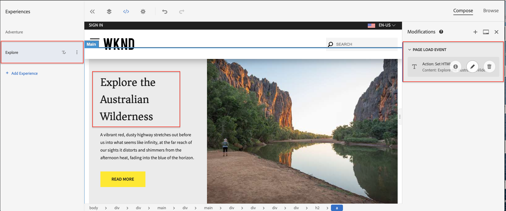

# Personalisatie met behulp van Visual Experience Composer {#personalization-vec}

Leer hoe te om een Activiteit van het Doel van de Test te creëren A/B gebruikend Visuele Composer van de Ervaring (VEC).

## Vereisten

Om VEC op een AEM website te kunnen gebruiken, moet de volgende instelling zijn voltooid:

1. [Adobe Target toevoegen aan uw AEM website](./add-target-launch-extension.md)
1. [Een Adobe Target-aanroep vanuit Launch activeren](./load-and-fire-target.md)

## Overzicht van scenario

Op de homepage van de WKND-site worden lokale activiteiten of de beste manier om rond een stad te doen weergegeven in de vorm van informatiekaarten. Als markeerteken, bent u toegewezen de taak om de homepage te wijzigen, door tekstveranderingen in het leerapparaat van de avontuursectie aan te brengen en te begrijpen hoe het omzetting verbetert.

## Stappen om een A/B-test te creëren met behulp van Visual Experience Composer (VEC)

1. Aanmelden bij [Adobe Experience Cloud](https://experience.adobe.com/), tikken op __Doel__, navigeer naar het tabblad __Activiteiten__

   + Als u __Doel__ op het dashboard van de Experience Cloud niet ziet, zorg ervoor de correcte organisatie van de Adobe in de organisatieschakelaar in het hoogste recht wordt geselecteerd, en dat u de gebruiker toegang tot Doel in [Adobe Admin Console](https://adminconsole.adobe.com/) is verleend.

1. Klik op **Activiteit maken** en kies vervolgens **A/B Test** activiteit

   

1. Selecteer de optie **Visual Experience Composer**, geef de activiteit-URL op en klik op **Volgende**

   

1. De visuele Composer van de Ervaring toont twee lusjes op de linkerkant nadat u een nieuwe activiteit creeert: *Beleef A* en *Beleef B*. Selecteer een ervaring in de lijst. U kunt nieuwe ervaringen aan de lijst toevoegen, door **Add Ervaring** te gebruiken knoop.

   

1. Selecteer een afbeelding of tekst op de pagina die u wilt wijzigen of gebruik de code-editor om het element te selecteren en te HTML.

   

1. Wijzig de tekst van *Camping in Western Australia* in *Adventures of Australia*. Een lijst van veranderingen die aan een Ervaring worden toegevoegd zal onder Wijzigingen worden getoond. U kunt op het gewijzigde item klikken en dit bewerken om de CSS-kiezer weer te geven en de nieuwe inhoud die eraan is toegevoegd.

   

1. Naam wijzigen *Ervaring A* in *Adventure*
1. Werk de tekst op *Experience B* bij van *Camping in Western Australia* tot *De Australische wilde natuur ontdekken*.

   

1. Klik **Volgende** om zich aan het richten te bewegen en een Handmatige verkeerstoewijzing van 50-50 tussen de twee ervaringen te houden.

   

1. Voor Doelstellingen en instellingen kiest u de rapportbron als Adobe Target en selecteert u de metrische waarde Doel als Omzetting met een paginaweergaveactie.

   

1. Geef een naam op voor uw activiteiten en sla deze op.
1. Activeer je opgeslagen activiteit om je wijzigingen live te zetten.

   

1. Open uw sitepagina (Activiteit URL van stap 3) in een nieuw tabblad en u zou één van beide ervaringen (avontuur of Onderzoek) van onze testactiviteit A/B moeten kunnen bekijken.

   

## Samenvatting

In dit hoofdstuk, kon een teller een ervaring tot stand brengen gebruikend Visual Experience Composer door te slepen en neer te zetten, de lay-out en de inhoud van een Web-pagina te ruilen zonder enige code te veranderen om een test in werking te stellen.

## Ondersteunende koppelingen

+ [Adobe Experience Cloud Debugger - Chrome](https://chrome.google.com/webstore/detail/adobe-experience-cloud-de/ocdmogmohccmeicdhlhhgepeaijenapj)
+ [Adobe Experience Cloud Debugger - Firefox](https://addons.mozilla.org/en-US/firefox/addon/adobe-experience-platform-dbg/)
