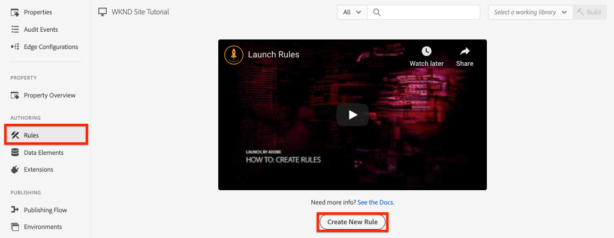

# Paginagegevens verzamelen met Adobe Analytics

Leer om de ingebouwde eigenschappen van de Laag van Gegevens van de Cliënt van de [Adobe met AEMComponenten](https://docs.adobe.com/content/help/en/experience-manager-core-components/using/developing/data-layer/overview.html) van de Kern te gebruiken om gegevens over een pagina in Adobe Experience Manager Sites te verzamelen. [Experience Platform Launch](https://www.adobe.com/experience-platform/launch.html) en de extensie [](https://docs.adobe.com/content/help/en/launch/using/extensions-ref/adobe-extension/analytics-extension/overview.html) Adobe Analytics worden gebruikt om regels te maken voor het verzenden van paginagegevens naar Adobe Analytics.

## Wat u gaat maken


In dit leerprogramma zult u een regel van de Lancering teweegbrengen die op een gebeurtenis van de Laag van de Gegevens van de Cliënt van Adobe wordt gebaseerd, toevoegt voorwaarden voor wanneer de regel zou moeten worden in brand gestoken, en verzendt de Naam **van de** Pagina en het Malplaatje **van de** Pagina van een AEM Pagina naar Adobe Analytics.

### Doelstellingen {#objective}

1. Creeer een gebeurtenis-gedreven regel in Lancering die op veranderingen in de gegevenslaag wordt gebaseerd
1. Eigenschappen van paginalaag toewijzen aan gegevenselementen in Starten
1. Paginagegevens verzamelen en naar Adobe Analytics verzenden met het paginaweergavebaken

## Vereisten

Hiervoor is het volgende vereist:

* **Eigenschap Experience Platform Launch**
* **Adobe Analytics** test/dev rapport suite ID and tracking server. Raadpleeg de volgende documentatie voor het [maken van een nieuwe rapportsuite](https://docs.adobe.com/content/help/en/analytics/admin/manage-report-suites/new-report-suite/new-report-suite.html).
* [Browserextensie van Foutopsporing](https://docs.adobe.com/content/help/en/platform-learn/tutorials/data-ingestion/web-sdk/introduction-to-the-experience-platform-debugger.html) Experience Platform. Screenshots in deze zelfstudie werden vastgelegd vanuit de Chrome-browser.
* (Optioneel) AEM Site met de gegevenslaag [Adobe Client Data ingeschakeld](https://docs.adobe.com/content/help/en/experience-manager-core-components/using/developing/data-layer/overview.html#installation-activation). In deze zelfstudie wordt de openbare website [https://wknd.site/us/en.html](https://wknd.site/us/en.html) gebruikt, maar u kunt uw eigen site graag gebruiken.

>[!NOTE]
>
> Hebt u hulp nodig bij het integreren van Starten en uw AEM site? [Zie deze videoreeks](../experience-platform-launch/overview.md).

## Overschakelen van opstartomgevingen voor WKND-site

[https://wknd.site](https://wknd.site) is een openbare onder ogen ziende plaats die op [een open-bronproject](https://github.com/adobe/aem-guides-wknd) wordt gebaseerd dat als verwijzing en [zelfstudie](https://docs.adobe.com/content/help/en/experience-manager-learn/getting-started-wknd-tutorial-develop/overview.html) voor AEM implementaties wordt ontworpen.

In plaats van vestiging een AEM milieu en het installeren van de WKND codebasis, kunt u debugger van het Experience Platform gebruiken om levende **https://wknd.site/** aan [uw](https://wknd.site/) Bezit van de Lancering te *schakelen* . Natuurlijk kunt u uw eigen AEM gebruiken als het reeds de Toegelaten Laag van de Gegevens van de Cliënt van [Adobe heeft](https://docs.adobe.com/content/help/en/experience-manager-core-components/using/developing/data-layer/overview.html#installation-activation)

1. Meld u aan bij het Experience Platform Launch en [maak een opstarteigenschap](https://docs.adobe.com/content/help/en/core-services-learn/implementing-in-websites-with-launch/configure-launch/launch.html) (als u dat nog niet hebt gedaan).
1. Zorg ervoor dat er een initiële [opstartbibliotheek is gemaakt](https://docs.adobe.com/content/help/en/launch/using/reference/publish/libraries.html#create-a-library) en gepromoveerd naar een [opstartomgeving](https://docs.adobe.com/content/help/en/launch/using/reference/publish/environments.html).
1. Kopieer de insluitcode voor Starten vanuit de omgeving waarnaar de bibliotheek is gepubliceerd.

   

1. Open in uw browser een nieuw tabblad en ga naar [https://wknd.site/](https://wknd.site/)
1. De browserextensie van Foutopsporing Experience Platform openen

   

1. Navigeer naar **Starten** > **Configuratie** en vervang onder **Geinjecteerde Embed Codes** de bestaande Insluitcode van de Lancering met *uw* ingebedde code die van stap 3 wordt gekopieerd.

   

1. Schakel **Console Logging** in en **vergrendel** de foutopsporing op het tabblad WKND.

   

## Gegevens Adobe client-gegevenslaag op WKND-site verifiëren

Het project [van de Verwijzing](https://github.com/adobe/aem-guides-wknd) WKND wordt gebouwd met AEM Componenten van de Kern en heeft de Laag van Gegevens van de Cliënt van [Adobe die door gebrek wordt toegelaten](https://docs.adobe.com/content/help/en/experience-manager-core-components/using/developing/data-layer/overview.html#installation-activation) . Daarna, verifieer de Laag van Gegevens van de Cliënt van Adobe wordt toegelaten.

1. Ga naar [https://wknd.site](https://wknd.site).
1. Open de ontwikkelaarsgereedschappen van de browser en navigeer naar de **Console**. Voer de volgende opdracht uit:

   ```js
   adobeDataLayer.getState();
   ```

   Dit keert de huidige staat van de Laag van Gegevens van de Cliënt van Adobe terug.

   

1. Breid de reactie uit en inspecteer de `page` ingang. U zou een gegevensschema als het volgende moeten zien:

   ```json
   page-2eee4f8914:
       @type: "wknd/components/page"
       dc:description: "WKND is a collective of outdoors, music, crafts, adventure sports, and travel enthusiasts that want to share our experiences, connections, and expertise with the world."
       dc:title: "WKND Adventures and Travel"
       repo:modifyDate: "2020-08-31T21:02:21Z"
       repo:path: "/content/wknd/us/en.html"
       xdm:language: "en-US"
       xdm:tags: ["Attract"]
       xdm:template: "/conf/wknd/settings/wcm/templates/landing-page-template"
   ```

   We gebruiken standaardeigenschappen die zijn afgeleid van het [paginaschema](https://docs.adobe.com/content/help/en/experience-manager-core-components/using/developing/data-layer/overview.html#page), `dc:title`en `xdm:language` `xdm:template` van de gegevenslaag om paginagegevens naar Adobe Analytics te verzenden.

   >[!NOTE]
   >
   > Ziet u het `adobeDataLayer` javascript-object niet? Zorg ervoor dat de gegevenslaag van de Gegevens van de Cliënt van [Adobe op uw plaats is toegelaten](https://docs.adobe.com/content/help/en/experience-manager-core-components/using/developing/data-layer/overview.html#installation-activation) .

## Een regel maken voor het laden van pagina&#39;s

De gegevenslaag van de Gegevens van de Cliënt van Adobe is een **gebeurtenis** gedreven gegevenslaag. Wanneer de gegevenslaag AEM **Pagina** wordt geladen, wordt een gebeurtenis geactiveerd `cmp:show`. Maak een regel die op basis van de `cmp:show` gebeurtenis wordt geactiveerd.

1. Navigeer aan Experience Platform Launch en in het bezit van het Web dat met de Plaats van de AEM wordt geïntegreerd.
1. Navigeer naar de sectie **Regels** in de gebruikersinterface van Launch en klik vervolgens op **Nieuwe regel** maken.

   

1. Geef de regelpagina een naam **die is geladen**.
1. Klik op **Gebeurtenissen** **toevoegen** om de wizard **Gebeurtenisconfiguratie** te openen.
1. Selecteer onder **Type** gebeurtenis de optie **Aangepaste code**.

   

1. Klik op Editor **** openen in het hoofddeelvenster en voer het volgende codefragment in:

   ```js
   var pageShownEventHandler = function(evt) {
      // defensive coding to avoid a null pointer exception
      if(evt.hasOwnProperty("eventInfo") && evt.eventInfo.hasOwnProperty("path")) {
         //trigger Launch Rule and pass event
         console.debug("cmp:show event: " + evt.eventInfo.path);
         var event = {
            //include the path of the component that triggered the event
            path: evt.eventInfo.path,
            //get the state of the component that triggered the event
            component: window.adobeDataLayer.getState(evt.eventInfo.path)
         };
   
         //Trigger the Launch Rule, passing in the new `event` object
         // the `event` obj can now be referenced by the reserved name `event` by other Launch data elements
         // i.e `event.component['someKey']`
         trigger(event);
      }
   }
   
   //set the namespace to avoid a potential race condition
   window.adobeDataLayer = window.adobeDataLayer || [];
   //push the event listener for cmp:show into the data layer
   window.adobeDataLayer.push(function (dl) {
      //add event listener for `cmp:show` and callback to the `pageShownEventHandler` function
      dl.addEventListener("cmp:show", pageShownEventHandler);
   });
   ```

   Het bovenstaande codefragment voegt een gebeurtenislistener toe door een functie [in de gegevenslaag te](https://github.com/adobe/adobe-client-data-layer/wiki#pushing-a-function) duwen. Wanneer de `cmp:show` gebeurtenis wordt geactiveerd, wordt de `pageShownEventHandler` functie aangeroepen. In deze functie worden een paar controles van de hygiëne toegevoegd en een nieuw `event` wordt geconstrueerd met de recentste [staat van de gegevenslaag](https://github.com/adobe/adobe-client-data-layer/wiki#getstate) voor de component die de gebeurtenis teweegbracht.

   Daarna `trigger(event)` wordt het genoemd. `trigger()` is een gereserveerde naam in Launch en activeert &quot;de Launch-regel&quot;. We geven het `event` object door als een parameter die vervolgens wordt weergegeven door een andere gereserveerde naam in Launch met de naam `event`. Data Elements in Launch kan nu verwijzen naar verschillende eigenschappen, zoals: `event.component['someKey']`.

1. Sla de wijzigingen op.
1. Klik onder **Handelingen** op **Toevoegen** om de wizard **Configuratie** handeling te openen.
1. Kies bij Type **handeling** de optie **Aangepaste code**.

   

1. Klik op Editor **** openen in het hoofddeelvenster en voer het volgende codefragment in:

   ```js
   console.debug("Page Loaded ");
   console.debug("Page name: " + event.component['dc:title']);
   console.debug("Page type: " + event.component['@type']);
   console.debug("Page template: " + event.component['xdm:template']);
   ```

   Het `event` object wordt doorgegeven via de `trigger()` methode die in de aangepaste gebeurtenis wordt aangeroepen. `component` Dit is de huidige pagina die wordt afgeleid van de gegevenslaag `getState` in de aangepaste gebeurtenis. Herhaal van vroeger het schema [van de](https://docs.adobe.com/content/help/en/experience-manager-core-components/using/developing/data-layer/overview.html#page) Pagina dat door de gegevenslaag wordt blootgesteld om de diverse sleutels te zien die uit de doos worden blootgesteld.

1. Sla de wijzigingen op en voer een [build](https://docs.adobe.com/content/help/en/launch/using/reference/publish/builds.html) uit in Launch om de code te promoten in de [omgeving](https://docs.adobe.com/content/help/en/launch/using/reference/publish/environments.html) die op uw AEM-site wordt gebruikt.

   >[!NOTE]
   >
   > Het kan zeer nuttig zijn om Foutopsporing [van](https://docs.adobe.com/content/help/en/platform-learn/tutorials/data-ingestion/web-sdk/introduction-to-the-experience-platform-debugger.html) Adobe Experience Platform te gebruiken om de ingebedde code aan een milieu van de **Ontwikkeling** te schakelen.

1. Navigeer naar uw AEM en open de ontwikkelaarsgereedschappen om de console weer te geven. Vernieuw de pagina en u zou moeten zien dat de consoleberichten zijn geregistreerd:

   

## Gegevenselementen maken

Maak vervolgens verschillende gegevenselementen om verschillende waarden vast te leggen uit de gegevenslaag van de Adobe-client. Zoals gezien in de vorige oefening hebben wij het mogelijk gezien om tot de eigenschappen van de gegevenslaag rechtstreeks door douanecode toegang te hebben. Het voordeel van het gebruik van gegevenselementen is dat deze opnieuw kunnen worden gebruikt in alle opstartregels.

Herinneren van vroeger het schema [van de](https://docs.adobe.com/content/help/en/experience-manager-core-components/using/developing/data-layer/overview.html#page) Pagina dat door de gegevenslaag wordt blootgesteld:

Gegevenselementen worden toegewezen aan de eigenschappen `@type`, `dc:title`en `xdm:template` .

### Type componentbron

1. Navigeer aan Experience Platform Launch en in het bezit van het Web dat met de Plaats van de AEM wordt geïntegreerd.
1. Navigeer naar de sectie **Gegevenselementen** en klik op **Nieuw gegevenselement** maken.
1. Voer bij **Naam** het type **** Component Resource in.
1. Selecteer **Aangepaste code** bij Type **** gegevenselement.

   

1. Klik op Editor **** openen en voer het volgende in de aangepaste code-editor in:

   ```js
   if(event && event.component && event.component.hasOwnProperty('@type')) {
       return event.component['@type'];
   }
   ```

   Sla de wijzigingen op.

   >[!NOTE]
   >
   > Rappel dat het `event` voorwerp beschikbaar wordt gemaakt en scoped gebaseerd op de gebeurtenis die de **Regel** in Lancering teweegbracht. De waarde van een gegevenselement wordt niet geplaatst tot het Element van Gegevens binnen een Regel *van verwijzingen* wordt voorzien. Daarom is het veilig om dit Element van Gegevens binnen van een Regel zoals de **Pagina Geladen** regel te gebruiken die in de vorige stap wordt gecreeerd *maar* zou niet veilig om in andere contexten te gebruiken zijn.

### Paginanaam

1. Klik op Gegevenselement **** toevoegen.
1. Voer bij **Naam** de **paginanaam** in.
1. Selecteer **Aangepaste code** bij Type **** gegevenselement.
1. Klik op Editor **** openen en voer het volgende in de aangepaste code-editor in:

   ```js
   if(event && event.component && event.component.hasOwnProperty('dc:title')) {
       return event.component['dc:title'];
   }
   ```

   Sla de wijzigingen op.

### Paginasjabloon

1. Klik op Gegevenselement **** toevoegen.
1. Voer bij **Naam** de **paginanaam** in.
1. Selecteer **Aangepaste code** bij Type **** gegevenselement.
1. Klik op Editor **** openen en voer het volgende in de aangepaste code-editor in:

   ```js
   if(event && event.component && event.component.hasOwnProperty('xdm:template')) {
       return event.component['xdm:template'];
   }
   ```

   Sla de wijzigingen op.

1. U moet nu drie gegevenselementen hebben als onderdeel van uw regel:

   

## De extensie Analytics toevoegen

Voeg vervolgens de extensie Analytics toe aan de eigenschap Launch. We moeten deze gegevens ergens naartoe sturen!

1. Navigeer aan Experience Platform Launch en in het bezit van het Web dat met de Plaats van de AEM wordt geïntegreerd.
1. Ga naar **Extensies** > **Catalogus**
1. Zoek de extensie **Adobe Analytics** en klik op **Installeren**

   

1. Voer onder **Bibliotheekbeheer** > **Rapportsuites** de rapportsuite-id&#39;s in die u voor elke opstartomgeving wilt gebruiken.

   

   >[!NOTE]
   >
   > Het is oké om één rapportenreeks voor alle milieu&#39;s in dit leerprogramma te gebruiken, maar in echt zou u afzonderlijke rapportseries willen gebruiken, zoals aangetoond in het hieronder beeld

   >[!TIP]
   >
   >We raden u aan de optie *Bibliotheek voor mij* beheren te gebruiken als instelling voor Bibliotheekbeheer, omdat de `AppMeasurement.js` bibliotheek hierdoor veel gemakkelijker up-to-date kan worden gehouden.

1. Schakel het selectievakje in om Activity Map **** gebruiken in te schakelen.

   

1. Voer onder **Algemeen** > **Trackingserver** de trackingserver in, bijvoorbeeld `tmd.sc.omtrdc.net`. Voer uw SSL-traceringsserver in als uw site ondersteuning biedt `https://`

   

1. Click **Save** to save the changes.

## Een voorwaarde toevoegen aan de regel Pagina geladen

Vervolgens werkt u de regel **Pagina geladen** bij om het gegevenselement **Type** componentresource te gebruiken, zodat de regel alleen wordt geactiveerd wanneer de `cmp:show` gebeurtenis zich voor de **pagina** bevindt. Andere componenten kunnen de `cmp:show` gebeurtenis starten, bijvoorbeeld de Carousel-component zal deze starten wanneer de dia&#39;s veranderen. Daarom is het belangrijk om een voorwaarde voor deze regel toe te voegen.

1. Navigeer in de gebruikersinterface van Launch naar de regel **Pagina die eerder is geladen** .
1. Klik onder **Voorwaarden** op **Toevoegen** om de wizard **Voorwaardelijke configuratie** te openen.
1. Selecteer bij **Type** voorwaarde de optie **Waardevergelijking**.
1. Stel de eerste waarde in het formulierveld in op `%Component Resource Type%`. U kunt het het  om het het gegevenselement van het Type **van Middel van de** Component te selecteren. Laat de comparator ingesteld staan op `Equals`.
1. Stel de tweede waarde in op `wknd/components/page`.

   

   >[!NOTE]
   >
   > Het is mogelijk om deze voorwaarde binnen de functie van de douanecode toe te voegen die op de gebeurtenis let die eerder in het leerprogramma wordt gecreeerd. `cmp:show` Nochtans, geeft het toevoegen van het binnen UI meer zicht aan extra gebruikers die veranderingen in de regel zouden kunnen moeten aanbrengen. Bovendien hebben we ons gegevenselement gebruikt!

1. Sla de wijzigingen op.

## Analysevariabelen instellen en Paginaweergavebaken activeren

Momenteel voert de regel **Pagina geladen** eenvoudig een consoleverklaring uit. Gebruik vervolgens de gegevenselementen en de extensie Analytics om de variabelen Analytics in te stellen als een **handeling** in de regel **Pagina geladen** . We zullen ook een extra actie instellen om het **Paginaweergavebaken** te activeren en de verzamelde gegevens naar Adobe Analytics te verzenden.

1. In de **Pagina Geladen** regel **verwijdert** de actie **Kern - de Douane Code** (de consoleverklaringen):

   

1. Klik onder Handelingen op **Toevoegen** om een nieuwe handeling toe te voegen.
1. Stel het **extensietype** in op **Adobe Analytics** en stel het **actietype** in op Variabelen **instellen**

   

1. Selecteer in het hoofdvenster een beschikbaar **eVar** en stel dit in als de waarde van de **paginasjabloon** voor gegevenselement. Gebruik het pictogram  Gegevens om het element **Paginasjabloon** te selecteren.

   

1. Schuif omlaag, onder **Extra instellingen** stelt **Paginanaam** in op het gegevenselement **Paginanaam**:

   

   Sla de wijzigingen op.

1. Voeg vervolgens een aanvullende handeling toe aan de rechterkant van de **Adobe Analytics - Variabelen** instellen door op het **plusteken** te tikken:

   

1. Stel het **extensietype** in op **Adobe Analytics** en stel het **actietype** in op **Verzendbaken**. Omdat dit als een paginaweergave wordt beschouwd, laat u de standaardtekstspatiëring ingesteld op **`s.t()`**.

   

1. Sla de wijzigingen op. De regel **Pagina geladen** moet nu de volgende configuratie hebben:

   

   * **1.** Luister naar de `cmp:show` gebeurtenis.
   * **2.** Controleer of de gebeurtenis door een pagina is geactiveerd.
   * **3.** Variabelen voor analyse instellen voor **paginanaam** en **paginasjabloon**
   * **4.** Verzend het Beacon van de Mening van de Pagina van de Analyse
1. Sla alle wijzigingen op en maak uw opstartbibliotheek, waarbij u een upgrade uitvoert naar de juiste omgeving.

## Valideer de oproep Beacon en Analytics voor paginaweergave

Nu de **Pagina Geladen** regel het baken van de Analyse verzendt, zou u de variabelen moeten kunnen zien die van Analytics gebruikend Foutopsporing van het Experience Platform volgen.

1. Open de [WKND-site](https://wknd.site/us/en.html) in uw browser.
1. Klik op het pictogram Foutopsporing op het pictogram Foutopsporing van  om Foutopsporing op Experience Platform te openen.
1. Zorg ervoor Debugger het bezit van de Lancering aan *uw* milieu van de Ontwikkeling in kaart brengt, zoals vroeger beschreven en het Registreren **van de** Console wordt gecontroleerd.
1. Open het menu Analytics en controleer of de rapportsuite is ingesteld op *uw* rapportsuite. De paginanaam moet ook worden ingevuld:

   

1. Schuif omlaag en vouw **Netwerkverzoeken** uit. U moet de **vorige set** voor de **paginasjabloon** kunnen vinden:

   

1. Ga terug naar de browser en open de ontwikkelaarsconsole. Klik door de **Carrousel** bij de bovenkant van de pagina.

   

1. Neem in de browser console de consoleverklaring waar:

   

   De reden hiervoor is dat de Carousel wel een `cmp:show` gebeurtenis activeert, *maar* dat er geen gebeurtenis wordt geactiveerd vanwege de controle van het type **** Component Resource.

   >[!NOTE]
   >
   > Als u geen consolelogboeken ziet, zorg ervoor dat het Registreren van de **Console** onder **Lancering** in Foutopsporing van het Experience Platform wordt gecontroleerd.

1. Navigeer naar een artikelpagina zoals [Western Australia](https://wknd.site/us/en/magazine/western-australia.html). Bekijk de paginanaam en het sjabloontype worden gewijzigd.

## Gefeliciteerd!

U hebt net de gebeurtenisgestuurde Adobe Client Data Layer en het Experience Platform Launch gebruikt om gegevenspagina-gegevens van een AEM Site te verzamelen en deze naar Adobe Analytics te verzenden.

### Volgende stappen

Bekijk de volgende zelfstudie om te leren hoe u de gebeurtenisgestuurde Adobe Client Data-laag kunt gebruiken om [kliks van specifieke componenten op een Adobe Experience Manager-site](track-clicked-component.md)bij te houden.
