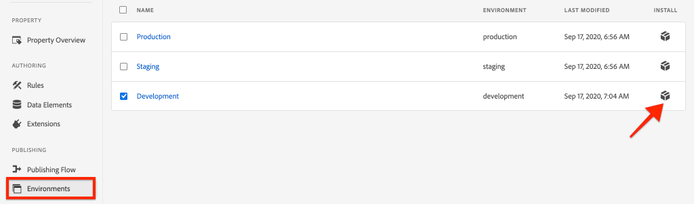

# AEM Sites en Adobe Analytics integreren

Leer hoe te om AEM Sites en Adobe Analytics met de etikettenuitbreiding van Adobe Analytics te integreren, gebruikend de ingebouwde eigenschappen van de [ Laag van de Gegevens van de Cliënt van de Adobe met AEM Componenten van de Kern ](https://experienceleague.adobe.com/docs/experience-manager-core-components/using/developing/data-layer/overview.html) om gegevens over een pagina in Adobe Experience Manager Sites te verzamelen. [ de Markeringen in Experience Platform ](https://experienceleague.adobe.com/docs/experience-platform/tags/home.html) en de [ uitbreiding van Adobe Analytics ](https://experienceleague.adobe.com/docs/experience-platform/tags/extensions/client/analytics/overview.html) worden gebruikt om regels tot stand te brengen om paginagegevens naar Adobe Analytics te verzenden.

## Wat u gaat bouwen {#what-build}


In dit leerprogramma, gaat u een markeringsregel teweegbrengen die op een gebeurtenis van de Laag van de Gegevens van de Cliënt van de Adobe wordt gebaseerd. Ook, voeg voorwaarden toe voor wanneer de regel zou moeten worden in brand gestoken, en verzend dan de **Naam van de Pagina** en **waarden van het Malplaatje van de Pagina** van een AEM Pagina aan Adobe Analytics.

### Doelstellingen {#objective}

1. Maak een gebeurtenisgestuurde regel in de eigenschap tag die wijzigingen vastlegt vanaf de gegevenslaag
1. Eigenschappen van paginalagen toewijzen aan gegevenselementen in de eigenschap Tag
1. Paginagegevens verzamelen en naar Adobe Analytics verzenden met behulp van het paginaweergavebaken

## Vereisten

Hiervoor is het volgende vereist:

* **bezit van de Markering** in Experience Platform
* **Adobe Analytics** test/dev- rapportreeks identiteitskaart en volgende server. Zie de volgende documentatie voor [ het creëren van een rapportreeks ](https://experienceleague.adobe.com/docs/analytics/admin/admin-tools/manage-report-suites/c-new-report-suite/new-report-suite.html).
* ](https://experienceleague.adobe.com/docs/platform-learn/data-collection/debugger/overview.html) browser van de Experience Platform Debugger van 0} {. [ Screenshots in deze zelfstudie werden vastgelegd vanuit de Chrome-browser.
* (Facultatief) AEM Plaats met de [ Toegelaten Laag van de Gegevens van de Cliënt van de Adobe ](https://experienceleague.adobe.com/docs/experience-manager-core-components/using/developing/data-layer/overview.html#installation-activation). Dit leerprogramma gebruikt het publiek onder ogen ziet [ WKND ](https://wknd.site/us/en.html) plaats maar u bent welkom om uw eigen plaats te gebruiken.

>[!NOTE]
>
> Hebt u hulp nodig bij het integreren van eigenschap tag en AEM site? [ zie deze videoreeks ](../experience-platform/data-collection/tags/overview.md).

## Omgeving van Switch-tag voor WKND-site

[ WKND ](https://wknd.site/us/en.html) is een openbaar-onder ogen ziet plaats die op [ wordt gebouwd een open-bronproject ](https://github.com/adobe/aem-guides-wknd) als verwijzing wordt ontworpen en [ leerprogramma ](https://experienceleague.adobe.com/docs/experience-manager-learn/getting-started-wknd-tutorial-develop/overview.html) voor een AEM implementatie.

In plaats van vestiging een AEM milieu en het installeren van de WKND codebasis, kunt u debugger van het Experience Platform aan **schakelaar** de levende [ Plaats WKND ](https://wknd.site/us/en.html) aan *gebruiken uw* markeringsbezit. Nochtans, kunt u uw eigen AEM plaats gebruiken als het reeds de [ toegelaten Laag van de Gegevens van de Cliënt van de Adobe ](https://experienceleague.adobe.com/docs/experience-manager-core-components/using/developing/data-layer/overview.html#installation-activation) heeft.

1. Login aan Experience Platform en [ creeer een bezit van de Markering ](https://experienceleague.adobe.com/docs/platform-learn/implement-in-websites/configure-tags/create-a-property.html) (als u niet reeds) hebt.
1. Zorg ervoor dat een aanvankelijke markering JavaScript [ bibliotheek ](https://experienceleague.adobe.com/docs/experience-platform/tags/publish/libraries.html#create-a-library) is gecreeerd en aan het milieu van de markering [ ](https://experienceleague.adobe.com/docs/experience-platform/tags/publish/environments/environments.html) bevorderd.
1. Kopieer de JavaScript-insluitcode vanuit de tagomgeving waarin uw bibliotheek is gepubliceerd.

    in

1. In uw browser, open een nieuw lusje en navigeer aan [ Plaats WKND ](https://wknd.site/us/en.html)
1. De browserextensie van Foutopsporing Experience Platform openen

   

1. Navigeer aan **de Markeringen van het Experience Platform** > **Configuratie** en onder **Ingeworpen bedt Codes** vervangen de bestaande ingebedde code met *uw* ingebedde code die van stap 3 wordt gekopieerd.

    in

1. Laat **Logging van de Console** en **Slot** debugger op het lusje van WKND toe.

   

## Gegevens Adobe client-gegevenslaag op WKND-site verifiëren

Het [ WKND verwijzingsproject ](https://github.com/adobe/aem-guides-wknd) wordt gebouwd met AEM de Componenten van de Kern en heeft de [ Laag van de Gegevens van de Cliënt van de Adobe toegelaten ](https://experienceleague.adobe.com/docs/experience-manager-core-components/using/developing/data-layer/overview.html#installation-activation) door gebrek. Daarna, verifieer dat de Laag van de Gegevens van de Cliënt van de Adobe wordt toegelaten.

1. Navigeer aan [ Plaats WKND ](https://wknd.site/us/en.html).
1. Open de de ontwikkelaarshulpmiddelen van browser en navigeer aan de **Console**. Voer de volgende opdracht uit:

   ```js
   adobeDataLayer.getState();
   ```

   Boven code keert de huidige staat van de Gegevens van de Cliënt van de Adobe Laag terug.

   

1. Breid de reactie uit en inspecteer de `page` ingang. U zou een gegevensschema als het volgende moeten zien:

   ```json
   page-2eee4f8914:
       @type: "wknd/components/page"
       dc:description: WKND is a collective of outdoors, music, crafts, adventure sports, and travel enthusiasts that want to share our experiences, connections, and expertise with the world.
       dc:title: "WKND Adventures and Travel"
       repo:modifyDate: "2020-08-31T21:02:21Z"
       repo:path: "/content/wknd/us/en.html"
       xdm:language: "en-US"
       xdm:tags: ["Attract"]
       xdm:template: "/conf/wknd/settings/wcm/templates/landing-page-template"
   ```

   Als u paginagegevens naar Adobe Analytics wilt verzenden, gebruiken we de standaardeigenschappen zoals `dc:title` , `xdm:language` en `xdm:template` van de gegevenslaag.

   Voor meer informatie, herzie het [ Schema van de Pagina ](https://experienceleague.adobe.com/docs/experience-manager-core-components/using/developing/data-layer/overview.html#page) van de Schema van de Gegevens van de Componenten van de Kern.

   >[!NOTE]
   >
   > Als u het JavaScript-object `adobeDataLayer` niet ziet? Zorg ervoor dat de [ Laag van de Gegevens van de Cliënt van de Adobe ](https://experienceleague.adobe.com/docs/experience-manager-core-components/using/developing/data-layer/overview.html#installation-activation) op uw plaats is toegelaten.

## Een regel maken voor het laden van pagina&#39;s

De Laag van Gegevens van de Cliënt van de Adobe is een **gebeurtenis-gedreven** gegevenslaag. Wanneer de gegevenslaag AEM pagina is geladen, wordt een `cmp:show` -gebeurtenis geactiveerd. Maak een regel die wordt geactiveerd wanneer de gebeurtenis `cmp:show` wordt geactiveerd vanaf de paginalaag.

1. Navigeer naar het Experience Platform en naar de eigenschap tag die is geïntegreerd met de AEM Site.
1. Navigeer aan de **sectie van Regels** in het Bezit van de Markering UI en klik dan **creeer Nieuwe Regel**.

   

1. Noem de regel **Geladen Pagina**.
1. In de **subsection van Gebeurtenissen**, voegt de klik **** toe om de **tovenaar van de Configuratie van de Gebeurtenis** te openen.
1. Voor **het Type van Gebeurtenis** gebied, uitgezochte **Code van de Douane**.

   

1. Klik **Open Redacteur** in het belangrijkste paneel en ga het volgende codefragment in:

   ```js
   var pageShownEventHandler = function(evt) {
      // defensive coding to avoid a null pointer exception
      if(evt.hasOwnProperty("eventInfo") && evt.eventInfo.hasOwnProperty("path")) {
         //trigger the Tag Rule and pass event
         console.log("cmp:show event: " + evt.eventInfo.path);
         var event = {
            //include the path of the component that triggered the event
            path: evt.eventInfo.path,
            //get the state of the component that triggered the event
            component: window.adobeDataLayer.getState(evt.eventInfo.path)
         };
   
         //Trigger the Tag Rule, passing in the new `event` object
         // the `event` obj can now be referenced by the reserved name `event` by other Tag data elements
         // i.e `event.component['someKey']`
         trigger(event);
      }
   }
   
   //set the namespace to avoid a potential race condition
   window.adobeDataLayer = window.adobeDataLayer || [];
   //push the event listener for cmp:show into the data layer
   window.adobeDataLayer.push(function (dl) {
      //add event listener for `cmp:show` and callback to the `pageShownEventHandler` function
      dl.addEventListener("cmp:show", pageShownEventHandler);
   });
   ```

   Het bovenstaande codefragment voegt een gebeurtenisluisteraar toe door [ een functie ](https://github.com/adobe/adobe-client-data-layer/wiki#pushing-a-function) in de gegevenslaag te duwen. Wanneer de gebeurtenis `cmp:show` wordt geactiveerd, wordt de functie `pageShownEventHandler` aangeroepen. In deze functie, worden een paar gezondheidscontroles toegevoegd en een nieuw `event` geconstrueerd met de recentste [ staat van de gegevenslaag ](https://github.com/adobe/adobe-client-data-layer/wiki#getstate) voor de component die de gebeurtenis teweegbracht.

   Tot slot wordt de functie `trigger(event)` aangeroepen. De `trigger()` functie is een gereserveerde naam in het markeringsbezit en het **brengt** de regel teweeg. Het `event` -object wordt doorgegeven als een parameter die vervolgens weer wordt weergegeven door een andere gereserveerde naam in de eigenschap tag. Gegevenselementen in de eigenschap tag kunnen nu verwijzen naar verschillende eigenschappen met behulp van een codefragment, zoals `event.component['someKey']` .

1. Sla de wijzigingen op.
1. Daarna onder **Acties** klik **** toevoegen om de **tovenaar van de Configuratie van de Actie** te openen.
1. Voor **gebied van het Type van Actie 0} {, kies** de Code van de Douane **.**

   

1. Klik **Open Redacteur** in het belangrijkste paneel en ga het volgende codefragment in:

   ```js
   console.log("Page Loaded ");
   console.log("Page name: " + event.component['dc:title']);
   console.log("Page type: " + event.component['@type']);
   console.log("Page template: " + event.component['xdm:template']);
   ```

   Het object `event` wordt doorgegeven via de methode `trigger()` die in de aangepaste gebeurtenis wordt aangeroepen. Hier is de `component` -pagina de huidige pagina die wordt afgeleid van de gegevenslaag `getState` in de aangepaste gebeurtenis.

1. Sparen de veranderingen en stel a [ in werking bouwt ](https://experienceleague.adobe.com/docs/experience-platform/tags/publish/builds.html) in het markeringsbezit om de code aan het [ milieu ](https://experienceleague.adobe.com/docs/experience-platform/tags/publish/environments/environments.html) te bevorderen dat op uw AEMPlaats wordt gebruikt.

   >[!NOTE]
   >
   > Het kan nuttig zijn om het [ Adobe Experience Platform Debugger ](https://experienceleague.adobe.com/docs/platform-learn/data-collection/debugger/overview.html) te gebruiken om de ingebedde code aan het milieu van de a **Ontwikkeling** te schakelen.

1. Navigeer naar uw AEM en open de ontwikkelaarshulpmiddelen om de console te bekijken. Vernieuw de pagina en u zou moeten zien dat de consoleberichten zijn geregistreerd:


## Gegevenselementen maken

Maak vervolgens verschillende gegevenselementen om verschillende waarden vast te leggen uit de gegevenslaag van de client-Adobe. Zoals in de vorige oefening wordt gezien is het mogelijk om tot de eigenschappen van de gegevenslaag rechtstreeks door douanecode toegang te hebben. Het voordeel van het gebruik van gegevenselementen is dat deze opnieuw kunnen worden gebruikt in verschillende labelregels.

Gegevenselementen worden toegewezen aan de eigenschappen `@type` , `dc:title` en `xdm:template` .

### Type componentbron

1. Navigeer naar het Experience Platform en naar de eigenschap tag die is geïntegreerd met de AEM Site.
1. Navigeer aan de **sectie van de Elementen van Gegevens 0} {en klik** creeer Nieuw Element van Gegevens **.**
1. Voor het **gebied van de Naam**, ga het **Type van Middel van de Component** in.
1. Voor het **gebied van het Type van Gegevens 0} {, uitgezochte** Code van de Douane **.**

   

1. Klik **Open de knoop van de Redacteur** en ga het volgende in de redacteur van de douanecode in:

   ```js
   if(event && event.component && event.component.hasOwnProperty('@type')) {
       return event.component['@type'];
   }
   ```

1. Sla de wijzigingen op.

   >[!NOTE]
   >
   > Rappel dat het `event` voorwerp beschikbaar wordt gemaakt en scoped gebaseerd op de gebeurtenis die de **Regel** in markeringsbezit teweegbracht. De waarde van een Element van Gegevens wordt niet geplaatst tot het Element van Gegevens ** binnen een Regel van verwijzingen wordt voorzien. Daarom is het veilig om dit Element van Gegevens binnen een Regel als de **Geladen Pagina** regel te gebruiken die in de vorige stap *wordt gecreeerd maar* zou niet veilig zijn om in andere contexten te gebruiken.

### Paginanaam

1. Klik **toevoegen het Element van Gegevens** knoop
1. Voor het **gebied van de Naam**, ga **Naam van de Pagina** in.
1. Voor het **gebied van het Type van Gegevens 0} {, uitgezochte** Code van de Douane **.**
1. Klik **Open de knoop van de Redacteur**, en ga het volgende in de redacteur van de douanecode in:

   ```js
   if(event && event.component && event.component.hasOwnProperty('dc:title')) {
       return event.component['dc:title'];
   }
   ```

1. Sla de wijzigingen op.

### Paginasjabloon

1. Klik **toevoegen het Element van Gegevens** knoop
1. Voor het **gebied van de Naam**, ga **Malplaatje van de Pagina** in.
1. Voor het **gebied van het Type van Gegevens 0} {, uitgezochte** Code van de Douane **.**
1. Klik **Open de knoop van de Redacteur**, en ga het volgende in de redacteur van de douanecode in:

   ```js
   if(event && event.component && event.component.hasOwnProperty('xdm:template')) {
       return event.component['xdm:template'];
   }
   ```

1. Sla de wijzigingen op.

1. U moet nu drie gegevenselementen hebben als onderdeel van uw regel:

   

## De extensie Analytics toevoegen

Voeg vervolgens de extensie Analytics toe aan de eigenschap Tag om gegevens naar een rapportsuite te verzenden.

1. Navigeer naar het Experience Platform en naar de eigenschap tag die is geïntegreerd met de AEM Site.
1. Ga naar **Uitbreidingen** > **Catalogus**
1. Bepaal de plaats van **Adobe Analytics** uitbreiding en klik **installeren**

   

1. Onder **Suites van het Beheer van de Bibliotheek** > **Rapport**, ga de ids van de rapportreeks in u met elk markeringsmilieu zou willen gebruiken.

    in

   >[!NOTE]
   >
   > Het is oké om één rapportenreeks voor alle milieu&#39;s in dit leerprogramma te gebruiken, maar in echt zou u afzonderlijke rapportseries willen gebruiken, zoals aangetoond in het hieronder beeld

   >[!TIP]
   >
   >Wij adviseren gebruikend *beheer de bibliotheek voor me optie* als het plaatsen van het Beheer van de Bibliotheek aangezien het het veel gemakkelijker maakt om de `AppMeasurement.js` bibliotheek bijgewerkt te houden.

1. Controleer de doos om **Activity Map van het Gebruik** toe te laten.

    toe

1. Onder **Algemeen** > **het Volgen Server**, ga uw het volgen server in, bijvoorbeeld, `tmd.sc.omtrdc.net`. Voer uw SSL-traceringsserver in als uw site ondersteuning biedt voor `https://`

    in

1. Klik **sparen** om de veranderingen te bewaren.

## Een voorwaarde toevoegen aan de regel Pagina geladen

Daarna, werk de **Geladen Pagina** regel bij om het **het gegevenselement van het Type van Middel van de Component** te gebruiken om ervoor te zorgen dat de regel slechts brandt wanneer de `cmp:show` gebeurtenis voor de **Pagina** is. Andere componenten kunnen de gebeurtenis `cmp:show` starten, bijvoorbeeld de component Carousel, activeert de gebeurtenis wanneer de dia&#39;s veranderen. Daarom is het belangrijk om een voorwaarde voor deze regel toe te voegen.

1. In het Bezit van de Markering UI, navigeer aan de **Geladen Pagina** regel eerder gecreeerd.
1. Onder **Voorwaarden** klik **** toevoegen om de **tovenaar van de Configuratie van de Voorwaarde** te openen.
1. Voor **gebied van het Type van Voorwaarde 0} {, de uitgezochte** optie van de Vergelijking van de Waarde **.**
1. Stel de eerste waarde in het formulierveld in op `%Component Resource Type%` . U kunt het Pictogram van het Element van Gegevens gebruiken  om het **het gegevenselement van het Type van Middel van de Component** te selecteren. Laat het comparator ingesteld staan op `Equals` .
1. Stel de tweede waarde in op `wknd/components/page` .

   

   >[!NOTE]
   >
   > Het is mogelijk deze voorwaarde toe te voegen binnen de aangepaste codesfunctie die luistert naar de gebeurtenis `cmp:show` die eerder in de zelfstudie is gemaakt. Nochtans, geeft het toevoegen van het binnen UI meer zicht aan extra gebruikers die veranderingen in de regel zouden kunnen moeten aanbrengen. Bovendien kunnen we ons gegevenselement gebruiken!

1. Sla de wijzigingen op.

## Analysevariabelen instellen en Paginaweergavebaken activeren

Momenteel voert de **Geladen Pagina** regel eenvoudig een consoleverklaring uit. Daarna, gebruik de gegevenselementen en de uitbreiding Analytics om de variabelen van de Analyse als **actie** in de **Geladen Pagina** regel te plaatsen. Wij plaatsen ook een extra actie om het **Band van de Mening van de Pagina** teweeg te brengen en de verzamelde gegevens naar Adobe Analytics te verzenden.

1. In de Pagina Geladen regel, **verwijdert** de **Kern - de actie van de Code van de Douane** (de consoleverklaringen):

   

1. Onder de onderafdeling van Acties, voegt de klik **** toe om een nieuwe actie toe te voegen.

1. Plaats het **type van Uitbreiding** aan **Adobe Analytics** en plaats het **Type van Actie** aan **Vastgestelde Variabelen**

   

1. In het belangrijkste paneel, selecteer een beschikbare **eVar** en reeks als waarde van het Malplaatje van de Pagina van het Element van Gegevens ****. Gebruik het pictogram van de Elementen van Gegevens  om het **element van het Malplaatje van de Pagina** te selecteren.

   

1. Schuif neer, onder **Extra Montages** plaats **de Naam van de Pagina** aan het gegevenselement **Naam van de Pagina**:

   

1. Sla de wijzigingen op.

1. Daarna, voeg een extra Actie rechts van **Adobe Analytics toe - plaats Variabelen** door het **plus** pictogram te tikken:

   

1. Plaats het **type van de Uitbreiding 0} {aan** Adobe Analytics **en plaats het** Type van Actie **aan** verzendt Baken **.** Aangezien deze handeling als een paginaweergave wordt beschouwd, laat u de standaardtekstspatiëring ingesteld op **`s.t()`** .

   

1. Sla de wijzigingen op. De **Geladen Pagina** regel zou de volgende configuratie nu moeten hebben:

   

   * **1.** Luister naar de `cmp:show` -gebeurtenis.
   * **2.** Controleer of de gebeurtenis door een pagina is geactiveerd.
   * **3.** plaats de variabelen van de Analyse voor **Naam van de Pagina** en **Malplaatje van de Pagina**
   * **4.** De weergavekenmerken van de pagina Analytics verzenden

1. Sla alle wijzigingen op en maak uw tagbibliotheek, waarbij u een upgrade uitvoert naar de juiste omgeving.

## Valideer de oproep Beacon en Analytics voor paginaweergave

Nu de **Geladen Pagina** regel het baken van Analytics verzendt, zou u de volgende variabelen van Analytics moeten kunnen zien gebruikend debugger van het Experience Platform.

1. Open de [ Plaats WKND ](https://wknd.site/us/en.html) in uw browser.
1. Klik het Debugger pictogram van de Ervaring  om Debugger van het Experience Platform te openen.
1. Zorg ervoor dat Debugger het markeringsbezit aan *in kaart brengt uw* milieu van de Ontwikkeling, zoals vroeger beschreven en **het Registreren van de Console** wordt gecontroleerd.
1. Open het menu van Analytics en verifieer dat de rapportreeks aan *uw* rapportreeks wordt geplaatst. De paginanaam moet ook worden ingevuld:

   

1. De rol neer en breidt **Verzoeken van het Netwerk** uit. U zou **moeten kunnen vinden var** voor het **Malplaatje van de Pagina** wordt geplaatst:

   

1. Ga terug naar de browser en open de ontwikkelaarsconsole. Klik door de **Carrousel** bij de bovenkant van de pagina.

   

1. Neem in de browser console de consoleverklaring waar:

   

   Dit is omdat Carousel a `cmp:show` gebeurtenis *teweegbrengt maar* wegens onze controle van het **Type van Middel van de Component**, wordt geen gebeurtenis in brand gestoken.

   >[!NOTE]
   >
   > Als u geen consolelogboeken ziet, zorg ervoor dat **het Registreren van de Console** onder **de Markeringen van het Experience Platform** in Debugger van het Experience Platform wordt gecontroleerd.

1. Navigeer aan een artikelpagina als [ West Australië ](https://wknd.site/us/en/magazine/western-australia.html). Bekijk de paginanaam en het sjabloontype worden gewijzigd.

## Gefeliciteerd!

U hebt zojuist de gebeurtenisgestuurde Adobe Clientgegevenslaag en -tags in Experience Platform gebruikt om gegevens over gegevenspagina&#39;s van een AEM Site te verzamelen en naar Adobe Analytics te verzenden.

### Volgende stappen

Controle uit het volgende leerprogramma leren hoe te om de gebeurtenis-gedreven laag van de Gegevens van de Cliënt van de Adobe te gebruiken aan [ spoor klikt van specifieke componenten op een plaats van Adobe Experience Manager ](track-clicked-component.md).
