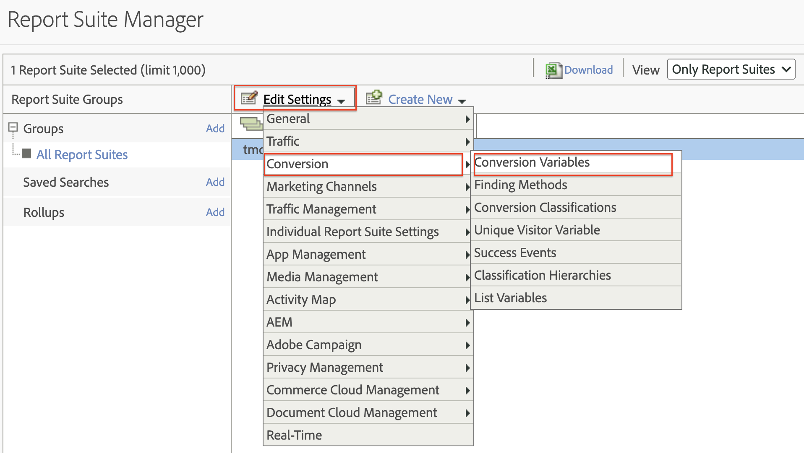
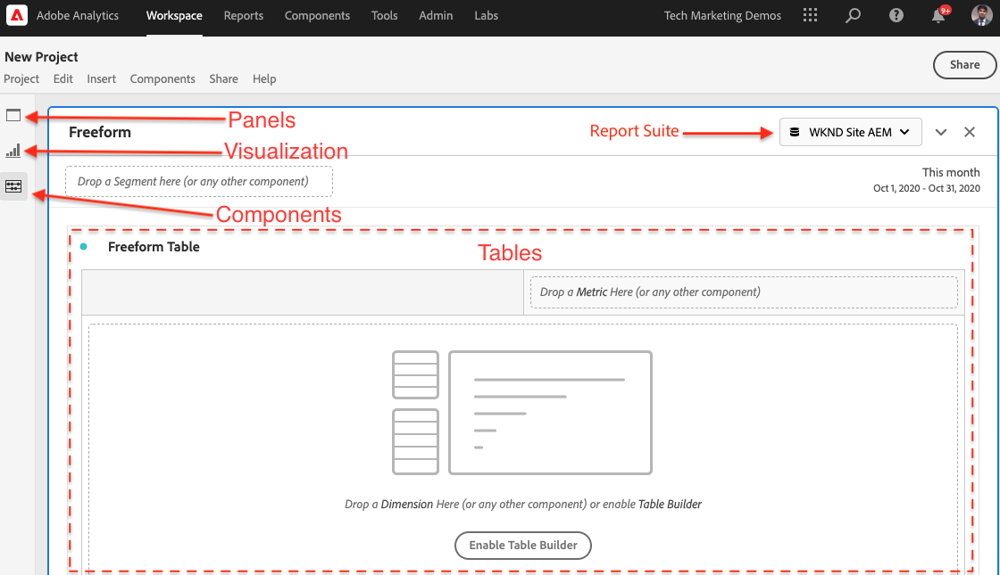

# Gegevens analyseren met Analysis Workspace

Leer hoe u gegevens die vanaf een Adobe Experience Manager-site zijn vastgelegd, kunt toewijzen aan maateenheden en dimensies in Adobe Analytics-rapportensuites. Leer hoe u een gedetailleerd rapportdashboard maakt met de Analysis Workspace-functie van Adobe Analytics.

## Wat u gaat maken

Het WKND marketing team wil begrijpen welke Vraag aan de knopen van de Actie (CTA) het best op de homepage presteert. In deze zelfstudie maken we een nieuw project in de Analysis Workspace om de prestaties van verschillende CTA-knoppen te visualiseren en het gebruikersgedrag op de site te begrijpen. De volgende informatie wordt gevangen gebruikend Adobe Analytics wanneer een gebruiker een Vraag aan de knoop van de Actie (CTA) op de WKND homepage klikt.

**Variabelen voor analyse**

Hieronder vindt u een overzicht van de analytische variabelen die momenteel worden bijgehouden:

* `eVar5` -  `Page template`
* `eVar6` - `Page Id`
* `eVar7` -  `Page last modified date`
* `eVar8` -  `CTA Button Id`
* `eVar9` -  `Page Name`
* `event8` -  `CTA Button Click event`
* `prop8` -  `CTA Button Id`

### Doelstellingen {#objective}

1. Maak een nieuwe rapportsuite of gebruik een bestaande set.
1. Configureer [Conversievariabelen (eVars)](https://docs.adobe.com/content/help/en/analytics/admin/admin-tools/conversion-variables/conversion-var-admin.html) en [Gebeurtenissen met succes (Gebeurtenissen)](https://docs.adobe.com/help/en/analytics/admin/admin-tools/success-events/success-event.html) in de rapportsuite.
1. Maak een [Analysis Workspace-project](https://docs.adobe.com/content/help/en/analytics/analyze/analysis-workspace/home.html) om gegevens te analyseren met behulp van gereedschappen waarmee u snel inzichten kunt bouwen, analyseren en delen.
1. Deel het Analysis Workspace-project met andere teamleden.

## Vereisten

Deze zelfstudie is een voortzetting van de [Aangeklikte component bijhouden met Adobe Analytics](./track-clicked-component.md) en gaat ervan uit dat u:

* A **Launch Property** met [Adobe Analytics extension](https://docs.adobe.com/content/help/en/launch/using/extensions-ref/adobe-extension/analytics-extension/overview.html) enabled
* **Adobe** AnalyticSnelst/dev-rapportsuite-id en trackingserver. Zie de volgende documentatie voor [het creëren van een nieuwe rapportreeks](https://docs.adobe.com/content/help/en/analytics/admin/manage-report-suites/new-report-suite/new-report-suite.html).
* [Experience Platform ](https://docs.adobe.com/content/help/en/platform-learn/tutorials/data-ingestion/web-sdk/introduction-to-the-experience-platform-debugger.html) Debuggerbrowser uitbreiding die met uw bezit van de Lancering wordt gevormd op  [https://wknd.site/us/en.](https://wknd.site/us/en.html) htmlor een plaats van de AEM met de toegelaten Laag van Gegevens van Adobe wordt geladen.

## Conversievariabelen (eVars) en succesgebeurtenissen (gebeurtenis)

De Custom Insight-conversievariabele (of -eVar) wordt in de Adobe-code op de geselecteerde webpagina&#39;s van uw site geplaatst. Zijn belangrijkste doel is omzettingssuccesmetriek in douane marketing rapporten te segmenteren. Een eVar kan op bezoek-gebaseerd zijn en functioneren gelijkaardig aan koekjes. De waarden die in eVar-variabelen worden doorgegeven, volgen de gebruiker gedurende een vooraf bepaalde periode.

Wanneer een eVar aan de waarde van een bezoeker wordt geplaatst, onthoudt Adobe automatisch die waarde tot het verloopt. Eventuele succesgebeurtenissen die een bezoeker tegenkomt terwijl de waarde eVar actief is, worden geteld bij de waarde eVar.

Vars kunnen het beste worden gebruikt om oorzaak en effect te meten, zoals:

* Welke interne campagnes de inkomsten beïnvloedden
* Welke banneradvertenties uiteindelijk hebben geresulteerd in een registratie
* Het aantal keren dat een interne zoekopdracht is gebruikt voordat een bestelling is gemaakt

Gebeurtenissen met succes zijn handelingen die kunnen worden bijgehouden. U bepaalt wat een succesgebeurtenis is. Als een bezoeker bijvoorbeeld op een CTA-knop klikt, kan de klikgebeurtenis als een succesgebeurtenis worden beschouwd.

### Vars configureren

1. Selecteer uw organisatie op de startpagina van Adobe Experience Cloud en start Adobe Analytics.

   

1. Klik op **Admin** > **Suites rapporteren** en zoek de rapportsuite.

   

1. Selecteer de Reeks van het Rapport > **geef Montages** > **Omzetting** > **Omzetvariabelen** uit

   

1. Gebruikend **voeg nieuw** optie toe, maken de Variabelen van de Omzetting om het schema als hieronder in kaart te brengen:

   * `eVar5` -   `Page Template`
   * `eVar6` -  `Page ID`
   * `eVar7` -  `Last Modified Date`
   * `eVar8` -  `Button Id`
   * `eVar9` -  `Page Name`

   

1. Geef een relevante naam en beschrijving op voor elke eVars en **Sla** uw wijzigingen op. Deze eVars worden gebruikt om in de volgende sectie een Analysis Workspace-project te maken. Een gebruiksvriendelijke naam maakt de variabelen gemakkelijk te ontdekken.

   

### Succesgebeurtenissen configureren

Daarna, creëren wij zelfs om de Knoop te volgen CTA klikt.

1. Selecteer **Rapportsuite-id** in het venster **RapportSuite Manager** Instellingen bewerken **.**
1. Klik **Conversie** > **Gebeurtenissen met succes**
1. Gebruikend **voeg Nieuw** optie toe, creeer een nieuwe gebeurtenis van het douanesucces om de Knoop te volgen CTA en dan **sparen** uw veranderingen.
   * `Event` : `event8`
   * `Name`:`CTA Click`
   * `Type`:`Counter`

   

## Een nieuw project maken in Analysis Workspace {#workspace-project}

Analysis Workspace is een flexibel browserprogramma waarmee u snel analyses kunt maken en inzichten kunt delen. Gebruikend de belemmering-en-dalingsinterface, kunt u uw analyse ambachtelijk maken, visualisaties toevoegen om gegevens aan het leven te brengen, een dataset in werking te stellen, delen, en planningsprojecten met iedereen in uw organisatie.

Daarna, creeer een nieuw [project](https://docs.adobe.com/content/help/en/analytics/analyze/analysis-workspace/build-workspace-project/t-freeform-project.html) om een dashboard te bouwen om de prestaties van de knopen CTA door de plaats te analyseren.

1. Selecteer **Werkruimte** op de werkbalk Analytics en klik op **Een nieuw project maken**.

   

1. Kies om van **leeg project** te beginnen of één van de pre-gebouwde malplaatjes te selecteren, of door Adobe of douanesjablonen worden verstrekt die door uw organisatie worden gecreeerd. Er zijn verschillende sjablonen beschikbaar, afhankelijk van de analyse- of gebruikscase die u in gedachten hebt. [Meer weten ](https://docs.adobe.com/content/help/en/analytics/analyze/analysis-workspace/build-workspace-project/starter-projects.html) over de verschillende beschikbare sjabloonopties?

   In uw project van de Werkruimte, worden de panelen, de lijsten, de visualisaties, en de componenten betreden van het linkerspoor. Dit zijn uw projectbouwstenen.

   * **[Componenten](https://docs.adobe.com/content/help/en/analytics/analyze/analysis-workspace/components/analysis-workspace-components.html)**  - Componenten zijn dimensies, metriek, segmenten of datumbereiken, die allemaal kunnen worden gecombineerd in een tabel met vrije vorm om te beginnen met het beantwoorden van uw zakelijke vraag. Zorg ervoor dat u bekend bent met elk type component voordat u in de analyse gaat duiken. Als u de componentterminologie onder de knie hebt, kunt u beginnen met slepen en neerzetten om uw analyse te maken in een tabel met vrije vorm.
   * **[Visualisaties](https://docs.adobe.com/content/help/en/analytics/analyze/analysis-workspace/visualizations/freeform-analysis-visualizations.html)**  - Visualisaties, zoals een bar of lijngrafiek, worden dan toegevoegd bovenop de gegevens om het aan het leven visueel te brengen. In de uiterst linkse spoorlijn, selecteer het middenpictogram van Visualisaties om de volledige lijst van beschikbare visualisaties te zien.
   * **[Deelvensters](https://docs.adobe.com/content/help/en/analytics/analyze/analysis-workspace/panels/panels.html)**  - Een deelvenster is een verzameling tabellen en visualisaties. U hebt toegang tot deelvensters via het pictogram linksboven in de werkruimte. Deelvensters zijn handig wanneer u uw projecten wilt ordenen op basis van tijdsperiodes, rapportreeksen of gevallen waarin u de analyse wilt gebruiken. De volgende deelvenstertypen zijn beschikbaar in Analysis Workspace:

   

### Gegevensvisualisatie toevoegen met Analysis Workspace

Daarna, bouw een lijst om een visuele vertegenwoordiging van tot stand te brengen hoe de gebruikers met Vraag aan de knopen van de Actie (CTA) op de WKND homepage van de Plaats in wisselwerking staan. Om een dergelijke vertegenwoordiging te bouwen, gebruiken de gegevens die in [Aangeklikte component van het Spoor met Adobe Analytics](./track-clicked-component.md) worden verzameld. Hieronder volgt een snelle samenvatting van gegevens die voor gebruikersinteractie met de Vraag aan de knopen van de Actie voor de Plaats WKND worden gevolgd.

* `eVar5` -   `Page template`
* `eVar6` -  `Page Id`
* `eVar7` -  `Page last modified date`
* `eVar8` -  `CTA Button Id`
* `eVar9` -  `Page Name`
* `event8` -  `CTA Button Click event`
* `prop8` -  `CTA Button Id`

1. Sleep de **Pagina** afmetingscomponent naar de tabel voor vrije vorm. U moet nu een visualisatie kunnen weergeven die de paginanaam (eVar9) en de bijbehorende paginaweergaven (voorvallen) weergeeft die in de tabel worden weergegeven.

   

1. Sleep de metrische waarde **CTA Click** (event8) naar de metrische instantie van het voorkomen en vervang deze. U kon nu een visualisatie bekijken die de Naam van de Pagina (eVar9) en een overeenkomstige telling van CTA Klikken gebeurtenissen op een pagina toont.

   

1. Laten we de pagina onderverdelen op basis van het sjabloontype. Selecteer de metrische waarde van de paginasjabloon uit componenten en sleep de metrische waarde van het paginasjabloon naar de dimensie Paginanaam. U kunt de paginanaam nu bekijken, uitgesplitst naar het sjabloontype.

   * **Voor**

      

   * **Na**

      

1. Om te begrijpen hoe de gebruikers met Knopen CTA in wisselwerking staan wanneer zij op de pagina&#39;s van de Plaats WKND zijn, moeten wij metrische metrisch verder breken van het Malplaatje van de Pagina door identiteitskaart van de Knoop (eVar8) metrisch toe te voegen.

   

1. Hieronder ziet u een visuele vertegenwoordiging van de Plaats WKND die door zijn paginasjabloon wordt verdeeld en verder door gebruikersinteractie met de KND van de Plaats klikt aan de Knopen van de Actie (CTA) wordt verdeeld.

   

1. Met de Adobe Analytics-classificaties kunt u de waarde van de knop-id vervangen door een gebruikersvriendelijke naam. U zou meer over kunnen lezen hoe te om een classificatie voor specifieke metrische [hier](https://docs.adobe.com/content/help/en/analytics/components/classifications/c-classifications.html) tot stand te brengen. In dit geval, hebben wij classificatiemetrisch `Button Section (Button ID)` opstelling voor `eVar8` die knoop identiteitskaart aan een gebruikersvriendelijke naam in kaart brengt.

   

## Classificatie toevoegen aan een analytische variabele

### Conversie-classificaties

De Classificatie van Analytics is een manier om de veranderlijke gegevens van Analytics te categoriseren, dan tonend de gegevens op verschillende manieren wanneer u rapporten produceert. Om te verbeteren hoe identiteitskaart van de Knoop in het rapport van de Werkruimte van de Analyse wordt getoond, maken een classificatievariabele voor Knoop Id (eVar8). Wanneer het classificeren, vestigt u een verband tussen de variabele en de meta-gegevens met betrekking tot die variabele.

Laten we nu een variabele Classificatie maken voor Analytics.

1. Selecteer **Rapporten** in het werkbalkmenu **Admin**
1. Selecteer **Report Suite Id** in het venster **Report Suite Manager** en klik op **Edit Settings** > **Conversion** > **Conversion Classifications**

   

1. Selecteer in de vervolgkeuzelijst **Selecteer classificatietype** de variabele (eVar8-knop-id) om een classificatie toe te voegen.
1. Klik op de pijl rechts naast de classificatievariabele die onder de sectie Classificaties wordt vermeld om een nieuwe Classificatie toe te voegen.

   

1. Geef in het dialoogvenster **Een classificatie bewerken** een geschikte naam op voor de tekstclassificatie. Er wordt een dimensiecomponent met de naam voor tekstclassificatie gemaakt.

   

1. **** Sla uw wijzigingen op.

### Classificatieimportmodule

Gebruik de importer om classificaties te uploaden naar Adobe Analytics. U kunt de gegevens ook exporteren voor bijwerken vóór het importeren. De gegevens die u met het gereedschap Importeren importeert, moeten een specifieke indeling hebben. Adobe biedt u de mogelijkheid om een gegevenssjabloon te downloaden met alle juiste headerdetails in een door tabs gescheiden gegevensbestand. U kunt nieuwe gegevens aan deze sjabloon toevoegen en het gegevensbestand vervolgens met FTP in de browser importeren.

#### Indelingssjabloon

Voordat u classificaties importeert in marketingrapporten, kunt u een sjabloon downloaden waarmee u een bestand met classificatiegegevens kunt maken. Het gegevensbestand gebruikt uw gewenste classificaties als kolomrubrieken, dan organiseert de rapportgegevensreeks onder de aangewezen classificatiekoppen.

Vervolgens downloaden we de classificatiesjabloon voor de variabele Button Id (eVar8)

1. Navigeer naar **Admin** > **Classificatieimportmodule**
1. Laten we een classificatiesjabloon voor de conversievariabele downloaden van het tabblad **Sjabloon downloaden**.
   

1. Geef op het tabblad Download Template de configuratie van de gegevenssjabloon op.
   * **Selecteer rapportsuite** : Selecteer de rapportsuite die u in de sjabloon wilt gebruiken. De rapportsuite en gegevensset moeten overeenkomen.
   * **Te classificeren**  gegevensset: Selecteer het type gegevens voor het gegevensbestand. Het menu omvat alle rapporten in uw rapportreeksen die voor classificaties worden gevormd.
   * **Codering** : Selecteer de tekencodering voor het gegevensbestand. De standaardcoderingsindeling is UTF-8.

1. Klik **Download** en sla het sjabloonbestand op uw lokale systeem op. Het sjabloonbestand is een door tabs gescheiden gegevensbestand (bestandsnaamextensie .tab) dat door de meeste spreadsheettoepassingen wordt ondersteund.
1. Open het door tabs gescheiden gegevensbestand met een editor van uw keuze.
1. Voeg de knop-id (eVar9) en een bijbehorende knopnaam toe aan het door tabs gescheiden bestand voor elke eVar-9-waarde uit stap 9 in de sectie.

   

1. **Sla** het door tabs gescheiden bestand op.
1. Navigeer naar het tabblad **Bestand importeren**.
1. Configureer de bestemming voor het importeren van het bestand.
   * **Selecteer rapportsuite** : WKND Site AEM (rapportsuite)
   * **Gegevensset die moet worden geclassificeerd** : Knop-id (conversievariabele eVar8)
1. Klik op de optie **Kies Bestand** om het door tabs gescheiden bestand van uw systeem te uploaden en klik vervolgens op **Bestand importeren**

   

   >[!NOTE]
   >
   > Wanneer het importeren is gelukt, worden onmiddellijk de juiste wijzigingen in een exportbewerking weergegeven. Gegevenswijzigingen in rapporten duren echter maximaal vier uur wanneer u een browser importeert en maximaal 24 uur wanneer u een FTP-import gebruikt.

#### Conversievariabele vervangen door classificatievariabele

1. Selecteer **Werkruimte** op de werkbalk Analytics en open de werkruimte die we hebben gemaakt in het gedeelte [Nieuw project maken in het gedeelte Analysis Workspace](#workspace-project) van deze zelfstudie.

   

1. Daarna, vervang **Knoop Identiteitskaart** metrisch in uw werkruimte die identiteitskaart van een Vraag aan de knoop van de Actie (CTA) met de classificatienaam toont die in de vorige stap wordt gecreeerd.

1. Van de componentenzoeker, onderzoek naar **KND CTA Knopen** en sleep-daling de **KND CTA Knopen (Identiteitskaart van de Knoop)** metrisch op de Identiteitskaart van de Knoop en vervang het.

   * **Voor**

      
   * **Na**

      

1. U kunt zien dat metrisch van Knoop ID die knoopidentiteitskaart van een Vraag aan de knoop van de Actie (CTA) bevatte nu met een overeenkomstige naam wordt vervangen die in het Malplaatje van de Indeling wordt verstrekt.
1. Laten we de tabel Analytics Workspace vergelijken met de WKND Home-pagina en de CTA Button-kliktelling en de bijbehorende analyse begrijpen. Gebaseerd op de gegevens van de werkruimtetabellijst van de vrije vorm, is het duidelijk dat 22 keer de gebruikers op **SKI NU** en vier keer voor de Camping van de Homepagina WKND in West Australië **Meer** hebben gelezen.

   

1. Sla uw Adobe Analytics Workspace-project op en geef een juiste naam en beschrijving op. U kunt desgewenst codes toevoegen aan een werkruimteproject.

   

1. Nadat u het project hebt opgeslagen, kunt u uw werkruimteproject delen met andere collega&#39;s of teamleden met de optie Delen.

   

## Gefeliciteerd!

U hebt net geleerd hoe u gegevens die zijn vastgelegd vanaf een Adobe Experience Manager-site kunt toewijzen aan maateenheden en dimensies in Adobe Analytics-rapportaereeksen, een classificatie voor de metriek kunt uitvoeren en een gedetailleerd rapportdashboard kunt maken met de Analysis Workspace-functie van Adobe Analytics.

