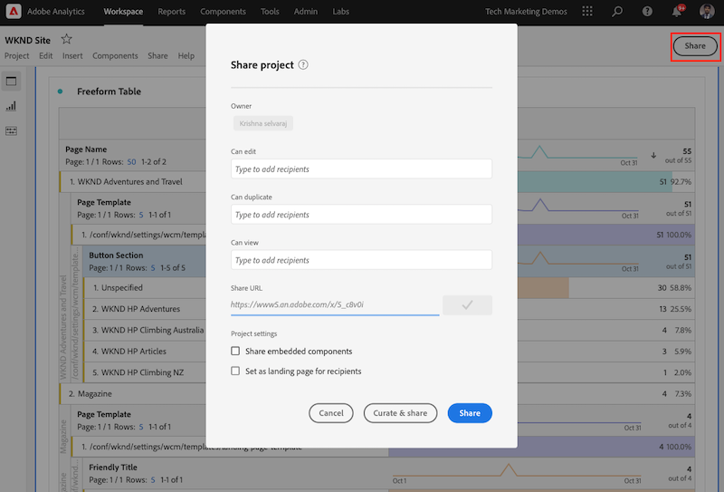

# Gegevens analyseren met Analysis Workspace

Leer hoe u gegevens die vanaf een Adobe Experience Manager-site zijn vastgelegd, kunt toewijzen aan maateenheden en dimensies in Adobe Analytics-rapportensuites. Leer hoe u een gedetailleerd rapportdashboard maakt met de Analysis Workspace-functie van Adobe Analytics.

## Wat u gaat bouwen {#what-build}

Het WKND-marketingteam wil graag weten welke `Call to Action (CTA)` de knoppen voeren het beste uit op de startpagina. In deze zelfstudie maakt u een project in het dialoogvenster **Analysis Workspace** om de prestaties van verschillende knopen van CTA te visualiseren en gebruikersgedrag op de plaats te begrijpen. De volgende informatie wordt gevangen gebruikend Adobe Analytics wanneer een gebruiker een Vraag aan de knoop van de Actie (CTA) op de WKND homepage klikt.

**Variabelen voor analyse**

Hieronder vindt u een overzicht van de analytische variabelen die momenteel worden bijgehouden:

* `eVar5` -  `Page template`
* `eVar6` - `Page Id`
* `eVar7` - `Page last modified date`
* `eVar8` - `CTA Button Id`
* `eVar9` - `Page Name`
* `event8` - `CTA Button Click event`
* `prop8` - `CTA Button Id`

### Doelstellingen {#objective}

1. Maak een rapportsuite of gebruik een bestaande set.
1. Configureren [Conversievariabelen (eVars)](https://experienceleague.adobe.com/docs/analytics/admin/admin-tools/manage-report-suites/edit-report-suite/conversion-variables/conversion-var-admin.html) en [Gebeurtenissen met succes (gebeurtenissen)](https://experienceleague.adobe.com/docs/analytics/admin/admin-tools/manage-report-suites/edit-report-suite/conversion-variables/success-events/success-event.html) in de rapportsuite.
1. Een [Analysis Workspace-project](https://experienceleague.adobe.com/docs/analytics/analyze/analysis-workspace/home.html) om gegevens te analyseren met behulp van hulpmiddelen die u toestaan om, inzichten snel te bouwen te analyseren en te delen.
1. Deel het Analysis Workspace-project met andere teamleden.

## Vereisten

Deze zelfstudie is een voortzetting van de [Aangeklikte component bijhouden met Adobe Analytics](./track-clicked-component.md) en gaat ervan uit dat u:

* A **Tageigenschap** met de [Adobe Analytics-extensie](https://experienceleague.adobe.com/docs/experience-platform/tags/extensions/client/analytics/overview.html) enabled
* **Adobe Analytics** test/dev rapportsuite-id en trackingserver. Zie de volgende documentatie voor [een rapportenpakket maken](https://experienceleague.adobe.com/docs/analytics/admin/admin-tools/manage-report-suites/c-new-report-suite/new-report-suite.html).
* [Foutopsporing Experience Platform](https://experienceleague.adobe.com/docs/platform-learn/data-collection/debugger/overview.html) browser uitbreiding die met een markeringsbezit wordt gevormd die op [WKND-site](https://wknd.site/us/en.html) of een AEM plaats met de Toegelaten Laag van Gegevens van de Adobe.

## Conversievariabelen (eVars) en succesgebeurtenissen (gebeurtenis)

De Custom Insight-conversievariabele (of -eVar) wordt in de Adobe-code op de geselecteerde webpagina&#39;s van uw site geplaatst. Zijn belangrijkste doel is omzettingssuccesmetriek in douane marketing rapporten te segmenteren. Een eVar kan een op een bezoek gebaseerde functie zijn en werkt net als cookies. De waarden die worden doorgegeven aan eVar-variabelen volgen de gebruiker gedurende een vooraf bepaalde periode.

Wanneer een eVar aan de waarde van een bezoeker wordt geplaatst, onthoudt Adobe automatisch die waarde tot het verloopt. Eventuele succesgebeurtenissen die een bezoeker tegenkomt terwijl de waarde eVar actief is, worden geteld bij de waarde eVar.

Vars kunnen het beste worden gebruikt om oorzaak en effect te meten, zoals:

* Welke interne campagnes de inkomsten beïnvloedden
* Welke banneradvertenties uiteindelijk hebben geresulteerd in een registratie
* Het aantal keren dat een interne zoekopdracht is gebruikt voordat een bestelling is gemaakt

Gebeurtenissen met succes zijn handelingen die kunnen worden bijgehouden. U bepaalt wat een succesgebeurtenis is. Als een bezoeker bijvoorbeeld op een CTA-knop klikt, kan de klikgebeurtenis als een succesgebeurtenis worden beschouwd.

### Vars configureren

1. Selecteer uw organisatie op de startpagina van Adobe Experience Cloud en start Adobe Analytics.

   

1. Klik op de werkbalk Analyse op **Beheer** > **Rapportageopties** en zoek naar de rapportsuite.

   

1. Selecteer de rapportsuite > **Instellingen bewerken** > **Conversie** > **Conversievariabelen**

   

1. Met de **Nieuw toevoegen** Laten we Conversievariabelen maken om het schema als volgt toe te wijzen:

   * `eVar5` -  `Page Template`
   * `eVar6` - `Page ID`
   * `eVar7` - `Last Modified Date`
   * `eVar8` - `Button Id`
   * `eVar9` - `Page Name`

   

1. Geef een geschikte naam en beschrijving voor elke eVars en **Opslaan** uw wijzigingen. In het Analysis Workspace-project worden de eVars met de juiste naam gebruikt, zodat de variabelen gemakkelijk te vinden zijn onder een gebruiksvriendelijke naam.

   

### Succesgebeurtenissen configureren

Daarna, creëren wij een gebeurtenis om de Knoop te volgen CTA klikt.

1. Van de **Report Suite Manager** venster, selecteert u de **Set-id rapporteren** en klik op **Instellingen bewerken**.
1. Klikken **Conversie** > **Gebeurtenissen geslaagd**
1. Met de **Nieuwe toevoegen** optie, creeer een gebeurtenis van het douanesucces om de Knoop van de Knoop te volgen CTA klikt en dan **Opslaan** uw wijzigingen.
   * `Event` : `event8`
   * `Name`:`CTA Click`
   * `Type`:`Counter`

   

## Een project maken in Analysis Workspace {#workspace-project}

Analysis Workspace is een flexibel browserprogramma waarmee u snel analyses kunt maken en inzichten kunt delen. Gebruikend de belemmering-en-dalingsinterface, kunt u uw analyse ambachtelijk maken, visualisaties toevoegen om gegevens aan het leven te brengen, een dataset in werking te stellen, delen, en planningsprojecten met iedereen in uw organisatie.

Maak vervolgens een [project](https://experienceleague.adobe.com/docs/analytics/analyze/analysis-workspace/build-workspace-project/freeform-overview.html#analysis-workspace) om een dashboard te bouwen om de prestaties van de knopen CTA door de plaats te analyseren.

1. Selecteer op de werkbalk Analyse de optie **Werkruimte** en klik op **Een nieuw project maken**.

   

1. Kies ervoor te beginnen met een **leeg project** of selecteer een van de vooraf gebouwde sjablonen, opgegeven door Adobe of aangepaste sjablonen die door uw organisatie zijn gemaakt. Er zijn verschillende sjablonen beschikbaar, afhankelijk van de analyse- of gebruikscase die u in gedachten hebt. [Meer informatie](https://experienceleague.adobe.com/docs/analytics/analyze/analysis-workspace/build-workspace-project/starter-projects.html) over de verschillende beschikbare sjabloonopties.

   In uw project van de Werkruimte, worden de panelen, de lijsten, de visualisaties, en de componenten betreden van het linkerspoor. Ze maken bouwstenen voor je project.

   * **[Componenten](https://experienceleague.adobe.com/docs/analytics/analyze/analysis-workspace/components/analysis-workspace-components.html)** - Componenten zijn dimensies, metriek, segmenten of datumbereiken, die allemaal kunnen worden gecombineerd in een tabel met vrije vorm om te beginnen met het beantwoorden van uw zakelijke vraag. Zorg ervoor dat u bekend bent met elk type component voordat u in de analyse gaat duiken. Als u de componentterminologie onder de knie hebt, kunt u beginnen met slepen en neerzetten om uw analyse te maken in een tabel met vrije vorm.
   * **[Visualisaties](https://experienceleague.adobe.com/docs/analytics/analyze/analysis-workspace/visualizations/freeform-analysis-visualizations.html)** - Visualisaties, zoals een staaf of een lijndiagram, worden vervolgens toegevoegd boven op de gegevens om deze visueel tot leven te brengen. In de uiterst linkse spoorlijn, selecteer het middenpictogram van Visualisaties om de volledige lijst van beschikbare visualisaties te zien.
   * **[Deelvensters](https://experienceleague.adobe.com/docs/analytics/analyze/analysis-workspace/panels/panels.html)** - Een deelvenster is een verzameling tabellen en visualisaties. U hebt toegang tot deelvensters via het pictogram linksboven in de werkruimte. Deelvensters zijn handig wanneer u uw projecten wilt ordenen op basis van tijdsperiodes, rapportreeksen of gevallen waarin u de analyse wilt gebruiken. De volgende deelvenstertypen zijn beschikbaar in Analysis Workspace:

   

### Gegevensvisualisatie toevoegen met Analysis Workspace

Daarna, bouw een lijst om een visuele vertegenwoordiging tot stand te brengen van hoe de gebruikers met communiceren `Call to Action (CTA)` knoppen op de startpagina van de WKND-site. Om een dergelijke vertegenwoordiging te bouwen, gebruiken de gegevens die in [Aangeklikte component bijhouden met Adobe Analytics](./track-clicked-component.md). Hieronder volgt een snelle samenvatting van gegevens die voor gebruikersinteractie met de Vraag aan de knopen van de Actie voor de Plaats WKND worden gevolgd.

* `eVar5` -  `Page template`
* `eVar6` - `Page Id`
* `eVar7` - `Page last modified date`
* `eVar8` - `CTA Button Id`
* `eVar9` - `Page Name`
* `event8` - `CTA Button Click event`
* `prop8` - `CTA Button Id`

1. Sleep de **Pagina** dimensiecomponent op de Lijst van de Vrije Vorm. U moet nu een visualisatie kunnen weergeven die de paginanaam (eVar9) en de bijbehorende paginaweergaven (voorvallen) weergeeft die in de tabel worden weergegeven.

   

1. Sleep de **CTA-klik** (event8) metrisch op het voorkomen en vervangt het metrisch. U kon nu een visualisatie bekijken die de Naam van de Pagina (eVar9) en een overeenkomstige telling van CTA Klikken gebeurtenissen op een pagina toont.

   

1. Laten we de pagina onderverdelen op basis van het sjabloontype. Selecteer de metrische waarde van de paginasjabloon uit componenten en sleep de metrische waarde van het paginasjabloon naar de dimensie Paginanaam. U kunt de paginanaam nu bekijken, uitgesplitst naar het sjabloontype.

   * **Voor**
     

   * **Na**
     

1. Om te begrijpen hoe de gebruikers met Knopen CTA in wisselwerking staan wanneer zij op de pagina&#39;s van de Plaats WKND zijn, is de verdere verdeling door de metrisch van Knoop identiteitskaart (eVar8) toe te voegen nodig.

   

1. Hieronder ziet u een visuele vertegenwoordiging van de Plaats WKND die door zijn paginasjabloon wordt verdeeld en verder door gebruikersinteractie met de KND van de Plaats klikt aan de Knopen van de Actie (CTA) wordt verdeeld.

   

1. Met de Adobe Analytics-classificaties kunt u de waarde van de knop-id vervangen door een gebruikersvriendelijke naam. U kunt meer lezen over het maken van een classificatie voor een specifieke metrische waarde [hier](https://experienceleague.adobe.com/docs/analytics/components/classifications/c-classifications.html). In dit geval hebben we een classificatiemetrisch `Button Section (Button ID)` instellen voor `eVar8` Hiermee wordt de knop-id toegewezen aan een gebruikersvriendelijke naam.

   

## Classificatie toevoegen aan een analytische variabele

### Conversie-classificaties

De Classificatie van Analytics is een manier om de veranderlijke gegevens van Analytics te categoriseren, dan tonend de gegevens op verschillende manieren wanneer u rapporten produceert. Om te verbeteren hoe identiteitskaart van de Knoop in het rapport van de Werkruimte van de Analyse wordt getoond, maken een classificatievariabele voor Knoop Id (eVar8). Wanneer het classificeren, vestigt u een verband tussen de variabele en de meta-gegevens met betrekking tot die variabele.

Laten we nu een variabele Classificatie maken voor Analytics.

1. Van de **Beheer** werkbalkmenu, selecteert u **Rapportageopties**
1. Selecteer **Set-id rapporteren** van de **Report Suite Manager** venster en klik op **Instellingen bewerken** > **Conversie** > **Conversie-classificaties**

   

1. Van de **Classificatietype selecteren** vervolgkeuzelijst, selecteert u de variabele (eVar8-knop-id) om een classificatie toe te voegen.
1. Klik op de pijl rechts naast de variabele Classificatie onder de sectie Classificaties om een nieuwe classificatie toe te voegen.

   

1. In de **Een classificatie bewerken** een geschikte naam voor de Tekstclassificatie opgeven. Er wordt een dimensiecomponent met de naam voor tekstclassificatie gemaakt.

   

1. **Opslaan** uw wijzigingen.

### Classificatieimportmodule

Gebruik de importer om classificaties te uploaden naar Adobe Analytics. U kunt de gegevens ook exporteren voor bijwerken vóór het importeren. De gegevens die u met het gereedschap Importeren importeert, moeten een specifieke indeling hebben. Adobe biedt u de mogelijkheid om een gegevenssjabloon te downloaden met alle juiste headerdetails in een door tabs gescheiden gegevensbestand. U kunt nieuwe gegevens aan deze sjabloon toevoegen en het gegevensbestand vervolgens met FTP in de browser importeren.

#### Indelingssjabloon

Voordat u classificaties importeert in marketingrapporten, kunt u een sjabloon downloaden waarmee u een bestand met classificatiegegevens kunt maken. Het gegevensbestand gebruikt uw gewenste classificaties als kolomrubrieken, dan organiseert de rapportgegevensreeks onder de aangewezen classificatiekoppen.

Vervolgens downloaden we de classificatiesjabloon voor de variabele Button Id (eVar8)

1. Navigeren naar **Beheer** > **Classificatieimportmodule**
1. Laten we een classificatiesjabloon voor de conversievariabele downloaden van de **Sjabloon downloaden** Tab.
   

1. Geef op het tabblad Download Template de configuratie van de gegevenssjabloon op.
   * **Rapportsuite selecteren** : Selecteer de rapportsuite die u in de sjabloon wilt gebruiken. De rapportsuite en gegevensset moeten overeenkomen.
   * **Te classificeren gegevensset** : Selecteer het type gegevens voor het gegevensbestand. Het menu omvat alle rapporten in uw rapportreeksen die voor classificaties worden gevormd.
   * **Codering** : Selecteer de tekencodering voor het gegevensbestand. De standaardcoderingsindeling is UTF-8.

1. Klikken **Downloaden** en sla het sjabloonbestand op uw lokale systeem op. Het sjabloonbestand is een door tabs gescheiden gegevensbestand (bestandsnaamextensie .tab) dat door de meeste spreadsheettoepassingen wordt ondersteund.
1. Open het door tabs gescheiden gegevensbestand met een editor van uw keuze.
1. Voeg de knop-id (eVar9) en een bijbehorende knopnaam toe aan het door tabs gescheiden bestand voor elke eVar-9-waarde uit stap 9 in de sectie.

   

1. **Opslaan** het door tabs gescheiden bestand.
1. Ga naar de **Bestand importeren** tab.
1. Configureer de bestemming voor het importeren van het bestand.
   * **Rapportsuite selecteren** : WKND Site AEM (rapportsuite)
   * **Te classificeren gegevensset** : Knop-id (conversievariabele eVar8)
1. Klik op de knop **Bestand kiezen** uploadt u het door tabs gescheiden bestand van uw systeem en klikt u vervolgens op **Bestand importeren**

   

   >[!NOTE]
   >
   > Wanneer het importeren is gelukt, worden onmiddellijk de juiste wijzigingen in een exportbewerking weergegeven. Gegevenswijzigingen in rapporten duren echter maximaal vier uur wanneer u een browser importeert en maximaal 24 uur wanneer u een FTP-import gebruikt.

#### Conversievariabele vervangen door classificatievariabele

1. Selecteer op de werkbalk Analyse de optie **Werkruimte** en opent u de werkruimte die is gemaakt in het dialoogvenster [Een project maken in Analysis Workspace](#create-a-project-in-analysis-workspace) in deze zelfstudie.

   

1. Vervang vervolgens de **Knop-id** metrisch in uw werkruimte die identiteitskaart van een Vraag aan de knoop van de Actie (CTA) met de classificatienaam toont die in de vorige stap wordt gecreeerd.

1. Zoek in de zoekfunctie van de component naar **WKND CTA-knoppen** en sleep de **WKND CTA-knoppen (knop-id)** afmetingen op metrische identiteitskaart van de Knoop en vervang het.

   * **Voor**
     
   * **Na**
     

1. U kunt zien dat metrisch van Knoop ID die knoopidentiteitskaart van een Vraag aan de knoop van de Actie (CTA) bevatte nu met een overeenkomstige naam wordt vervangen die in het Malplaatje van de Indeling wordt verstrekt.
1. Laten we de tabel Analytics Workspace vergelijken met de WKND Home-pagina en de CTA Button-kliktelling en de bijbehorende analyse begrijpen. Gebaseerd op de gegevens van de werkruimtetabel van de werkruimtetabel, is het duidelijk dat 22 keer de gebruikers hebben geklikt **SKI NOW** en vier keer voor de WKND Home Page Camping in Western Australia **Meer informatie** knop.

   

1. Sla uw Adobe Analytics Workspace-project op en geef een juiste naam en beschrijving op. U kunt desgewenst codes toevoegen aan een werkruimteproject.

   

1. Nadat u het project hebt opgeslagen, kunt u uw werkruimteproject delen met andere collega&#39;s of teamleden met de optie Delen.

   

## Gefeliciteerd!

U hebt net geleerd hoe u gegevens die zijn vastgelegd vanaf een Adobe Experience Manager-site kunt toewijzen aan maateenheden en dimensies in Adobe Analytics-rapportageopes. Ook, voerde een Classificatie voor de metriek uit, en bouw een gedetailleerd rapporteringsdashboard gebruikend de eigenschap van Analysis Workspace van Adobe Analytics.
