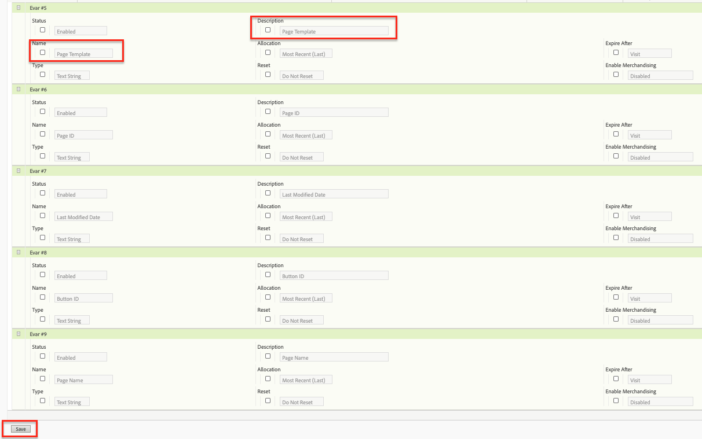
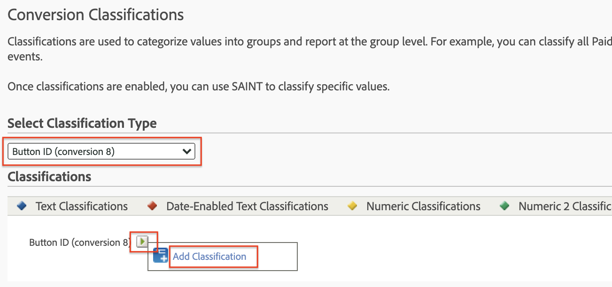
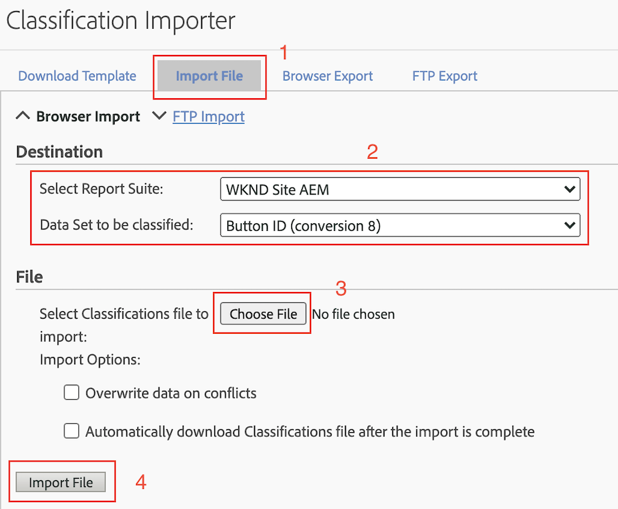

# Gegevens analyseren met Analysis Workspace

Leer hoe u gegevens die vanaf een Adobe Experience Manager-site zijn vastgelegd, kunt toewijzen aan maateenheden en dimensies in Adobe Analytics-rapportensuites. Leer hoe u een gedetailleerd rapportdashboard maakt met de Analysis Workspace-functie van Adobe Analytics.

## Wat u gaat bouwen {#what-build}

Het WKND-marketingteam is geïnteresseerd in de vraag welke `Call to Action (CTA)` -knoppen het beste op de startpagina uitvoeren. In dit leerprogramma, creeer een project in **Analysis Workspace** om de prestaties van verschillende knopen van CTA te visualiseren en gebruikersgedrag op de plaats te begrijpen. De volgende informatie wordt gevangen gebruikend Adobe Analytics wanneer een gebruiker een Vraag aan de knoop van de Actie (CTA) op de WKND homepage klikt.

**Variabelen van Analytics**

Hieronder vindt u een overzicht van de analytische variabelen die momenteel worden bijgehouden:

* `eVar5` - `Page template`
* `eVar6` - `Page Id`
* `eVar7` - `Page last modified date`
* `eVar8` - `CTA Button Id`
* `eVar9` - `Page Name`
* `event8` - `CTA Button Click event`
* `prop8` - `CTA Button Id`

### Doelstellingen {#objective}

1. Maak een rapportsuite of gebruik een bestaande set.
1. Vorm [ Variabelen van de Omzetting (eVars) ](https://experienceleague.adobe.com/docs/analytics/admin/admin-tools/manage-report-suites/edit-report-suite/conversion-variables/conversion-var-admin.html) en [ Gebeurtenissen van het Succes (Gebeurtenissen) ](https://experienceleague.adobe.com/en/docs/analytics/admin/admin-tools/manage-report-suites/edit-report-suite/conversion-variables/success-event) in de Reeks van het Rapport.
1. Creeer een [ project van Analysis Workspace ](https://experienceleague.adobe.com/docs/analytics/analyze/analysis-workspace/home.html) om gegevens met de hulp van hulpmiddelen te analyseren die u toestaan om, inzichten snel te bouwen te analyseren en te delen.
1. Deel het Analysis Workspace-project met andere teamleden.

## Vereisten

Dit leerprogramma is een voortzetting van het [ Geklikte Spoor component met Adobe Analytics ](./track-clicked-component.md) en veronderstelt dat u hebt:

* A **Bezit van de Markering** met de [ toegelaten uitbreiding van Adobe Analytics ](https://experienceleague.adobe.com/docs/experience-platform/tags/extensions/client/analytics/overview.html)
* **Adobe Analytics** test/dev- rapportreeks identiteitskaart en volgende server. Zie de volgende documentatie voor [ het creëren van een rapportreeks ](https://experienceleague.adobe.com/docs/analytics/admin/admin-tools/manage-report-suites/c-new-report-suite/new-report-suite.html).
* ](https://experienceleague.adobe.com/docs/platform-learn/data-collection/debugger/overview.html) browser van foutopsporing van het Experience Platform 1} uitbreiding die met een markeringsbezit wordt gevormd op de [ wordt geladen Plaats WKND ](https://wknd.site/us/en.html) of een AEM plaats met de toegelaten Laag van Gegevens van de Adobe.[

## Conversievariabelen (eVars) en succesgebeurtenissen (gebeurtenis)

De Custom Insight-conversievariabele (of eVar) wordt in de Adobe-code op de geselecteerde webpagina&#39;s van uw site geplaatst. Zijn belangrijkste doel is omzettingssuccesmetriek in douane marketing rapporten te segmenteren. Een eVar kan een op een bezoek gebaseerde functie zijn en werkt net als cookies. De waarden die in eVar variabelen worden overgegaan volgen de gebruiker voor een vooraf bepaalde periode.

Wanneer een eVar aan de waarde van een bezoeker wordt geplaatst, onthoudt de Adobe automatisch die waarde tot het verloopt. Eventuele succesgebeurtenissen die een bezoeker tegenkomt terwijl de eVar-waarde actief is, worden geteld bij de eVar-waarde.

Vars kunnen het beste worden gebruikt om oorzaak en effect te meten, zoals:

* Welke interne campagnes de inkomsten beïnvloedden
* Welke banneradvertenties uiteindelijk hebben geresulteerd in een registratie
* Het aantal keren dat een interne zoekopdracht is gebruikt voordat een bestelling is gemaakt

Gebeurtenissen met succes zijn handelingen die kunnen worden bijgehouden. U bepaalt wat een succesgebeurtenis is. Als een bezoeker bijvoorbeeld op een CTA-knop klikt, kan de klikgebeurtenis als een succesgebeurtenis worden beschouwd.

### Vars configureren

1. Selecteer uw organisatie op de startpagina van Adobe Experience Cloud en start Adobe Analytics.

   

1. Van de toolbar van Analytics, klik **Admin** > **de Reeksen van het Rapport** en vind uw Reeks van het Rapport.

   

1. Selecteer de Reeks van het Rapport > **uitgeven Montages** > **Omzetting** > **Variabelen van de Omzetting**

   

1. Gebruikend **voeg nieuwe** optie toe, creeer de Variabelen van de Omzetting om het schema in kaart te brengen zoals hieronder:

   * `eVar5` - `Page Template`
   * `eVar6` - `Page ID`
   * `eVar7` - `Last Modified Date`
   * `eVar8` - `Button Id`
   * `eVar9` - `Page Name`

    toe

1. Verstrek een aangewezen naam en een beschrijving voor elke eVars en **sparen** uw veranderingen. In het Analysis Workspace-project worden de eVars met de juiste naam gebruikt, zodat de variabelen gemakkelijk te vinden zijn onder een gebruiksvriendelijke naam.

   

### Succesgebeurtenissen configureren

Laten we nu een gebeurtenis maken om de klik op de CTA Button bij te houden.

1. Van het **venster van de Manager van de Reeks van het 0} Rapport {, selecteer** Identiteitskaart van de Reeks van het Rapport **en klik** uitgeven Montages **.**
1. Klik **Omzetting** > **Gebeurtenissen van het Succes**
1. Gebruikend **voeg Nieuwe** optie toe, creeer een gebeurtenis van het douanesucces om de Knoop van CTA te volgen en dan **sparen** uw veranderingen.
   * `Event` : `event8`
   * `Name`:`CTA Click`
   * `Type`:`Counter`

   

## Een project maken in Analysis Workspace {#workspace-project}

Analysis Workspace is een flexibel browserprogramma waarmee u snel analyses kunt maken en inzichten kunt delen. Gebruikend de belemmering-en-dalingsinterface, kunt u uw analyse ambachtelijk maken, visualisaties toevoegen om gegevens aan het leven te brengen, een dataset in werking te stellen, delen, en planningsprojecten met iedereen in uw organisatie.

Daarna, creeer a [ project ](https://experienceleague.adobe.com/docs/analytics/analyze/analysis-workspace/build-workspace-project/freeform-overview.html#analysis-workspace) om een dashboard te bouwen om de prestaties van de knopen van CTA door de plaats te analyseren.

1. Van de toolbar van Analytics, uitgezochte **Workspace** en klik om **een Nieuw Project** tot stand te brengen.

   

1. Kies om van a **leeg project** te beginnen of één van de pre-gebouwde malplaatjes te selecteren, of door Adobe of douanesjablonen worden verstrekt die door uw organisatie worden gecreeerd. Er zijn verschillende sjablonen beschikbaar, afhankelijk van de analyse- of gebruikscase die u in gedachten hebt. [ leer meer ](https://experienceleague.adobe.com/docs/analytics/analyze/analysis-workspace/build-workspace-project/starter-projects.html) over de verschillende beschikbare malplaatjeopties.

   In uw Workspace-project hebt u vanaf de linkertrack toegang tot deelvensters, tabellen, visualisaties en componenten. Ze maken bouwstenen voor je project.

   * **[Componenten ](https://experienceleague.adobe.com/docs/analytics/analyze/analysis-workspace/components/analysis-workspace-components.html)** - de Componenten zijn dimensies, metriek, segmenten, of datumwaaiers, allen die in een lijst van de Vrije vorm kunnen worden gecombineerd beginnen uw bedrijfsvraag te beantwoorden. Zorg ervoor dat u bekend bent met elk type component voordat u in de analyse gaat duiken. Als u de componentterminologie onder de knie hebt, kunt u beginnen met slepen en neerzetten om uw analyse te maken in een tabel met vrije vorm.
   * **[Visualisaties ](https://experienceleague.adobe.com/docs/analytics/analyze/analysis-workspace/visualizations/freeform-analysis-visualizations.html)** - Visualisaties, zoals een bar of lijngrafiek, worden dan toegevoegd bovenop de gegevens om het aan het leven visueel te brengen. In de uiterst linkse spoorlijn, selecteer het middenpictogram van Visualisaties om de volledige lijst van beschikbare visualisaties te zien.
   * **[Deelvensters ](https://experienceleague.adobe.com/docs/analytics/analyze/analysis-workspace/panels/panels.html)** - een paneel is een inzameling van lijsten en visualisaties. U hebt toegang tot deelvensters via het pictogram linksboven in de Workspace. Deelvensters zijn handig wanneer u uw projecten wilt ordenen op basis van tijdsperiodes, rapportreeksen of gebruik van analyses. De volgende deelvenstertypen zijn beschikbaar in Analysis Workspace:

   

### Gegevensvisualisatie toevoegen met Analysis Workspace

Daarna, bouwt een lijst om een visuele vertegenwoordiging van te creëren hoe de gebruikers met `Call to Action (CTA)` knopen op de homepage van de Plaats WKND communiceren. Om zulk een vertegenwoordiging te bouwen, gebruiken wij de gegevens die in het [ Spoor worden verzameld klikte component met Adobe Analytics ](./track-clicked-component.md). Hieronder volgt een snelle samenvatting van gegevens die voor gebruikersinteractie met de Vraag aan de knopen van de Actie voor de Plaats WKND worden gevolgd.

* `eVar5` - `Page template`
* `eVar6` - `Page Id`
* `eVar7` - `Page last modified date`
* `eVar8` - `CTA Button Id`
* `eVar9` - `Page Name`
* `event8` - `CTA Button Click event`
* `prop8` - `CTA Button Id`

1. Sleep-daling de **dimensiecomponent van de Pagina** {op de Vrije Lijst van de Vorm. U moet nu een visualisatie kunnen weergeven die de paginanaam (eVar9) en de bijbehorende paginaweergaven (voorvallen) weergeeft die in de tabel worden weergegeven.

   

1. De belemmering-daling **CTA klikt** (event8) metrisch op metrische voorkomen en vervangt het. U kunt nu een visualisatie weergeven die de paginanaam (eVar9) en een corresponderende telling van CTA Click-gebeurtenissen op een pagina weergeeft.

   

1. Laten we de pagina onderverdelen op basis van het sjabloontype. Selecteer de metrische waarde van de paginasjabloon uit componenten en sleep de metrische waarde van het paginasjabloon naar de dimensie Paginanaam. U kunt de paginanaam nu bekijken, uitgesplitst naar het sjabloontype.

   * **vóór**
     

   * **na**
     

1. Om te begrijpen hoe de gebruikers met de Knopen van CTA in wisselwerking staan wanneer zij op de pagina&#39;s van de Plaats WKND zijn, is verdere verdeling door de metrische van Knoop ID (eVar8) toe te voegen nodig.

   

1. Hieronder ziet u een visuele voorstelling van de WKND-site die is opgesplitst naar de paginasjabloon en verder is onderverdeeld op basis van gebruikersinteractie met de knoppen voor klikken op WKND-site op handeling (CTA).

   

1. Met de Adobe Analytics-classificaties kunt u de waarde van de knop-id vervangen door een gebruikersvriendelijke naam. U kon meer over lezen hoe te om een classificatie voor specifiek metrisch [ hier ](https://experienceleague.adobe.com/docs/analytics/components/classifications/c-classifications.html) tot stand te brengen. In dit geval hebben we een `Button Section (Button ID)` -instelling voor classificatie voor `eVar8` die knop-id toewijst aan een gebruikersvriendelijke naam.

   

## Classificatie toevoegen aan een analytische variabele

### Conversie-classificaties

De Classificatie van Analytics is een manier om de veranderlijke gegevens van Analytics te categoriseren, dan tonend de gegevens op verschillende manieren wanneer u rapporten produceert. Om te verbeteren hoe identiteitskaart van de Knoop in het rapport van Workspace van Analytics wordt getoond, maken een classificatievariabele voor Knoop Id (eVar8). Wanneer het classificeren, vestigt u een verband tussen de variabele en de meta-gegevens met betrekking tot die variabele.

Laten we nu een variabele Classificatie maken voor Analytics.

1. Van het **Admin** toolbarmenu, uitgezochte **Suites van het Rapport**
1. Selecteer de **Identiteitskaart van de Reeks van het Rapport** van het **venster van de Manager van de Reeks van het Rapport** en klik **uitgeven Montages** > **Omzetting** > **Classificaties van de Omzetting**

   

1. Van de **Uitgezochte drop-down lijst van het Type van Classificatie**, selecteer veranderlijk (eVar8-Knoop identiteitskaart) om een classificatie toe te voegen.
1. Klik op de pijl rechts naast de variabele Classificatie onder de sectie Classificaties om een nieuwe classificatie toe te voegen.

   

1. In **geef een doos van de Indeling** uit, verstrek een geschikte naam voor de Indeling van de Tekst. Er wordt een dimensiecomponent met de naam voor tekstclassificatie gemaakt.

   

1. **sparen** uw veranderingen.

### Classificatieimportmodule

Gebruik de importer om classificaties te uploaden naar Adobe Analytics. U kunt de gegevens ook exporteren voor bijwerken vóór het importeren. De gegevens die u met het gereedschap Importeren importeert, moeten een specifieke indeling hebben. Met Adobe kunt u een gegevenssjabloon downloaden met alle juiste koptekstdetails in een door tabs gescheiden gegevensbestand. U kunt nieuwe gegevens aan deze sjabloon toevoegen en het gegevensbestand vervolgens met FTP in de browser importeren.

#### Indelingssjabloon

Voordat u classificaties importeert in marketingrapporten, kunt u een sjabloon downloaden waarmee u een bestand met classificatiegegevens kunt maken. Het gegevensbestand gebruikt uw gewenste classificaties als kolomrubrieken, dan organiseert de rapportgegevensreeks onder de aangewezen classificatiekoppen.

Vervolgens downloaden we de classificatiesjabloon voor de variabele Button Id (eVar8)

1. Navigeer aan **Admin** > **Invoerder van de Indeling**
1. Laat een malplaatje van de Classificatie voor de omzettingsvariabele van het **Malplaatje van de Download** Lusje downloaden.
   

1. Geef op het tabblad Download Template de configuratie van de gegevenssjabloon op.
   * **Uitgezochte Reeks van het Rapport**: Selecteer de rapportreeks in het malplaatje te gebruiken. De rapportsuite en gegevensset moeten overeenkomen.
   * **Reeks van Gegevens om worden geclassificeerd**: Selecteer het type van gegevens voor het gegevensdossier. Het menu omvat alle rapporten in uw rapportreeksen die voor classificaties worden gevormd.
   * **Codering**: Selecteer het karakter coderen voor het gegevensdossier. De standaardcoderingsindeling is UTF-8.

1. Klik **Download** en sla het malplaatjedossier aan uw lokaal systeem op. Het sjabloonbestand is een door tabs gescheiden gegevensbestand (bestandsnaamextensie .tab) dat door de meeste spreadsheettoepassingen wordt ondersteund.
1. Open het door tabs gescheiden gegevensbestand met een editor van uw keuze.
1. Voeg de Knoop ID (eVar9) en een overeenkomstige knoopnaam aan het lusje-afgebakende dossier voor elke eVar9 waarde van Stap 9 in de sectie toe.

   

1. **sparen** het lusje-afgebakende dossier.
1. Navigeer aan het **Dossier van de Invoer** lusje.
1. Configureer de bestemming voor het importeren van bestanden.
   * **Uitgezochte Reeks van het Rapport**: De AEM van de Plaats van WKND (de Reeks van het Rapport)
   * **Reeks van Gegevens om te worden geclassificeerd** : Identiteitskaart van de knoop (de Variabele eVar8 van de Omzetting)
1. Klik **kiezen Dossier** optie om het lusje-afgebakende dossier van uw systeem te uploaden, en dan **Dossier van de Invoer** te klikken

   

   >[!NOTE]
   >
   > Wanneer het importeren is gelukt, worden onmiddellijk de juiste wijzigingen in een exportbewerking weergegeven. Gegevenswijzigingen in rapporten duren echter maximaal vier uur wanneer u een browser importeert en maximaal 24 uur wanneer u een FTP-import gebruikt.

#### Conversievariabele vervangen door classificatievariabele

1. Van de toolbar van Analytics, uitgezochte **Workspace** en open de werkruimte die in [ wordt gecreeerd creeer een project in Analysis Workspace ](#create-a-project-in-analysis-workspace) sectie van dit leerprogramma.

   

1. Daarna, vervang **identiteitskaart van de Knoop** metrisch in uw werkruimte die identiteitskaart van een Vraag aan de knoop van de Actie (CTA) met de classificatienaam toont die in de vorige stap wordt gecreeerd.

1. Van de componentenvinder, onderzoek naar **de Knopen van CTA van WKND** en belemmering-daling de **Knopen van CTA WKND (Identiteitskaart van de Knoop)** dimensie op metrische identiteitskaart van de Knoop en vervang het.

   * **vóór**
     
   * **na**
     

1. U kunt zien dat metrisch van identiteitskaart van de Knoop die knoopidentiteitskaart van een Vraag aan de knoop van de Actie (CTA) bevatte nu met een overeenkomstige naam die in het Malplaatje van de Indeling wordt verstrekt wordt vervangen.
1. Laten we de Analytics Workspace-tabel vergelijken met de WKND Home-pagina en de CTA Button-kliktelling en de bijbehorende analyse begrijpen. Gebaseerd op de gegevens van de de lijstlijst van de werkruimte vrije vorm, is het duidelijk dat 22 keer de gebruikers **SKI** knoop en vier keer voor de Camping van de Pagina van het Huis WKND in West Australië **Meer** knoop gelezen hebben geklikt.

   

1. Sla uw Adobe Analytics Workspace-project op en geef een juiste naam en beschrijving op. U kunt desgewenst codes toevoegen aan een werkruimteproject.

   

1. Nadat u het project hebt opgeslagen, kunt u uw werkruimteproject delen met andere collega&#39;s of teamleden met de optie Delen.

   

## Gefeliciteerd!

U hebt net geleerd hoe u gegevens die zijn vastgelegd vanaf een Adobe Experience Manager-site kunt toewijzen aan maateenheden en dimensies in Adobe Analytics-rapportageopes. Ook, voerde een Classificatie voor de metriek uit, en bouw een gedetailleerd rapporteringsdashboard gebruikend de eigenschap van Analysis Workspace van Adobe Analytics.
