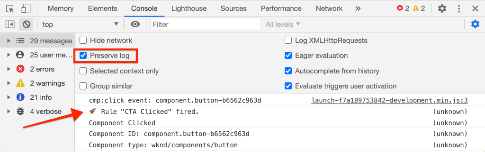
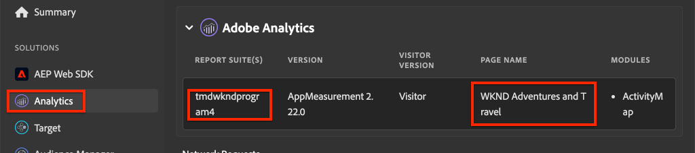
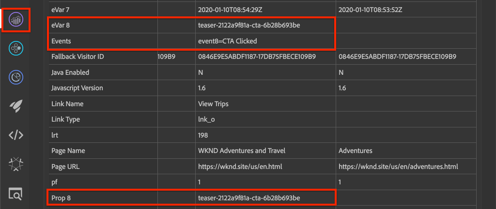

# Aangeklikte component bijhouden met Adobe Analytics

De gebeurtenisgestuurde functie gebruiken [Clientgegevenslaag Adoben met AEM kerncomponenten](https://experienceleague.adobe.com/docs/experience-manager-core-components/using/developing/data-layer/overview.html) om kliks van specifieke componenten op een plaats van Adobe Experience Manager te volgen. Leer hoe u regels in de eigenschap tag gebruikt om te luisteren naar klikgebeurtenissen, deze te filteren op component en de gegevens te verzenden naar een Adobe Analytics met een spoorkoppelingsbaken.

## Wat u gaat bouwen {#what-build}

Het WKND-marketingteam wil graag weten welke `Call to Action (CTA)` de knoppen voeren het beste uit op de startpagina. In deze zelfstudie, laten wij een regel aan het markeringsbezit toevoegen dat op het `cmp:click` gebeurtenissen van **Teaser** en **Knop** componenten. Vervolgens verzendt u de component-id en een nieuwe gebeurtenis naar Adobe Analytics naast het trackkoppelingsbaken.


### Doelstellingen {#objective}

1. Maak een gebeurtenisgestuurde regel in de eigenschap tag die het `cmp:click` gebeurtenis.
1. Filter de verschillende gebeurtenissen op componentenmiddeltype.
1. Stel de component-id in en verzend een gebeurtenis naar Adobe Analytics met het trackkoppelingsbaken.

## Vereisten

Deze zelfstudie is een voortzetting van [Paginagegevens verzamelen met Adobe Analytics](./collect-data-analytics.md) en gaat ervan uit dat u:

* A **Tag, eigenschap** met de [Adobe Analytics-extensie](https://experienceleague.adobe.com/docs/experience-platform/tags/extensions/client/analytics/overview.html) enabled
* **Adobe Analytics** test/dev rapportsuite-id en trackingserver. Zie de volgende documentatie voor [een rapportenpakket maken](https://experienceleague.adobe.com/docs/analytics/admin/admin-tools/manage-report-suites/c-new-report-suite/new-report-suite.html).
* [Foutopsporing Experience Platform](https://experienceleague.adobe.com/docs/platform-learn/data-collection/debugger/overview.html) browserextensie geconfigureerd met de eigenschap tag die is geladen op het tabblad [WKND-site](https://wknd.site/us/en.html) of een AEM plaats met de Laag van Gegevens van de Adobe toegelaten.

## Inspect the Button and Teaser schema

Voordat u regels maakt in de eigenschap tag, is het handig om de opdracht [schema voor de knop en de taser](https://experienceleague.adobe.com/docs/experience-manager-core-components/using/developing/data-layer/overview.html#item) en inspecteer hen in de implementatie van de gegevenslaag.

1. Navigeren naar [WKND-startpagina](https://wknd.site/us/en.html)
1. Open de ontwikkelaarsgereedschappen van de browser en ga naar de **Console**. Voer de volgende opdracht uit:

   ```js
   adobeDataLayer.getState();
   ```

   Boven code keert de huidige staat van de Gegevens van de Cliënt van de Adobe Laag terug.

   

1. Vouw de reactie uit en zoek vooraf items met `button-` en  `teaser-xyz-cta` vermelding. U zou een gegevensschema als het volgende moeten zien:

   Knopschema:

   ```json
   button-2e6d32893a:
       @type: "wknd/components/button"
       dc:title: "View All"
       parentId: "page-2eee4f8914"
       repo:modifyDate: "2020-07-11T22:17:55Z"
       xdm:linkURL: "/content/wknd/us/en/magazine.html"
   ```

   Teaserschema:

   ```json
   teaser-da32481ec8-cta-adf3c09db9:
       @type: "wknd/components/teaser/cta"
       dc:title: "Surf's Up"
       parentId: "teaser-da32481ec8"
       xdm:linkURL: "/content/wknd/us/en/magazine/san-diego-surf.html"
   ```

   De bovenstaande gegevensdetails zijn gebaseerd op de [Component-/containeritemschema](https://experienceleague.adobe.com/docs/experience-manager-core-components/using/developing/data-layer/overview.html#item). De nieuwe tagregel gebruikt dit schema.

## Creeer een CTA klikte regel

De gegevenslaag van de Cliënt van de Adobe is **event** gestuurde gegevenslaag. Wanneer op een Core-component wordt geklikt `cmp:click` wordt verzonden via de gegevenslaag. Als u wilt luisteren naar de `cmp:click` -gebeurtenis. Laten we een regel maken.

1. Navigeer naar het Experience Platform en naar de eigenschap tag die is geïntegreerd met de AEM Site.
1. Ga naar de **Regels** in de gebruikersinterface voor eigenschappen van tags en klik vervolgens op **Regel toevoegen**.
1. Naam van de regel **CTA geklikt**.
1. Klikken **Gebeurtenissen** > **Toevoegen** om de **Gebeurtenisconfiguratie** wizard.
1. Voor **Type gebeurtenis** veld, selecteren **Aangepaste code**.

   

1. Klikken **Editor openen** in het hoofddeelvenster en voer het volgende codefragment in:

   ```js
   var componentClickedHandler = function(evt) {
      // defensive coding to avoid a null pointer exception
      if(evt.hasOwnProperty("eventInfo") && evt.eventInfo.hasOwnProperty("path")) {
         //trigger Tag Rule and pass event
         console.debug("cmp:click event: " + evt.eventInfo.path);
         var event = {
            //include the path of the component that triggered the event
            path: evt.eventInfo.path,
            //get the state of the component that triggered the event
            component: window.adobeDataLayer.getState(evt.eventInfo.path)
         };
   
         //Trigger the Tag Rule, passing in the new `event` object
         // the `event` obj can now be referenced by the reserved name `event` by other Tag Property data elements
         // i.e `event.component['someKey']`
         trigger(event);
      }
   }
   
   //set the namespace to avoid a potential race condition
   window.adobeDataLayer = window.adobeDataLayer || [];
   //push the event listener for cmp:click into the data layer
   window.adobeDataLayer.push(function (dl) {
      //add event listener for `cmp:click` and callback to the `componentClickedHandler` function
      dl.addEventListener("cmp:click", componentClickedHandler);
   });
   ```

   Het bovenstaande codefragment voegt een gebeurtenislistener toe door [een functie duwen](https://github.com/adobe/adobe-client-data-layer/wiki#pushing-a-function) in de gegevenslaag. Wanneer de `cmp:click` de gebeurtenis wordt geactiveerd `componentClickedHandler` functie wordt aangeroepen. In deze functie worden een paar gezondheidscontroles toegevoegd en een nieuwe `event` object is samengesteld met de nieuwste [status van de gegevenslaag](https://github.com/adobe/adobe-client-data-layer/wiki#getstate) voor de component die de gebeurtenis heeft geactiveerd.

   Tot slot de `trigger(event)` functie wordt aangeroepen. De `trigger()` function is a reserved name in the tag property and it **triggers** de regel. De `event` object wordt doorgegeven als een parameter die vervolgens weer wordt weergegeven door een andere gereserveerde naam in de eigenschap tag. Gegevenselementen in de eigenschap tag kunnen nu verwijzen naar verschillende eigenschappen met behulp van een codefragment, zoals `event.component['someKey']`.

1. Sla de wijzigingen op.
1. Volgende onder **Handelingen** klikken **Toevoegen** om de **Configuratie van handelingen** wizard.
1. Voor **Type handeling** veld, kies **Aangepaste code**.

   

1. Klikken **Editor openen** in het hoofddeelvenster en voer het volgende codefragment in:

   ```js
   console.debug("Component Clicked");
   console.debug("Component Path: " + event.path);
   console.debug("Component type: " + event.component['@type']);
   console.debug("Component text: " + event.component['dc:title']);
   ```

   De `event` object wordt doorgegeven vanuit het `trigger()` wordt aangeroepen in de aangepaste gebeurtenis. De `component` object is de huidige status van de component die is afgeleid van de gegevenslaag `getState()` methode en is het element dat de klik teweegbracht.

1. Sla de wijzigingen op en voer een [build](https://experienceleague.adobe.com/docs/experience-platform/tags/publish/builds.html) in de eigenschap tag om de code naar de [milieu](https://experienceleague.adobe.com/docs/experience-platform/tags/publish/environments/environments.html) gebruikt op uw AEM Site.

   >[!NOTE]
   >
   > Het kan handig zijn om de [Adobe Experience Platform Debugger](https://experienceleague.adobe.com/docs/platform-learn/data-collection/debugger/overview.html) om de insluitcode over te schakelen op een **Ontwikkeling** milieu.

1. Ga naar de [WKND-site](https://wknd.site/us/en.html) en open de ontwikkelaarshulpmiddelen om de console te bekijken. Selecteer ook de optie **Logbestand behouden** selectievakje.

1. Klik op een van de **Teaser** of **Knop** CTA knopen om aan een andere pagina te navigeren.

   

1. Neem in de ontwikkelaarsconsole waar dat **CTA geklikt** regel is geactiveerd:

   

## Gegevenselementen maken

Maak vervolgens gegevenselementen om de component-id en de titel vast te leggen waarop is geklikt. Herinneren in de vorige oefening de output van `event.path` was vergelijkbaar met `component.button-b6562c963d` en de waarde van `event.component['dc:title']` was zoiets als &#39;Bezoekreizen&#39;.

### Component-id

1. Navigeer naar het Experience Platform en naar de eigenschap tag die is geïntegreerd met de AEM Site.
1. Ga naar de **Gegevenselementen** sectie en klik op **Nieuw gegevenselement toevoegen**.
1. Voor **Naam** veld, Enter **Component-id**.
1. Voor **Type gegevenselement** veld, selecteren **Aangepaste code**.

   

1. Klikken **Editor openen** en voert u het volgende in de aangepaste code-editor in:

   ```js
   if(event && event.path && event.path.includes('.')) {
       // split on the `.` to return just the component ID
       return event.path.split('.')[1];
   }
   ```

1. Sla de wijzigingen op.

   >[!NOTE]
   >
   > Herinnert eraan dat de `event` object beschikbaar wordt gemaakt en het bereik wordt ingesteld op basis van de gebeurtenis die het **Regel** in tag-eigenschap. De waarde van een gegevenselement wordt pas ingesteld wanneer het gegevenselement *gerefereerd* binnen een regel. Daarom is het veilig om dit Element van Gegevens binnen een Regel als te gebruiken **Pagina geladen** regel die in de vorige stap is gemaakt *maar* zou niet veilig zijn om in andere contexten te gebruiken.


### Componenttitel

1. Ga naar de **Gegevenselementen** sectie en klik op **Nieuw gegevenselement toevoegen**.
1. Voor **Naam** veld, Enter **Componenttitel**.
1. Voor **Type gegevenselement** veld, selecteren **Aangepaste code**.
1. Klikken **Editor openen** en voert u het volgende in de aangepaste code-editor in:

   ```js
   if(event && event.component && event.component.hasOwnProperty('dc:title')) {
       return event.component['dc:title'];
   }
   ```

1. Sla de wijzigingen op.

## Voeg een voorwaarde aan de CTA geklikte regel toe

Werk vervolgens de **CTA geklikt** om ervoor te zorgen dat de regel alleen wordt geactiveerd wanneer de `cmp:click` gebeurtenis wordt geactiveerd voor een **Teaser** of **Knop**. Aangezien Taser&#39;s CTA als een afzonderlijk object in de gegevenslaag wordt beschouwd, is het belangrijk dat u het bovenliggende element controleert om te controleren of het van een Taser afkomstig is.

1. Navigeer in de interface Tageigenschap naar de **CTA geklikt** regel eerder gemaakt.
1. Onder **Voorwaarden** klikken **Toevoegen** om de **Condition Configuration** wizard.
1. Voor **Type voorwaarde** veld, selecteren **Aangepaste code**.

   

1. Klikken **Editor openen** en voer het volgende in de redacteur van de douanecode in:

   ```js
   if(event && event.component && event.component.hasOwnProperty('@type')) {
       // console.log("Event Type: " + event.component['@type']);
       //Check for Button Type OR Teaser CTA type
       if(event.component['@type'] === 'wknd/components/button' ||
          event.component['@type'] === 'wknd/components/teaser/cta') {
           return true;
       }
   }
   
   // none of the conditions are met, return false
   return false;
   ```

   De bovenstaande code controleert eerst of het middeltype van a afkomstig was **Knop** of als het middeltype van een CTA binnen een **Teaser**.

1. Sla de wijzigingen op.

## Analysevariabelen instellen en Track Link Beacon activeren

Momenteel worden de **CTA geklikt** regel output eenvoudig een consoleverklaring. Gebruik vervolgens de gegevenselementen en de extensie Analytics om de variabelen Analytics in te stellen als een **action**. Laten we ook een extra handeling instellen om de **Koppeling bijhouden** en de verzamelde gegevens naar Adobe Analytics verzenden.

1. In de **CTA geklikt** regel, **remove** de **Core - Aangepaste code** handeling (de consoleverklaringen):

   

1. Klik onder Handelingen op **Toevoegen** om een handeling te maken.
1. Stel de **Extensie** tekst naar **Adobe Analytics** en stelt de **Type handeling** tot  **Variabelen instellen**.

1. Stel de volgende waarden in voor **eVars**, **Props**, en **Gebeurtenissen**:

   * `evar8` - `%Component ID%`
   * `prop8` - `%Component ID%`
   * `event8`

   

   >[!NOTE]
   >
   > hier `%Component ID%` wordt gebruikt aangezien het een uniek herkenningsteken voor CTA waarborgt dat werd geklikt. Een potentiële nadeel van het gebruik `%Component ID%` is dat het analyserapport waarden bevat zoals `button-2e6d32893a`. Met de `%Component Title%` zou een mensvriendelijkere naam geven, maar de waarde zou niet uniek kunnen zijn.

1. Voeg vervolgens een extra handeling toe aan de rechterkant van de knop **Adobe Analytics - Variabelen instellen** door op de **plus** pictogram:

   

1. Stel de **Extensie** tekst naar **Adobe Analytics** en stelt de **Type handeling** tot  **Bandbaken verzenden**.
1. Onder **Tekstspatiëring** het keuzerondje instellen op **`s.tl()`**.
1. Voor **Koppelingstype** veld, kies **Aangepaste koppeling** en voor **Koppelingsnaam** Stel de waarde in op: **`%Component Title%: CTA Clicked`**:

   

   Bovenstaande config combineert de dynamische variabele van het gegevenselement **Componenttitel** en de statische tekenreeks **CTA geklikt**.

1. Sla de wijzigingen op. De **CTA geklikt** de regel zou nu de volgende configuratie moeten hebben:

   

   * **1.** Luister naar de `cmp:click` gebeurtenis.
   * **2.** Controleer of de gebeurtenis is geactiveerd door een **Knop** of **Teaser**.
   * **3.** Stel analysevariabelen in om de **Component-id** als **eVar**, **prop** en **event**.
   * **4.** Verzend het Beacon van de Verbinding van het Spoor Analytics (en doe **niet** behandelen het als paginamening).

1. Sla alle wijzigingen op en maak uw tagbibliotheek, waarbij u een upgrade uitvoert naar de juiste omgeving.

## Valideer de vraag van het Beacon en van de Analyse van de Verbinding van het Spoor

Nu **CTA geklikt** regel verzendt het baken van Analytics, zou u de Analytics volgende variabelen moeten kunnen zien gebruikend Foutopsporing van het Experience Platform.

1. Open de [WKND-site](https://wknd.site/us/en.html) in uw browser.
1. Klik op het pictogram Foutopsporing  om Foutopsporing op Experience Platform te openen.
1. Controleer of Foutopsporing de eigenschap tag toewijst aan *uw* Ontwikkelomgeving, zoals eerder beschreven, en de **Logboekregistratie voor console** is ingeschakeld.
1. Open het menu Analytics en controleer of de rapportsuite is ingesteld op *uw* rapportsuite.

   

1. Klik in de browser op een van de **Teaser** of **Knop** CTA knopen om aan een andere pagina te navigeren.

   

1. Terug naar Foutopsporing Experience Platform en omlaag schuiven en uitvouwen **Netwerkverzoeken** > *Uw rapportsuite*. U moet de **eVar**, **prop**, en **event** set.

   

1. Ga terug naar de browser en open de ontwikkelaarsconsole. Navigeer naar de voettekst van de site en klik op een van de navigatiekoppelingen:

   

1. Neem in de browser console het bericht waar *Er is niet voldaan aan &quot;Aangepaste code&quot; voor regel waarop wordt geklikt*.

   Het bovenstaande bericht is omdat de navigatiecomponent een `cmp:click` event *maar* vanwege [Voorwaarde voor de regel](#add-a-condition-to-the-cta-clicked-rule) dat het middeltype controleert wordt geen actie ondernomen.

   >[!NOTE]
   >
   > Als u geen consolelogboeken ziet, zorg ervoor dat **Logboekregistratie voor console** is gecontroleerd onder **Experience Platform-tags** in het Experience Platform Foutopsporing.

## Gefeliciteerd!

U gebruikte enkel de gebeurtenis-gedreven Laag en Markering van de Gegevens van de Adobe van de Cliënt in Experience Platform om de kliks van specifieke componenten op een AEM plaats te volgen.
