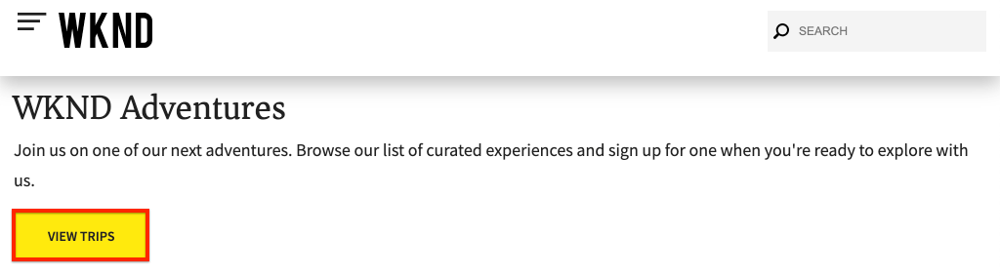

# Aangeklikte component bijhouden met Adobe Analytics

Gebruik de gebeurtenis-gedreven [de Laag van Gegevens van de Cliënt van de Adobe met AEM Core Componenten ](https://docs.adobe.com/content/help/en/experience-manager-core-components/using/developing/data-layer/overview.html) om kliks van specifieke componenten op een plaats van Adobe Experience Manager te volgen. Leer hoe te om regels in Experience Platform Launch te gebruiken om op klikgebeurtenissen te luisteren, filter door component en verzend de gegevens naar een Adobe Analytics met een baken van de spoorverbinding.

## Wat u gaat maken

Het WKND marketing team wil begrijpen welke Vraag aan de knopen van de Actie (CTA) het beste op de homepage uitvoert. In deze zelfstudie voegen we een nieuwe regel in het Experience Platform Launch toe die luistert naar `cmp:click`-gebeurtenissen van **Teaser** en **Button**-componenten en sturen de component-id en een nieuwe gebeurtenis naar Adobe Analytics naast het trackkoppelingsbaken.


### Doelstellingen {#objective}

1. Creeer een gebeurtenis-gedreven regel in Lancering die op `cmp:click` gebeurtenis wordt gebaseerd.
1. Filter de verschillende gebeurtenissen op componentenmiddeltype.
1. Stel de component-id waarop wordt geklikt in en verzend de gebeurtenis Adobe Analytics met het trackkoppelingsbaken.

## Vereisten

Deze zelfstudie is een vervolg van [Paginagegevens verzamelen met Adobe Analytics](./collect-data-analytics.md) en gaat ervan uit dat u:

* A **Launch Property** met [Adobe Analytics extension](https://docs.adobe.com/content/help/en/launch/using/extensions-ref/adobe-extension/analytics-extension/overview.html) enabled
* **Adobe** AnalyticSnelst/dev-rapportsuite-id en trackingserver. Zie de volgende documentatie voor [het creëren van een nieuwe rapportreeks](https://docs.adobe.com/content/help/en/analytics/admin/manage-report-suites/new-report-suite/new-report-suite.html).
* [Experience Platform ](https://docs.adobe.com/content/help/en/platform-learn/tutorials/data-ingestion/web-sdk/introduction-to-the-experience-platform-debugger.html) Debuggerbrowser uitbreiding die met uw bezit van de Lancering wordt gevormd op  [https://wknd.site/us/en.](https://wknd.site/us/en.html) htmlor een plaats van de AEM met de toegelaten Laag van Gegevens van Adobe wordt geladen.

## Inspect the Button and Teaser Schema

Alvorens regels in Lancering te maken is het nuttig om [schema voor de Knoop en het Taser](https://docs.adobe.com/content/help/en/experience-manager-core-components/using/developing/data-layer/overview.html#item) te herzien en hen in de implementatie van de gegevenslaag te inspecteren.

1. Navigeer naar [https://wknd.site/us/en.html](https://wknd.site/us/en.html)
1. Open de ontwikkelaarsgereedschappen van de browser en navigeer naar de **Console**. Voer de volgende opdracht uit:

   ```js
   adobeDataLayer.getState();
   ```

   Dit keert de huidige staat van de Laag van Gegevens van de Cliënt van Adobe terug.

   

1. Breid de reactie uit en vind ingangen vooraf met `button-` en `teaser-xyz-cta` ingang. U zou een gegevensschema als het volgende moeten zien:

   Knopschema:

   ```json
   button-2e6d32893a:
       @type: "wknd/components/button"
       dc:title: "View All"
       parentId: "page-2eee4f8914"
       repo:modifyDate: "2020-07-11T22:17:55Z"
       xdm:linkURL: "/content/wknd/us/en/magazine.html"
   ```

   Teaserschema:

   ```json
   teaser-da32481ec8-cta-adf3c09db9:
       @type: "wknd/components/teaser/cta"
       dc:title: "Surf's Up"
       parentId: "teaser-da32481ec8"
       xdm:linkURL: "/content/wknd/us/en/magazine/san-diego-surf.html"
   ```

   Deze zijn gebaseerd op [Component/Container het Schema van het Punt ](https://docs.adobe.com/content/help/en/experience-manager-core-components/using/developing/data-layer/overview.html#item). De regel die we in Launch maken, gebruikt dit schema.

## Een CTA-regel waarop wordt geklikt maken

De gegevenslaag van de Gegevens van de Cliënt van Adobe is een **gebeurtenis** gedreven gegevenslaag. Wanneer op een willekeurige Core Component wordt geklikt, wordt een `cmp:click`-gebeurtenis verzonden via de gegevenslaag. Maak vervolgens een regel om naar de gebeurtenis `cmp:click` te luisteren.

1. Navigeer aan Experience Platform Launch en in het bezit van het Web dat met de Plaats van de AEM wordt geïntegreerd.
1. Navigeer naar de sectie **Rules** in de gebruikersinterface van de Lancering en klik vervolgens **Regel toevoegen**.
1. Noem de regel **CTA geklikt**.
1. Klik **Gebeurtenissen** > **Toevoegen** om de wizard **Gebeurtenisconfiguratie** te openen.
1. Selecteer **Aangepaste code** onder **Type gebeurtenis**.

   

1. Klik **Editor openen** in het hoofddeelvenster en voer het volgende codefragment in:

   ```js
   var componentClickedHandler = function(evt) {
      // defensive coding to avoid a null pointer exception
      if(evt.hasOwnProperty("eventInfo") && evt.eventInfo.hasOwnProperty("path")) {
         //trigger Launch Rule and pass event
         console.debug("cmp:click event: " + evt.eventInfo.path);
         var event = {
            //include the path of the component that triggered the event
            path: evt.eventInfo.path,
            //get the state of the component that triggered the event
            component: window.adobeDataLayer.getState(evt.eventInfo.path)
         };
   
         //Trigger the Launch Rule, passing in the new `event` object
         // the `event` obj can now be referenced by the reserved name `event` by other Launch data elements
         // i.e `event.component['someKey']`
         trigger(event);
      }
   }
   
   //set the namespace to avoid a potential race condition
   window.adobeDataLayer = window.adobeDataLayer || [];
   //push the event listener for cmp:click into the data layer
   window.adobeDataLayer.push(function (dl) {
      //add event listener for `cmp:click` and callback to the `componentClickedHandler` function
      dl.addEventListener("cmp:click", componentClickedHandler);
   });
   ```

   Het bovenstaande codefragment voegt een gebeurtenislistener toe door een functie [in de gegevenslaag te duwen. ](https://github.com/adobe/adobe-client-data-layer/wiki#pushing-a-function) Wanneer de gebeurtenis `cmp:click` wordt geactiveerd, wordt de functie `componentClickedHandler` aangeroepen. In deze functie worden een paar controles van de hygiëne toegevoegd en een nieuw `event` voorwerp wordt geconstrueerd met de recentste [staat van de gegevenslaag](https://github.com/adobe/adobe-client-data-layer/wiki#getstate) voor de component die de gebeurtenis teweegbracht.

   Nadat `trigger(event)` wordt geroepen. `trigger()` is een gereserveerde naam in Launch en activeert &quot;de Launch-regel&quot;. We geven het object `event` door als een parameter die vervolgens weer wordt vrijgegeven door een andere gereserveerde naam in Launch met de naam `event`. Data Elements in Launch kan nu verwijzen naar verschillende eigenschappen, zoals: `event.component['someKey']`.

1. Sla de wijzigingen op.
1. Vervolgens klikt u onder **Handelingen** op **Toevoegen** om de wizard **Configuratie handeling** te openen.
1. Kies **Aangepaste code** onder **Type handeling**.

   

1. Klik **Editor openen** in het hoofddeelvenster en voer het volgende codefragment in:

   ```js
   console.debug("Component Clicked");
   console.debug("Component Path: " + event.path);
   console.debug("Component type: " + event.component['@type']);
   console.debug("Component text: " + event.component['dc:title']);
   ```

   Het object `event` wordt doorgegeven via de methode `trigger()` die in de aangepaste gebeurtenis wordt aangeroepen. `component` is de huidige staat van de component die uit de gegevenslaag wordt afgeleid  `getState` die de klik teweegbracht.

1. Sla de wijzigingen op en voer een [build](https://docs.adobe.com/content/help/en/launch/using/reference/publish/builds.html) in Launch uit om de code te promoten naar de [omgeving](https://docs.adobe.com/content/help/en/launch/using/reference/publish/environments.html) die op uw AEM-site wordt gebruikt.

   >[!NOTE]
   >
   > Het kan zeer nuttig zijn om [Adobe Experience Platform Debugger](https://docs.adobe.com/content/help/en/platform-learn/tutorials/data-ingestion/web-sdk/introduction-to-the-experience-platform-debugger.html) te gebruiken om de ingebedde code aan een **ontwikkelings** milieu te schakelen.

1. Navigeer naar [WKND Site](https://wknd.site/us/en.html) en open de ontwikkelaarsgereedschappen om de console weer te geven. Selecteer **Logbestand behouden**.

1. Klik op een van de CTA-knoppen **Taser** of **Button** om naar een andere pagina te navigeren.

   

1. Merk in de ontwikkelaarsconsole op dat **CTA Clicked** regel is in brand gestoken:

   

## Gegevenselementen maken

Maak vervolgens gegevenselementen om de component-id en de titel vast te leggen waarop is geklikt. Tijdens de vorige exercitie was de uitvoer van `event.path` ongeveer vergelijkbaar met `component.button-b6562c963d` en de waarde van `event.component['dc:title']` was ongeveer als &quot;Trips weergeven&quot;.

### Component-id

1. Navigeer aan Experience Platform Launch en in het bezit van het Web dat met de Plaats van de AEM wordt geïntegreerd.
1. Navigeer naar de sectie **Gegevenselementen** en klik **Nieuw gegevenselement toevoegen**.
1. Typ **Component ID** voor **Naam**.
1. Voor **Gegevenselement Type** selecteert **Aangepaste code**.

   

1. Klik op **Editor openen** en voer het volgende in de aangepaste code-editor in:

   ```js
   if(event && event.path && event.path.includes('.')) {
       // split on the `.` to return just the component ID
       return event.path.split('.')[1];
   }
   ```

   Sla de wijzigingen op.

   >[!NOTE]
   >
   > Herinnering dat het `event` voorwerp beschikbaar wordt gemaakt en scoped gebaseerd op de gebeurtenis die **Rule** in Lancering teweegbracht. De waarde van een Element van Gegevens wordt niet geplaatst tot het Element van Gegevens *referenced* binnen een Regel is. Daarom is het veilig om dit Element van Gegevens binnen van een Regel als **CTA te gebruiken geklikt** regel die in de vorige oefening *maar* wordt gecreeerd zou niet veilig om in andere contexten te gebruiken zijn.

### Componenttitel

1. Navigeer naar de sectie **Gegevenselementen** en klik **Nieuw gegevenselement toevoegen**.
1. Voer **Componenttitel** in voor **Naam**.
1. Voor **Gegevenselement Type** selecteert **Aangepaste code**.
1. Klik op **Editor openen** en voer het volgende in de aangepaste code-editor in:

   ```js
   if(event && event.component && event.component.hasOwnProperty('dc:title')) {
       return event.component['dc:title'];
   }
   ```

   Sla de wijzigingen op.

## Voeg een voorwaarde aan de CTA geklikte regel toe

Vervolgens werkt u de **CTA waarop is geklikt**-regel bij om ervoor te zorgen dat de regel alleen wordt geactiveerd wanneer de `cmp:click`-gebeurtenis wordt geactiveerd voor een **Taser** of een **Button**. Aangezien Taser&#39;s CTA als een afzonderlijk object in de gegevenslaag wordt beschouwd, is het belangrijk om het bovenliggende element te controleren om te controleren of het van een Taser afkomstig is.

1. Navigeer in de interface van de Lancering naar de **CTA geklikt** regel die eerder is gemaakt.
1. Klik onder **Voorwaarden** op **Toevoegen** om de wizard **Condition Configuration** te openen.
1. Selecteer **Aangepaste code** voor **Voorwaardetype**.

   

1. Klik op **Editor openen** en voer het volgende in de aangepaste code-editor in:

   ```js
   if(event && event.component && event.component.hasOwnProperty('@type')) {
       // console.log("Event Type: " + event.component['@type']);
       //Check for Button Type OR Teaser CTA type
       if(event.component['@type'] === 'wknd/components/button' ||
          event.component['@type'] === 'wknd/components/teaser/cta') {
           return true;
       }
   }
   
   // none of the conditions are met, return false
   return false;
   ```

   De bovenstaande code controleert eerst of was het middeltype van **Knoop** en dan controleert om te zien of was het middeltype van CTA binnen **Taser**.

1. Sla de wijzigingen op.

## Analysevariabelen instellen en Track Link Beacon activeren

Momenteel voert de **CTA geklikt** regel eenvoudig een consoleverklaring uit. Vervolgens gebruikt u de gegevenselementen en de extensie Analytics om de variabelen Analytics in te stellen als een **action**. Wij zullen ook een extra actie plaatsen om **Verbinding van het Spoor** teweeg te brengen en de verzamelde gegevens naar Adobe Analytics te verzenden.

1. In **CTA klikte** regel **remove** de **Kern - Douane Code** actie (de consoleverklaringen):

   

1. Klik onder Handelingen op **Toevoegen** om een nieuwe handeling toe te voegen.
1. Stel het type **Extension** in op **Adobe Analytics** en stel het **Action Type** in op **Variabelen instellen**.

1. Stel de volgende waarden in voor **eVars**, **Props** en **Gebeurtenissen**:

   * `evar8` - `%Component ID%`
   * `prop8` -  `%Component ID%`
   * `event8`

   

   >[!NOTE]
   >
   > Hier wordt `%Component ID%` gebruikt aangezien het een uniek herkenningsteken voor CTA zal verzekeren dat werd geklikt. Een potentieel nadeel van het gebruik van `%Component ID%` is dat het rapport Analytics waarden als `button-2e6d32893a` zal bevatten. Het gebruiken van `%Component Title%` zou een mensvriendelijkere naam maar de waarde zou niet uniek kunnen zijn.

1. Voeg vervolgens een aanvullende handeling toe aan de rechterkant van de **Adobe Analytics - Set Variables** door op het pictogram **plus** te tikken:

   

1. Stel het type **Extension** in op **Adobe Analytics** en stel het **Action Type** in op **Beacon** verzenden.
1. Stel onder **Tekstspatiëring** het keuzerondje in op **`s.tl()`**.
1. Voor **Koppelingstype** kiest u **Eigen koppeling** en voor **Koppelingsnaam** stelt u de waarde in op: **`%Component Title%: CTA Clicked`**:

   

   Hierdoor wordt de dynamische variabele van het gegevenselement **Component Title** gecombineerd met de statische tekenreeks **CTA waarop wordt geklikt**.

1. Sla de wijzigingen op. De **CTA geklikt** regel zou nu de volgende configuratie moeten hebben:

   

   * **1.** Luister naar de  `cmp:click` gebeurtenis.
   * **2.** Controleer of de gebeurtenis is geactiveerd door een  **** Buttonor- **taser**.
   * **3.** Stel de variabelen Analytics in voor om de  **Component** IDas an  **eVar**,  **prop** en an  **event** bij te houden.
   * **4.** Verzend het Beacon van de Verbinding van het Spoor Analytics (en behandelt het  **** niet als paginamening).

1. Sla alle wijzigingen op en maak uw opstartbibliotheek, waarbij u een upgrade uitvoert naar de juiste omgeving.

## Valideer de vraag van het Beacon en van de Analyse van de Verbinding van het Spoor

Nu **CTA geklikt** de regel verzendt het baken van Analytics, zou u de variabelen moeten kunnen zien die van Analytics volgen gebruikend Foutopsporing van het Experience Platform.

1. Open [WKND Site](https://wknd.site/us/en.html) in uw browser.
1. Klik op het pictogram Foutopsporing  om Foutopsporing op Experience Platform te openen.
1. Zorg ervoor Debugger het bezit van de Lancering aan *uw* ontwikkelomgeving in kaart brengt, zoals vroeger beschreven en **Console het Registreren** wordt gecontroleerd.
1. Open het menu Analytics en controleer of de rapportsuite is ingesteld op *uw*-rapportsuite.

   

1. Klik in de browser op een van de CTA-knoppen **Taser** of **Button** om naar een andere pagina te navigeren.

   

1. Ga terug naar de foutopsporing van het Experience Platform en schuif omlaag en vouw **Netwerkverzoeken** > *Uw rapportsuite* uit. U zou **eVar**, **prop**, en **event** moeten kunnen vinden reeks.

   

1. Ga terug naar de browser en open de ontwikkelaarsconsole. Navigeer naar de voettekst van de site en klik op een van de navigatiekoppelingen:

   

1. Neem in de browser console het bericht *&quot;Aangepaste Code&quot;voor regel &quot;CTA Clicked&quot;niet werd ontmoet*.

   De reden hiervoor is dat de navigatiecomponent een `cmp:click`-gebeurtenis *maar* activeert vanwege de controle van de gebeurtenis op het middeltype. Er wordt geen actie uitgevoerd.

   >[!NOTE]
   >
   > Als u geen consolelogboeken ziet, zorg ervoor dat **Console het Registreren** onder **Lancering** in Foutopsporing van het Experience Platform wordt gecontroleerd.

## Gefeliciteerd!

U gebruikte enkel de gebeurtenis-gedreven Laag en het Experience Platform Launch van Gegevens van de Cliënt van de Adobe om kliks van specifieke componenten op een plaats van Adobe Experience Manager te volgen.