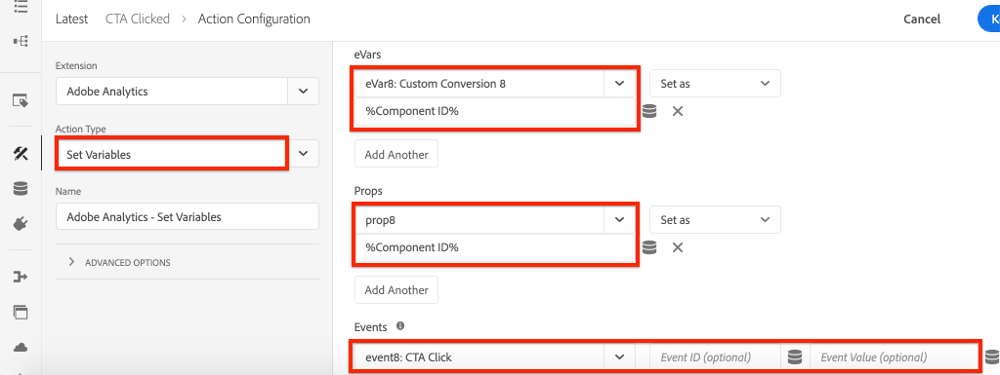

# Aangeklikte component bijhouden met Adobe Analytics

Gebruik de gebeurtenis-gedreven [ Laag van de Gegevens van de Cliënt van de Adobe met AEM Componenten van de Kern ](https://experienceleague.adobe.com/docs/experience-manager-core-components/using/developing/data-layer/overview.html) om kliks van specifieke componenten op een plaats van Adobe Experience Manager te volgen. Leer hoe u regels in de eigenschap tag gebruikt om te luisteren naar klikgebeurtenissen, deze te filteren op component en de gegevens te verzenden naar een Adobe Analytics met een spoorkoppelingsbaken.

## Wat u gaat bouwen {#what-build}

Het WKND-marketingteam is geïnteresseerd in de vraag welke `Call to Action (CTA)` -knoppen het beste op de startpagina uitvoeren. In dit leerprogramma, laten wij een regel aan het markeringsbezit toevoegen dat op de `cmp:click` gebeurtenissen van **Taser** en **Knoop** componenten luistert. Vervolgens verzendt u de component-id en een nieuwe gebeurtenis naar Adobe Analytics naast het trackkoppelingsbaken.


### Doelstellingen {#objective}

1. Maak een gebeurtenisgestuurde regel in de eigenschap tag die de gebeurtenis `cmp:click` vastlegt.
1. Filter de verschillende gebeurtenissen op componentenmiddeltype.
1. Stel de component-id in en verzend een gebeurtenis naar Adobe Analytics met het trackkoppelingsbaken.

## Vereisten

Dit leerprogramma is een voortzetting van [ verzamel paginagegevens met Adobe Analytics ](./collect-data-analytics.md) en veronderstelt dat u hebt:

* A **bezit van de Markering** met de [ toegelaten uitbreiding van Adobe Analytics ](https://experienceleague.adobe.com/docs/experience-platform/tags/extensions/client/analytics/overview.html)
* **Adobe Analytics** test/dev- rapportreeks identiteitskaart en volgende server. Zie de volgende documentatie voor [ het creëren van een rapportreeks ](https://experienceleague.adobe.com/docs/analytics/admin/admin-tools/manage-report-suites/c-new-report-suite/new-report-suite.html).
* ](https://experienceleague.adobe.com/docs/platform-learn/data-collection/debugger/overview.html) browser van foutopsporing van het Experience Platform 1} uitbreiding die met uw markeringsbezit wordt gevormd op de [ wordt geladen plaats WKND ](https://wknd.site/us/en.html) of een AEM plaats met de toegelaten Laag van Gegevens van de Adobe.[

## Inspect the Button and Teaser schema

Alvorens regels in het markeringsbezit tot stand te brengen, is het nuttig om het [ schema voor de Knoop en het Taser ](https://experienceleague.adobe.com/docs/experience-manager-core-components/using/developing/data-layer/overview.html#item) te herzien en hen in de implementatie van de gegevenslaag te inspecteren.

1. Navigeer aan [ WKND Homepage ](https://wknd.site/us/en.html)
1. Open de de ontwikkelaarshulpmiddelen van browser en navigeer aan de **Console**. Voer de volgende opdracht uit:

   ```js
   adobeDataLayer.getState();
   ```

   Boven code keert de huidige staat van de Gegevens van de Cliënt van de Adobe Laag terug.

   

1. Vouw de reactie uit en zoek de items die vooraf aan de items `button-` en `teaser-xyz-cta` zijn toegewezen. U zou een gegevensschema als het volgende moeten zien:

   Knopschema:

   ```json
   button-2e6d32893a:
       @type: "wknd/components/button"
       dc:title: "View All"
       parentId: "page-2eee4f8914"
       repo:modifyDate: "2020-07-11T22:17:55Z"
       xdm:linkURL: "/content/wknd/us/en/magazine.html"
   ```

   Teaserschema:

   ```json
   teaser-da32481ec8-cta-adf3c09db9:
       @type: "wknd/components/teaser/cta"
       dc:title: "Surf's Up"
       parentId: "teaser-da32481ec8"
       xdm:linkURL: "/content/wknd/us/en/magazine/san-diego-surf.html"
   ```

   Boven gegevensdetails zijn gebaseerd op het [ Schema van het Punt van de Component/van de Container ](https://experienceleague.adobe.com/docs/experience-manager-core-components/using/developing/data-layer/overview.html#item). De nieuwe tagregel gebruikt dit schema.

## Creeer een CTA klikte regel

De Laag van Gegevens van de Cliënt van de Adobe is een **gebeurtenis** gedreven gegevenslaag. Wanneer op een Core-component wordt geklikt, wordt een `cmp:click` -gebeurtenis verzonden via de gegevenslaag. Laten we een regel maken om naar de gebeurtenis `cmp:click` te luisteren.

1. Navigeer naar het Experience Platform en naar de eigenschap tag die is geïntegreerd met de AEM Site.
1. Navigeer aan de **sectie van Regels** in het Bezit UI van de Markering, dan klik **voegt Regel** toe.
1. Noem de regel **CTA klikte**.
1. Klik **Gebeurtenissen** > **toevoegen** om de **tovenaar van de Configuratie van de Gebeurtenis** te openen.
1. Voor **het Type van Gebeurtenis** gebied, uitgezochte **Code van de Douane**.

   

1. Klik **Open Redacteur** in het belangrijkste paneel en ga het volgende codefragment in:

   ```js
   var componentClickedHandler = function(evt) {
      // defensive coding to avoid a null pointer exception
      if(evt.hasOwnProperty("eventInfo") && evt.eventInfo.hasOwnProperty("path")) {
         //trigger Tag Rule and pass event
         console.debug("cmp:click event: " + evt.eventInfo.path);
         var event = {
            //include the path of the component that triggered the event
            path: evt.eventInfo.path,
            //get the state of the component that triggered the event
            component: window.adobeDataLayer.getState(evt.eventInfo.path)
         };
   
         //Trigger the Tag Rule, passing in the new `event` object
         // the `event` obj can now be referenced by the reserved name `event` by other Tag Property data elements
         // i.e `event.component['someKey']`
         trigger(event);
      }
   }
   
   //set the namespace to avoid a potential race condition
   window.adobeDataLayer = window.adobeDataLayer || [];
   //push the event listener for cmp:click into the data layer
   window.adobeDataLayer.push(function (dl) {
      //add event listener for `cmp:click` and callback to the `componentClickedHandler` function
      dl.addEventListener("cmp:click", componentClickedHandler);
   });
   ```

   Het bovenstaande codefragment voegt een gebeurtenisluisteraar toe door [ een functie ](https://github.com/adobe/adobe-client-data-layer/wiki#pushing-a-function) in de gegevenslaag te duwen. Wanneer de gebeurtenis `cmp:click` wordt geactiveerd, wordt de functie `componentClickedHandler` aangeroepen. In deze functie, worden een paar gezondheidscontroles toegevoegd en een nieuw `event` voorwerp wordt geconstrueerd met de recentste [ staat van de gegevenslaag ](https://github.com/adobe/adobe-client-data-layer/wiki#getstate) voor de component die de gebeurtenis teweegbracht.

   Tot slot wordt de functie `trigger(event)` aangeroepen. De `trigger()` functie is een gereserveerde naam in het markeringsbezit en het **brengt** de regel teweeg. Het `event` -object wordt doorgegeven als een parameter die vervolgens weer wordt weergegeven door een andere gereserveerde naam in de eigenschap tag. Gegevenselementen in de eigenschap tag kunnen nu verwijzen naar verschillende eigenschappen met behulp van een codefragment, zoals `event.component['someKey']` .

1. Sla de wijzigingen op.
1. Daarna onder **Acties** klik **** toevoegen om de **tovenaar van de Configuratie van de Actie** te openen.
1. Voor **gebied van het Type van Actie 0} {, kies** de Code van de Douane **.**

   

1. Klik **Open Redacteur** in het belangrijkste paneel en ga het volgende codefragment in:

   ```js
   console.debug("Component Clicked");
   console.debug("Component Path: " + event.path);
   console.debug("Component type: " + event.component['@type']);
   console.debug("Component text: " + event.component['dc:title']);
   ```

   Het object `event` wordt doorgegeven via de methode `trigger()` die in de aangepaste gebeurtenis wordt aangeroepen. Het `component` -object is de huidige status van de component die is afgeleid van de methode data layer `getState()` en is het element dat de klik heeft geactiveerd.

1. Sparen de veranderingen en stel a [ in werking bouwt ](https://experienceleague.adobe.com/docs/experience-platform/tags/publish/builds.html) in het markeringsbezit om de code aan het [ milieu ](https://experienceleague.adobe.com/docs/experience-platform/tags/publish/environments/environments.html) te bevorderen dat op uw AEMPlaats wordt gebruikt.

   >[!NOTE]
   >
   > Het kan nuttig zijn om het [ Adobe Experience Platform Debugger ](https://experienceleague.adobe.com/docs/platform-learn/data-collection/debugger/overview.html) te gebruiken om de ingebedde code aan het milieu van de a **Ontwikkeling** te schakelen.

1. Navigeer aan de [ Plaats WKND ](https://wknd.site/us/en.html) en open de ontwikkelaarshulpmiddelen om de console te bekijken. Ook, selecteer het **Logboek van het Behoud** checkbox.

1. Klik één van **Taser** of **Knoop** CTA knopen om aan een andere pagina te navigeren.

    te klikken

1. Merk in de ontwikkelaarsconsole op dat de **CTA geklikte** regel in brand is gestoken:

   

## Gegevenselementen maken

Maak vervolgens gegevenselementen om de component-id en de titel vast te leggen waarop is geklikt. Tijdens de vorige exercitie was de uitvoer van `event.path` ongeveer gelijk aan `component.button-b6562c963d` en de waarde van `event.component['dc:title']` was ongeveer als &quot;Trips weergeven&quot;.

### Component-id

1. Navigeer naar het Experience Platform en naar de eigenschap tag die is geïntegreerd met de AEM Site.
1. Navigeer aan de **sectie van de Elementen van Gegevens 0} {en klik** toevoegen Nieuw Element van Gegevens **.**
1. Voor **het gebied van de Naam**, ga **identiteitskaart van de Component** in.
1. Voor **het Type van Element van Gegevens** gebied, uitgezochte **Code van de Douane**.

   

1. Klik **Open de knoop van de Redacteur** en ga het volgende in de redacteur van de douanecode in:

   ```js
   if(event && event.path && event.path.includes('.')) {
       // split on the `.` to return just the component ID
       return event.path.split('.')[1];
   }
   ```

1. Sla de wijzigingen op.

   >[!NOTE]
   >
   > Rappel dat het `event` voorwerp beschikbaar wordt gemaakt en scoped gebaseerd op de gebeurtenis die de **Regel** in markeringsbezit teweegbracht. De waarde van een Element van Gegevens wordt niet geplaatst tot het Element van Gegevens ** binnen een Regel van verwijzingen wordt voorzien. Daarom is het veilig om dit Element van Gegevens binnen een Regel als de **Geladen Pagina** regel te gebruiken die in de vorige stap *wordt gecreeerd maar* zou niet veilig zijn om in andere contexten te gebruiken.


### Componenttitel

1. Navigeer aan de **sectie van de Elementen van Gegevens 0} {en klik** toevoegen Nieuw Element van Gegevens **.**
1. Voor **het gebied van de Naam**, ga **Titel van de Component** in.
1. Voor **het Type van Element van Gegevens** gebied, uitgezochte **Code van de Douane**.
1. Klik **Open de knoop van de Redacteur** en ga het volgende in de redacteur van de douanecode in:

   ```js
   if(event && event.component && event.component.hasOwnProperty('dc:title')) {
       return event.component['dc:title'];
   }
   ```

1. Sla de wijzigingen op.

## Voeg een voorwaarde aan de CTA geklikte regel toe

Daarna, werk **CTA geklikte** regel bij om ervoor te zorgen dat de regel slechts brandt wanneer de `cmp:click` gebeurtenis voor a **Taser** of a **Knoop** in brand wordt gestoken. Aangezien Taser&#39;s CTA als een afzonderlijk object in de gegevenslaag wordt beschouwd, is het belangrijk dat u het bovenliggende element controleert om te controleren of het van een Taser afkomstig is.

1. In het Bezit van de Markering UI, navigeer aan **CTA geklikte** regel vroeger gecreeerd.
1. Onder **Voorwaarden** klik **** toevoegen om de **tovenaar van de Configuratie van de Voorwaarde** te openen.
1. Voor **gebied van het Type van Voorwaarde 0} {, uitgezochte** Code van de Douane **.**

   

1. Klik **Open Redacteur** en ga het volgende in de redacteur van de douanecode in:

   ```js
   if(event && event.component && event.component.hasOwnProperty('@type')) {
       // console.log("Event Type: " + event.component['@type']);
       //Check for Button Type OR Teaser CTA type
       if(event.component['@type'] === 'wknd/components/button' ||
          event.component['@type'] === 'wknd/components/teaser/cta') {
           return true;
       }
   }
   
   // none of the conditions are met, return false
   return false;
   ```

   De bovenstaande code controleert eerst om te zien of was het middeltype van a **Knoop** of als het middeltype van een CTA binnen a **Taser** was.

1. Sla de wijzigingen op.

## Analysevariabelen instellen en Track Link Beacon activeren

Momenteel voert de **CTA geklikte** regel eenvoudig een consoleverklaring uit. Daarna, gebruik de gegevenselementen en de uitbreiding van de Analyse om de variabelen van de Analyse als **actie** te plaatsen. Laten wij ook een extra actie plaatsen om de **Verbinding van het Spoor** teweeg te brengen en de verzamelde gegevens naar Adobe Analytics te verzenden.

1. In **CTA klikte** regel, **verwijdert** de **Kern - de actie van de Code van de Douane** (de consoleverklaringen):

   

1. Onder Acties, voegt de klik **** toe om een actie tot stand te brengen.
1. Plaats het **type van Uitbreiding** aan **Adobe Analytics** en plaats het **Type van Actie** aan **Vastgestelde Variabelen**.

1. Plaats de volgende waarden voor **eVars**, **Props**, en **Gebeurtenissen**:

   * `evar8` - `%Component ID%`
   * `prop8` - `%Component ID%`
   * `event8`

   

   >[!NOTE]
   >
   > Hier wordt `%Component ID%` gebruikt omdat het een unieke herkenningsteken voor CTA waarborgt die werd geklikt. Een mogelijk nadeel van het gebruik van `%Component ID%` is dat het rapport Analytics waarden bevat zoals `button-2e6d32893a` . Als u `%Component Title%` gebruikt, krijgt u een mensvriendelijkere naam, maar de waarde is mogelijk niet uniek.

1. Daarna, voeg een extra Actie rechts van **Adobe Analytics toe - plaats Variabelen** door het **plus** pictogram te tikken:

   

1. Plaats het **type van de Uitbreiding 0} {aan** Adobe Analytics **en plaats het** Type van Actie **aan** verzendt Baken **.**
1. Onder **Volgend** plaatsen het radioknoop aan **`s.tl()`**.
1. Voor **het Type van Verbinding** gebied, kies **Douane Verbinding** en voor **de Naam van de Verbinding** plaatsen de waarde aan: **`%Component Title%: CTA Clicked`**

   

   Bovenstaande config combineert de dynamische variabele van de Titel van de Component van het gegevenselement **** en het statische koord **CTA klikte**.

1. Sla de wijzigingen op. De **CTA geklikte** regel zou nu de volgende configuratie moeten hebben:

   

   * **1.** Luister naar de `cmp:click` -gebeurtenis.
   * **2.** Controle dat de gebeurtenis door a **Knoop** of **Taser** werd teweeggebracht.
   * **3.** Vastgestelde variabelen van de Analyse om **identiteitskaart van de Component** als **eVar**, **pro**, en een **gebeurtenis** te volgen.
   * **4.** verzend het Baken van de Verbinding van het Spoor van Analytics (en **niet** behandelt het als paginamening).

1. Sla alle wijzigingen op en maak uw tagbibliotheek, waarbij u een upgrade uitvoert naar de juiste omgeving.

## Valideer de vraag van het Beacon en van de Analyse van de Verbinding van het Spoor

Nu **CTA klikte** regel verzendt het baken van Analytics, zou u de Analytics volgende variabelen moeten kunnen zien gebruikend debugger van het Experience Platform.

1. Open de [ Plaats WKND ](https://wknd.site/us/en.html) in uw browser.
1. Klik het Debugger pictogram van de Ervaring  om Debugger van het Experience Platform te openen.
1. Zorg ervoor dat Debugger het markeringsbezit aan *in kaart brengt uw* milieu van de Ontwikkeling, zoals vroeger beschreven en het **Loggen van de Console** wordt gecontroleerd.
1. Open het menu van Analytics en verifieer dat de rapportreeks aan *uw* rapportreeks wordt geplaatst.

   

1. In browser, klik één van **Taser** of **Knoop** CTA knopen om aan een andere pagina te navigeren.

    te klikken

1. Terugkeer aan debugger van het Experience Platform en rol neer en breid **Verzoeken van het Netwerk** uit > *Uw Reeks van het Rapport*. U zou de **eVar**, **prop**, en **gebeurtenis** moeten kunnen vinden reeks.

   {de gebeurtenissen van 0} Analytics, evar, en prop die op klik ](assets/track-clicked-component/evar-prop-link-clicked-tracked-debugger.png) worden gevolgd

1. Neem in de browser console het bericht *&quot;Aangepaste Code&quot;voor regel &quot;CTA Clicked&quot;niet werd ontmoet* waar.

   Het bovenstaande bericht is omdat de component van de Navigatie a `cmp:click` gebeurtenis *teweegbrengt maar* wegens [ Voorwaarde aan de regel ](#add-a-condition-to-the-cta-clicked-rule) die het middeltype controleert geen actie wordt genomen.

   >[!NOTE]
   >
   > Als u geen consolelogboeken ziet, zorg ervoor dat **het Registreren van de Console** onder **de Markeringen van het Experience Platform** in Debugger van het Experience Platform wordt gecontroleerd.

## Gefeliciteerd!

U gebruikte enkel de gebeurtenis-gedreven Laag en Markering van de Gegevens van de Adobe van de Cliënt in Experience Platform om de kliks van specifieke componenten op een AEM plaats te volgen.
