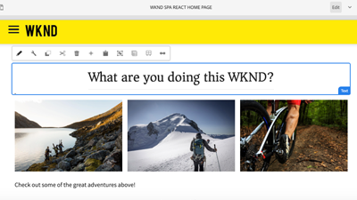

# AEM Sites - video&#39;s en zelfstudies {#overview}

{{edge-delivery-services}}

Adobe Experience Manager (AEM) Sites is een beheerplatform voor Adobe-ervaringen waarmee u digitale ervaringen kunt ontwerpen, beheren en aanbieden, via een website, mobiele app of een ander digitaal kanaal.

## Drie manieren om ervaringen met AEM Sites te bieden

AEM Sites biedt drie manieren om ervaringen op te bouwen, te schrijven en te leveren. Of u nu websites bouwt, optimaliseert voor de prestaties van de Edge-server of toepassingen zonder koppen gebruikt, AEM Sites biedt flexibele opties die aansluiten bij uw projectbehoeften:

1. **Edge Delivery Services** ervaart gebruik Adobe Edge Network om inhoud met hoge snelheid en lage latentie te leveren. De service optimaliseert automatisch inhoud voor het verbruikende apparaat, zoekmachines en GenAI-agents. Auteurs maken inhoud met Adobe Universal Editor of op documenten gebaseerde authoring.
1. **Koploze/API-eerste** ervaringen gebruiken AEM publiceren om inhoud als JSON over HTTP APIs voor mobiele apps, enig-paginatoepassingen (SPAs), of andere headless cliënten te leveren. Auteurs maken inhoud met de Content Fragment Editor of de Universal Editor.
1. **Traditionele AEM** ervaringen gebruiken AEM publiceren om inhoud als webpagina&#39;s van HTML te leveren. Auteurs maken inhoud met de paginaeditor van AEM Auteur. Deze optie is het meest geschikt voor bestaande projecten of projecten die al zijn gemigreerd.

Alle drie de opties zijn sterke benaderingen, en de beste keus hangt van uw gebruiksgeval en organisatorische behoeften af. Elke benadering staat teams toe om gepersonaliseerde, boeiende ervaringen bij snelheid en schaal over om het even welk kanaal of apparaat te leveren.

>[!IMPORTANT]
>
> **Edge Delivery Services** is de nieuwste en meest geavanceerde manier om websites met AEM te leveren. Het combineert de snelheid en schaalbaarheid van Adobe Edge Network met moderne ontwerpopties. Hoewel Edge Delivery Services wordt aanbevolen voor nieuwe projecten, blijft AEM Sites ondersteuning bieden voor een aanpak zonder kop en met een traditionele aanpak, zodat u het pad kunt kiezen dat het beste bij uw behoeften past.

In het volgende diagram worden de verschillende opties weergegeven voor het maken van ervaringen met AEM Sites:

{width="700" zoomable="yes"}

### Vergelijk de manieren om te bouwen met AEM Sites

De volgende tabel biedt een vergelijking op hoog niveau van de drie paden. Het richt zich op de inhoud creatie en ervaart leveringsnuances van elk weg.

|            | Edge Delivery Services | Koploos / API-eerste | Traditioneel AEM |
|---------------------|------------------------------|---------------------------------|---------------------------------------------|
| **Best voor** | Websites met hoge vereisten voor verkeer, prestaties en schaalbaarheid | Mobiele apps, SPA&#39;s en andere toepassingen zonder kop | Bestaande projecten of gemigreerde projecten |
| **Authoring hulpmiddelen** | Op documenten gebaseerde authoring, Universal Editor, Pagina-editor | Inhoudsfragmenten, Universele editor | Pagina-editor, Universal Editor |
| **Geautoriseerde inhoudsopslag** | Documenten of AEM-auteur (JCR) | AEM-auteur (JCR) | AEM-auteur (JCR) |
| **Levering** | Edge Delivery Services | AEM Publiceren (met Adobe CDN + Dispatcher) | AEM Publiceren (met Adobe CDN + Dispatcher) |
| **opslag van de Inhoud van de Levering** | Edge Delivery Services | AEM Publish (JCR) | AEM Publish (JCR) |
| **formaat van de Levering** | HTML | JSON | HTML |
| **de technologie van de Ontwikkeling** | JavaScript, CSS | Willekeurig (bv. Swift, Reageren, enz.) | Java™, HTML, JavaScript, CSS |
| **Onderzoek zowel en de agent GenAI steun** | Geoptimaliseerd voor bots, zoekmachines en GenAI-agents | De werken voor bots en agenten, maar kunnen SSR of extra opstelling vereisen | Geschikt voor bots, maar de prestaties kunnen trager zijn in vergelijking met Edge Delivery Services |

## Migreren van AMS of op locatie

Als u van AMS of on-premise (OTP) aan AEM as a Cloud Service migreert, moedigt Adobe u aan om direct het bewegen aan Edge Delivery Services te evalueren. De inspanningen zijn doorgaans niet groter dan het migreren naar AEM as a Cloud Service Publish, terwijl ze snellere prestaties en grotere schaalbaarheid bieden. Als u besluit dat Edge Delivery Services op dit moment niet de juiste keuze voor u is, of als de andere oplossingen beter aan uw behoeften voldoen, blijven ze volledig ondersteund en geldige opties voor uw project.

## Tutorials

Ontdek de drie benaderingen om met AEM Sites samen te werken. In de onderstaande zelfstudies wordt uitgelegd hoe elke optie werkt, welke gereedschappen worden gebruikt en wanneer.

<!-- CARDS

* https://www.aem.live/docs/
  {title = Edge Delivery Services - Guides}
  {description = Explore Edge Delivery Services with comprehensive guides. The Build, Publish, and Launch guides cover everything you need to get started with Edge Delivery Services.}
  {image = ./assets/edge-delivery-services.png}
  {target = _blank}
* https://experienceleague.adobe.com/nl/docs/experience-manager-learn/getting-started-with-aem-headless/overview
  {title = Headless/API-First - Tutorials}
  {description = Learn how to build headless applications powered by AEM content. Tutorials cover frameworks like iOS, Android, and React—choose what fits your stack.}
  {image = ./assets/headless.png}
  {target = _self}
* https://experienceleague.adobe.com/nl/docs/experience-manager-learn/getting-started-wknd-tutorial-develop/overview
  {title = Traditional AEM - WKND Tutorial}
  {description = Learn how to build a sample AEM Sites project using the WKND tutorial. This guide walks you through project setup, Core Components, Editable Templates, client-side libraries, and component development.}
  {image = ./assets/aem-wknd-spa-editor-tutorial.png}
  {target = _self}
-->
<!-- START CARDS HTML - DO NOT MODIFY BY HAND -->

    

        

            

                <figure class="image x-is-16by9">
                    
                </figure>
            

            

                

                    

                        <a href="https://www.aem.live/docs/" target="_blank" rel="referrer" title="Edge Delivery Services - Hulplijnen"> Edge Delivery Services - Gidsen </a>
                    

                    
Ontdek Edge Delivery Services met uitgebreide gidsen. De gidsen van de Bouwstijl, van de Publicatie, en van de Lancering behandelen alles u met Edge Delivery Services moet beginnen.

                

                <a href="https://www.aem.live/docs/" target="_blank" rel="referrer" class="spectrum-Button spectrum-Button--outline spectrum-Button--primary spectrum-Button--sizeM" style="align-self: flex-start; margin-top: 1rem;">
                     Leer meer 
                </a>
            

        

    

    

        

            

                <figure class="image x-is-16by9">
                    
                </figure>
            

            

                

                    

                        <a href="https://experienceleague.adobe.com/nl/docs/experience-manager-learn/getting-started-with-aem-headless/overview" target="_self" rel="referrer" title="Headless/API-First - Lesbestanden"> Headless/API-Eerste - Leerprogramma's </a>
                    

                    
Leer hoe u toepassingen zonder koppen kunt maken met AEM-inhoud. De leerprogramma's behandelen kaders zoals iOS, Android, en React-kiezen wat uw stapel past.

                

                <a href="https://experienceleague.adobe.com/nl/docs/experience-manager-learn/getting-started-with-aem-headless/overview" target="_self" rel="referrer" class="spectrum-Button spectrum-Button--outline spectrum-Button--primary spectrum-Button--sizeM" style="align-self: flex-start; margin-top: 1rem;">
                     Leer meer 
                </a>
            

        

    

    

        

            

                <figure class="image x-is-16by9">
                    
                </figure>
            

            

                

                    

                        <a href="https://experienceleague.adobe.com/nl/docs/experience-manager-learn/getting-started-wknd-tutorial-develop/overview" target="_self" rel="referrer" title="Traditionele AEM - WKND-zelfstudie"> Traditionele AEM - WKND Leerprogramma </a>
                    

                    
Leer hoe u een voorbeeld-AEM Sites-project maakt aan de hand van de WKND-zelfstudie. Deze gids begeleidt u door projectopstelling, de Componenten van de Kern, Bewerkbare Malplaatjes, cliënt-zijbibliotheken, en componentenontwikkeling.

                

                <a href="https://experienceleague.adobe.com/nl/docs/experience-manager-learn/getting-started-wknd-tutorial-develop/overview" target="_self" rel="referrer" class="spectrum-Button spectrum-Button--outline spectrum-Button--primary spectrum-Button--sizeM" style="align-self: flex-start; margin-top: 1rem;">
                     Leer meer 
                </a>
            

        

    

<!-- END CARDS HTML - DO NOT MODIFY BY HAND -->

## Aanvullende bronnen

* [&#x200B; AEM Sites Authoring documentatie &#x200B;](https://experienceleague.adobe.com/nl/docs/experience-manager-65/content/sites/authoring/essentials/first-steps)
* [&#x200B; AEM Sites het Ontwikkelen documentatie &#x200B;](https://experienceleague.adobe.com/nl/docs/experience-manager-65/content/implementing/developing/introduction/getting-started)
* [&#x200B; AEM Sites die documentatie beheren &#x200B;](https://experienceleague.adobe.com/nl/docs/experience-manager-65/content/sites/administering/home)
* [&#x200B; AEM Sites die documentatie &#x200B;](https://experienceleague.adobe.com/nl/docs/experience-manager-65/content/implementing/deploying/introduction/platform) opstelt
* [AEM as a Cloud Service-zelfstudies](/help/cloud-service/overview.md)
* [AEM Assets-zelfstudies](/help/assets/overview.md)
* [AEM Forms-zelfstudies](/help/forms/overview.md)
* [Zelfstudies voor AEM Foundation](/help/foundation/overview.md)
