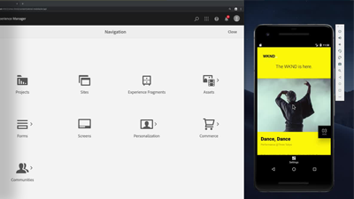

# Overzicht {#overview}

Adobe Experience Manager (AEM) Sites is een toonaangevend platform voor ervaringsbeheer. Deze gebruikershandleiding bevat video&#39;s en zelfstudies over de vele functies en mogelijkheden van AEM Sites.

## Wat is er nieuw?

* **[Starten gebruiken met AEM Sites (video)](./spa-editor/spa-editor-framework-feature-video-use.md)**

   *Meer informatie over het starten van AEM-sites en hoe u deze kunt gebruiken om inhoud van websites voor te bereiden voor toekomstige release.*

* **[De Adobe Client Data Layer aanpassen met AEM componenten (zelfstudie)](./integrations/adobe-client-data-layer/data-layer-customize.md)**

   *Leer hoe u de gegevenslaag voor de Adobe-client kunt bijwerken met inhoud van aangepaste AEM Componenten.*

* **[Aan de slag met AEM headless GraphQL (zelfstudie)](https://experienceleague.adobe.com/docs/experience-manager-learn/getting-started-with-aem-headless/graphql/overview.html)**

   *Hoe u inhoud van AEM toegankelijk maakt voor gebruik door een systeemeigen mobiele app met behulp van AEM GraphQL-API&#39;s.*

* **[Inhoudsfragmenten gebruiken (videoreeks)](./content-fragments/content-fragments-feature-video-use.md)**

   *Inhoudsfragmenten zijn akoestische stukken inhoud die opnieuw kunnen worden gebruikt.*

* **[De SPA Editor (video) gebruiken](./spa-editor/spa-editor-framework-feature-video-use.md)**

   *Meer informatie over AEM bewerkingsmogelijkheden voor toepassingen op één pagina (SPA).*

## Personeelspictogrammen

<table>
<tr>
  <td>
    
    

      <a href="https://docs.adobe.com/content/help/en/experience-manager-learn/getting-started-wknd-tutorial-develop/overview.html">
    <strong>Aan de slag met AEM Sites</strong>
    </a>
    

    

    <em>Een gids aan de slag voor ontwikkelaars die AEM Sites willen implementeren.</em>
    

  </td>
  <td>
    
    

    <a href="https://docs.adobe.com/content/help/en/experience-manager-learn/getting-started-with-aem-headless/overview.html">
    <strong>Aan de slag met AEM headless</strong>
    </a>
    

    

    <em>Een gids aan de slag voor ontwikkelaars die AEM als headless CMS willen gebruiken.</em>
    

  </td>
  <td>
    
     

      <a href="https://docs.adobe.com/content/help/en/experience-manager-learn/spa-react-tutorial/overview.html">
        <strong>Aan de slag met AEM SPA Editor</strong>
      </a>
    

    

    <em>Een gids Aan de slag voor ontwikkelaars om één enkele paginatoepassingen (SPA) met AEM te integreren.</em>
    

  </td>
</tr>
</table>

## Aanvullende bronnen

* [Experience League - Verken AEM](https://experienceleague.adobe.com/#recommended/solutions/experience-manager)
* [AEM Sites Authoring Documentation](https://helpx.adobe.com/experience-manager/6-5/sites/authoring/user-guide.html)
* [AEM Sites Developing Documentation](https://helpx.adobe.com/experience-manager/6-5/sites/developing/user-guide.html)
* [AEM Sites-beheerdocumentatie](https://helpx.adobe.com/experience-manager/6-5/sites/administering/user-guide.html)
* [AEM Sites-documentatie implementeren](https://helpx.adobe.com/experience-manager/6-5/sites/deploying/user-guide.html)
* [AEM als Cloud Service Tutorials](/help/cloud-service/overview.md)
* [AEM Assets Tutorials](/help/assets/overview.md)
* [AEM Forms Tutorials](/help/forms/overview.md)
* [Tutorials AEM stichting](/help/foundation/overview.md)
