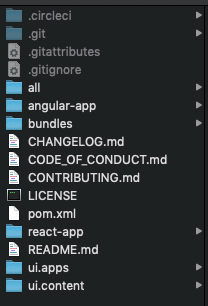

# Ontwikkelen met de AEM SPA Editor - Hello World Tutorial {#developing-with-the-aem-spa-editor-hello-world-tutorial}

>[!WARNING]
>
> Deze zelfstudie is **afgekeurd**. Het wordt aanbevolen om: [Aan de slag met de AEM SPA Editor en Angular](https://docs.adobe.com/content/help/en/experience-manager-learn/spa-angular-tutorial/overview.html) of [Aan de slag met de AEM SPA Editor en Reageren](https://docs.adobe.com/content/help/en/experience-manager-learn/spa-react-tutorial/overview.html)

AEM SPA Editor biedt ondersteuning voor contextbewerkingen van een toepassing of SPA van één pagina. Deze zelfstudie is een inleiding op SPA ontwikkeling die moet worden gebruikt met AEM SPA Editor JS SDK. De zelfstudie breidt de app We.Retail Journal uit door een aangepaste Hello World-component toe te voegen. Gebruikers kunnen de zelfstudie voltooien met Reageren of Angulars.

>[!NOTE]
>
> De eigenschap van de Redacteur van de Toepassing van de enig-Pagina (SPA) vereist AEM 6.4 de dienstpak 2 of nieuwer.
>
> De SPA Redacteur is de geadviseerde oplossing voor projecten die SPA kader gebaseerde cliënt-zijteruggeven (b.v. Reageren of Angular) vereisen.

## Vereiste lezen {#prereq}

Deze zelfstudie is bedoeld om de stappen te benadrukken die nodig zijn om een SPA component toe te wijzen aan een AEM component om in-context het uitgeven toe te laten. Gebruikers die deze zelfstudie starten, moeten vertrouwd zijn met de basisbeginselen van ontwikkeling met Adobe Experience Manager, AEM en met React of Angular frameworks. De zelfstudie behandelt zowel back-end als front-end ontwikkelingstaken.

U wordt aangeraden de volgende bronnen te controleren voordat u deze zelfstudie start:

* [SPA de Video](spa-editor-framework-feature-video-use.md)  van de Eigenschap van de Redacteur van de Redacteur - een videooverzicht van de SPA Redacteur en de app van het Dagboek.
* [Zelfstudie](https://reactjs.org/tutorial/tutorial.html)  React.js - Een inleiding tot ontwikkeling met het React-kader.
* [Zelfstudie](https://angular.io/tutorial)  over angular - Een inleiding tot ontwikkeling met Angular

## Lokale ontwikkelomgeving {#local-dev}

Deze zelfstudie is ontworpen voor:

[Adobe Experience Manager 6.5](https://helpx.adobe.com/experience-manager/6-5/release-notes.html) of  [Adobe Experience Manager 6.4](https://helpx.adobe.com/experience-manager/6-4/sites/deploying/using/technical-requirements.html) +  [Service Pack 5](https://helpx.adobe.com/experience-manager/6-4/release-notes/sp-release-notes.html)

In deze zelfstudie moeten de volgende technologieën en gereedschappen worden geïnstalleerd:

1. [Java 11](https://downloads.experiencecloud.adobe.com/content/software-distribution/en/general.html)
2. [Apache Maven - 3.3.1+](https://maven.apache.org/)
3. [Node.js - 8.11.1+](https://nodejs.org/en/) en npm 5.6.0+ (npm is geïnstalleerd met node.js)

Controleer de installatie van de bovenstaande gereedschappen door een nieuwe terminal te openen en het volgende uit te voeren:

```shell
$ java -version
java version "11 +"

$ mvn -version
Apache Maven 3.3.9

$ node --version
v8.11.1

$ npm --version
6.1.0
```

## Overzicht {#overview}

Het basisconcept is om een SPA Component aan een AEM Component in kaart te brengen. AEM componenten, met serverfuncties, inhoud exporteren in de vorm van JSON. De JSON-inhoud wordt door de SPA verbruikt en wordt in de browser op de client uitgevoerd. Er wordt een 1:1-toewijzing gemaakt tussen SPA componenten en een AEM component.


Populaire frameworks [React JS](https://reactjs.org/) en [Angular](https://angular.io/) worden vanuit de box ondersteund. Gebruikers kunnen deze zelfstudie voltooien in Angular of Reageren, afhankelijk van welk raamwerk ze het prettigst vinden.

## Projectinstelling {#project-setup}

SPA ontwikkeling heeft één voet in AEM ontwikkeling, en de andere. Het doel is om SPA ontwikkeling onafhankelijk te laten plaatsvinden, en (meestal) agnostisch aan AEM.

* SPA projecten kunnen onafhankelijk van het AEM project functioneren tijdens de ontwikkeling vooraf.
* Voor-end bouwstijlhulpmiddelen en technologieën zoals Webpack, NPM, [!DNL Grunt] en [!DNL Gulp]blijven worden gebruikt.
* Om voor AEM te bouwen, wordt het SPA project gecompileerd en automatisch inbegrepen in het AEM project.
* Standaard AEM Pakketten die worden gebruikt om de SPA in AEM op te stellen.


*SPA ontwikkeling heeft een voet in AEM ontwikkeling en de andere een uitweg - zodat SPA ontwikkeling zelfstandig kan plaatsvinden en (meestal) onnodig aan AEM.*

Het doel van deze zelfstudie is om de Web.Retail App met een nieuwe component uit te breiden. Begin door de broncode voor de app van het Dagboek te downloaden We.Retail en aan een lokale AEM op te stellen.

1. **** Downloadt de recentste Code van het Dagboek  [We.Retail van GitHub](https://github.com/adobe/aem-sample-we-retail-journal).

   U kunt de gegevensopslagruimte ook klonen vanaf de opdrachtregel:

   ```shell
   $ git clone git@github.com:adobe/aem-sample-we-retail-journal.git
   ```

   >[!NOTE]
   >
   >De zelfstudie werkt tegen de **master**-vertakking met **1.2.1-SNAPSHOT**-versie van het project.

1. De volgende structuur moet zichtbaar zijn:

   

   Het project bevat de volgende gemaskeerde modules:

   * `all`: Hiermee sluit u het hele project in één pakket in en installeert u dit.
   * `bundles`: Bevat twee OSGi-bundels: komma&#39;s en core die  [!DNL Sling Models] en andere Java-code bevatten.
   * `ui.apps`: bevat de /apps-onderdelen van het project, dat wil zeggen JS &amp; CSS-clientlibs, componenten, specifieke configuraties voor de runmode.
   * `ui.content`: bevat structurele inhoud en configuraties (`/content`,  `/conf`)
   * `react-app`: Wij.Retail Journal React-toepassing. Dit is zowel een module Maven als een webpack project.
   * `angular-app`: Wij.Retail Journal Angular application. Dit is zowel een [!DNL Maven] module als een webpack project.

1. Open een nieuw terminalvenster en voer de volgende opdracht uit om de volledige app te maken en te implementeren in een lokale AEM-instantie die wordt uitgevoerd op [http://localhost:4502](http://localhost:4502).

   ```shell
   $ cd <src>/aem-sample-we-retail-journal
   $ mvn -PautoInstallSinglePackage clean install
   ```

   >[!NOTE]
   >
   > In dit project is het Maven-profiel voor het maken en verpakken van het gehele project `autoInstallSinglePackage`

   >[!CAUTION]
   >
   > Als u tijdens de build een fout ontvangt, [zorgt u ervoor dat het bestand Maven settings.xml een Adobe Maven Artefactgegevensopslagruimte](https://helpx.adobe.com/experience-manager/kb/SetUpTheAdobeMavenRepository.html) bevat.

1. Ga naar:

   * [http://localhost:4502/editor.html/content/we-retail-journal/react/en/home.html](http://localhost:4502/editor.html/content/we-retail-journal/react/en/home.html)
   * [http://localhost:4502/editor.html/content/we-retail-journal/angular/en/home.html](http://localhost:4502/editor.html/content/we-retail-journal/angular/en/home.html)

   De Web.Retail Journal App moet worden weergegeven in de AEM Sites-editor.

1. Selecteer in de modus [!UICONTROL Edit] de component die u wilt bewerken en werk de inhoud bij.

   

1. Selecteer het pictogram [!UICONTROL Page Properties] om [!UICONTROL Page Properties] te openen. Selecteer [!UICONTROL Edit Template] om de sjabloon van de pagina te openen.

   

1. In de recentste versie van de Redacteur van de SPA, [Editable malplaatjes](https://helpx.adobe.com/experience-manager/6-5/sites/developing/using/page-templates-editable.html) kunnen op de zelfde manier worden gebruikt zoals met traditionele implementaties van Plaatsen. Dit wordt later opnieuw bekeken met onze aangepaste component.

   >[!NOTE]
   >
   > Alleen AEM 6.5 en AEM 6.4 + **Service Pack 5** ondersteunen bewerkbare sjablonen.

## Overzicht van ontwikkeling {#development-overview}


SPA ontwikkelherhalingen zijn onafhankelijk van AEM. Wanneer de SPA klaar is om te worden ingezet in AEM vinden de volgende stappen op hoog niveau plaats (zoals hierboven geïllustreerd).

1. Het AEM project bouwt wordt aangehaald, dat beurtelings een bouwstijl van het SPA project teweegbrengt. The We.Retail Journal gebruikt de [**frontend-maven-plugin**](https://github.com/eirslett/frontend-maven-plugin).
1. Met de [**aem-clientlib-generator**](https://www.npmjs.com/package/aem-clientlib-generator) van het SPA project wordt de gecompileerde SPA ingesloten als een AEM clientbibliotheek in het AEM project.
1. Het AEM project produceert een AEM pakket, met inbegrip van de gecompileerde SPA, plus andere ondersteunende AEM code.

## AEM component {#aem-component} maken

**Persona: AEM Developer**

Eerst wordt een AEM gemaakt. De AEM component is verantwoordelijk voor het renderen van de JSON-eigenschappen die door de component React worden gelezen. De AEM component is ook verantwoordelijk voor het opgeven van een dialoogvenster voor alle bewerkbare eigenschappen van de component.

Met [!DNL Eclipse] of andere [!DNL IDE] importeert u het Web.Retail Journal Maven-project.

1. Werk de reactor **pom.xml** bij om de [!DNL Apache Rat] plug-in te verwijderen. Met deze insteekmodule wordt elk bestand gecontroleerd om er zeker van te zijn dat er een licentieheader is. Voor onze doeleinden hoeven we ons niet bezig te houden met deze functionaliteit.

   Verwijder **apache-rate-plugin** in **aem-sample-we-retail-journal/pom.xml**:

   ```xml
   <!-- Remove apache-rat-plugin -->
   <plugin>
           <groupId>org.apache.rat</groupId>
           <artifactId>apache-rat-plugin</artifactId>
           <configuration>
               <excludes combine.children="append">
                   <exclude>*</exclude>
                       ...
               </excludes>
           </configuration>
           <executions>
                   <execution>
                       <phase>verify</phase>
                       <goals>
                           <goal>check</goal>
                       </goals>
               </execution>
           </executions>
       </plugin>
   ```

1. Maak in de module **we-Retail-journaal-content** (`<src>/aem-sample-we-retail-journal/ui.apps`) een nieuw knooppunt onder `ui.apps/jcr_root/apps/we-retail-journal/components` met de naam **helloworld** van het type **cq:Component**.
1. Voeg de volgende eigenschappen toe aan de **helloworld** component, die in XML (`/helloworld/.content.xml`) hieronder wordt vertegenwoordigd:

   ```xml
   <?xml version="1.0" encoding="UTF-8"?>
   <jcr:root xmlns:cq="http://www.day.com/jcr/cq/1.0" xmlns:jcr="http://www.jcp.org/jcr/1.0"
       jcr:description="Hello World Component for We.Retail Journal"
       jcr:primaryType="cq:Component"
       jcr:title="Hello World"
       componentGroup="We.Retail Journal" />
   ```

   

   >[!NOTE]
   >
   > Om de Bewerkbare eigenschap van Malplaatjes te illustreren hebben wij opzettelijk `componentGroup="Custom Components"` geplaatst. In een echt project, is het best om het aantal componentengroepen te minimaliseren, zodat zou een betere groep &quot;[!DNL We.Retail Journal]&quot;zijn om de andere inhoudcomponenten aan te passen.
   >
   > Alleen AEM 6.5 en AEM 6.4 + **Service Pack 5** ondersteunen bewerkbare sjablonen.

1. Daarna zal een dialoog worden gecreeerd om voor een douanebericht toe te staan om voor **Hello World** component worden gevormd. Voeg onder `/apps/we-retail-journal/components/helloworld` een knooppuntnaam **cq:dialog** van **nt:unStructured** toe.
1. Met **cq:dialog** wordt één tekstveld weergegeven waarin tekst doorloopt naar een eigenschap met de naam **[!DNL message]**. Onder het nieuwe **cq:dialog** voegt u de volgende knooppunten en eigenschappen toe, weergegeven in XML hieronder (`helloworld/_cq_dialog/.content.xml`):

   ```xml
   <?xml version="1.0" encoding="UTF-8"?>
   <jcr:root xmlns:sling="http://sling.apache.org/jcr/sling/1.0" xmlns:cq="http://www.day.com/jcr/cq/1.0" xmlns:jcr="http://www.jcp.org/jcr/1.0" xmlns:nt="http://www.jcp.org/jcr/nt/1.0"
       jcr:primaryType="nt:unstructured"
       jcr:title="We.Retail Journal - Hello World"
       sling:resourceType="cq/gui/components/authoring/dialog">
       <content
           jcr:primaryType="nt:unstructured"
           sling:resourceType="granite/ui/components/coral/foundation/container">
           <items jcr:primaryType="nt:unstructured">
               <tabs
                   jcr:primaryType="nt:unstructured"
                   sling:resourceType="granite/ui/components/coral/foundation/tabs"
                   maximized="{Boolean}true">
                   <items jcr:primaryType="nt:unstructured">
                       <properties
                           jcr:primaryType="nt:unstructured"
                           jcr:title="Properties"
                           sling:resourceType="granite/ui/components/coral/foundation/container"
                           margin="{Boolean}true">
                           <items jcr:primaryType="nt:unstructured">
                               <columns
                                   jcr:primaryType="nt:unstructured"
                                   sling:resourceType="granite/ui/components/coral/foundation/fixedcolumns"
                                   margin="{Boolean}true">
                                   <items jcr:primaryType="nt:unstructured">
                                       <column
                                           jcr:primaryType="nt:unstructured"
                                           sling:resourceType="granite/ui/components/coral/foundation/container">
                                           <items jcr:primaryType="nt:unstructured">
                                               <message
                                                   jcr:primaryType="nt:unstructured"
                                                   sling:resourceType="granite/ui/components/coral/foundation/form/textfield"
                                                   fieldLabel="Message"
                                                   name="./message"
                                                   required="{Boolean}true"/>
                                           </items>
                                       </column>
                                   </items>
                               </columns>
                           </items>
                       </properties>
                   </items>
               </tabs>
           </items>
       </content>
   </jcr:root>
   ```

   

   Met de bovenstaande XML-knooppuntdefinitie wordt een dialoogvenster gemaakt met één tekstveld waarmee een gebruiker een &quot;bericht&quot; kan invoeren. Noteer de eigenschap `name="./message"` in het knooppunt `<message />`. Dit is de naam van de eigenschap die wordt opgeslagen in het JCR binnen AEM.

1. Vervolgens wordt een leeg beleidsdialoogvenster gemaakt (`cq:design_dialog`). Het dialoogvenster Beleid is nodig om de component weer te geven in de Sjablooneditor. Voor dit eenvoudige gebruiksgeval wordt het een leeg dialoogvenster.

   Voeg onder `/apps/we-retail-journal/components/helloworld` een knooppuntnaam `cq:design_dialog` van `nt:unstructured` toe.

   De configuratie wordt hieronder weergegeven in XML (`helloworld/_cq_design_dialog/.content.xml`)

   ```xml
   <?xml version="1.0" encoding="UTF-8"?>
   <jcr:root xmlns:sling="http://sling.apache.org/jcr/sling/1.0" xmlns:cq="http://www.day.com/jcr/cq/1.0" xmlns:jcr="http://www.jcp.org/jcr/1.0" xmlns:nt="http://www.jcp.org/jcr/nt/1.0"
   jcr:primaryType="nt:unstructured" />
   ```

1. Stel de codebasis aan AEM van de bevellijn op:

   ```shell
   $ cd <src>/aem-sample-we-retail-journal/content
   $ mvn -PautoInstallPackage clean install
   ```

   Controleer in [CRXDE Lite](http://localhost:4502/crx/de/index.jsp#/apps/we-retail-journal/global/components/helloworld) of de component is geïmplementeerd door de map onder `/apps/we-retail-journal/components:` te inspecteren

   

## Verstijlmodel maken {#create-sling-model}

**Persona: AEM Developer**

Vervolgens wordt een [!DNL Sling Model] gemaakt ter ondersteuning van de [!DNL Hello World]-component. In een traditioneel WCM-gebruiksgeval implementeert [!DNL Sling Model] bedrijfslogica en een server-side rendering script (HTL) roept een [!DNL Sling Model] aan. Hierdoor blijft het renderscript relatief eenvoudig.

[!DNL Sling Models] worden ook gebruikt in het SPA gebruiksgeval om server-kant bedrijfslogica uit te voeren. Het verschil is dat in [!DNL SPA] gebruiksgeval, [!DNL Sling Models] het methodes zoals geserialiseerde JSON blootstelt.

>[!NOTE]
>
>Als beste praktijken, zouden de ontwikkelaars [AEM de Componenten van de Kern ](https://docs.adobe.com/content/help/en/experience-manager-core-components/using/introduction.html) moeten gebruiken wanneer mogelijk. Core Components bieden [!DNL Sling Models] onder andere JSON-uitvoer die &quot;SPA-klaar&quot; is, zodat ontwikkelaars zich meer kunnen richten op front-end presentaties.

1. In de redacteur van uw keus, open **wij-detailhandel-dagboek-komma-komma&#39;s** project ( `<src>/aem-sample-we-retail-journal/bundles/commons`).
1. In het pakket `com.adobe.cq.sample.spa.commons.impl.models`:
   * Maak een nieuwe klasse met de naam `HelloWorld`.
   * Voeg een implementerende interface toe voor `com.adobe.cq.export.json.ComponentExporter.`

   

   De `ComponentExporter` interface moet worden uitgevoerd om [!DNL Sling Model] compatibel te zijn met AEM Content Services.

   ```java
    package com.adobe.cq.sample.spa.commons.impl.models;
   
    import com.adobe.cq.export.json.ComponentExporter;
   
    public class HelloWorld implements ComponentExporter {
   
        @Override
        public String getExportedType() {
            return null;
        }
    }
   ```

1. Voeg een statische variabele met de naam `RESOURCE_TYPE` toe om het bronnentype van de component [!DNL HelloWorld] te identificeren:

   ```java
    ...
    public class HelloWorld implements ComponentExporter {
   
        static final String RESOURCE_TYPE = "we-retail-journal/components/helloworld";
   
        ...
    }
   ```

1. Voeg de OSGi-annotaties toe voor `@Model` en `@Exporter`. De `@Model`-annotatie registreert de klasse als een [!DNL Sling Model]. De `@Exporter`-annotatie zal de methoden als geserialiseerde JSON blootstellen met behulp van het [!DNL Jackson Exporter]-framework.

   ```java
   import org.apache.sling.api.SlingHttpServletRequest;
   import org.apache.sling.models.annotations.Exporter;
   import org.apache.sling.models.annotations.Model;
   import com.adobe.cq.export.json.ExporterConstants;
   ...
   
   @Model(
           adaptables = SlingHttpServletRequest.class,
           adapters = {ComponentExporter.class},
           resourceType = HelloWorld.RESOURCE_TYPE
   )
   @Exporter(
           name = ExporterConstants.SLING_MODEL_EXPORTER_NAME, 
           extensions = ExporterConstants.SLING_MODEL_EXTENSION
   )
   public class HelloWorld implements ComponentExporter {
   
   ...
   ```

1. Implementeer de methode `getDisplayMessage()` om de JCR-eigenschap `message` te retourneren. Gebruik de [!DNL Sling Model]-annotatie van `@ValueMapValue` om het gemakkelijk te maken om de eigenschap `message` op te halen die onder de component is opgeslagen. De annotatie `@Optional` is belangrijk omdat `message` niet wordt gevuld wanneer de component voor het eerst aan de pagina wordt toegevoegd.

   Als deel van de bedrijfslogica, zal een koord, &quot;**Hello**&quot;, aan het bericht worden toegevoegd.

   ```java
   import org.apache.sling.models.annotations.injectorspecific.ValueMapValue;
   import org.apache.sling.models.annotations.Optional;
   
   ...
   
   public class HelloWorld implements ComponentExporter {
   
      static final String RESOURCE_TYPE = "we-retail-journal/components/helloworld";
   
      private static final String PREPEND_MSG = "Hello";
   
       @ValueMapValue @Optional
       private String message;
   
       public String getDisplayMessage() {
           if(message != null && message.length() > 0) {
               return PREPEND_MSG + " "  + message;
           }
           return null;
       }
   
   ...
   ```

   >[!NOTE]
   >
   > De methodenaam `getDisplayMessage` is belangrijk. Wanneer [!DNL Sling Model] met [!DNL Jackson Exporter] wordt geserialiseerd zal het als bezit JSON worden blootgesteld: `displayMessage`. [!DNL Jackson Exporter] zal alle `getter` methodes serialiseren en blootstellen die geen parameter (tenzij uitdrukkelijk duidelijk om) nemen te negeren. Later in de app React / Angular lezen we deze eigenschapswaarde en geven deze weer als onderdeel van de toepassing.

   De methode `getExportedType` is ook belangrijk. De waarde van de component `resourceType` wordt gebruikt om de JSON-gegevens toe te wijzen aan de front-end component (Angular/React). We zullen dit in de volgende sectie onderzoeken.

1. Voer de methode `getExportedType()` uit om het middeltype van `HelloWorld` component terug te keren.

   ```java
    @Override
       public String getExportedType() {
           return RESOURCE_TYPE;
       }
   ```

   De volledige code voor [**HelloWorld.java** kan hier worden gevonden.](https://github.com/Adobe-Marketing-Cloud/aem-guides/blob/master/spa-helloworld-guide/src/bundles/commons/HelloWorld.java)

1. Implementeer de code om te AEM met Apache Maven:

   ```shell
   $ cd <src>/sample-we-retail-spa-content/bundles/commons
   $ mvn -PautoInstallPackage clean install
   ```

   Verifieer de plaatsing en registratie van [!DNL Sling Model] door aan [[!UICONTROL Status] > [!UICONTROL Sling Models]](http://localhost:4502/system/console/status-slingmodels) in de console te navigeren OSGi.

   U zou moeten zien dat `HelloWorld` het Verschuiven Model aan `we-retail-journal/components/helloworld` het Verschuiven middeltype gebonden is en dat het als [!DNL Sling Model Exporter Servlet] wordt geregistreerd:

   ```shell
   com.adobe.cq.sample.spa.commons.impl.models.HelloWorld - we-retail-journal/components/helloworld
   com.adobe.cq.sample.spa.commons.impl.models.HelloWorld exports 'we-retail-journal/components/helloworld' with selector 'model' and extension '[Ljava.lang.String;@6480f3e5' with exporter 'jackson'
   ```

## React-component maken {#react-component}

**Persona: Front End Developer**

Vervolgens wordt de component React gemaakt. Open de **reactie-app** module ( `<src>/aem-sample-we-retail-journal/react-app`) gebruikend de redacteur van uw keus.

>[!NOTE]
>
> U kunt deze sectie overslaan als u alleen geïnteresseerd bent in de ontwikkeling van [Angulars](#angular-component).

1. In de `react-app` omslag navigeer aan zijn src omslag. Vouw de componentenmap uit om de bestaande React-componentbestanden weer te geven.

   

1. Voeg een nieuw dossier onder de componentenomslag genoemd `HelloWorld.js` toe.
1. Open `HelloWorld.js`. Voeg een importinstructie toe om de componentenbibliotheek React te importeren. Voeg een tweede importinstructie toe om de `MapTo` helper te importeren die door Adobe wordt geleverd. De `MapTo` helper verstrekt een afbeelding van de React component aan JSON van de AEM component.

   ```js
   import React, {Component} from 'react';
   import {MapTo} from '@adobe/cq-react-editable-components';
   ```

1. Onder de invoer creeert een nieuwe klasse genoemd `HelloWorld` die React `Component` interface uitbreidt. Voeg de vereiste `render()` methode aan `HelloWorld` klasse toe.

   ```js
   import React, {Component} from 'react';
   import {MapTo} from '@adobe/cq-react-editable-components';
   
   class HelloWorld extends Component {
   
       render() {
   
       }
   }
   ```

1. De `MapTo` helper omvat automatisch een voorwerp genoemd `cqModel` als deel van de reacomponenten van de component. `cqModel` omvat alle eigenschappen die door [!DNL Sling Model] worden blootgesteld.

   Onthoud dat de [!DNL Sling Model] die u eerder hebt gemaakt een methode `getDisplayMessage()` bevat. `getDisplayMessage()` wordt vertaald als een JSON-toets die  `displayMessage` bij uitvoer een naam heeft.

   Implementeer de methode `render()` om een `h1`-tag uit te voeren die de waarde van `displayMessage` bevat. [JSX](https://reactjs.org/docs/introducing-jsx.html), een syntaxisextensie voor JavaScript, wordt gebruikt om de definitieve opmaak van de component te retourneren.

   ```js
   ...
   
   class HelloWorld extends Component {
       render() {
   
           if(this.props.displayMessage) {
               return (
                   <div className="cmp-helloworld">
                       <h1 className="cmp-helloworld_message">{this.props.displayMessage}</h1>
                   </div>
               );
           }
           return null;
       }
   }
   ```

1. Voer een Edit configuratiemethode uit. Deze methode wordt doorgegeven via de Help `MapTo` en biedt de AEM editor informatie om een tijdelijke aanduiding weer te geven als de component leeg is. Dit gebeurt wanneer de component aan de SPA wordt toegevoegd, maar nog niet is gemaakt. Voeg het volgende toe onder de `HelloWorld` klasse:

   ```js
   ...
   
   class HelloWorld extends Component {
       ...
   }
   
   const HelloWorldEditConfig = {
   
       emptyLabel: 'Hello World',
   
       isEmpty: function(props) {
           return !props || !props.displayMessage || props.displayMessage.trim().length < 1;
       }
   };
   
   ...
   ```

1. Roep aan het einde van het bestand de `MapTo`-hulplijn aan en geef de klasse `HelloWorld` en `HelloWorldEditConfig` door. Hierdoor wordt de React Component toegewezen aan de AEM component op basis van het brontype van de AEM Component: `we-retail-journal/components/helloworld`.

   ```js
   MapTo('we-retail-journal/components/helloworld')(HelloWorld, HelloWorldEditConfig);
   ```

   De voltooide code voor [**HelloWorld.js** kan hier worden gevonden.](https://github.com/Adobe-Marketing-Cloud/aem-guides/blob/master/spa-helloworld-guide/src/react-app/components/HelloWorld.js)

1. Open het bestand `ImportComponents.js`. Deze vindt u op `<src>/aem-sample-we-retail-journal/react-app/src/ImportComponents.js`.

   Voeg een lijn toe om `HelloWorld.js` met de andere componenten in de gecompileerde bundel te vereisen JavaScript:

   ```js
   ...
     require('./components/Text');
     require('./components/Image');
     require('./components/HelloWorld');
   ...
   ```

1. Maak in de map `components` een nieuw bestand met de naam `HelloWorld.css` als een bestand op hetzelfde niveau als `HelloWorld.js.` Het bestand vullen met de volgende code om een basisstijl voor de component `HelloWorld` te maken:

   ```css
   /* HelloWorld.css to style HelloWorld component */
   
   .cmp-helloworld_message {
       text-align: center;
       color: #ff505e;
       text-transform: unset;
       letter-spacing: unset;
   }
   ```

1. Open `HelloWorld.js` opnieuw en werk de importinstructies bij om `HelloWorld.css` te vereisen:

   ```js
   import React, {Component} from 'react';
   import {MapTo} from '@adobe/cq-react-editable-components';
   
   require('./HelloWorld.css');
   
   ...
   ```

1. Implementeer de code om te AEM met Apache Maven:

   ```shell
   $ cd <src>/sample-we-retail-spa-content
   $ mvn -PautoInstallSinglePackage clean install
   ```

1. Open `/apps/we-retail-journal/react/clientlibs/we-retail-journal-react/js/app.js` in [CRXDE-Lite](http://localhost:4502/crx/de/index.jsp#/apps/we-retail-journal/react/clientlibs/we-retail-journal-react/js/app.js). U kunt snel zoeken naar HelloWorld in app.js om te controleren of de component React is opgenomen in de gecompileerde app.

   >[!NOTE]
   >
   > **app.** jsis de gebundelde React-app. De code is niet meer leesbaar voor mensen. De opdracht `npm run build` heeft een geoptimaliseerde build geactiveerd die gecompileerde JavaScript-code uitvoert die door moderne browsers kan worden geïnterpreteerd.


## Angular-component maken {#angular-component}

**Persona: Front End Developer**

>[!NOTE]
>
> U kunt deze sectie overslaan als u alleen geïnteresseerd bent in React-ontwikkeling.

Vervolgens wordt de component Angular gemaakt. Open de **angular-app** module (`<src>/aem-sample-we-retail-journal/angular-app`) gebruikend de redacteur van uw keus.

1. In de `angular-app` omslag navigeer aan zijn `src` omslag. Breid de componentenomslag uit om de bestaande de componentendossiers van de Angular te bekijken.

   

1. Voeg een nieuwe omslag onder de componentenomslag genoemd `helloworld` toe. Voeg onder de map `helloworld` nieuwe bestanden met de naam `helloworld.component.css, helloworld.component.html, helloworld.component.ts` toe.

   ```plain
   /angular-app
       /src
           /app
               /components
   +                /helloworld
   +                    helloworld.component.css
   +                    helloworld.component.html
   +                    helloworld.component.ts
   ```

1. Open `helloworld.component.ts`. Voeg een importinstructie toe om de klassen `Component` en `Input` van de Angular te importeren. Maak een nieuwe component en wijs `styleUrls` en `templateUrl` aan `helloworld.component.css` en `helloworld.component.html` aan. Exporteer ten slotte de klasse `HelloWorldComponent` met de verwachte invoer van `displayMessage`.

   ```js
   //helloworld.component.ts
   
   import { Component, Input } from '@angular/core';
   
   @Component({
     selector: 'app-helloworld',
     host: { 'class': 'cmp-helloworld' },
     styleUrls:['./helloworld.component.css'],
     templateUrl: './helloworld.component.html',
   })
   
   export class HelloWorldComponent {
     @Input() displayMessage: string;
   }
   ```

   >[!NOTE]
   >
   > Als u [!DNL Sling Model] eerder gecreeerd herinnert, was er een methode **getDisplayMessage ()**. De geserialiseerde JSON van deze methode zal **displayMessage** zijn, die wij nu in Angular app lezen.

1. Open `helloworld.component.html` om een `h1`-tag op te nemen die de eigenschap `displayMessage` zal afdrukken:

   ```html
   <h1 *ngIf="displayMessage" class="cmp-helloworld_message">
       {{displayMessage}}
   </h1>
   ```

1. Werk `helloworld.component.css` bij om enkele basisstijlen voor de component op te nemen.

   ```css
   :host-context {
       display: block;
   };
   
   .cmp-helloworld {
       display:block;
   }
   .cmp-helloworld_message {
       text-align: center;
       color: #ff505e;
       text-transform: unset;
       letter-spacing: unset;
   }
   ```

1. `helloworld.component.spec.ts` bijwerken met de volgende testbank:

   ```js
   import { async, ComponentFixture, TestBed } from '@angular/core/testing';
   
   import { HelloWorldComponent } from './helloworld.component';
   
       describe('HelloWorld', () => {
       let component: HelloWorldComponent;
       let fixture: ComponentFixture<HelloWorldComponent>;
   
       beforeEach(async(() => {
           TestBed.configureTestingModule({
           declarations: [ HelloWorldComponent ]
           })
           .compileComponents();
       }));
   
       beforeEach(() => {
           fixture = TestBed.createComponent(HelloWorldComponent);
           component = fixture.componentInstance;
           fixture.detectChanges();
       });
   
       it('should create', () => {
           expect(component).toBeTruthy();
       });
   });
   ```

1. Volgende update `src/components/mapping.ts` om `HelloWorldComponent` te omvatten. Voeg een `HelloWorldEditConfig` toe die placeholder in de AEM redacteur zal merken alvorens de component is gevormd. Voeg ten slotte een lijn toe om de AEM component aan de component van de Angular met `MapTo` helper in kaart te brengen.

   ```js
   // src/components/mapping.ts
   
   import { HelloWorldComponent } from "./helloworld/helloworld.component";
   
   ...
   
   const HelloWorldEditConfig = {
   
       emptyLabel: 'Hello World',
   
       isEmpty: function(props) {
           return !props || !props.displayMessage || props.displayMessage.trim().length < 1;
       }
   };
   
   ...
   
   MapTo('we-retail-journal/components/helloworld')(HelloWorldComponent, HelloWorldEditConfig);
   ```

   De volledige code voor [**mapping.ts** is hier te vinden.](https://github.com/Adobe-Marketing-Cloud/aem-guides/blob/master/spa-helloworld-guide/src/angular-app/mapping.ts)

1. `src/app.module.ts` bijwerken om **NgModule** bij te werken. Voeg **`HelloWorldComponent`** als **verklaring** toe die tot **AppModule** behoort. Voeg ook `HelloWorldComponent` als **entryComponent** toe zodat het wordt gecompileerd en dynamisch in app wordt omvat aangezien het model JSON wordt verwerkt.

   ```js
   import { HelloWorldComponent } from './components/helloworld/helloworld.component';
   
   ...
   
   @NgModule({
     imports: [BrowserModule.withServerTransition({ appId: 'we-retail-sample-angular' }),
       SpaAngularEditableComponentsModule,
     AngularWeatherWidgetModule.forRoot({
       key: "37375c33ca925949d7ba331e52da661a",
       name: WeatherApiName.OPEN_WEATHER_MAP,
       baseUrl: 'http://api.openweathermap.org/data/2.5'
     }),
       AppRoutingModule,
       BrowserTransferStateModule],
     providers: [ModelManagerService,
       { provide: APP_BASE_HREF, useValue: '/' }],
     declarations: [AppComponent,
       TextComponent,
       ImageComponent,
       WeatherComponent,
       NavigationComponent,
       MenuComponent,
       MainContentComponent,
       HelloWorldComponent],
     entryComponents: [TextComponent,
       ImageComponent,
       WeatherComponent,
       NavigationComponent,
       MainContentComponent,
       HelloWorldComponent],
     bootstrap: [AppComponent]
    })
   ```

   De voltooide code voor [**app.module.ts** is hier te vinden.](https://github.com/Adobe-Marketing-Cloud/aem-guides/blob/master/spa-helloworld-guide/src/angular-app/app.module.ts)

1. Implementeer de code die u wilt AEM met Maven:

   ```shell
   $ cd <src>/sample-we-retail-spa-content
   $ mvn -PautoInstallSinglePackage clean install
   ```

1. Open `/apps/we-retail-journal/angular/clientlibs/we-retail-journal-angular/js/main.js` in [CRXDE-Lite](http://localhost:4502/crx/de/index.jsp#/apps/we-retail-journal/angular/clientlibs/we-retail-journal-angular/js/main.js). Voer een snelle onderzoek naar **HelloWorld** in `main.js` uit om te verifiëren de component van de Angular is inbegrepen.

   >[!NOTE]
   >
   > **main.** jsis de gebundelde Angular-app. De code is niet meer leesbaar voor mensen. De npm run build-opdracht heeft een geoptimaliseerde build geactiveerd die gecompileerde JavaScript uitvoert die door moderne browsers kan worden geïnterpreteerd.

## Sjabloon {#template-update} bijwerken

1. Navigeer naar de bewerkbare sjabloon voor de reactieversie en/of Angular-versie:

   * (Angular) [http://localhost:4502/editor.html/conf/we-retail-journal/angular/settings/wcm/templates/we-retail-angular-weather-template/structure.html](http://localhost:4502/editor.html/conf/we-retail-journal/angular/settings/wcm/templates/we-retail-angular-weather-template/structure.html)
   * (Reageren) [http://localhost:4502/editor.html/conf/we-retail-journal/react/settings/wcm/templates/we-retail-react-weather-template/structure.html](http://localhost:4502/editor.html/conf/we-retail-journal/react/settings/wcm/templates/we-retail-react-weather-template/structure.html)

1. Selecteer het hoofd [!UICONTROL Layout Container] en selecteer het [!UICONTROL Policy] pictogram om zijn beleid te openen:

   

   Voer onder **[!UICONTROL Properties]** > **[!UICONTROL Allowed Components]** een zoekopdracht uit naar **[!DNL Custom Components]**. De **[!DNL Hello World]** component moet worden weergegeven en geselecteerd. Sla de wijzigingen op door op het selectievakje rechtsboven in het scherm te klikken.

   

1. Na het opslaan, zou u **[!DNL HelloWorld]** component als toegestane component in [!UICONTROL Layout Container] moeten zien.

   

   >[!NOTE]
   >
   > Alleen AEM 6.5 en AEM 6.4.5 ondersteunen de functie Bewerkbare sjabloon van de SPA Editor. Als het gebruiken van AEM 6.4, zult u het beleid voor Toegestane Componenten via CRXDE Lite manueel moeten vormen: `/conf/we-retail-journal/react/settings/wcm/policies/wcm/foundation/components/responsivegrid/default` of `/conf/we-retail-journal/angular/settings/wcm/policies/wcm/foundation/components/responsivegrid/default`

   CRXDE Lite die de bijgewerkte beleidsconfiguraties voor [!UICONTROL Allowed Components] in [!UICONTROL Layout Container] tonen:

   

## Alles samenvoegen {#putting-together}

1. Navigeer naar de pagina&#39;s Angular of Reageren:

   * [http://localhost:4502/editor.html/content/we-retail-journal/react/en/home.html](http://localhost:4502/editor.html/content/we-retail-journal/react/en/home.html)
   * [http://localhost:4502/editor.html/content/we-retail-journal/angular/en/home.html](http://localhost:4502/editor.html/content/we-retail-journal/angular/en/home.html)

1. Zoek de component **[!DNL Hello World]** en sleep de component **[!DNL Hello World]** naar de pagina.

   

   De tijdelijke aanduiding moet worden weergegeven.

   

1. Selecteer de component en voeg een bericht toe in het dialoogvenster, namelijk &quot;Wereld&quot; of &quot;Uw naam&quot;. Sla de wijzigingen op.

   

   De tekenreeks &#39;Hello&#39; wordt altijd aan het bericht toegevoegd. Dit is een resultaat van de logica in `HelloWorld.java` [!DNL Sling Model].

## Volgende stappen {#next-steps}

[Voltooide oplossing voor de component HelloWorld](assets/spa-editor-helloworld-tutorial-use/aem-sample-we-retail-journal-HelloWorldSolution.zip)

* Volledige broncode voor [[!DNL We.Retail Journal] op GitHub](https://github.com/adobe/aem-sample-we-retail-journal)
* Ontdek een meer diepgaande zelfstudie over het ontwikkelen van Reactie met [[!DNL Getting Started with the AEM SPA Editor - WKND Tutorial]](https://helpx.adobe.com/experience-manager/kt/sites/using/getting-started-spa-wknd-tutorial-develop.html)

## Problemen oplossen {#troubleshooting}

### Kan project niet maken in Eclipse {#unable-to-build-project-in-eclipse}

**Fout:** een fout wanneer het invoeren van het  [!DNL We.Retail Journal] project in Eclipse voor niet erkende doeluitvoeringen:

`Execution npm install, Execution npm run build, Execution default-analyze-classes*`


**Resolutie**: Klik op Voltooien om deze later op te lossen. Dit mag de voltooiing van de zelfstudie niet in de weg staan.

**Fout**: De React module,  `react-app`, bouwt niet met succes tijdens een Maven bouwt.

**Resolutie:** probeer het schrappen van de  `node_modules` omslag onder  **reactie-app**. Voer de opdracht Apache Maven `mvn  clean install -PautoInstallSinglePackage` opnieuw uit vanuit de hoofdmap van het project.

### Ontevreden afhankelijkheden in AEM {#unsatisfied-dependencies-in-aem}


Als niet aan een AEM-afhankelijkheid wordt voldaan, geeft dit aan dat SPA Editor-functie niet beschikbaar is in **[!UICONTROL AEM Package Manager]** of **[!UICONTROL AEM Web Console]** (Felix Console).

### Component wordt niet weergegeven

**Fout**: Zelfs na een geslaagde implementatie en het controleren of de gecompileerde versies van React/Angular-apps de bijgewerkte  `helloworld` component hebben, wordt mijn component niet weergegeven wanneer ik deze naar de pagina versleep. Ik kan de component in AEM UI zien.

**Resolutie**: Wis de browsergeschiedenis/cache en/of open een nieuwe browser of gebruik de incognitomodus. Als dat niet werkt, maakt u de cache van de clientbibliotheek op de lokale AEM ongeldig. AEM probeert grote clientbibliotheken in cache te plaatsen om efficiënt te zijn. Soms is het handmatig ongeldig maken van de cache nodig om problemen op te lossen waarbij verouderde code in de cache wordt geplaatst.

Navigeren naar: [http://localhost:4502/libs/granite/ui/content/dumplibs.rebuild.html](http://localhost:4502/libs/granite/ui/content/dumplibs.rebuild.html) en klik invalidate Cache. Ga terug naar de pagina React/Angular en vernieuw de pagina.


