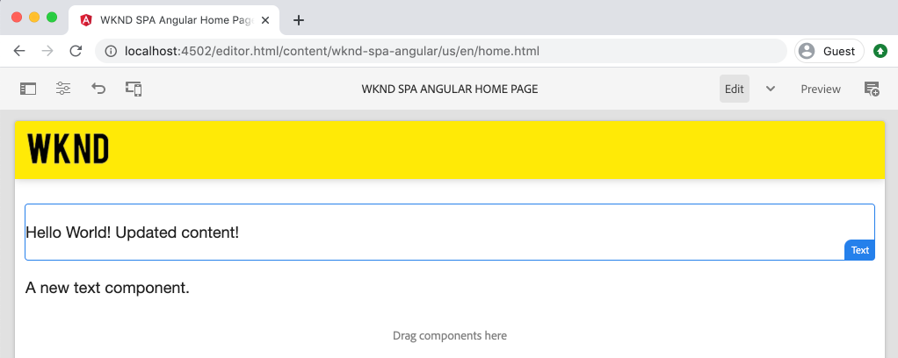
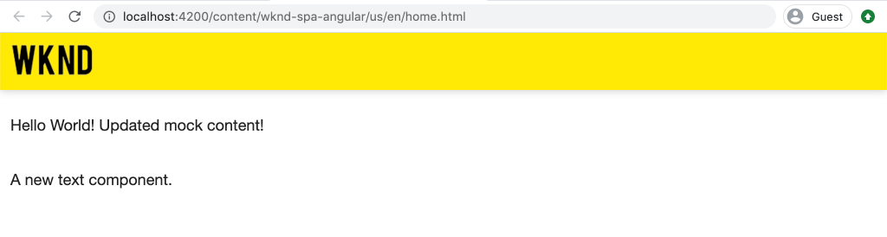

# Een SPA {#integrate-spa} integreren

Begrijp hoe de broncode voor een Toepassing van de Enige Pagina (SPA) die in Angular wordt geschreven met een Project van Adobe Experience Manager (AEM) kan worden geïntegreerd. Leer om moderne front-end hulpmiddelen, zoals een webpack dev server, te gebruiken om de SPA tegen AEM JSON model API snel te ontwikkelen.

## Doelstelling

1. Begrijp hoe het SPA project met AEM met cliënt-zijbibliotheken geïntegreerd is.
2. Leer hoe u een lokale ontwikkelingsserver gebruikt voor speciale front-end ontwikkeling.
3. Het gebruik van een **proxy** en een statisch **mock** bestand verkennen voor ontwikkeling met behulp van de AEM JSON-model-API

## Wat u gaat maken

In dit hoofdstuk wordt een eenvoudige `Header`-component aan de SPA toegevoegd. Tijdens het ontwikkelen van deze statische `Header`-component zullen verschillende benaderingen voor AEM SPA ontwikkeling worden gebruikt.



*De SPA wordt uitgebreid om een statische  `Header` component toe te voegen*

## Vereisten

Controleer de vereiste gereedschappen en instructies voor het instellen van een [lokale ontwikkelomgeving](overview.md#local-dev-environment).

### De code ophalen

1. Download het beginpunt voor deze zelfstudie via Git:

   ```shell
   $ git clone git@github.com:adobe/aem-guides-wknd-spa.git
   $ cd aem-guides-wknd-spa
   $ git checkout Angular/integrate-spa-start
   ```

2. Implementeer de basis van de code op een lokale AEM met Maven:

   ```shell
   $ mvn clean install -PautoInstallSinglePackage
   ```

   Als u [AEM 6.x](overview.md#compatibility) gebruikt, voegt u het profiel `classic` toe:

   ```shell
   $ mvn clean install -PautoInstallSinglePackage -Pclassic
   ```

U kunt de gebeëindigde code op [GitHub](https://github.com/adobe/aem-guides-wknd-spa/tree/Angular/integrate-spa-solution) altijd bekijken of de code plaatselijk controleren door aan de tak `Angular/integrate-spa-solution` te schakelen.

## Integratiebenadering {#integration-approach}

In het kader van het AEM-project werden twee modules gemaakt: `ui.apps` en `ui.frontend`.

De `ui.frontend` module is een [webpack](https://webpack.js.org/) project dat alle SPA broncode bevat. Het grootste deel van de SPA ontwikkeling en tests zal worden uitgevoerd in het webpack-project. Wanneer een productiebouwstijl wordt teweeggebracht, wordt het SPA gebouwd en gecompileerd gebruikend webpack. De gecompileerde artefacten (CSS en Javascript) worden gekopieerd in `ui.apps` module die dan aan AEM runtime wordt opgesteld.


*Een afbeelding op hoog niveau van de SPA integratie.*

Aanvullende informatie over de front-end build kan [hier worden gevonden](https://docs.adobe.com/content/help/en/experience-manager-core-components/using/developing/archetype/uifrontend-angular.html).

## Inspect de SPA integratie {#inspect-spa-integration}

Vervolgens inspecteert u de module `ui.frontend` om te begrijpen welke SPA automatisch is gegenereerd door het [AEM Project archetype](https://docs.adobe.com/content/help/en/experience-manager-core-components/using/developing/archetype/uifrontend-angular.html).

1. In winde van uw keus open omhoog het AEM Project voor de SPA WKND. Deze zelfstudie zal [Visual Studio Code IDE](https://docs.adobe.com/content/help/en/experience-manager-learn/cloud-service/local-development-environment-set-up/development-tools.html#microsoft-visual-studio-code) gebruiken.

   

2. Vouw de map `ui.frontend` uit en inspecteer deze. Het bestand `ui.frontend/package.json` openen

3. Onder `dependencies` moet u verschillende verwant aan `@angular` zien:

   ```json
   "@angular/animations": "~9.1.11",
   "@angular/common": "~9.1.11",
   "@angular/compiler": "~9.1.11",
   "@angular/core": "~9.1.11",
   "@angular/forms": "~9.1.10",
   "@angular/platform-browser": "~9.1.10",
   "@angular/platform-browser-dynamic": "~9.1.10",
   "@angular/router": "~9.1.10",
   ```

   De `ui.frontend` module is een [Angular toepassing](https://angular.io) die door [Angular CLI hulpmiddel ](https://angular.io/cli) wordt geproduceerd te gebruiken die het verpletteren omvat.

4. Er zijn ook drie gebiedsdelen vooraf bepaald met `@adobe`:

   ```json
   "@adobe/cq-angular-editable-components": "^2.0.2",
   "@adobe/cq-spa-component-mapping": "^1.0.3",
   "@adobe/cq-spa-page-model-manager": "^1.1.3",
   ```

   De bovenstaande modules vormen de [AEM redacteur JS SDK](https://docs.adobe.com/content/help/en/experience-manager-65/developing/headless/spas/spa-blueprint.html) en verstrekken de functionaliteit om het mogelijk te maken om SPA Componenten aan AEM Componenten in kaart te brengen.

5. In het `package.json`-bestand zijn verschillende `scripts` gedefinieerd:

   ```json
   "scripts": {
       "start": "ng serve --open --proxy-config ./proxy.conf.json",
       "build": "ng lint && ng build && clientlib",
       "build:production": "ng lint && ng build --prod && clientlib",
       "test": "ng test",
       "sync": "aemsync -d -w ../ui.apps/src/main/content"
   }
   ```

   Deze manuscripten zijn gebaseerd op gemeenschappelijke [Angular CLI bevelen](https://angular.io/cli/build) maar lichtjes gewijzigd om met het grotere AEM project te werken.

   `start` - voert de Angular-app lokaal uit met een lokale webserver. Deze is bijgewerkt om de inhoud van een lokale AEM-instantie te profileren.

   `build` - stelt de Angular-app voor productiedistributie samen. De toevoeging van `&& clientlib` is verantwoordelijk voor het kopiëren van de gecompileerde SPA in de `ui.apps` module als cliënt-zijbibliotheek tijdens een bouwstijl. De npm module [aem-clientlib-generator](https://github.com/wcm-io-frontend/aem-clientlib-generator) wordt gebruikt om dit te vergemakkelijken.

   Meer informatie over de beschikbare scripts vindt u [hier](https://docs.adobe.com/content/help/en/experience-manager-core-components/using/developing/archetype/uifrontend-angular.html).

6. Inspect het bestand `ui.frontend/clientlib.config.js`. Dit configuratiedossier wordt gebruikt door [aem-clientlib-generator](https://github.com/wcm-io-frontend/aem-clientlib-generator#clientlibconfigjs) om te bepalen hoe te om de cliëntbibliotheek te produceren.

7. Inspect het bestand `ui.frontend/pom.xml`. Dit bestand transformeert de map `ui.frontend` naar een [Gemaakt module](http://maven.apache.org/guides/mini/guide-multiple-modules.html). Het `pom.xml`-bestand is bijgewerkt en gebruikt de [frontend-maven-plugin](https://github.com/eirslett/frontend-maven-plugin) om **test** en **build** de SPA tijdens een Maven-build te gebruiken.

8. Inspect het bestand `app.component.ts` om `ui.frontend/src/app/app.component.ts`:

   ```js
   import { Constants } from '@adobe/cq-angular-editable-components';
   import { ModelManager } from '@adobe/cq-spa-page-model-manager';
   import { Component } from '@angular/core';
   
   @Component({
   selector: '#spa-root', // tslint:disable-line
   styleUrls: ['./app.component.css'],
   templateUrl: './app.component.html'
   })
   export class AppComponent {
       ...
   
       constructor() {
           ModelManager.initialize().then(this.updateData);
       }
   
       private updateData = pageModel => {
           this.path = pageModel[Constants.PATH_PROP];
           this.items = pageModel[Constants.ITEMS_PROP];
           this.itemsOrder = pageModel[Constants.ITEMS_ORDER_PROP];
       }
   }
   ```

   `app.component.js` is het ingangspunt van de SPA. `ModelManager` wordt geleverd door de AEM SPA Editor JS SDK. Het is verantwoordelijk voor het aanroepen en injecteren van `pageModel` (de JSON-inhoud) in de toepassing.

## Een koptekstcomponent {#header-component} toevoegen

Vervolgens voegt u een nieuwe component aan de SPA toe en implementeert u de wijzigingen in een lokale AEM-instantie om de integratie te zien.

1. Open een nieuw terminalvenster en navigeer naar de map `ui.frontend`:

   ```shell
   $ cd aem-guides-wknd-spa/ui.frontend
   ```

2. Installeer [Angular CLI](https://angular.io/cli#installing-angular-cli) globaal Dit wordt gebruikt om Angular componenten te produceren evenals om de toepassing van de Angular via **ng** bevel te bouwen en te dienen.

   ```shell
   $ npm install -g @angular/cli
   ```

   >[!CAUTION]
   >
   > De door dit project gebruikte versie van **@angular/cli** is **9.1.7**. Het wordt aanbevolen de Angular CLI-versies synchroon te houden.

3. Maak een nieuwe `Header`-component door de CLI-opdracht Angular uit te voeren vanuit de map `ui.frontend`.`ng generate component`

   ```shell
   $ ng generate component components/header
   
   CREATE src/app/components/header/header.component.css (0 bytes)
   CREATE src/app/components/header/header.component.html (21 bytes)
   CREATE src/app/components/header/header.component.spec.ts (628 bytes)
   CREATE src/app/components/header/header.component.ts (269 bytes)
   UPDATE src/app/app.module.ts (1809 bytes)
   ```

   Dit zal tot een skelet voor de nieuwe component van de Kopbal van de Angular bij `ui.frontend/src/app/components/header` leiden.

4. Open het `aem-guides-wknd-spa` project in winde van uw keus. Navigeer naar de map `ui.frontend/src/app/components/header`.

   

5. Open het bestand `header.component.html` en vervang de inhoud door het volgende:

   ```html
   <!--/* header.component.html */-->
   <header className="header">
       <div className="header-container">
           <h1>WKND</h1>
       </div>
   </header>
   ```

   Merk op dit vertoningen statische inhoud, zodat vereist deze component van Angular geen aanpassingen aan het gebrek dat `header.component.ts` wordt geproduceerd.

6. Open het bestand **app.component.html** op `ui.frontend/src/app/app.component.html`. Voeg `app-header` toe:

   ```html
   <app-header></app-header>
   <router-outlet></router-outlet>
   ```

   Dit omvat de `header` component boven alle pagina-inhoud.

7. Open een nieuwe terminal, navigeer in de `ui.frontend` omslag en stel `npm run build` bevel in werking:

   ```shell
   $ cd ui.frontend
   $ npm run build
   
   Linting "angular-app"...
   All files pass linting.
   Generating ES5 bundles for differential loading...
   ES5 bundle generation complete.
   ```

8. Navigeer naar de map `ui.apps`. Onder `ui.apps/src/main/content/jcr_root/apps/wknd-spa-angular/clientlibs/clientlib-angular` zou u moeten zien de gecompileerde SPA dossiers van `ui.frontend/build` omslag zijn gekopieerd.

   

9. Ga terug naar de terminal en navigeer in de `ui.apps` omslag. Voer het volgende Geweven bevel uit:

   ```shell
   $ cd ../ui.apps
   $ mvn clean install -PautoInstallPackage
   ...
   [INFO] ------------------------------------------------------------------------
   [INFO] BUILD SUCCESS
   [INFO] ------------------------------------------------------------------------
   [INFO] Total time:  9.629 s
   [INFO] Finished at: 2020-05-04T17:48:07-07:00
   [INFO] ------------------------------------------------------------------------
   ```

   Hiermee wordt het `ui.apps`-pakket geïmplementeerd op een lokale actieve instantie van AEM.

10. Open een browsertabblad en navigeer naar [http://localhost:4502/editor.html/content/wknd-spa-angular/us/en/home.html](http://localhost:4502/editor.html/content/wknd-spa-angular/us/en/home.html). U zou nu de inhoud van de `Header` component moeten zien die in de SPA wordt getoond.

   

   De stappen **7-9** worden automatisch uitgevoerd wanneer het teweegbrengen van een Gemaakt bouwstijl van de wortel van het project (d.w.z `mvn clean install -PautoInstallSinglePackage`). U zou nu de grondbeginselen van de integratie tussen de SPA en AEM cliënt-zijbibliotheken moeten begrijpen. U kunt `Text`-componenten nog wel bewerken en toevoegen in AEM, maar de component `Header` kan niet worden bewerkt.

## Webpack Dev Server - Proxy de JSON API {#proxy-json}

Zoals u in de vorige oefeningen ziet, duurt het maken van een build en het synchroniseren van de clientbibliotheek naar een lokale AEM enkele minuten. Dit is acceptabel voor de uiteindelijke test, maar niet ideaal voor het grootste deel van de SPA ontwikkeling.

Een [webpack-ontwikkelserver](https://webpack.js.org/configuration/dev-server/) kan worden gebruikt om de SPA snel te ontwikkelen. De SPA wordt aangedreven door een JSON-model dat door AEM wordt gegenereerd. In deze oefening zal de inhoud JSON van een lopende instantie van AEM **proxied** in de ontwikkelingsserver zijn die door het [project van de Angular](https://angular.io/guide/build) wordt gevormd.

1. Keer terug naar winde en open het dossier **proxy.conf.json** om `ui.frontend/proxy.conf.json`.

   ```json
   [
       {
           "context": [
                       "/content/**/*.(jpg|jpeg|png|model.json)",
                       "/etc.clientlibs/**/*"
                   ],
           "target": "http://localhost:4502",
           "auth": "admin:admin",
           "logLevel": "debug"
       }
   ]
   ```

   De [Angular-app](https://angular.io/guide/build#proxying-to-a-backend-server) biedt een eenvoudig mechanisme voor proxy-API-aanvragen. De patronen die in `context` worden gespecificeerd zijn proxied door `localhost:4502`, lokale AEM quickstart.

2. Open het bestand **index.html** op `ui.frontend/src/index.html`. Dit is het hoofdHTML- dossier dat door de dev server wordt gebruikt.

   Er is een vermelding voor `base href="/"`. De [basistag](https://angular.io/guide/deployment#the-base-tag) is essentieel voor de toepassing om relatieve URL&#39;s op te lossen.

   ```html
   <base href="/">
   ```

3. Open een terminalvenster en navigeer naar de map `ui.frontend`. Voer de opdracht `npm start` uit:

   ```shell
   $ cd ui.frontend
   $ npm start
   
   > wknd-spa-angular@0.1.0 start /Users/dgordon/Documents/code/aem-guides-wknd-spa/ui.frontend
   > ng serve --open --proxy-config ./proxy.conf.json
   
   10% building 3/3 modules 0 active[HPM] Proxy created: [ '/content/**/*.(jpg|jpeg|png|model.json)', '/etc.clientlibs/**/*' ]  ->  http://localhost:4502
   [HPM] Subscribed to http-proxy events:  [ 'error', 'close' ]
   ℹ ｢wds｣: Project is running at http://localhost:4200/webpack-dev-server/
   ℹ ｢wds｣: webpack output is served from /
   ℹ ｢wds｣: 404s will fallback to //index.html
   ```

4. Open een nieuw browsertabblad (indien nog niet geopend) en navigeer naar [http://localhost:4200/content/wknd-spa-angular/us/en/home.html](http://localhost:4200/content/wknd-spa-angular/us/en/home.html).

   

   U moet dezelfde inhoud zien als in AEM, maar zonder dat een van de ontwerpmogelijkheden is ingeschakeld.

5. Ga terug naar winde en creeer een nieuwe omslag genoemd `img` bij `ui.frontend/src/assets`.
6. Download en voeg het volgende WKND-logo toe aan de map `img`:

   

7. Open **header.component.html** op `ui.frontend/src/app/components/header/header.component.html` en neem het logo op:

   ```html
   <header class="header">
       <div class="header-container">
           <div class="logo">
               
           </div>
       </div>
   </header>
   ```

   Sla de wijzigingen op in **header.component.html**.

8. Ga terug naar de browser. De wijzigingen in de app worden meteen weerspiegeld.

   

   U kunt doorgaan met het uitvoeren van inhoudsupdates in **AEM** en deze weergeven in **webpack-ontwikkelserver**, aangezien we de inhoud proxying. De wijzigingen in de inhoud zijn alleen zichtbaar in de **webpack-ontwikkelserver**.

9. Stop de lokale Webserver met `ctrl+c` in de terminal.

## Webpack Dev Server - Mock JSON API {#mock-json}

Een andere manier om snel te ontwikkelen is het gebruik van een statisch JSON-bestand als JSON-model. Door de JSON te &#39;rokken&#39; verwijderen we de afhankelijkheid van een lokale AEM. Het staat ook een front-end ontwikkelaar toe om het model JSON bij te werken om functionaliteit te testen en veranderingen in JSON API te drijven die dan door een achterste-eindontwikkelaar zou worden uitgevoerd.

Voor de eerste configuratie van het model-JSON is **een lokale AEM-instantie** vereist.

1. Navigeer in de browser naar [http://localhost:4502/content/wknd-spa-angular/us/en.model.json](http://localhost:4502/content/wknd-spa-angular/us/en.model.json).

   Dit is de JSON die wordt geëxporteerd door AEM die de toepassing stuurt. Kopieer de JSON-uitvoer.

2. Ga terug naar winde navigeer aan `ui.frontend/src` en voeg nieuwe omslagen toe genoemd **mocks** en **json** om de volgende omslagstructuur aan te passen:

   ```plain
   |-- ui.frontend
       |-- src
           |-- mocks
               |-- json
   ```

3. Maak een nieuw bestand met de naam **en.model.json** onder `ui.frontend/public/mocks/json`. Plak de JSON-uitvoer van **Stap 1** hier.

   

4. Maak een nieuw bestand **proxy.mock.conf.json** onder `ui.frontend`. Vul het bestand met het volgende:

   ```json
   [
       {
       "context": [
           "/content/**/*.model.json"
       ],
       "pathRewrite": { "^/content/wknd-spa-angular/us" : "/mocks/json"} ,
       "target": "http://localhost:4200",
       "logLevel": "debug"
       }
   ]
   ```

   Deze volmachtsconfiguratie zal verzoeken herschrijven die met `/content/wknd-spa-angular/us` met `/mocks/json` beginnen en het overeenkomstige statische JSON dossier, bijvoorbeeld dienen:

   ```plain
   /content/wknd-spa-angular/us/en.model.json -> /mocks/json/en.model.json
   ```

5. Open het bestand **angular.json**. Voeg een nieuwe **dev**-configuratie met een bijgewerkte **assets**-array toe om te verwijzen naar de gemaakte **mocks**-map.

   ```json
    "dev": {
             "assets": [
               "src/mocks",
               "src/assets",
               "src/favicon.ico",
               "src/logo192.png",
               "src/logo512.png",
               "src/manifest.json"
             ]
       },
   ```

   

   Door een specifieke **dev**-configuratie te maken, zorgt u ervoor dat de map **mocks** alleen tijdens de ontwikkeling wordt gebruikt en nooit wordt geïmplementeerd om te AEM in een productiebuild.

6. In het **angular.json** dossier, werk dan **browserTarget** configuratie bij om de nieuwe **dev** configuratie te gebruiken:

   ```diff
     ...
     "serve": {
         "builder": "@angular-devkit/build-angular:dev-server",
         "options": {
   +       "browserTarget": "angular-app:build:dev"
   -       "browserTarget": "angular-app:build"
         },
     ...
   ```

   

7. Open het bestand `ui.frontend/package.json` en voeg een nieuwe opdracht **start:mock** toe om naar het bestand **proxy.mock.conf.json** te verwijzen.

   ```diff
       "scripts": {
           "start": "ng serve --open --proxy-config ./proxy.conf.json",
   +       "start:mock": "ng serve --open --proxy-config ./proxy.mock.conf.json",
           "build": "ng lint && ng build && clientlib",
           "build:production": "ng lint && ng build --prod && clientlib",
           "test": "ng test",
           "sync": "aemsync -d -w ../ui.apps/src/main/content"
       }
   ```

   Door een nieuwe opdracht toe te voegen, kunt u gemakkelijk schakelen tussen de proxyconfiguraties.

8. Als deze actief is, stopt u de **webpack dev-server**. Start de **webpack dev server** met het **start:mock**-script:

   ```shell
   $ npm run start:mock
   
   > wknd-spa-angular@0.1.0 start:mock /Users/dgordon/Documents/code/aem-guides-wknd-spa/ui.frontend
   > ng serve --open --proxy-config ./proxy.mock.conf.json
   ```

   Navigeer naar [http://localhost:4200/content/wknd-spa-angular/us/en/home.html](http://localhost:4200/content/wknd-spa-angular/us/en/home.html) en u zou de zelfde SPA moeten zien maar de inhoud wordt nu getrokken uit **mock** JSON dossier.

9. Breng een kleine wijziging aan in het **en.model.json**-bestand dat u eerder hebt gemaakt. De bijgewerkte inhoud moet direct worden weerspiegeld in de **webpack dev-server**.

   

   Door het JSON-model te kunnen manipuleren en de effecten op een live SPA te kunnen bekijken, kan een ontwikkelaar de JSON-model-API beter begrijpen. Het maakt ook zowel front-end als back-end ontwikkeling mogelijk.

## Stijlen met klasse toevoegen

Vervolgens wordt een bijgewerkte stijl toegevoegd aan het project. Dit project voegt [Sass](https://sass-lang.com/) steun voor een paar nuttige eigenschappen zoals variabelen toe.

1. Open een terminalvenster en stop de **webpack dev server** indien deze wordt gestart. Voer vanuit de map `ui.frontend` de volgende opdracht in om de Angular-app bij te werken naar het verwerken van **.scss**-bestanden.

   ```shell
   $ cd ui.frontend
   $ ng config schematics.@schematics/angular:component.styleext scss
   ```

   Hiermee wordt het `angular.json`-bestand bijgewerkt met een nieuwe vermelding onder aan het bestand:

   ```json
   "schematics": {
       "@schematics/angular:component": {
       "styleext": "scss"
       }
   }
   ```

2. Installeer `normalize-scss` om de stijlen in verschillende browsers te normaliseren:

   ```shell
   $ npm install normalize-scss --save
   ```

3. Terugkeer aan winde en onder `ui.frontend/src` creeer een nieuwe omslag genoemd `styles`.
4. Maak een nieuw bestand onder `ui.frontend/src/styles` met de naam `_variables.scss` en voeg de volgende variabelen toe aan het bestand:

   ```scss
   //_variables.scss
   
   //== Colors
   //
   //## Gray and brand colors for use across theme.
   
   $black:                  #202020;
   $gray:                   #696969;
   $gray-light:             #EBEBEB;
   $gray-lighter:           #F7F7F7;
   $white:                  #FFFFFF;
   $yellow:                 #FFEA00;
   $blue:                   #0045FF;
   
   
   //== Typography
   //
   //## Font, line-height, and color for body text, headings, and more.
   
   $font-family-sans-serif:  "Helvetica Neue", Helvetica, Arial, sans-serif;
   $font-family-serif:       Georgia, "Times New Roman", Times, serif;
   $font-family-base:        $font-family-sans-serif;
   $font-size-base:          18px;
   
   $line-height-base:        1.5;
   $line-height-computed:    floor(($font-size-base * $line-height-base));
   
   // Functional Colors
   $brand-primary:             $yellow;
   $body-bg:                   $white;
   $text-color:                $black;
   $text-color-inverse:        $gray-light;
   $link-color:                $blue;
   
   //Layout
   $max-width: 1024px;
   $header-height: 75px;
   
   // Spacing
   $gutter-padding: 12px;
   ```

5. Wijzig de naam van de extensie van het bestand **styles.css** op `ui.frontend/src/styles.css` in **styles.scss**. Vervang de inhoud door:

   ```scss
   /* styles.scss * /
   
   /* Normalize */
   @import '~normalize-scss/sass/normalize';
   
   @import './styles/variables';
   
   body {
       background-color: $body-bg;
       font-family: $font-family-base;
       margin: 0;
       padding: 0;
       font-size: $font-size-base;
       text-align: left;
       color: $text-color;
       line-height: $line-height-base;
   }
   
   body.page {
       max-width: $max-width;
       margin: 0 auto;
       padding: $gutter-padding;
       padding-top: $header-height;
   }
   ```

6. **angular.json** bijwerken en alle verwijzingen naar **style.css** met **styles.scss** een nieuwe naam geven. Er moeten drie verwijzingen zijn.

   ```diff
     "styles": [
   -    "src/styles.css"
   +    "src/styles.scss"
      ],
   ```

## Koptekststijlen bijwerken

Voeg vervolgens met Sass enkele merkspecifieke stijlen toe aan de component **Header**.

1. Start de **webpack dev-server** om de stijlen in real-time te zien bijwerken:

   ```shell
   $ npm run start:mock
   ```

2. Onder `ui.frontend/src/app/components/header` re-name **header.component.css** tot **header.component.scss**. Vul het bestand met het volgende:

   ```scss
   @import "~src/styles/variables";
   
   .header {
       width: 100%;
       position: fixed;
       top: 0;
       left:0;
       z-index: 99;
       background-color: $brand-primary;
       box-shadow: 0px 0px 10px 0px rgba(0, 0, 0, 0.24);
   }
   
   .header-container {
       display: flex;
       max-width: $max-width;
       margin: 0 auto;
       padding-left: $gutter-padding;
       padding-right: $gutter-padding;
   }
   
   .logo {
       z-index: 100;
       display: flex;
       padding-top: $gutter-padding;
       padding-bottom: $gutter-padding;
   }
   
   .logo-img {
       width: 100px;
   }
   ```

3. **header.component.js** bijwerken naar verwijzing **header.component.scss**:

   ```diff
   ...
     @Component({
       selector: 'app-header',
       templateUrl: './header.component.html',
   -   styleUrls: ['./header.component.css']
   +   styleUrls: ['./header.component.scss']
     })
   ...
   ```

4. Ga terug naar de browser en de **webpack dev server**:

   

   De bijgewerkte stijlen worden nu toegevoegd aan de component **Header**.

## SPA updates voor AEM implementeren

De wijzigingen die in de **Header** zijn aangebracht, zijn momenteel alleen zichtbaar via de **webpack dev-server**. Implementeer de bijgewerkte SPA om de wijzigingen te AEM.

1. Stop **webpack dev server**.
2. Navigeer aan de wortel van het project `/aem-guides-wknd-spa` en stel het project in om AEM te gebruiken Maven:

   ```shell
   $ cd ..
   $ mvn clean install -PautoInstallSinglePackage
   ```

3. Navigeer naar [http://localhost:4502/editor.html/content/wknd-spa-angular/us/en/home.html](http://localhost:4502/editor.html/content/wknd-spa-angular/us/en/home.html). De bijgewerkte **Koptekst** met het toegepaste logo en de toegepaste stijlen worden weergegeven:

   

   Nu de bijgewerkte SPA in AEM is, kan het ontwerpen worden voortgezet.

## Gefeliciteerd! {#congratulations}

Gefeliciteerd, u hebt de SPA bijgewerkt en de integratie met AEM onderzocht! U kent nu twee verschillende benaderingen voor het ontwikkelen van de SPA tegen de AEM JSON-model-API met behulp van een **webpack-ontwikkelserver**.

U kunt de gebeëindigde code op [GitHub](https://github.com/adobe/aem-guides-wknd-spa/tree/Angular/integrate-spa-solution) altijd bekijken of de code plaatselijk controleren door aan de tak `Angular/integrate-spa-solution` te schakelen.

### Volgende stappen {#next-steps}

[Wijs SPA componenten aan AEM componenten](map-components.md)  toe - Leer hoe te om de componenten van de Angular aan (AEM) componenten van Adobe Experience Manager met de AEM Redacteur JS SDK in kaart te brengen SPA. Met componenttoewijzing kunnen auteurs dynamische updates uitvoeren naar SPA componenten in de AEM SPA Editor, net als bij traditionele AEM ontwerpen.
