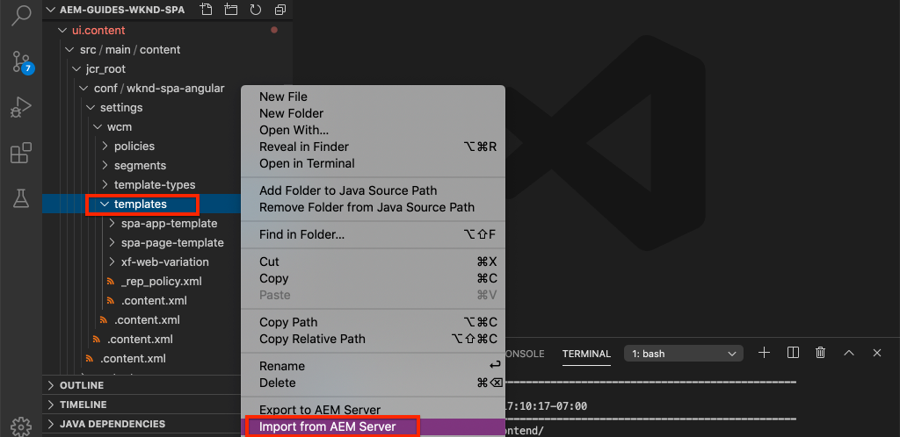

# De componenten van het KUUROORD van de kaart aan AEM componenten {#map-components}

Leer hoe te om Hoekcomponenten aan de componenten van Adobe Experience Manager (AEM) met de Redacteur van het KUUROORD JS SDK van het AEM in kaart te brengen. De afbeelding van de component laat gebruikers toe om dynamische updates aan de componenten van het KUUROORD binnen de AEM Redacteur van het KUUROORD, gelijkend op traditioneel AEM te maken.

In dit hoofdstuk wordt dieper ingegaan op de AEM JSON-model-API en wordt uitgelegd hoe de JSON-inhoud die door een AEM wordt blootgesteld, automatisch als props in een hoekcomponent kan worden geïnjecteerd.

## Doelstelling

1. Leer hoe te om AEM componenten aan de Componenten van het KUUROORD in kaart te brengen.
2. Begrijp het verschil tussen de componenten van de **Container** en de componenten van de **Inhoud** .
3. Maak een nieuwe hoekcomponent die is toegewezen aan een bestaande AEM.

## Wat u gaat maken

Dit hoofdstuk zal inspecteren hoe de verstrekte component van het `Text` KUUROORD aan de AEM `Text`component in kaart wordt gebracht. Een nieuwe component van het `Image` KUUROORD zal worden gecreeerd die in het KUUROORD kan worden gebruikt en in AEM wordt geschreven. Buiten de vakeigenschappen van het beleid van de Container **van de** Lay-out en van de Redacteur **van het** Malplaatje zullen ook worden gebruikt om een mening tot stand te brengen die een weinig gevarieerder in verschijning is.


## Vereisten

Controleer de vereiste gereedschappen en instructies voor het instellen van een [lokale ontwikkelomgeving](overview.md#local-dev-environment).

### De code ophalen

1. Download het beginpunt voor deze zelfstudie via Git:

   ```shell
   $ git clone git@github.com:adobe/aem-guides-wknd-spa.git
   $ cd aem-guides-wknd-spa
   $ git checkout Angular/map-components-start
   ```

2. Implementeer de basis van de code op een lokale AEM met Maven:

   ```shell
   $ mvn clean install -PautoInstallSinglePackage
   ```

   Als u [AEM 6.x](overview.md#compatibility) gebruikt, voegt u het `classic` profiel toe:

   ```shell
   $ mvn clean install -PautoInstallSinglePackage -Pclassic
   ```

U kunt de gebeëindigde code op [GitHub](https://github.com/adobe/aem-guides-wknd-spa/tree/Angular/map-components-solution) altijd bekijken of de code plaatselijk controleren door aan de tak te schakelen `Angular/map-components-solution`.

## Toewijzingsmethode

Het basisconcept moet een Component van het KUUROORD aan een AEMComponent in kaart brengen. AEM componenten, voer server-kant in, voer inhoud als deel van JSON model API uit. De inhoud JSON wordt verbruikt door het KUUROORD, lopend cliënt-kant in browser. Een afbeelding 1:1 tussen de componenten van het KUUROORD en een AEM wordt gecreeerd.


*Overzicht op hoog niveau van het toewijzen van een AEM component aan een hoekcomponent*

## De tekstcomponent Inspect

Het [AEM Projectarchetype](https://github.com/adobe/aem-project-archetype) verstrekt een `Text` component die aan de AEM component [van de](https://docs.adobe.com/content/help/en/experience-manager-core-components/using/components/text.html)Tekst in kaart wordt gebracht. Dit is een voorbeeld van een **inhoudcomponent** , in die zin dat *inhoud* wordt gerenderd uit AEM.

Laten we eens kijken hoe de component werkt.

### Inspect het JSON-model

1. Alvorens in de code van het KUUROORD te springen, is het belangrijk om het model te begrijpen JSON dat AEM verstrekt. Navigeer naar de [Core Component Library](https://www.aemcomponents.dev/content/core-components-examples/library/page-authoring/text.html) en bekijk de pagina voor de Text-component. De Core Component Library bevat voorbeelden van alle AEM Core Components.
2. Selecteer het tabblad **JSON** voor een van de voorbeelden:

   

   Er moeten drie eigenschappen worden weergegeven: `text`, `richText`en `:type`.

   `:type` is een gereserveerde eigenschap die de `sling:resourceType` (of het pad) van de AEM Component opsomt. De waarde van `:type` is wat wordt gebruikt om de AEM component aan de component van het KUUROORD in kaart te brengen.

   `text` en `richText` zijn extra eigenschappen die aan de component van het KUUROORD zullen worden blootgesteld.

### De component Text Inspect

1. Open een nieuwe terminal en navigeer naar de `ui.frontend` map in het project. Voer `npm install` en start vervolgens `npm start` de **webpack-ontwikkelserver**:

   ```shell
   $ cd ui.frontend
   $ npm run start:mock
   ```

   De `ui.frontend` module is momenteel ingesteld op het gebruik van het [model](./integrate-spa.md#mock-json)JSON.

2. Er wordt een nieuw browservenster geopend naar [http://localhost:4200/content/wknd-spa-angular/us/en/home.html](http://localhost:4200/content/wknd-spa-angular/us/en/home.html)

   

3. In winde van uw keus open omhoog het AEM Project voor het KND SPA. Breid de `ui.frontend` module uit en open het dossier **text.component.ts** onder `ui.frontend/src/app/components/text/text.component.ts`:

   

4. Het eerste gebied dat moet worden geïnspecteerd, is de `class TextComponent` bij ~line 35:

   ```js
   export class TextComponent {
       @Input() richText: boolean;
       @Input() text: string;
       @Input() itemName: string;
   
       @HostBinding('innerHtml') get content() {
           return this.richText
           ? this.sanitizer.bypassSecurityTrustHtml(this.text)
           : this.text;
       }
       @HostBinding('attr.data-rte-editelement') editAttribute = true;
   
       constructor(private sanitizer: DomSanitizer) {}
   }
   ```

   [@Input()](https://angular.io/api/core/Input) -decorator wordt gebruikt om velden te declareren die de waarden via het toegewezen JSON-object hebben ingesteld, die eerder zijn gecontroleerd.

   `@HostBinding('innerHtml') get content()` is een methode die de geschreven tekstinhoud van de waarde van `this.text`. Als de inhoud tekst met opmaak is (bepaald door de `this.richText` markering), wordt de ingebouwde beveiliging van Angular omzeild. De [DomSanitizer](https://angular.io/api/platform-browser/DomSanitizer) van Angular wordt gebruikt om de onbewerkte HTML &#39;scrubt&#39; en om kwetsbaarheden met scripts die verwijzen naar andere sites te voorkomen. De methode is gebonden aan het `innerHtml` bezit gebruikend [@HostBinding](https://angular.io/api/core/HostBinding) decorator.

5. Ga vervolgens over op ~ `TextEditConfig` line 24:

   ```js
   const TextEditConfig = {
       emptyLabel: 'Text',
       isEmpty: cqModel =>
           !cqModel || !cqModel.text || cqModel.text.trim().length < 1
   };
   ```

   De bovenstaande code bepaalt wanneer de tijdelijke aanduiding in de AEM auteursomgeving moet worden weergegeven. Als de `isEmpty` methode **true** retourneert, wordt de tijdelijke aanduiding weergegeven.

6. Neem ten slotte een blik op de `MapTo` vraag bij ~lijn 53:

   ```js
   MapTo('wknd-spa-angular/components/text')(TextComponent, TextEditConfig );
   ```

   **MapTo** wordt verstrekt door de AEM redacteur JS SDK van het KUUROORD (`@adobe/cq-angular-editable-components`). Het pad `wknd-spa-angular/components/text` vertegenwoordigt de `sling:resourceType` component AEM. Dit pad komt overeen met het pad dat door het JSON-model wordt `:type` getoond dat eerder is waargenomen. **MapTo** ontleedt de JSON modelreactie en gaat de correcte waarden tot de `@Input()` variabelen van de component van het KUUROORD over.

   U kunt de definitie van de AEM `Text` component vinden bij `ui.apps/src/main/content/jcr_root/apps/wknd-spa-angular/components/text`.

7. Experimenteer door het bestand **en.model.json** te wijzigen op `ui.frontend/src/mocks/json/en.model.json`.

   Bij ~line 62 werkt u de eerste `Text` waarde bij en gebruikt u een **`H1`** en **`u`** tag:

   ```json
       "text": {
           "text": "<h1><u>Hello World!</u></h1>",
           "richText": true,
           ":type": "wknd-spa-angular/components/text"
       }
   ```

   Ga terug naar de browser om de effecten te zien die worden aangeboden door de **webpack-dev-server**:

   

   Probeer de `richText` eigenschap tussen **true** / **false** te schakelen om de renderlogica in actie te zien.

8. Inspect **text.component.html** bij `ui.frontend/src/app/components/text/text.component.html`.

   Dit bestand is leeg omdat de volledige inhoud van de component door de `innerHTML` eigenschap wordt ingesteld.

9. Inspect de **app.module.ts** op `ui.frontend/src/app/app.module.ts`.

   ```js
   @NgModule({
   imports: [
       BrowserModule,
       SpaAngularEditableComponentsModule,
       AppRoutingModule
   ],
   providers: [ModelManagerService, { provide: APP_BASE_HREF, useValue: '/' }],
   declarations: [AppComponent, TextComponent, PageComponent, HeaderComponent],
   entryComponents: [TextComponent, PageComponent],
   bootstrap: [AppComponent]
   })
   export class AppModule {}
   ```

   De **TextComponent** is niet expliciet opgenomen, maar wel dynamisch via **AEMResponsiveGridComponent** die wordt geleverd door de AEM SPA Editor JS SDK. Daarom moet deze worden vermeld in de array **app.module.ts**&#39; [entryComponents](https://angular.io/guide/entry-components) .

## De afbeeldingscomponent maken

Maak vervolgens een `Image` hoekcomponent die is toegewezen aan de component [AEM](https://docs.adobe.com/content/help/en/experience-manager-core-components/using/components/image.html)afbeelding. De `Image` component is een ander voorbeeld van een **inhoudcomponent** .

### Inspect the JSON

Alvorens in de code van het KUUROORD te springen, inspecteer het model JSON dat door AEM wordt verstrekt.

1. Navigeer naar de voorbeelden van [afbeeldingen in de Core Component-bibliotheek](https://www.aemcomponents.dev/content/core-components-examples/library/page-authoring/image.html).

   

   De eigenschappen van `src`, `alt`, en `title` zullen worden gebruikt om de `Image` component van het KUUROORD te bevolken.

   >[!NOTE]
   >
   > Er zijn andere eigenschappen van het Beeld blootgesteld (`lazyEnabled`, `widths`) die een ontwikkelaar toestaan om een adaptieve en lazy ladende component tot stand te brengen. De component die in deze zelfstudie is ingebouwd, is eenvoudig en gebruikt **geen** van deze geavanceerde eigenschappen.

2. Ga terug naar uw IDE en open omhoog `en.model.json` bij `ui.frontend/src/mocks/json/en.model.json`. Aangezien dit een netto-nieuwe component voor ons project is, moeten we de Image JSON &quot;modelleren&quot;.

   Voeg bij ~line 70 een JSON-item voor het `image` model toe (vergeet niet de volgkomma `,` na de tweede `text_386303036`) en werk de `:itemsOrder` array bij.

   ```json
   ...
   ":items": {
               ...
               "text_386303036": {
                   "text": "<p>A new text component.</p>\r\n",
                   "richText": true,
                   ":type": "wknd-spa-angular/components/text"
                   },
               "image": {
                   "alt": "Rock Climber in New Zealand",
                   "title": "Rock Climber in New Zealand",
                   "src": "/mocks/images/adobestock-140634652.jpeg",
                   ":type": "wknd-spa-angular/components/image"
               }
           },
           ":itemsOrder": [
               "text",
               "text_386303036",
               "image"
           ],
   ```

   Het project bevat een voorbeeldafbeelding `/mock-content/adobestock-140634652.jpeg` die wordt gebruikt met de **webpack-ontwikkelserver**.

   U kunt de volledige [en.model.json hier](https://github.com/adobe/aem-guides-wknd-spa/blob/Angular/map-components-solution/ui.frontend/src/mocks/json/en.model.json)bekijken.

3. Voeg een stockfoto toe die door de component moet worden weergegeven.

   Maak een nieuwe map met de naam **Afbeeldingen** eronder `ui.frontend/src/mocks`. Download [adobestock-140634652.jpeg](assets/map-components/adobestock-140634652.jpeg) en plaats deze in de nieuwe map **images** . Voel u vrij om desgewenst uw eigen afbeelding te gebruiken.

### De component Image implementeren

1. Stop de **webpack-ontwikkelserver** als deze wordt gestart.
2. Creeer een nieuwe component van het Beeld door de HoekCLI `ng generate component` bevel van binnen `ui.frontend` omslag in werking te stellen:

   ```shell
   $ ng generate component components/image
   ```

3. In winde, open **image.component.ts** bij `ui.frontend/src/app/components/image/image.component.ts` en werk als volgt bij:

   ```js
   import {Component, Input, OnInit} from '@angular/core';
   import {MapTo} from '@adobe/cq-angular-editable-components';
   
   const ImageEditConfig = {
   emptyLabel: 'Image',
   isEmpty: cqModel =>
       !cqModel || !cqModel.src || cqModel.src.trim().length < 1
   };
   
   @Component({
   selector: 'app-image',
   templateUrl: './image.component.html',
   styleUrls: ['./image.component.scss']
   })
   export class ImageComponent implements OnInit {
   
   @Input() src: string;
   @Input() alt: string;
   @Input() title: string;
   
   constructor() { }
   
   get hasImage() {
       return this.src && this.src.trim().length > 0;
   }
   
   ngOnInit() { }
   }
   
   MapTo('wknd-spa-angular/components/image')(ImageComponent, ImageEditConfig);
   ```

   `ImageEditConfig` is de configuratie om te bepalen of om auteursplaceholder in AEM terug te geven, die op wordt gebaseerd als het `src` bezit bevolkt is.

   `@Input()` van `src`, `alt`en `title` zijn de eigenschappen toegewezen aan de JSON API.

   `hasImage()` is een methode die bepaalt of de afbeelding moet worden gerenderd.

   `MapTo` brengt de component van het KUUROORD aan de AEM component in kaart die bij `ui.apps/src/main/content/jcr_root/apps/wknd-spa-angular/components/image`. wordt gevestigd.

4. Open **image.component.html** en werk deze als volgt bij:

   ```html
   <ng-container *ngIf="hasImage">
       
   </ng-container>
   ```

   Dit zal het `` element teruggeven als `hasImage` waar **** terugkeert.

5. Open **image.component.scss** en werk deze als volgt bij:

   ```scss
   :host-context {
       display: block;
   }
   
   .image {
       margin: 1rem 0;
       width: 100%;
       border: 0;
   }
   ```

   >[!NOTE]
   >
   > De `:host-context` regel is **kritiek** voor AEM redacteursplaceholder SPA correct te functioneren. Alle componenten van het KUUROORD die bestemd zijn om in de AEM paginaredacteur worden ontworpen zullen deze regel bij een minimum vereisen.

6. Open `app.module.ts` en voeg de `ImageComponent` array toe aan de `entryComponents` array:

   ```js
   entryComponents: [TextComponent, PageComponent, ImageComponent],
   ```

   Net als bij de `TextComponent`, `ImageComponent` wordt de array dynamisch geladen en moet deze in de `entryComponents` array worden opgenomen.

7. Start de **webpack-ontwikkelserver** om de `ImageComponent` rendering te bekijken.

   ```shell
   $ npm run start:mock
   ```

   

   *Afbeelding toegevoegd aan de SPA*

   >[!NOTE]
   >
   > **Bonusuitdaging**: Voer een nieuwe methode uit om de waarde van als `title` een titel onder de afbeelding weer te geven.

## Beleid bijwerken in AEM

De `ImageComponent` component is alleen zichtbaar in de **webpack-ontwikkelserver**. Daarna, stel het bijgewerkte KUUROORD op om het malplaatjebeleid te AEM en bij te werken.

1. Stop de **webpack dev server** en van de **wortel** van het project, stel de veranderingen in AEM gebruikend uw Maven vaardigheden op:

   ```shell
   $ cd aem-guides-wknd-spa
   $ mvn clean install -PautoInstallSinglePackage
   ```

2. Navigeer in het scherm AEM Start naar **[!UICONTROL Tools]** > **[!UICONTROL Templates]** > **[WKND SPA Hoek](http://localhost:4502/libs/wcm/core/content/sites/templates.html/conf/wknd-spa-angular)**.

   Selecteer en bewerk de **SPA-pagina**:

   

3. Selecteer de container **van de** Lay-out en klik het is **beleidspictogram** om het beleid uit te geven:

   

4. Onder **Toegestane Componenten** > Hoek **WKND SPA - Inhoud** > controleer de component van het **Beeld** :

   

   Onder **Standaardcomponenten** > **Toewijzing** toevoegen en kies het **Beeld - de Hoek van het KND KUUROORD - de component van de Inhoud** :

   

   Voer een **mime-type** in van `image/*`.

   Klik op **Gereed** om de beleidsupdates op te slaan.

5. Klik in de container **** layout op het **beleidspictogram** voor de **component Text** :

   

   Maak een nieuw beleid met de naam **WKND SPA Text**. Schakel onder **Insteekmodules** > **Opmaak** > alle vakken in om extra opmaakopties in te schakelen:

   

   Schakel onder **Insteekmodules** > **Alineastijlen** > het selectievakje in om alineastijlen **** in te schakelen:

   

   Klik op **Gereed** om de beleidsupdate op te slaan.

6. Navigeer naar de **startpagina** [http://localhost:4502/editor.html/content/wknd-spa-angular/us/en/home.html](http://localhost:4502/editor.html/content/wknd-spa-angular/us/en/home.html).

   U moet ook de `Text` component kunnen bewerken en extra alineastijlen kunnen toevoegen in de modus **Volledig scherm** .

   

7. U moet ook een afbeelding kunnen slepen en neerzetten vanaf de **Finder** Asset:

   

8. Voeg uw eigen afbeeldingen toe via [AEM Assets](http://localhost:4502/assets.html/content/dam) of installeer de voltooide codebasis voor de standaard [WKND-referentiesite](https://github.com/adobe/aem-guides-wknd/releases/latest). De [WKND verwijzingsplaats](https://github.com/adobe/aem-guides-wknd/releases/latest) omvat vele beelden die op het KND KUUROORD kunnen worden opnieuw gebruikt. U kunt het pakket installeren met [AEM Package Manager](http://localhost:4502/crx/packmgr/index.jsp).

   

## Inspect the Layout Container

De steun voor de Container **van de** Lay-out wordt automatisch verleend door de AEM Redacteur SDK van het KUUROORD. De **container** van de Lay-out, zoals aangegeven door de naam, is een **containercomponent** . Containercomponenten zijn componenten die JSON-structuren accepteren die *andere* componenten vertegenwoordigen en ze dynamisch instantiëren.

Laten we de container voor lay-out verder inspecteren.

1. In winde open **responsive-grid.component.ts** bij `ui.frontend/src/app/components/responsive-grid`:

   ```js
   import { AEMResponsiveGridComponent,MapTo } from '@adobe/cq-angular-editable-components';
   
   MapTo('wcm/foundation/components/responsivegrid')(AEMResponsiveGridComponent);
   ```

   Het `AEMResponsiveGridComponent` wordt uitgevoerd als deel van de AEM redacteur SDK van het KUUROORD en is inbegrepen in het project via `import-components`.

2. Ga in een browser naar [http://localhost:4502/content/wknd-spa-angular/us/en.model.json](http://localhost:4502/content/wknd-spa-angular/us/en.model.json)

   

   De **component van de Container** van de Lay-out heeft een `sling:resourceType` van `wcm/foundation/components/responsivegrid` en door de Redacteur van het KUUROORD erkend gebruikend het `:type` bezit, enkel zoals `Text` en de `Image` componenten.

   De zelfde mogelijkheden om een component opnieuw te rangschikken gebruikend de Wijze [van de](https://docs.adobe.com/content/help/en/experience-manager-65/authoring/siteandpage/responsive-layout.html#defining-layouts-layout-mode) Lay-out zijn beschikbaar met de Redacteur van het KUUROORD.

3. Ga terug naar [http://localhost:4502/editor.html/content/wknd-spa-angular/us/en/home.html](http://localhost:4502/editor.html/content/wknd-spa-angular/us/en/home.html). Voeg aanvullende onderdelen voor de **afbeelding** toe en probeer de grootte ervan te wijzigen met de optie **Lay-out** :

   

4. Open het JSON-model opnieuw [http://localhost:4502/content/wknd-spa-angular/us/en.model.json](http://localhost:4502/content/wknd-spa-angular/us/en.model.json) en bekijk het `columnClassNames` als onderdeel van de JSON:

   

   De klassenaam `aem-GridColumn--default--4` geeft aan dat de component 4 kolommen breed moet zijn op basis van een raster van 12 kolommen. Meer informatie over het [responsieve raster vindt u hier](https://adobe-marketing-cloud.github.io/aem-responsivegrid/).

5. Keer aan winde terug en in de `ui.apps` module is er een cliënt-zijbibliotheek die bij wordt bepaald `ui.apps/src/main/content/jcr_root/apps/wknd-spa-angular/clientlibs/clientlib-grid`. Open the file `less/grid.less`.

   Dit bestand bepaalt de onderbrekingspunten (`default`, `tablet`en `phone`) die worden gebruikt door de container **van de** layout. Dit dossier is bedoeld om per projectspecificaties worden aangepast. Momenteel zijn de onderbrekingspunten ingesteld op `1200px` en `650px`.

6. U zou de ontvankelijke mogelijkheden en het bijgewerkte rijke tekstbeleid van de `Text` component aan auteur een mening als het volgende moeten kunnen gebruiken:

   

## Gefeliciteerd! {#congratulations}

Gefeliciteerd, leerde u hoe te om de componenten van het KUUROORD aan AEM Componenten in kaart te brengen en u uitvoerde een nieuwe `Image` component. U hebt ook de kans om de responsieve mogelijkheden van de **container** van de Lay-out te onderzoeken.

U kunt de gebeëindigde code op [GitHub](https://github.com/adobe/aem-guides-wknd-spa/tree/Angular/map-components-solution) altijd bekijken of de code plaatselijk controleren door aan de tak te schakelen `Angular/map-components-solution`.

### Volgende stappen {#next-steps}

[Navigatie en het Verpletteren](navigation-routing.md) - leer hoe de veelvoudige meningen in het KUUROORD door afbeelding aan AEM Pagina&#39;s met de Redacteur SDK van het KUUROORD kunnen worden gesteund. De dynamische navigatie wordt uitgevoerd gebruikend Hoekrouter en toegevoegd aan een bestaande component van de Kopbal.

## Bonus - configuraties aan broncontrole blijven {#bonus}

In veel gevallen, vooral aan het begin van een AEM project is het waardevol om configuraties, zoals malplaatjes en verwant inhoudsbeleid, aan broncontrole voort te zetten. Dit zorgt ervoor dat alle ontwikkelaars tegen de zelfde reeks inhoud en configuraties werken en extra consistentie tussen milieu&#39;s kunnen verzekeren. Wanneer een project een bepaald ontwikkelingsniveau heeft bereikt, kan het beheren van sjablonen worden overgedragen aan een speciale groep van energiegebruikers.

De volgende paar stappen zullen plaatsvinden gebruikend winde van de Code van Visual Studio en [VSCode AEM Synchronisatie](https://marketplace.visualstudio.com/items?itemName=yamato-ltd.vscode-aem-sync) maar zouden kunnen doen gebruikend om het even welk hulpmiddel en om het even welke winde die u hebt gevormd om inhoud van een lokaal geval van AEM te **trekken** of te **importeren** .

1. In winde van de Code van Visual Studio, zorg ervoor dat u **VSCode AEM Synchronisatie** via de uitbreiding van de Marketplace geïnstalleerd hebt:

   

2. Vouw de module **ui.content** in de projectverkenner uit en navigeer naar `/conf/wknd-spa-angular/settings/wcm/templates`.

3. **Klik met de rechtermuisknop** op de `templates` map en selecteer **Importeren van AEM server**:

   

4. Herhaal de stappen om inhoud te importeren, maar selecteer de map **policies** in `/conf/wknd-spa-angular/settings/wcm/templates/policies`.

5. Inspect het `filter.xml` bestand op `ui.content/src/main/content/META-INF/vault/filter.xml`.

   ```xml
   <!--ui.content filter.xml-->
   <?xml version="1.0" encoding="UTF-8"?>
    <workspaceFilter version="1.0">
        <filter root="/conf/wknd-spa-angular" mode="merge"/>
        <filter root="/content/wknd-spa-angular" mode="merge"/>
        <filter root="/content/dam/wknd-spa-angular" mode="merge"/>
        <filter root="/content/experience-fragments/wknd-spa-angular" mode="merge"/>
    </workspaceFilter>
   ```

   Het `filter.xml` bestand identificeert de paden van knooppunten die samen met het pakket worden geïnstalleerd. Let op het `mode="merge"` bij elk van de filters dat aangeeft dat bestaande inhoud niet wordt gewijzigd, alleen nieuwe inhoud wordt toegevoegd. Aangezien de inhoudsauteurs deze wegen kunnen bijwerken, is het belangrijk dat een codeplaatsing **geen** inhoud overschrijft. Raadpleeg de documentatie [bij](https://jackrabbit.apache.org/filevault/filter.html) FileVault voor meer informatie over het werken met filterelementen.

   Vergelijk `ui.content/src/main/content/META-INF/vault/filter.xml` en `ui.apps/src/main/content/META-INF/vault/filter.xml` om de verschillende knopen te begrijpen die door elke module worden beheerd.
