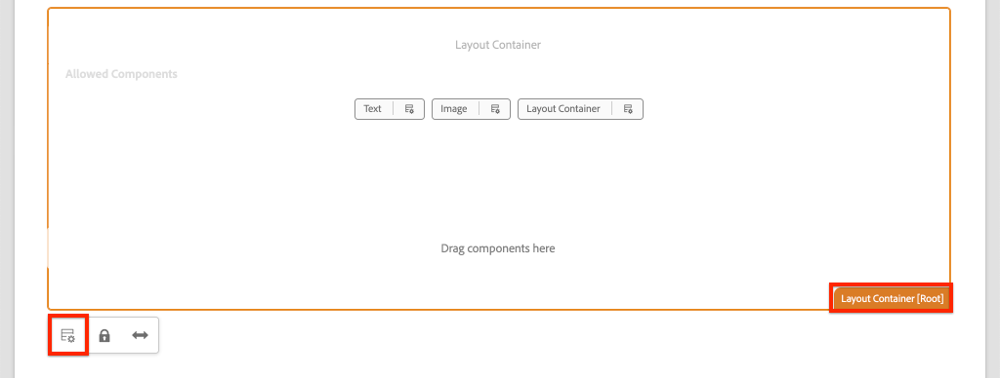
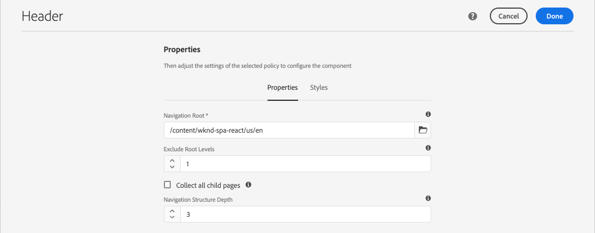
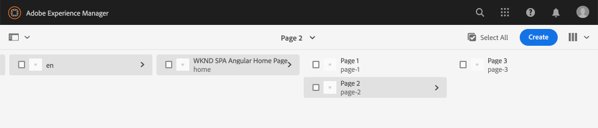

# Navigatie en routering toevoegen {#navigation-routing}

Leer hoe de veelvoudige meningen in het KUUROORD gebruikend AEM Pagina&#39;s en de Redacteur SDK van het KUUROORD worden gesteund. Dynamische navigatie wordt uitgevoerd gebruikend Hoekroutes en toegevoegd aan een bestaande component van de Kopbal.

## Doelstelling

1. Begrijp het model dat van het KUUROORD opties verplettert beschikbaar wanneer het gebruiken van de Redacteur van het KUUROORD.
2. Leer om [Hoekroutering](https://angular.io/guide/router) te gebruiken om tussen verschillende meningen van het KUUROORD te navigeren.
3. Voer een dynamische navigatie uit die door de AEM paginahiërarchie wordt aangedreven.

## Wat u gaat maken

In dit hoofdstuk wordt een navigatiemenu toegevoegd aan een bestaande `Header` component. Het navigatiemenu wordt aangedreven door de AEM paginahiërarchie en gebruikt het model JSON dat door de Component [van de Kern van de](https://docs.adobe.com/content/help/en/experience-manager-core-components/using/components/navigation.html)Navigatie wordt verstrekt.


## Vereisten

Controleer de vereiste gereedschappen en instructies voor het instellen van een [lokale ontwikkelomgeving](overview.md#local-dev-environment).

### De code ophalen

1. Download het beginpunt voor deze zelfstudie via Git:

   ```shell
   $ git clone git@github.com:adobe/aem-guides-wknd-spa.git
   $ cd aem-guides-wknd-spa
   $ git checkout Angular/navigation-routing-start
   ```

2. Implementeer de basis van de code op een lokale AEM met Maven:

   ```shell
   $ mvn clean install -PautoInstallSinglePackage
   ```

   Als u [AEM 6.x](overview.md#compatibility) gebruikt, voegt u het `classic` profiel toe:

   ```shell
   $ mvn clean install -PautoInstallSinglePackage -Pclassic
   ```

3. Installeer het voltooide pakket voor de traditionele [WKND verwijzingsplaats](https://github.com/adobe/aem-guides-wknd/releases/latest). De beelden die door de [WKND verwijzingsplaats](https://github.com/adobe/aem-guides-wknd/releases/latest) worden verstrekt zullen op het KND SPA worden hergebruikt. U kunt het pakket installeren met [AEM Package Manager](http://localhost:4502/crx/packmgr/index.jsp).

   

U kunt de gebeëindigde code op [GitHub](https://github.com/adobe/aem-guides-wknd-spa/tree/Angular/navigation-routing-solution) altijd bekijken of de code plaatselijk controleren door aan de tak te schakelen `Angular/navigation-routing-solution`.

## Inspect HeaderComponent-updates {#inspect-header}

In vorige hoofdstukken werd de `HeaderComponent` component toegevoegd als een zuivere hoekcomponent die via `app.component.html`de component werd opgenomen. In dit hoofdstuk wordt de `HeaderComponent` component verwijderd uit de app en toegevoegd via de [Sjablooneditor](https://docs.adobe.com/content/help/en/experience-manager-learn/sites/page-authoring/template-editor-feature-video-use.html). Dit staat gebruikers toe om het navigatiemenu van `HeaderComponent` binnen AEM te vormen.

>[!NOTE]
>
> Er zijn al verschillende CSS- en JavaScript-updates aangebracht in de codebasis om dit hoofdstuk te starten. Om zich op kernconcepten te concentreren, niet worden **alle** codeveranderingen besproken. U kunt de volledige wijzigingen [hier](https://github.com/adobe/aem-guides-wknd-spa/compare/Angular/map-components-solution...Angular/navigation-routing-start)bekijken.

1. In winde van uw keus open het de starterproject van het KUUROORD voor dit hoofdstuk.
2. Onder de `ui.frontend` module inspecteert u het bestand `header.component.ts` op: `ui.frontend/src/app/components/header/header.component.ts`.

   Er zijn verschillende updates uitgevoerd, waaronder de toevoeging van een `HeaderEditConfig` en een `MapTo` om de component aan een AEM component toe te wijzen `wknd-spa-angular/components/header`.

   ```js
   /* header.component.ts */
   ...
   const HeaderEditConfig = {
       ...
   };
   
   @Component({
   selector: 'app-header',
   templateUrl: './header.component.html',
   styleUrls: ['./header.component.scss']
   })
   export class HeaderComponent implements OnInit {
   @Input() items: object[];
       ...
   }
   ...
   MapTo('wknd-spa-angular/components/header')(withRouter(Header), HeaderEditConfig);
   ```

   Noteer de `@Input()` annotatie voor `items`. `items` bevat een array van navigatieobjecten die vanuit AEM worden doorgegeven.

3. Controleer in de `ui.apps` module de componentdefinitie van de AEM `Header` component: `ui.apps/src/main/content/jcr_root/apps/wknd-spa-angular/components/header/.content.xml`:

   ```xml
   <?xml version="1.0" encoding="UTF-8"?>
   <jcr:root xmlns:sling="http://sling.apache.org/jcr/sling/1.0" xmlns:cq="http://www.day.com/jcr/cq/1.0"
       xmlns:jcr="http://www.jcp.org/jcr/1.0"
       jcr:primaryType="cq:Component"
       jcr:title="Header"
       sling:resourceSuperType="wknd-spa-angular/components/navigation"
       componentGroup="WKND SPA Angular - Structure"/>
   ```

   De AEM `Header` component zal alle functionaliteit van de Component [van de](https://docs.adobe.com/content/help/en/experience-manager-core-components/using/components/navigation.html) Kern van de Navigatie via het `sling:resourceSuperType` bezit erven.

## Voeg de HeaderComponent aan het malplaatje van SPA toe {#add-header-template}

1. Open een browser en meld u aan bij AEM, [http://localhost:4502/](http://localhost:4502/). De begincodebasis zou reeds moeten worden opgesteld.
2. Navigeer naar de **[!UICONTROL SPA Page Template]**: [http://localhost:4502/editor.html/conf/wknd-spa-angular/settings/wcm/templates/spa-page-template/structure.html](http://localhost:4502/editor.html/conf/wknd-spa-angular/settings/wcm/templates/spa-page-template/structure.html).
3. Selecteer het buitenste gedeelte **[!UICONTROL Root Layout Container]** en klik op het bijbehorende **[!UICONTROL Policy]** pictogram. Zorg ervoor **dat u de** niet-vergrendelde optie niet **[!UICONTROL Layout Container]** selecteert voor ontwerpen.

   

4. Kopieer het huidige beleid en maak een nieuw beleid met de naam **[!UICONTROL SPA Structure]**:

   

   Selecteer de **[!UICONTROL Allowed Components]** component onder **[!UICONTROL General]** > **[!UICONTROL Layout Container]** .

   Selecteer onder **[!UICONTROL Allowed Components]** > **[!UICONTROL WKND SPA ANGULAR - STRUCTURE]** > de **[!UICONTROL Header]** component:

   

   Selecteer onder **[!UICONTROL Allowed Components]** > **[!UICONTROL WKND SPA ANGULAR - Content]** > de **[!UICONTROL Image]** componenten en de **[!UICONTROL Text]** componenten. Er moeten in totaal vier componenten zijn geselecteerd.

   Click **[!UICONTROL Done]** to save the changes.

5. **Vernieuw** de pagina. Voeg de **[!UICONTROL Header]** component toe boven de niet-vergrendelde **[!UICONTROL Layout Container]**:

   

6. Selecteer de **[!UICONTROL Header]** component en klik op het pictogram **Beleid** om het beleid te bewerken.

   

7. Creeer een nieuw beleid met een **[!UICONTROL Policy Title]** van de Kopbal van **&quot;KND SPA&quot;**.

   Onder de **[!UICONTROL Properties]**:

   * Stel de **[!UICONTROL Navigation Root]** optie in op `/content/wknd-spa-angular/us/en`.
   * Stel de **[!UICONTROL Exclude Root Levels]** waarde in op **1**.
   * Uitschakelen **[!UICONTROL Collect al child pages]**.
   * Stel de **[!UICONTROL Navigation Structure Depth]** waarde in op **3**.

   

   Hierdoor worden de navigatieniveaus 2 diep onder de curve verzameld `/content/wknd-spa-angular/us/en`.

8. Nadat u de wijzigingen hebt opgeslagen, ziet u de ingevulde sjabloon `Header` als onderdeel van de sjabloon:

   

## Onderliggende pagina&#39;s maken

Daarna, creeer extra pagina&#39;s in AEM die als verschillende meningen in het KUUROORD zullen dienen. We zullen ook de hiërarchische structuur van het JSON-model dat door AEM wordt aangeboden, controleren.

1. Navigeer naar de **Sites** -console: [http://localhost:4502/sites.html/content/wknd-spa-angular/us/en/home](http://localhost:4502/sites.html/content/wknd-spa-angular/us/en/home). Selecteer de **WKND SPA Hoekstartpagina** en klik **[!UICONTROL Create]** > **[!UICONTROL Page]**:

   

2. Under **[!UICONTROL Template]** select **[!UICONTROL SPA Page]**. Onder **[!UICONTROL Properties]** ga **&quot;Pagina 1&quot;** voor **[!UICONTROL Title]** en **&quot;pagina-1&quot;** als naam in.

   

   Klik **[!UICONTROL Create]** en in de dialoogdoos pop-up, klik **[!UICONTROL Open]** om de pagina in de Redacteur van het AEMKUUROORD te openen.

3. Voeg een nieuwe **[!UICONTROL Text]** component aan het hoofd toe **[!UICONTROL Layout Container]**. Bewerk de component en voer de tekst in: **&quot;Pagina 1&quot;** die RTE en het element **H1** gebruikt (u zult volledig-schermwijze moeten ingaan om de paragraafelementen te veranderen)

   

   Voel u vrij om extra inhoud toe te voegen, zoals een afbeelding.

4. Ga terug naar de AEM Sites-console en herhaal de bovenstaande stappen, waardoor een tweede pagina met de naam **&quot;Pagina 2&quot;** wordt gemaakt op hetzelfde niveau als **Pagina 1**. Voeg inhoud toe aan **pagina 2** , zodat deze gemakkelijk kan worden herkend.
5. Maak ten slotte een derde pagina, **&#39;Pagina 3&#39;** , maar als een **onderliggend** pagina van **Pagina 2**. Na voltooiing zou de plaatshiërarchie als het volgende moeten kijken:

   

6. Open op een nieuw tabblad de API van het JSON-model die wordt geleverd door AEM: [http://localhost:4502/content/wknd-spa-angular/us/en.model.json](http://localhost:4502/content/wknd-spa-angular/us/en.model.json). Deze inhoud JSON wordt gevraagd wanneer het KUUROORD eerst wordt geladen. De buitenste structuur ziet er als volgt uit:

   ```json
   {
   "language": "en",
   "title": "en",
   "templateName": "spa-app-template",
   "designPath": "/libs/settings/wcm/designs/default",
   "cssClassNames": "spa page basicpage",
   ":type": "wknd-spa-angular/components/spa",
   ":items": {},
   ":itemsOrder": [],
   ":hierarchyType": "page",
   ":path": "/content/wknd-spa-angular/us/en",
   ":children": {
       "/content/wknd-spa-angular/us/en/home": {},
       "/content/wknd-spa-angular/us/en/home/page-1": {},
       "/content/wknd-spa-angular/us/en/home/page-2": {},
       "/content/wknd-spa-angular/us/en/home/page-2/page-3": {}
       }
   }
   ```

   Onder `:children` moet u een item zien voor elk van de gemaakte pagina&#39;s. De inhoud voor alle pagina&#39;s staat in dit eerste JSON-verzoek. Zodra, navigatie die wordt uitgevoerd, zullen de verdere meningen van SPA snel worden geladen, aangezien de inhoud reeds beschikbare cliënt-kant is.

   Het is niet wijs om **ALLE** van de inhoud van een KUUROORD in het aanvankelijke JSON- verzoek te laden, aangezien dit de aanvankelijke paginading zou vertragen. Vervolgens kunt u bekijken hoe de hiërarchische diepte van pagina&#39;s wordt verzameld.

7. Navigeer aan het malplaatje van de **Wortel** van het KUUROORD bij: [http://localhost:4502/editor.html/conf/wknd-spa-angular/settings/wcm/templates/spa-app-template/structure.html](http://localhost:4502/editor.html/conf/wknd-spa-angular/settings/wcm/templates/spa-app-template/structure.html).

   Klik op **[!UICONTROL Page properties menu]** > **[!UICONTROL Page Policy]**:

   

8. Het malplaatje van de **Wortel** van het KUUROORD heeft een extra **[!UICONTROL Hierarchical Structure]** lusje om de inhoud te controleren JSON die wordt verzameld. De **[!UICONTROL Structure Depth]** code bepaalt hoe diep in de sitehiërarchie onderliggende pagina&#39;s onder de **hoofdmap** moeten worden verzameld. U kunt het **[!UICONTROL Structure Patterns]** veld ook gebruiken om extra pagina&#39;s te filteren op basis van een reguliere expressie.

   De **[!UICONTROL Structure Depth]** waarde bijwerken naar **&quot;2&quot;**:

   

   Klik **[!UICONTROL Done]** om de wijzigingen in het beleid op te slaan.

9. Open het JSON-model opnieuw [http://localhost:4502/content/wknd-spa-angular/us/en.model.json](http://localhost:4502/content/wknd-spa-angular/us/en.model.json).

   ```json
   {
   "language": "en",
   "title": "en",
   "templateName": "spa-app-template",
   "designPath": "/libs/settings/wcm/designs/default",
   "cssClassNames": "spa page basicpage",
   ":type": "wknd-spa-angular/components/spa",
   ":items": {},
   ":itemsOrder": [],
   ":hierarchyType": "page",
   ":path": "/content/wknd-spa-angular/us/en",
   ":children": {
       "/content/wknd-spa-angular/us/en/home": {},
       "/content/wknd-spa-angular/us/en/home/page-1": {},
       "/content/wknd-spa-angular/us/en/home/page-2": {}
       }
   }
   ```

   Het pad **Pagina 3** is verwijderd: `/content/wknd-spa-angular/us/en/home/page-2/page-3` uit het oorspronkelijke JSON-model.

   Later, zullen wij zien hoe de AEM Redacteur SDK van het KUUROORD extra inhoud dynamisch kan laden.

## Navigatie implementeren

Implementeer vervolgens het navigatiemenu met een nieuwe `NavigationComponent`. We kunnen de code rechtstreeks toevoegen, `header.component.html` maar het is beter om grote componenten te voorkomen. In plaats daarvan implementeert u een `NavigationComponent` bestand dat later opnieuw kan worden gebruikt.

1. Bekijk de JSON die door de AEM `Header` component beschikbaar is gesteld op [http://localhost:4502/content/wknd-spa-angular/us/en.model.json](http://localhost:4502/content/wknd-spa-angular/us/en.model.json):

   ```json
   ...
   "header": {
       "items": [
       {
       "level": 0,
       "active": true,
       "path": "/content/wknd-spa-angular/us/en/home",
       "description": null,
       "url": "/content/wknd-spa-angular/us/en/home.html",
       "lastModified": 1589062597083,
       "title": "WKND SPA Angular Home Page",
       "children": [
               {
               "children": [],
               "level": 1,
               "active": false,
               "path": "/content/wknd-spa-angular/us/en/home/page-1",
               "description": null,
               "url": "/content/wknd-spa-angular/us/en/home/page-1.html",
               "lastModified": 1589429385100,
               "title": "Page 1"
               },
               {
               "level": 1,
               "active": true,
               "path": "/content/wknd-spa-angular/us/en/home/page-2",
               "description": null,
               "url": "/content/wknd-spa-angular/us/en/home/page-2.html",
               "lastModified": 1589429603507,
               "title": "Page 2",
               "children": [
                   {
                   "children": [],
                   "level": 2,
                   "active": false,
                   "path": "/content/wknd-spa-angular/us/en/home/page-2/page-3",
                   "description": null,
                   "url": "/content/wknd-spa-angular/us/en/home/page-2/page-3.html",
                   "lastModified": 1589430413831,
                   "title": "Page 3"
                   }
               ],
               }
           ]
           }
       ],
   ":type": "wknd-spa-angular/components/header"
   ```

   De hiërarchische aard van de AEM pagina&#39;s wordt gemodelleerd in JSON die kan worden gebruikt om een navigatiemenu te bevolken. De `Header` component neemt alle functionaliteit van de [Navigation Core-component](https://www.aemcomponents.dev/content/core-components-examples/library/templating/navigation.html) over en de inhoud die via de JSON beschikbaar wordt gemaakt, wordt automatisch toegewezen aan de hoekaantekening `@Input` .

2. Open een nieuw eindvenster en navigeer aan de `ui.frontend` omslag van het project van het KUUROORD. Maak een nieuw bestand `NavigationComponent` met het gereedschap Hoeklcl:

   ```shell
   $ cd ui.frontend
   $ ng generate component components/navigation
   CREATE src/app/components/navigation/navigation.component.scss (0 bytes)
   CREATE src/app/components/navigation/navigation.component.html (25 bytes)
   CREATE src/app/components/navigation/navigation.component.spec.ts (656 bytes)
   CREATE src/app/components/navigation/navigation.component.ts (286 bytes)
   UPDATE src/app/app.module.ts (2032 bytes)
   ```

3. Maak vervolgens een klasse met de naam `NavigationLink` van de hoekige CLI in de nieuwe `components/navigation` map:

   ```shell
   $ cd src/app/components/navigation/
   $ ng generate class NavigationLink
   CREATE src/app/components/navigation/navigation-link.spec.ts (187 bytes)
   CREATE src/app/components/navigation/navigation-link.ts (32 bytes)
   ```

4. Keer terug naar winde van uw keus en open het dossier bij `navigation-link.ts` bij `/src/app/components/navigation/navigation-link.ts`.

   

5. Vul `navigation-link.ts` met het volgende:

   ```js
   export class NavigationLink {
   
       title: string;
       path: string;
       url: string;
       level: number;
       children: NavigationLink[];
       active: boolean;
   
       constructor(data) {
           this.path = data.path;
           this.title = data.title;
           this.url = data.url;
           this.level = data.level;
           this.active = data.active;
           this.children = data.children.map( item => {
               return new NavigationLink(item);
           });
       }
   }
   ```

   Dit is een eenvoudige klasse die een afzonderlijke navigatiekoppeling vertegenwoordigt. In de klasseconstructor verwachten we dat dit het JSON-object `data` is dat vanuit AEM wordt doorgegeven. Deze klasse wordt zowel binnen de klasse gebruikt als `NavigationComponent` `HeaderComponent` om de navigatiestructuur gemakkelijk te vullen.

   Er wordt geen gegevenstransformatie uitgevoerd. Deze klasse wordt vooral gemaakt om het JSON-model sterk te typen. U ziet dat `this.children` wordt getypt `NavigationLink[]` en dat de constructor recursief nieuwe `NavigationLink` objecten maakt voor elk item in de `children` array. Rappel dat JSON-model voor het `Header` is hiërarchisch.

6. Open the file `navigation-link.spec.ts`. Dit is het testbestand voor de `NavigationLink` klasse. Werk het bij met het volgende:

   ```js
   import { NavigationLink } from './navigation-link';
   
   describe('NavigationLink', () => {
       it('should create an instance', () => {
           const data = {
               children: [],
               level: 1,
               active: false,
               path: '/content/wknd-spa-angular/us/en/home/page-1',
               description: null,
               url: '/content/wknd-spa-angular/us/en/home/page-1.html',
               lastModified: 1589429385100,
               title: 'Page 1'
           };
           expect(new NavigationLink(data)).toBeTruthy();
       });
   });
   ```

   U ziet dat `const data` hetzelfde JSON-model wordt gevolgd dat eerder is geïnspecteerd voor één koppeling. Dit is verre van een robuuste eenheidstest, maar het zou moeten volstaan om de aannemer van `NavigationLink`.

7. Open the file `navigation.component.ts`. Werk het bij met het volgende:

   ```js
   import { Component, OnInit, Input } from '@angular/core';
   import { NavigationLink } from './navigation-link';
   
   @Component({
   selector: 'app-navigation',
   templateUrl: './navigation.component.html',
   styleUrls: ['./navigation.component.scss']
   })
   export class NavigationComponent implements OnInit {
   
       @Input() items: object[];
   
       constructor() { }
   
       get navigationLinks(): NavigationLink[] {
   
           if (this.items && this.items.length > 0) {
               return this.items.map(item => {
                   return new NavigationLink(item);
               });
           }
   
           return null;
       }
   
       ngOnInit() {}
   
   }
   ```

   `NavigationComponent` verwacht een `object[]` genoemde `items` die het model JSON van AEM is. Deze klasse maakt één methode beschikbaar `get navigationLinks()` die een array van `NavigationLink` objecten retourneert.

8. Open het bestand `navigation.component.html` en werk het bij met het volgende:

   ```html
   <ul *ngIf="navigationLinks && navigationLinks.length > 0" class="navigation__group">
       <ng-container *ngTemplateOutlet="recursiveListTmpl; context:{ links: navigationLinks }"></ng-container>
   </ul>
   ```

   Dit produceert een eerste `<ul>` en roept de `get navigationLinks()` methode van `navigation.component.ts`. Een `<ng-container>` wordt gebruikt om een vraag aan een genoemd malplaatje te maken `recursiveListTmpl` en het over te gaan `navigationLinks` als genoemde variabele `links`.

   Voeg het `recursiveListTmpl` volgende toe:

   ```html
   <ng-template #recursiveListTmpl let-links="links">
       <li *ngFor="let link of links" class="{{'navigation__item navigation__item--' + link.level}}">
           <a [routerLink]="link.url" class="navigation__item-link" [title]="link.title" [attr.aria-current]="link.active">
               {{link.title}}
           </a>
           <ul *ngIf="link.children && link.children.length > 0">
               <ng-container *ngTemplateOutlet="recursiveListTmpl; context:{ links: link.children }"></ng-container>
           </ul>
       </li>
   </ng-template>
   ```

   Hier wordt de rest van de rendering voor de navigatiekoppeling geïmplementeerd. De variabele `link` is van het type `NavigationLink` en alle methoden/eigenschappen die door die klasse worden gemaakt, zijn beschikbaar. [`[routerLink]`](https://angular.io/api/router/RouterLink) wordt gebruikt in plaats van normaal `href` kenmerk. Hierdoor kunnen we koppelingen maken naar specifieke routes in de app, zonder dat de volledige pagina wordt vernieuwd.

   Het recursieve gedeelte van de navigatie wordt ook geïmplementeerd door een ander te maken `<ul>` als de huidige `link` array een niet-lege `children` array bevat.

9. Bijwerken `navigation.component.spec.ts` om ondersteuning toe te voegen voor `RouterTestingModule`:

   ```diff
    ...
   + import { RouterTestingModule } from '@angular/router/testing';
    ...
    beforeEach(async(() => {
       TestBed.configureTestingModule({
   +   imports: [ RouterTestingModule ],
       declarations: [ NavigationComponent ]
       })
       .compileComponents();
    }));
    ...
   ```

   Het `RouterTestingModule` is nodig om de component toe te voegen, omdat de component dit gebruikt `[routerLink]`.

10. Bijwerken `navigation.component.scss` om enkele basisstijlen toe te voegen aan de `NavigationComponent`:

   ```scss
   @import "~src/styles/variables";
   
   $link-color: $black;
   $link-hover-color: $white;
   $link-background: $black;
   
   :host-context {
       display: block;
       width: 100%;
   }
   
   .navigation__item {
       list-style: none;
   }
   
   .navigation__item-link {
       color: $link-color;
       font-size: $font-size-large;
       text-transform: uppercase;
       padding: $gutter-padding;
       display: flex;
       border-bottom: 1px solid $gray;
   
       &:hover {
           background: $link-background;
           color: $link-hover-color;
       }
   
   }
   ```

## De koptekstcomponent bijwerken

Nu het `NavigationComponent` is geïmplementeerd, `HeaderComponent` moet het worden bijgewerkt om ernaar te verwijzen.

1. Open een terminal en navigeer aan de `ui.frontend` omslag binnen het project van het KUUROORD. Start de **webpack-ontwikkelserver**:

   ```shell
   $ npm start
   ```

2. Open een browsertabblad en navigeer naar [http://localhost:4200/](http://localhost:4200/).

   De **webpack dev-server** moet zo worden geconfigureerd dat het JSON-model kan worden gepropageerd vanuit een lokale instantie van AEM (`ui.frontend/proxy.conf.json`). Op deze manier kunnen we rechtstreeks code toevoegen aan de inhoud die in AEM van eerder in de zelfstudie is gemaakt.

   

   Op `HeaderComponent` dit moment is de menuschakelfunctionaliteit al geïmplementeerd. Voeg vervolgens de navigatiecomponent toe.

3. Keer terug naar winde van uw keus, en open het dossier `header.component.ts` bij `ui.frontend/src/app/components/header/header.component.ts`.
4. Werk de `setHomePage()` methode bij om het hard-gecodeerde Koord te verwijderen en de dynamische die steunen te gebruiken binnen door de AEM worden overgegaan component:

   ```js
   /* header.component.ts */
   import { NavigationLink } from '../navigation/navigation-link';
   ...
    setHomePage() {
       if (this.hasNavigation) {
           const rootNavigationLink: NavigationLink = new NavigationLink(this.items[0]);
           this.isHome = rootNavigationLink.path === this.route.snapshot.data.path;
           this.homePageUrl = rootNavigationLink.url;
       }
   }
   ...
   ```

   Er `NavigationLink` wordt een nieuwe instantie gemaakt op basis van `items[0]`de basis van het JSON-navigatiemodel dat vanuit AEM wordt doorgegeven. `this.route.snapshot.data.path` keert de weg van de huidige Hoekroute terug. Deze waarde wordt gebruikt om te bepalen als de huidige route de **Homepage** is. `this.homePageUrl` wordt gebruikt om de ankerkoppeling in het **logo** te vullen.

5. Open `header.component.html` en vervang de statische plaatsaanduiding voor de navigatie door een verwijzing naar het zojuist gemaakte `NavigationComponent`:

   ```diff
       <div class="header-navigation">
           <div class="navigation">
   -            Navigation Placeholder
   +           <app-navigation [items]="items"></app-navigation>
           </div>
       </div>
   ```

   `[items]=items` geeft het kenmerk de navigatie door `@Input() items` van de `HeaderComponent` naar de `NavigationComponent` locatie waar de navigatie wordt opgebouwd.

6. Open `header.component.spec.ts` en voeg een verklaring voor `NavigationComponent`:

   ```diff
       /* header.component.spect.ts */
   +   import { NavigationComponent } from '../navigation/navigation.component';
   
       describe('HeaderComponent', () => {
       let component: HeaderComponent;
       let fixture: ComponentFixture<HeaderComponent>;
   
       beforeEach(async(() => {
           TestBed.configureTestingModule({
           imports: [ RouterTestingModule ],
   +       declarations: [ HeaderComponent, NavigationComponent ]
           })
           .compileComponents();
       }));
   ```

   Aangezien de `NavigationComponent` stof nu als onderdeel van de `HeaderComponent` proefbank wordt gebruikt, moet deze als onderdeel van de proefbank worden opgegeven.

7. Sla de wijzigingen in geopende bestanden op en ga terug naar de **webpack-ontwikkelserver**: [http://localhost:4200/](http://localhost:4200/)

   

   Open de navigatie door de menuknevel te klikken en u zou de bevolkte navigatiekoppelingen moeten zien. U zou aan verschillende meningen van SPA moeten kunnen navigeren.

## Begrijp het verpletteren van SPA

Nu de navigatie is uitgevoerd, inspecteer het verpletteren in AEM.

1. In winde open het dossier `app-routing.module.ts` bij `ui.frontend/src/app`.

   ```js
   /* app-routing.module.ts */
   import { AemPageDataResolver, AemPageRouteReuseStrategy } from '@adobe/cq-angular-editable-components';
   import { NgModule } from '@angular/core';
   import { RouteReuseStrategy, RouterModule, Routes, UrlMatchResult, UrlSegment } from '@angular/router';
   import { PageComponent } from './components/page/page.component';
   
   export function AemPageMatcher(url: UrlSegment[]): UrlMatchResult {
       if (url.length) {
           return {
               consumed: url,
               posParams: {
                   path: url[url.length - 1]
               }
           };
       }
   }
   
   const routes: Routes = [
       {
           matcher: AemPageMatcher,
           component: PageComponent,
           resolve: {
               path: AemPageDataResolver
           }
       }
   ];
   @NgModule({
       imports: [RouterModule.forRoot(routes)],
       exports: [RouterModule],
       providers: [
           AemPageDataResolver,
           {
           provide: RouteReuseStrategy,
           useClass: AemPageRouteReuseStrategy
           }
       ]
   })
   export class AppRoutingModule {}
   ```

   De `routes: Routes = [];` array definieert de routes of navigatiepaden naar hoekcomponenttoewijzingen.

   `AemPageMatcher` is een douane Hoekrouter [UrlMatcher](https://angular.io/api/router/UrlMatcher), die om het even wat aanpast dat &quot;als&quot;een pagina in AEM kijkt die deel van deze Hoektoepassing uitmaakt.

   `PageComponent` is de Hoekcomponent die een Pagina in AEM vertegenwoordigt, en de aangepaste routes zullen aanhalen. Deze `PageComponent` zal verder worden geïnspecteerd.

   `AemPageDataResolver`, die door de AEM Redacteur JS SDK van het KUUROORD wordt verstrekt, is een douane [Hoekvormige Omvergooiver](https://angular.io/api/router/Resolve) van de Router die wordt gebruikt om route URL om te zetten, die de weg in AEM met inbegrip van de uitbreiding .html, aan de middelweg in AEM is, die de paginadad minus de uitbreiding is.

   Bijvoorbeeld, `AemPageDataResolver` transformeert URL van een route van `content/wknd-spa-angular/us/en/home.html` in een weg van `/content/wknd-spa-angular/us/en/home`. Hiermee wordt de inhoud van de pagina opgelost op basis van het pad in de JSON-model-API.

   `AemPageRouteReuseStrategy`, die door de AEM Redacteur van het KUUROORD JS SDK wordt verstrekt, is een douane [RouteReuseStrategy](https://angular.io/api/router/RouteReuseStrategy) die hergebruik van `PageComponent` over routes verhindert. Anders wordt de inhoud van pagina &quot;A&quot; mogelijk weergegeven wanneer u naar pagina &quot;B&quot; navigeert.

2. Open het bestand `page.component.ts` om `ui.frontend/src/app/components/page/`.

   ```js
   ...
   export class PageComponent {
       items;
       itemsOrder;
       path;
   
       constructor(
           private route: ActivatedRoute,
           private modelManagerService: ModelManagerService
       ) {
           this.modelManagerService
           .getData({ path: this.route.snapshot.data.path })
           .then(data => {
               this.path = data[Constants.PATH_PROP];
               this.items = data[Constants.ITEMS_PROP];
               this.itemsOrder = data[Constants.ITEMS_ORDER_PROP];
           });
       }
   }
   ```

   Het `PageComponent` wordt vereist om JSON te verwerken die van AEM wordt teruggewonnen en als Hoekcomponent wordt gebruikt om de routes terug te geven.

   `ActivatedRoute`, die wordt geleverd door de module Hoekrouter, bevat de status die aangeeft welke JSON-inhoud van AEM pagina in deze componentinstantie Hoekpagina moet worden geladen.

   `ModelManagerService`, krijgt de JSON-gegevens op basis van de route en wijst de gegevens toe aan klassevariabelen `path`, `items`, `itemsOrder`. Deze worden vervolgens doorgegeven aan de [AEMPageComponent](https://www.npmjs.com/package/@adobe/cq-angular-editable-components#aempagecomponent.md)

3. Open het bestand `page.component.html` op `ui.frontend/src/app/components/page/`

   ```html
   <aem-page 
       class="structure-page" 
       [attr.data-cq-page-path]="path" 
       [cqPath]="path" 
       [cqItems]="items" 
       [cqItemsOrder]="itemsOrder">
   </aem-page>
   ```

   `aem-page` bevat de [AEMPageComponent](https://www.npmjs.com/package/@adobe/cq-angular-editable-components#aempagecomponent.md). De variabelen `path`, `items`, en `itemsOrder` worden overgegaan tot `AEMPageComponent`. Het `AemPageComponent`, dat via de redacteur van het KUUROORD wordt verstrekt JavaScript SDK zal dan over deze gegevens herhalen en dynamisch Angulaire componenten concretiseren die op de gegevens JSON worden gebaseerd zoals die in het leerprogramma [van de Componenten van de](./map-components.md)Kaart worden gezien.

   Het `PageComponent` is eigenlijk slechts een proxy voor het `AEMPageComponent` `AEMPageComponent` en het is de meerderheid van het zware heffen om het JSON-model correct toe te wijzen aan de hoekonderdelen.

## Inspect het SPA verpletteren in AEM

1. Open een terminal en stop de **webpack-ontwikkelserver** als deze wordt gestart. Navigeer aan de wortel van het project, en stel het project in om het gebruiken van uw Geweven vaardigheden te AEM:

   ```shell
   $ cd aem-guides-wknd-spa
   $ mvn clean install -PautoInstallSinglePackage
   ```

   >[!CAUTION]
   >
   > Voor het hoekproject zijn enkele zeer strikte regels voor koppelingen ingeschakeld. Als de Maven-build mislukt, controleert u de fout en zoekt u naar **Lint-fouten in de weergegeven bestanden.**. Los om het even welke die kwesties door linter worden gevonden en stel het Maven bevel opnieuw in werking.

2. Navigeer aan de homepage van het KUUROORD in AEM: [http://localhost:4502/content/wknd-spa-angular/us/en/home.html](http://localhost:4502/content/wknd-spa-angular/us/en/home.html) en open de ontwikkelaarsgereedschappen van uw browser. Onderstaande screenshots worden vastgelegd vanuit de Google Chrome-browser.

   Vernieuw de pagina en u zou een XHR- verzoek moeten zien aan `/content/wknd-spa-angular/us/en.model.json`, dat de Wortel van het KUUROORD is. Bericht dat slechts drie kindpagina&#39;s op de configuratie van de hiërarchiediepte aan het malplaatje van de Wortel van het KUUROORD worden gebaseerd vroeger in het leerprogramma worden gemaakt. Dit is exclusief **pagina 3**.

   

3. Blader met de gereedschappen voor ontwikkelaars geopend naar **pagina 3**:

   

   Merk op dat een nieuw XHR-verzoek wordt ingediend aan: `/content/wknd-spa-angular/us/en/home/page-2/page-3.model.json`

   

   De AEM Model Manager begrijpt dat de **pagina 3** JSON-inhoud niet beschikbaar is en activeert automatisch het extra XHR-verzoek.

4. Ga verder door de SPA met behulp van de verschillende navigatiekoppelingen. Merk op dat er geen extra XHR-verzoeken worden gedaan en dat er geen volledige pagina-vernieuwingen plaatsvinden. Dit maakt het KUUROORD snel voor de eindgebruiker en vermindert onnodige verzoeken terug naar AEM.

   

5. Experimenteer met diepe koppelingen door rechtstreeks naar: [http://localhost:4502/content/wknd-spa-angular/us/en/home/page-2.html](http://localhost:4502/content/wknd-spa-angular/us/en/home/page-2.html). Let erop dat de knop Terug van de browser blijft werken.

## Gefeliciteerd! {#congratulations}

Gefeliciteerd, leerde u hoe de veelvoudige meningen in het KUUROORD door afbeelding aan AEM Pagina&#39;s met de Redacteur SDK van het KUUROORD kunnen worden gesteund. De dynamische navigatie is uitgevoerd gebruikend Hoekroutering en toegevoegd aan de `Header` component.

U kunt de gebeëindigde code op [GitHub](https://github.com/adobe/aem-guides-wknd-spa/tree/Angular/navigation-routing-solution) altijd bekijken of de code plaatselijk controleren door aan de tak te schakelen `Angular/navigation-routing-solution`.

### Volgende stappen {#next-steps}

[Creeer een Component](custom-component.md) van de Douane - leer hoe te om een douanecomponent tot stand te brengen die met de Redacteur van het AEMKUUROORD moet worden gebruikt. Leer hoe u dialoogvensters met auteurs en Sling Models ontwikkelt om het JSON-model uit te breiden en een aangepaste component te vullen.
