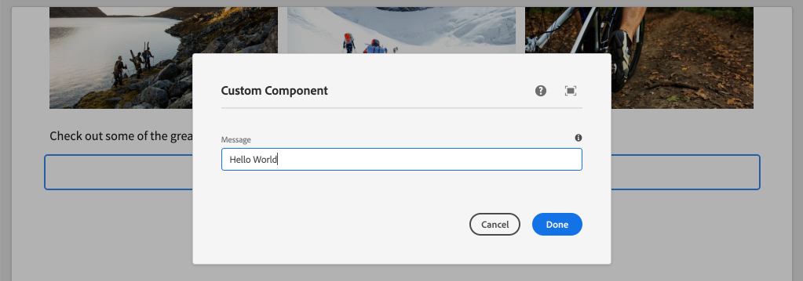

# Een aangepaste component maken {#custom-component}

Leer hoe u een aangepaste component maakt die wordt gebruikt met de AEM SPA Editor. Leer hoe u dialoogvensters met auteurs en Sling Models ontwikkelt om het JSON-model uit te breiden en een aangepaste component te vullen.

## Doelstelling

1. Begrijp de rol van Sling Models in het manipuleren van JSON model API die door AEM wordt verstrekt.
2. Begrijp hoe te om nieuwe AEM componentendialogen tot stand te brengen.
3. Leer om een **custom** AEM Component tot stand te brengen die met het SPA redacteurskader compatibel zal zijn.

## Wat u gaat maken

De focus van vorige hoofdstukken lag op het ontwikkelen van SPA componenten en het toewijzen ervan aan *bestaande* AEM Core Components. In dit hoofdstuk wordt aandacht besteed aan het maken en uitbreiden van *nieuwe* AEM componenten en het manipuleren van het JSON-model dat AEM aanbiedt.

Eenvoudig `Custom Component` illustreert de stappen nodig om een net-nieuwe AEM component tot stand te brengen.


## Vereisten

Controleer de vereiste gereedschappen en instructies voor het instellen van een [lokale ontwikkelomgeving](overview.md#local-dev-environment).

### De code ophalen

1. Download het beginpunt voor deze zelfstudie via Git:

   ```shell
   $ git clone git@github.com:adobe/aem-guides-wknd-spa.git
   $ cd aem-guides-wknd-spa
   $ git checkout React/custom-component-start
   ```

2. Implementeer de basis van de code op een lokale AEM met Maven:

   ```shell
   $ mvn clean install -PautoInstallSinglePackage
   ```

   Als u [AEM 6.x](overview.md#compatibility) gebruikt, voegt u het profiel `classic` toe:

   ```shell
   $ mvn clean install -PautoInstallSinglePackage -Pclassic
   ```

3. Installeer het voltooide pakket voor de traditionele [WKND-referentiesite](https://github.com/adobe/aem-guides-wknd/releases/latest). De afbeeldingen die worden geleverd door [WKND-referentiesite](https://github.com/adobe/aem-guides-wknd/releases/latest) worden opnieuw gebruikt op de WKND-SPA. Het pakket kan worden geïnstalleerd met [AEM Package Manager](http://localhost:4502/crx/packmgr/index.jsp).

   

U kunt de gebeëindigde code op [GitHub](https://github.com/adobe/aem-guides-wknd-spa/tree/React/custom-component-solution) altijd bekijken of de code plaatselijk controleren door aan de tak `React/custom-component-solution` te schakelen.

## De AEM component definiëren

Een AEM component wordt gedefinieerd als een knooppunt en eigenschappen. In het project worden deze knopen en eigenschappen vertegenwoordigd als dossiers van XML in `ui.apps` module. Maak vervolgens de AEM component in de module `ui.apps`.

>[!NOTE]
>
> Een snelle verfrisser op de [grondbeginselen van AEM componenten kan nuttig zijn](https://docs.adobe.com/content/help/en/experience-manager-learn/getting-started-wknd-tutorial-develop/component-basics.html).

1. Open de map `ui.apps` in IDE van uw keuze.
2. Navigeer naar `ui.apps/src/main/content/jcr_root/apps/wknd-spa-react/components` en maak een nieuwe map met de naam `custom-component`.
3. Maak een nieuw bestand met de naam `.content.xml` onder de map `custom-component`. Vul `custom-component/.content.xml` met het volgende:

   ```xml
   <?xml version="1.0" encoding="UTF-8"?>
   <jcr:root xmlns:sling="http://sling.apache.org/jcr/sling/1.0" xmlns:cq="http://www.day.com/jcr/cq/1.0" xmlns:jcr="http://www.jcp.org/jcr/1.0"
       jcr:primaryType="cq:Component"
       jcr:title="Custom Component"
       componentGroup="WKND SPA React - Content"/>
   ```

   

   `jcr:primaryType="cq:Component"` - identificeert dat dit knooppunt een AEM component zal zijn.

   `jcr:title` is de waarde die aan de Auteurs van de Inhoud zal worden getoond en het  `componentGroup` bepaalt de groepering van componenten in auteursUI.

4. Onder de `custom-component` omslag, creeer een andere omslag genoemd `_cq_dialog`.
5. Onder de map `_cq_dialog` maakt u een nieuw bestand met de naam `.content.xml` en vult u dit met het volgende:

   ```xml
   <?xml version="1.0" encoding="UTF-8"?>
   <jcr:root xmlns:sling="http://sling.apache.org/jcr/sling/1.0" xmlns:granite="http://www.adobe.com/jcr/granite/1.0" xmlns:cq="http://www.day.com/jcr/cq/1.0" xmlns:jcr="http://www.jcp.org/jcr/1.0" xmlns:nt="http://www.jcp.org/jcr/nt/1.0"
       jcr:primaryType="nt:unstructured"
       jcr:title="Custom Component"
       sling:resourceType="cq/gui/components/authoring/dialog">
       <content
           jcr:primaryType="nt:unstructured"
           sling:resourceType="granite/ui/components/coral/foundation/container">
           <items jcr:primaryType="nt:unstructured">
               <tabs
                   jcr:primaryType="nt:unstructured"
                   sling:resourceType="granite/ui/components/coral/foundation/tabs"
                   maximized="{Boolean}true">
                   <items jcr:primaryType="nt:unstructured">
                       <properties
                           jcr:primaryType="nt:unstructured"
                           jcr:title="Properties"
                           sling:resourceType="granite/ui/components/coral/foundation/container"
                           margin="{Boolean}true">
                           <items jcr:primaryType="nt:unstructured">
                               <columns
                                   jcr:primaryType="nt:unstructured"
                                   sling:resourceType="granite/ui/components/coral/foundation/fixedcolumns"
                                   margin="{Boolean}true">
                                   <items jcr:primaryType="nt:unstructured">
                                       <column
                                           jcr:primaryType="nt:unstructured"
                                           sling:resourceType="granite/ui/components/coral/foundation/container">
                                           <items jcr:primaryType="nt:unstructured">
                                               <message
                                                   jcr:primaryType="nt:unstructured"
                                                   sling:resourceType="granite/ui/components/coral/foundation/form/textfield"
                                                   fieldDescription="The text to display on the component."
                                                   fieldLabel="Message"
                                                   name="./message"/>
                                           </items>
                                       </column>
                                   </items>
                               </columns>
                           </items>
                       </properties>
                   </items>
               </tabs>
           </items>
       </content>
   </jcr:root>
   ```

   

   Het bovenstaande XML-bestand genereert een eenvoudige dialoog voor `Custom Component`. Het kritieke deel van het bestand is de binnenste `<message>`-node. Dit dialoogvenster bevat een eenvoudige `textfield` met de naam `Message` en behoudt de waarde van het textielveld voor een eigenschap met de naam `message`.

   Er wordt een verkoopmodel gemaakt naast de waarde van de eigenschap `message` via het JSON-model.

   >[!NOTE]
   >
   > U kunt veel meer [voorbeelden van dialogen bekijken door de definities van de Component van de Kern te bekijken](https://github.com/adobe/aem-core-wcm-components/tree/master/content/src/content/jcr_root/apps/core/wcm/components). U kunt ook extra formuliervelden weergeven, zoals `select`, `textarea`, `pathfield`, beschikbaar onder `/libs/granite/ui/components/coral/foundation/form` in [CRXDE-Lite](http://localhost:4502/crx/de/index.jsp#/libs/granite/ui/components/coral/foundation/form).

   Met een traditionele AEM component, wordt een [HTL](https://docs.adobe.com/content/help/en/experience-manager-htl/using/overview.html) manuscript typisch vereist. Aangezien de SPA de component zal teruggeven, is geen manuscript van HTML nodig.

## Het verkoopmodel maken

Sling-modellen zijn annotaties die worden aangedreven door Java &quot;POJO&#39;s&quot; (Plain Old Java Objects) en die het gemakkelijker maken gegevens van de JCR aan Java-variabelen toe te wijzen. [Sling ](https://docs.adobe.com/content/help/en/experience-manager-learn/getting-started-wknd-tutorial-develop/component-basics.html#sling-models) ModelType om complexe server-kant bedrijfslogica voor AEM Componenten in te kapselen.

In de context van de Redacteur van de SPA, stelt het Verdelen Modellen de inhoud van een component door het model JSON door een eigenschap bloot gebruikend [Sling ModelExporter](https://docs.adobe.com/content/help/en/experience-manager-learn/foundation/development/develop-sling-model-exporter.html).

1. Open de module `core` in IDE van uw keuze. `CustomComponent.java` en  `CustomComponentImpl.java` zijn al gemaakt en uitgesneden als onderdeel van de begincode van het hoofdstuk.

   >[!NOTE]
   >
   > Als het gebruiken van winde van de Code van Visual Studio, kan het nuttig zijn om [uitbreidingen voor Java](https://code.visualstudio.com/docs/java/extensions) te installeren.

2. Open de Java-interface `CustomComponent.java` op `core/src/main/java/com/adobe/aem/guides/wknd/spa/react/core/models/CustomComponent.java`:

   

   Dit is de Java-interface die wordt geïmplementeerd door het Sling-model.

3. Update `CustomComponent.java` zodat het `ComponentExporter` interface uitbreidt:

   ```java
   package com.adobe.aem.guides.wknd.spa.react.core.models;
   import com.adobe.cq.export.json.ComponentExporter;
   
   public interface CustomComponent extends ComponentExporter {
   
       public String getMessage();
   
   }
   ```

   Het implementeren van de `ComponentExporter`-interface is een vereiste dat het Sling-model automatisch wordt opgenomen door de JSON-model-API.

   De `CustomComponent` interface omvat één enkele vangmethode `getMessage()`. Dit is de methode die de waarde van de auteurdialoog door het model JSON zal blootstellen. Alleen methoden voor openbare getter met lege parameters `()` worden geëxporteerd in het JSON-model.

4. Open `CustomComponentImpl.java` om `core/src/main/java/com/adobe/aem/guides/wknd/spa/react/core/models/impl/CustomComponentImpl.java`.

   Dit is de implementatie van de `CustomComponent` interface. De annotatie `@Model` identificeert de klasse Java als een Sling Model. Met de annotatie `@Exporter` kan de Java-klasse via serienummering worden geserialiseerd en geëxporteerd via de Sling Model Exporter.

5. Werk de statische variabele `RESOURCE_TYPE` bij om aan de AEM component `wknd-spa-react/components/custom-component` te richten die in de vorige oefening wordt gecreeerd.

   ```java
   static final String RESOURCE_TYPE = "wknd-spa-react/components/custom-component";
   ```

   Het middeltype van de component is wat het Sling Model aan de AEM component zal binden en uiteindelijk aan de React component in kaart zal worden gebracht.

6. Voeg de `getExportedType()` methode aan `CustomComponentImpl` klasse toe om het type van componentenmiddel terug te keren:

   ```java
   @Override
   public String getExportedType() {
       return CustomComponentImpl.RESOURCE_TYPE;
   }
   ```

   Deze methode wordt vereist wanneer het uitvoeren van de `ComponentExporter` interface en zal het middeltype blootstellen dat de afbeelding aan de component van de Reactie toestaat.

7. Werk de methode `getMessage()` bij om de waarde van het `message` bezit te retourneren dat door de auteursdialoog wordt voortgeduurd. Gebruik de `@ValueMap`-annotatie om de JCR-waarde `message` toe te wijzen aan een Java-variabele:

   ```java
   import org.apache.commons.lang3.StringUtils;
   ...
   
   @ValueMapValue
   private String message;
   
   @Override
   public String getMessage() {
       return StringUtils.isNotBlank(message) ? message.toUpperCase() : null;
   }
   ```

   Er wordt een extra bedrijfslogica toegevoegd om de tekenreekswaarde van het bericht met alle hoofdletters te retourneren. Op deze manier kunnen we het verschil zien tussen de onbewerkte waarde die is opgeslagen in het dialoogvenster van de auteur en de waarde die wordt weergegeven in het verkoopmodel.

   >[!NOTE]
   >
   > U kunt [gebeëindigde CustomComponentImpl.java hier](https://github.com/adobe/aem-guides-wknd-spa/blob/React/custom-component-solution/core/src/main/java/com/adobe/aem/guides/wknd/spa/react/core/models/impl/CustomComponentImpl.java) bekijken.

## De component React bijwerken

De antwoordcode voor de aangepaste component is al gemaakt. Voer vervolgens een aantal updates uit om de component React toe te wijzen aan de AEM.

1. Open in de module `ui.frontend` het bestand `ui.frontend/src/components/Custom/Custom.js`.
2. Neem de `{this.props.message}` variabele als deel van de `render()` methode waar:

   ```js
   return (
           <div className="CustomComponent">
               <h2 className="CustomComponent__message">{this.props.message}</h2>
           </div>
       );
   ```

   Verwacht wordt dat de getransformeerde hoofdletterwaarde van het Sling Model aan deze `message` bezit zal worden in kaart gebracht.

3. Importeer het `MapTo`-object van de AEM SPA Editor JS SDK en gebruik dit om het toe te wijzen aan de AEM component:

   ```diff
   + import {MapTo} from '@adobe/aem-react-editable-components';
   
    ...
    export default class Custom extends Component {
        ...
    }
   
   + MapTo('wknd-spa-react/components/custom-component')(Custom, CustomEditConfig);
   ```

4. Stel alle updates aan een lokaal AEM milieu van de wortel van de projectfolder op, gebruikend uw Maven vaardigheden:

   ```shell
   $ cd aem-guides-wknd-spa
   $ mvn clean install -PautoInstallSinglePackage
   ```

## Sjabloonbeleid bijwerken

Navigeer vervolgens naar AEM om de updates te controleren en toe te staan dat `Custom Component` aan de SPA wordt toegevoegd.

1. Verifieer de registratie van het nieuwe Verschuivingsmodel door aan [http://localhost:4502/system/console/status-slingmodels](http://localhost:4502/system/console/status-slingmodels) te navigeren.

   ```plain
   com.adobe.aem.guides.wknd.spa.react.core.models.impl.CustomComponentImpl - wknd-spa-react/components/custom-component
   
   com.adobe.aem.guides.wknd.spa.react.core.models.impl.CustomComponentImpl exports 'wknd-spa-react/components/custom-component' with selector 'model' and extension '[Ljava.lang.String;@6fb4a693' with exporter 'jackson'
   ```

   De bovenstaande twee regels geven aan dat `CustomComponentImpl` is gekoppeld aan de `wknd-spa-react/components/custom-component`-component en dat deze is geregistreerd via de verkoopmodel-exportfunctie.

2. Navigeer naar de SPA paginasjabloon op [http://localhost:4502/editor.html/conf/wknd-spa-react/settings/wcm/templates/spa-page-template/structure.html](http://localhost:4502/editor.html/conf/wknd-spa-react/settings/wcm/templates/spa-page-template/structure.html).
3. Werk het beleid van de Container van de Lay-out bij om nieuwe `Custom Component` als toegestane component toe te voegen:

   

   Sla de wijzigingen in het beleid op en bekijk `Custom Component` als een toegestane component:

   

## Auteur van de aangepaste component

Daarna, auteur `Custom Component` gebruikend de Redacteur van de SPA van de AEM.

1. Navigeer naar [http://localhost:4502/editor.html/content/wknd-spa-react/us/en/home.html](http://localhost:4502/editor.html/content/wknd-spa-react/us/en/home.html).
2. In de modus `Edit` voegt u `Custom Component` toe aan `Layout Container`:

   

3. Open het dialoogvenster van de component en voer een bericht in dat kleine letters bevat.

   

   Dit is het dialoogvenster dat is gemaakt op basis van het XML-bestand dat eerder in het hoofdstuk is opgenomen.

4. Sla de wijzigingen op. Merk op dat het getoonde bericht in alle gekapitaliseerd is.

   

5. Bekijk het JSON-model door naar [http://localhost:4502/content/wknd-spa-react/us/en.model.json](http://localhost:4502/content/wknd-spa-react/us/en.model.json) te navigeren. Zoeken naar `wknd-spa-react/components/custom-component`:

   ```json
   "custom_component_208183317": {
       "message": "HELLO WORLD",
       ":type": "wknd-spa-react/components/custom-component"
   }
   ```

   De JSON-waarde wordt ingesteld op alle hoofdletters op basis van de logica die aan het Sling-model is toegevoegd.

## Gefeliciteerd! {#congratulations}

U hebt geleerd hoe u een aangepaste AEM kunt maken die u met de SPA Editor wilt gebruiken. U hebt ook geleerd hoe dialoogvensters, JCR-eigenschappen en Sling Models communiceren met de uitvoer van het JSON-model.

U kunt de gebeëindigde code op [GitHub](https://github.com/adobe/aem-guides-wknd-spa/tree/React/custom-component-solution) bekijken of de code plaatselijk controleren door aan de tak `React/custom-component-solution` te schakelen.

### Volgende stappen {#next-steps}

[Breid een Component](extend-component.md)  van de Kern uit - Leer hoe te om een bestaande Component van de Kern uit te breiden die met de Redacteur van de SPA van de AEM moet worden gebruikt. Het begrip hoe te om eigenschappen en inhoud aan een bestaande component toe te voegen is een krachtige techniek om de mogelijkheden van een implementatie van AEM SPARedacteur uit te breiden.
