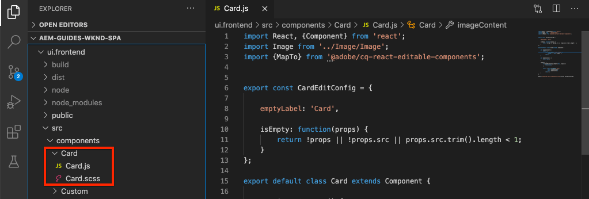
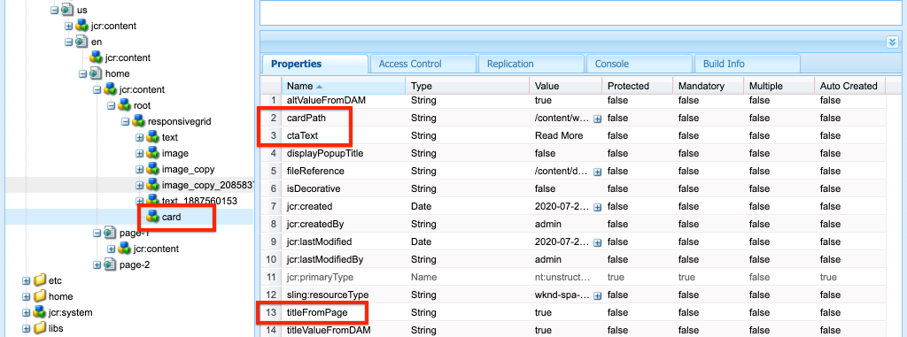

# Een kerncomponent uitbreiden {#extend-component}

Leer hoe te om een bestaande Component van de Kern uit te breiden die met de Redacteur van de SPA van de AEM moet worden gebruikt. Begrijpen hoe een bestaande component wordt uitgebreid is een krachtige techniek om de mogelijkheden van een AEM SPA de implementatie van de Redacteur aan te passen en uit te breiden.

## Doelstelling

1. Breid een bestaande Component van de Kern met extra eigenschappen en inhoud uit.
2. Begrijp de basis van de Overerving van de Component met het gebruik van `sling:resourceSuperType`.
3. Leer hoe u het [Delegatiepatroon](https://github.com/adobe/aem-core-wcm-components/wiki/Delegation-Pattern-for-Sling-Models) voor Sling Models gebruikt om bestaande logica en functionaliteit opnieuw te gebruiken.

## Wat u gaat maken

In dit hoofdstuk wordt een nieuwe `Card` component gemaakt. De `Card` component zal [Component van de Kern van het Beeld ](https://docs.adobe.com/content/help/en/experience-manager-core-components/using/components/image.html) uitbreiden toevoegend extra inhoudsgebieden zoals een Titel en een Vraag aan de knoop van de Actie om de rol van een meetapparaat voor andere inhoud binnen de SPA uit te voeren.


>[!NOTE]
>
> In een implementatie in de praktijk is het wellicht beter om de [Taser Component](https://docs.adobe.com/content/help/en/experience-manager-core-components/using/components/teaser.html) te gebruiken en vervolgens de [Image Core Component](https://docs.adobe.com/content/help/en/experience-manager-core-components/using/components/image.html) uit te breiden om een `Card` component te maken afhankelijk van de projectvereisten. Het wordt altijd aanbevolen [Core Components](https://docs.adobe.com/content/help/en/experience-manager-core-components/using/introduction.html) indien mogelijk rechtstreeks te gebruiken.

## Vereisten

Controleer de vereiste gereedschappen en instructies voor het instellen van een [lokale ontwikkelomgeving](overview.md#local-dev-environment).

### De code ophalen

1. Download het beginpunt voor deze zelfstudie via Git:

   ```shell
   $ git clone git@github.com:adobe/aem-guides-wknd-spa.git
   $ cd aem-guides-wknd-spa
   $ git checkout React/extend-component-start
   ```

2. Implementeer de basis van de code op een lokale AEM met Maven:

   ```shell
   $ mvn clean install -PautoInstallSinglePackage
   ```

   Als u [AEM 6.x](overview.md#compatibility) gebruikt, voegt u het profiel `classic` toe:

   ```shell
   $ mvn clean install -PautoInstallSinglePackage -Pclassic
   ```

3. Installeer het voltooide pakket voor de traditionele [WKND-referentiesite](https://github.com/adobe/aem-guides-wknd/releases/latest). De afbeeldingen die worden geleverd door [WKND-referentiesite](https://github.com/adobe/aem-guides-wknd/releases/latest) worden opnieuw gebruikt op de WKND-SPA. Het pakket kan worden geïnstalleerd met [AEM Package Manager](http://localhost:4502/crx/packmgr/index.jsp).

   

U kunt de gebeëindigde code op [GitHub](https://github.com/adobe/aem-guides-wknd-spa/tree/React/extend-component-solution) altijd bekijken of de code plaatselijk controleren door aan de tak `React/extend-component-solution` te schakelen.

## Inspect - initiële kaartimplementatie

De begincode van het hoofdstuk bevat een eerste kaartcomponent. Inspect het beginpunt voor de implementatie van de Kaart.

1. Open de module `ui.apps` in IDE van uw keuze.
2. Navigeer naar `ui.apps/src/main/content/jcr_root/apps/wknd-spa-react/components/card` en bekijk het `.content.xml` dossier.

   

   ```xml
   <?xml version="1.0" encoding="UTF-8"?>
   <jcr:root xmlns:sling="http://sling.apache.org/jcr/sling/1.0" xmlns:cq="http://www.day.com/jcr/cq/1.0" xmlns:jcr="http://www.jcp.org/jcr/1.0"
       jcr:primaryType="cq:Component"
       jcr:title="Card"
       sling:resourceSuperType="wknd-spa-react/components/image"
       componentGroup="WKND SPA React - Content"/>
   ```

   De eigenschap `sling:resourceSuperType` verwijst naar `wknd-spa-react/components/image` en geeft aan dat de component `Card` alle functionaliteit overneemt van de component WKND SPA Image.

3. Inspect het bestand `ui.apps/src/main/content/jcr_root/apps/wknd-spa-react/components/image/.content.xml`:

   ```xml
   <?xml version="1.0" encoding="UTF-8"?>
   <jcr:root xmlns:sling="http://sling.apache.org/jcr/sling/1.0" xmlns:cq="http://www.day.com/jcr/cq/1.0" xmlns:jcr="http://www.jcp.org/jcr/1.0"
       jcr:primaryType="cq:Component"
       jcr:title="Image"
       sling:resourceSuperType="core/wcm/components/image/v2/image"
       componentGroup="WKND SPA React - Content"/>
   ```

   De `sling:resourceSuperType` verwijst naar `core/wcm/components/image/v2/image`. Dit geeft aan dat de WKND SPA Image-component alle functionaliteit overerft van de Core Component Image.

   Ook genoemd geworden [Proxy patroon](https://docs.adobe.com/content/help/en/experience-manager-core-components/using/developing/guidelines.html#proxy-component-pattern) het Verschuiven middelovererving is een krachtig ontwerppatroon voor het toestaan van kindcomponenten om functionaliteit over te erven en gedrag uit te breiden/met voeten te treden wanneer gewenst. De het verdelen overerving steunt veelvoudige niveaus van overerving, zodat erft uiteindelijk de nieuwe `Card` component functionaliteit van het Beeld van de Component van de Kern.

   Veel ontwikkelingsteams streven ernaar om D.R.Y. te zijn. (Herhaal dit niet). Dit is mogelijk met AEM.

4. Open onder de map `card` het bestand `_cq_dialog/.content.xml`.

   Dit bestand is de definitie in het dialoogvenster Component voor de component `Card`. Als het gebruiken van het Verschuiven overerving, zijn mogelijk om eigenschappen van [het Verspreiden Samenvoegen van het Middel te gebruiken](https://docs.adobe.com/content/help/en/experience-manager-65/developing/platform/sling-resource-merger.html) om gedeelten van de dialoog met voeten te treden of uit te breiden. In dit voorbeeld is een nieuw tabblad toegevoegd aan het dialoogvenster om aanvullende gegevens van een auteur vast te leggen om de kaartcomponent te vullen.

   Met eigenschappen als `sling:orderBefore` kan een ontwikkelaar kiezen waar nieuwe tabbladen of formuliervelden moeten worden ingevoegd. In dit geval wordt het tabblad `Text` ingevoegd vóór het tabblad `asset`. Om volledig gebruik te maken van de Verschuivende Fusie van het Middel is het belangrijk om de originele structuur van de dialoogknoop voor [de componentendialoog van het Beeld te kennen](https://github.com/adobe/aem-core-wcm-components/blob/master/content/src/content/jcr_root/apps/core/wcm/components/image/v2/image/_cq_dialog/.content.xml).

5. Open onder de map `card` het bestand `_cq_editConfig.xml`. Dit bestand dicteert het gedrag van slepen en neerzetten in de AEM-ontwerpinterface. Wanneer het uitbreiden van de component van het Beeld is het belangrijk dat het middeltype de component zelf aanpast. Controleer de `<parameters>` knoop:

   ```xml
   <parameters
       jcr:primaryType="nt:unstructured"
       sling:resourceType="wknd-spa-react/components/card"
       imageCrop=""
       imageMap=""
       imageRotate=""/>
   ```

   De meeste componenten vereisen geen `cq:editConfig`, het Beeld en kindnakomelingen van de component van het Beeld zijn uitzonderingen.

6. In de schakelaar van winde aan de `ui.frontend` module, navigerend aan `ui.frontend/src/components/Card`:

   

7. Inspect het bestand `Card.js`.

   De component is al uitgestald om aan de AEM `Card` Component in kaart te brengen gebruikend de standaard `MapTo` functie.

   ```js
   MapTo('wknd-spa-react/components/card')(Card, CardEditConfig);
   ```

8. Inspect de methode `get imageContent()`:

   ```js
    get imageContent() {
       return (
           <div className="Card__image">
               <Image {...this.props} />
           </div>)
   }
   ```

   In dit voorbeeld hebben we ervoor gekozen de bestaande React Image-component `Image` opnieuw te gebruiken door de `this.props` vanuit de `Card`-component door te geven. Later in de zelfstudie wordt de methode `get bodyContent()` geïmplementeerd om een titel, datum en aanroep naar een actieknop weer te geven.

## Sjabloonbeleid bijwerken

Met deze eerste `Card`-implementatie evalueert u de functionaliteit in de AEM SPA Editor. Om de aanvankelijke `Card` component te zien is een update aan het beleid van het Malplaatje nodig.

1. Implementeer de startcode naar een lokale instantie van AEM, als u dat nog niet hebt gedaan:

   ```shell
   $ cd aem-guides-wknd-spa
   $ mvn clean install -PautoInstallSinglePackage
   ```

2. Navigeer naar de SPA paginasjabloon op [http://localhost:4502/editor.html/conf/wknd-spa-react/settings/wcm/templates/spa-page-template/structure.html](http://localhost:4502/editor.html/conf/wknd-spa-react/settings/wcm/templates/spa-page-template/structure.html).
3. Werk het beleid van de Container van de Lay-out bij om de nieuwe `Card` component als toegestane component toe te voegen:

   

   Sla de wijzigingen in het beleid op en bekijk de component `Card` als een toegestane component:

   

## Aanvankelijke kaartcomponent van auteur

Vervolgens ontwerpt u de `Card`-component met de AEM SPA Editor.

1. Navigeer naar [http://localhost:4502/editor.html/content/wknd-spa-react/us/en/home.html](http://localhost:4502/editor.html/content/wknd-spa-react/us/en/home.html).
2. Voeg in de modus `Edit` de component `Card` toe aan `Layout Container`:

   

3. Sleep een afbeelding van de Finder Asset naar de component `Card`:

   

4. Open het dialoogvenster `Card` en bekijk de toevoeging van een **Tekst** Tab.
5. Voer de volgende waarden in op het tabblad **Tekst**:

   

   **Kaartpad** : kies een pagina onder de SPA homepage.

   **CTA-tekst**  - &quot;Meer informatie&quot;

   **Kaarttitel**  - leeg laten

   **De titel wordt opgehaald van een gekoppelde pagina** . Schakel het selectievakje in om de waarde true aan te geven.

6. Werk het tabblad **Metagegevens van element** bij om waarden toe te voegen voor **Alternatieve tekst** en **Bijschrift**.

   Er worden momenteel geen aanvullende wijzigingen weergegeven na het bijwerken van het dialoogvenster. Om de nieuwe gebieden aan de Component van de Reactie bloot te stellen moeten wij het het Verdelen Model voor de `Card` component bijwerken.

7. Open een nieuw tabblad en navigeer naar [CRXDE-Lite](http://localhost:4502/crx/de/index.jsp#/content/wknd-spa-react/us/en/home/jcr%3Acontent/root/responsivegrid/card). Inspect de inhoudsknooppunten onder `/content/wknd-spa-react/us/en/home/jcr:content/root/responsivegrid` om de inhoud van de `Card`-component te zoeken.

   

   Merk op dat de eigenschappen `cardPath`, `ctaText`, `titleFromPage` door de dialoog worden voortgeduurd.

## Model voor kaartverkoop bijwerken

Om uiteindelijk de waarden van de componentendialoog aan de component van de Reactie bloot te stellen moeten wij het het Schipen Model bijwerken dat JSON voor de `Card` component bevolkt. Wij hebben ook de kans om twee stukken bedrijfslogica uit te voeren:

* Als `titleFromPage` naar **true** gaat, wordt de titel van de pagina die is opgegeven door `cardPath` geretourneerd, anders wordt de waarde van `cardTitle` textfield geretourneerd.
* Retourneer de laatste gewijzigde datum van de pagina die is opgegeven door `cardPath`.

Keer aan winde van uw keus terug en open `core` module.

1. Open het bestand `Card.java` om `core/src/main/java/com/adobe/aem/guides/wknd/spa/react/core/models/Card.java`.

   Merk op dat de `Card` interface momenteel `com.adobe.cq.wcm.core.components.models.Image` uitbreidt en daarom alle methodes van de `Image` interface erft. De `Image` interface breidt reeds `ComponentExporter` interface uit die het het Verdelen Model om als JSON toelaat worden uitgevoerd en door de SPA redacteur in kaart worden gebracht. Daarom te hoeven wij niet om `ComponentExporter` interface uitdrukkelijk uit te breiden zoals wij in [het hoofdstuk van de Component van de Douane ](custom-component.md) deden.

2. Voeg de volgende methodes aan de interface toe:

   ```java
   @ProviderType
   public interface Card extends Image {
   
       /***
       * The URL to populate the CTA button as part of the card.
       * The link should be based on the cardPath property that points to a page.
       * @return String URL
       */
       public String getCtaLinkURL();
   
       /***
       * The text to display on the CTA button of the card.
       * @return String CTA text
       */
       public String getCtaText();
   
   
   
       /***
       * The date to be displayed as part of the card.
       * This is based on the last modified date of the page specified by the cardPath
       * @return
       */
       public Calendar getCardLastModified();
   
   
       /**
       * Return the title of the page specified by cardPath if `titleFromPage` is set to true.
       * Otherwise return the value of `cardTitle`
       * @return
       */
       public String getCardTitle();
   }
   ```

   Deze methoden worden beschikbaar gemaakt via de JSON-model-API en doorgegeven aan de React-component.

3. Open `CardImpl.java`. Dit is de implementatie van `Card.java` interface. Deze implementatie is al gedeeltelijk stopgezet om de zelfstudie te versnellen.  Let op het gebruik van de `@Model`- en `@Exporter`-annotaties om ervoor te zorgen dat het Sling Model kan worden geserialiseerd als JSON via de Sling Model Exporter.

   `CardImpl.java` gebruikt ook het patroon van de  [Delegatie voor het Verdelen van ](https://github.com/adobe/aem-core-wcm-components/wiki/Delegation-Pattern-for-Sling-Models) Modellen om te vermijden herschrijvend alle logica van de kerncomponent van het Beeld.

4. Neem de volgende regels in acht:

   ```java
   @Self
   @Via(type = ResourceSuperType.class)
   private Image image;
   ```

   Met de bovenstaande annotatie wordt een afbeeldingsobject met de naam `image` geïnstantieerd op basis van de overerving `sling:resourceSuperType` van de component `Card`.

   ```java
   @Override
   public String getSrc() {
       return null != image ? image.getSrc() : null;
   }
   ```

   Het is dan mogelijk om het `image` voorwerp eenvoudig te gebruiken om methodes uit te voeren die door de `Image` interface worden bepaald, zonder het moeten zelf de logica schrijven. Deze techniek wordt gebruikt voor `getSrc()`, `getAlt()` en `getTitle()`.

5. Implementeer vervolgens de methode `initModel()` om een variabele `cardPage` van het type private te initiëren op basis van de waarde van `cardPath`

   ```java
   @PostConstruct
   public void initModel() {
       if(StringUtils.isNotBlank(cardPath) && pageManager != null) {
           cardPage = pageManager.getPage(this.cardPath);
       }
   }
   ```

   `@PostConstruct initModel()` zal altijd worden geroepen wanneer het het Verdelen Model wordt geïnitialiseerd, daarom is het een goede gelegenheid om voorwerpen te initialiseren die door andere methodes in het model kunnen worden gebruikt. De `pageManager` is een van een aantal [Door Java ondersteunde globale objecten](https://docs.adobe.com/content/help/en/experience-manager-htl/using/htl/global-objects.html#java-backed-objects) die via de annotatie `@ScriptVariable` ter beschikking worden gesteld aan Sling Models. De [getPage](https://docs.adobe.com/content/help/en/experience-manager-cloud-service/implementing/developing/ref/javadoc/com/day/cq/wcm/api/PageManager.html#getPage-java.lang.String-) methode neemt een weg en keert een AEM [Pagina](https://docs.adobe.com/content/help/en/experience-manager-cloud-service/implementing/developing/ref/javadoc/com/day/cq/wcm/api/Page.html) voorwerp of ongeldig terug als de weg niet aan een geldige pagina richt.

   Hierdoor wordt de variabele `cardPage` geïnitialiseerd, die door de andere nieuwe methoden wordt gebruikt om gegevens over de onderliggende gekoppelde pagina te retourneren.

6. Bekijk de algemene variabelen die al zijn toegewezen aan de JCR-eigenschappen die in het dialoogvenster met auteurs zijn opgeslagen. De annotatie `@ValueMapValue` wordt gebruikt om de toewijzing automatisch uit te voeren.

   ```java
   @ValueMapValue
   private String cardPath;
   
   @ValueMapValue
   private String ctaText;
   
   @ValueMapValue
   private boolean titleFromPage;
   
   @ValueMapValue
   private String cardTitle;
   ```

   Deze variabelen zullen worden gebruikt om de extra methodes voor de `Card.java` interface uit te voeren.

7. Voer de extra methodes uit die in de `Card.java` interface worden bepaald:

   ```java
   @Override
   public String getCtaLinkURL() {
       if(cardPage != null) {
           return cardPage.getPath() + ".html";
       }
       return null;
   }
   
   @Override
   public String getCtaText() {
       return ctaText;
   }
   
   @Override
   public Calendar getCardLastModified() {
      if(cardPage != null) {
          return cardPage.getLastModified();
      }
      return null;
   }
   
   @Override
   public String getCardTitle() {
       if(titleFromPage) {
           return cardPage != null ? cardPage.getTitle() : null;
       }
       return cardTitle;
   }
   ```

   >[!NOTE]
   >
   > U kunt [gebeëindigde CardImpl.java hier](https://github.com/adobe/aem-guides-wknd-spa/blob/React/extend-component-solution/core/src/main/java/com/adobe/aem/guides/wknd/spa/react/core/models/impl/CardImpl.java) bekijken.

8. Open een terminalvenster en implementeer alleen de updates voor de `core`-module met behulp van het profiel Maven `autoInstallBundle` uit de map `core`.

   ```shell
   $ cd core/
   $ mvn clean install -PautoInstallBundle
   ```

   Als u [AEM 6.x](overview.md#compatibility) gebruikt, voegt u het profiel `classic` toe.

9. Bekijk de JSON-modelreactie op: [http://localhost:4502/content/wknd-spa-react/us/en.model.json](http://localhost:4502/content/wknd-spa-react/us/en.model.json) en zoek naar `wknd-spa-react/components/card`:

   ```json
   "card": {
       "ctaText": "Read More",
       "cardTitle": "Page 1",
       "title": "Woman chillaxing with river views in Australian bushland",
       "src": "/content/wknd-spa-react/us/en/home/_jcr_content/root/responsivegrid/card.coreimg.jpeg/1595190732886/adobestock-216674449.jpeg",
       "alt": "Female sitting on a large rock relaxing in afternoon dappled light the Australian bushland with views over the river",
       "cardLastModified": 1591360492414,
       "ctaLinkURL": "/content/wknd-spa-react/us/en/home/page-1.html",
       ":type": "wknd-spa-react/components/card"
   }
   ```

   U ziet dat het JSON-model wordt bijgewerkt met extra sleutel-/waardeparen nadat de methoden in het `CardImpl` Sling-model zijn bijgewerkt.

## Reacomponent bijwerken

Nu het JSON-model is gevuld met nieuwe eigenschappen voor `ctaLinkURL`, `ctaText`, `cardTitle` en `cardLastModified`, kunnen we de React-component bijwerken en deze weergeven.

1. Keer aan winde terug en open `ui.frontend` module. Start eventueel de webpack-ontwikkelserver vanuit een nieuw terminalvenster om de wijzigingen in real-time te zien:

   ```shell
   $ cd ui.frontend
   $ npm install
   $ npm start
   ```

2. Open `Card.js` om `ui.frontend/src/components/Card/Card.js`.
3. Voeg de methode `get ctaButton()` toe om de vraag aan actie terug te geven:

   ```js
   import {Link} from "react-router-dom";
   ...
   
   export default class Card extends Component {
   
       get ctaButton() {
           if(this.props && this.props.ctaLinkURL && this.props.ctaText) {
               return (
                   <div className="Card__action-container">
                       <Link to={this.props.ctaLinkURL} title={this.props.title}
                           className="Card__action-link">
                           {this.props.ctaText}
                       </Link>
                   </div>
               );
           }
   
           return null;
       }
       ...
   }
   ```

4. Voeg een methode voor `get lastModifiedDisplayDate()` toe om `this.props.cardLastModified` in een gelokaliseerde Koord om te zetten die de datum vertegenwoordigt.

   ```js
   export default class Card extends Component {
       ...
       get lastModifiedDisplayDate() {
           const lastModifiedDate = this.props.cardLastModified ? new Date(this.props.cardLastModified) : null;
   
           if (lastModifiedDate) {
               return lastModifiedDate.toLocaleDateString();
           }
           return null;
       }
       ...
   }
   ```

5. Werk `get bodyContent()` bij om `this.props.cardTitle` te tonen en de methodes te gebruiken die in de vorige stappen worden gecreeerd:

   ```js
   export default class Card extends Component {
       ...
       get bodyContent() {
          return (<div class="Card__content">
                       <h2 class="Card__title"> {this.props.cardTitle}
                           <span class="Card__lastmod">
                               {this.lastModifiedDisplayDate}
                           </span>
                       </h2>
                       {this.ctaButton}
               </div>);
       }
       ...
   }
   ```

6. Er zijn al sorteerregels toegevoegd bij `Card.scss` om de titel, de aanroep van de handeling en de datum van de laatste wijziging op te maken. Neem deze stijlen op door de volgende regel aan `Card.js` boven in het bestand toe te voegen:

   ```diff
     import {MapTo} from '@adobe/aem-react-editable-components';
   
   + require('./Card.scss');
   
     export const CardEditConfig = {
   ```

   >[!NOTE]
   >
   > U kunt de gebeëindigde [Reageer de componentencode van de kaart hier](https://github.com/adobe/aem-guides-wknd-spa/blob/React/extend-component-solution/ui.frontend/src/components/Card/Card.js) bekijken.

7. Implementeer de volledige wijzigingen in AEM vanuit de hoofdmap van het project met Maven:

   ```shell
   $ cd aem-guides-wknd-spa
   $ mvn clean install -PautoInstallSinglePackage
   ```

8. Navigeer naar [http://localhost:4502/editor.html/content/wknd-spa-react/us/en/home.html](http://localhost:4502/editor.html/content/wknd-spa-react/us/en/home.html) om de bijgewerkte component weer te geven:

   

9. U moet de bestaande inhoud opnieuw kunnen ontwerpen om een pagina te maken die lijkt op het volgende:

   

## Gefeliciteerd! {#congratulations}

Gefeliciteerd, hebt u geleerd hoe u een AEM component kunt uitbreiden met de code en hoe de Sling-modellen en -dialoogvensters werken met het JSON-model.

U kunt de gebeëindigde code op [GitHub](https://github.com/adobe/aem-guides-wknd-spa/tree/React/extend-component-solution) altijd bekijken of de code plaatselijk controleren door aan de tak `React/extend-component-solution` te schakelen.
