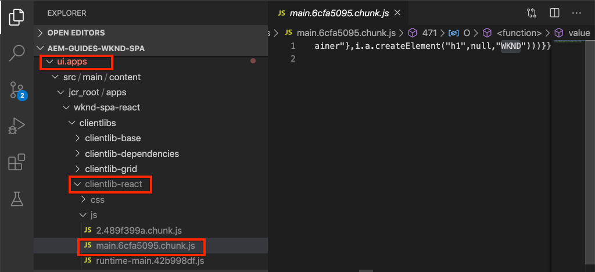
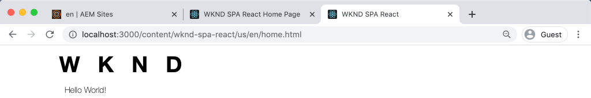
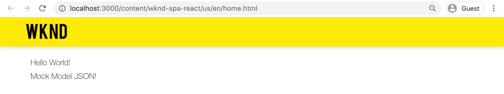

# Een SPA {#integrate-spa} integreren

Begrijp hoe de broncode voor een toepassing van de Enige Pagina (SPA) die in React wordt geschreven met een Project van Adobe Experience Manager (AEM) kan worden geïntegreerd. Leer om moderne front-end hulpmiddelen, zoals een webpack dev server, te gebruiken om de SPA tegen AEM JSON model API snel te ontwikkelen.

## Doelstelling

1. Begrijp hoe het SPA project met AEM met cliënt-zijbibliotheken geïntegreerd is.
2. Leer hoe u een webpack-ontwikkelingsserver gebruikt voor speciale front-end ontwikkeling.
3. Het gebruik van een **proxy** en een statisch **mock** bestand verkennen voor ontwikkeling met behulp van de AEM JSON-model-API

## Wat u gaat maken

In dit hoofdstuk wordt een eenvoudige `Header`-component aan de SPA toegevoegd. Tijdens het ontwikkelen van deze statische `Header`-component zullen verschillende benaderingen voor AEM SPA ontwikkeling worden gebruikt.


*De SPA wordt uitgebreid om een statische  `Header` component toe te voegen*

## Vereisten

Controleer de vereiste gereedschappen en instructies voor het instellen van een [lokale ontwikkelomgeving](overview.md#local-dev-environment).

### De code ophalen

1. Download het beginpunt voor deze zelfstudie via Git:

   ```shell
   $ git clone git@github.com:adobe/aem-guides-wknd-spa.git
   $ cd aem-guides-wknd-spa
   $ git checkout React/integrate-spa-start
   ```

2. Implementeer de basis van de code op een lokale AEM met Maven:

   ```shell
   $ mvn clean install -PautoInstallSinglePackage
   ```

   Als u [AEM 6.x](overview.md#compatibility) gebruikt, voegt u het profiel `classic` toe:

   ```shell
   $ mvn clean install -PautoInstallSinglePackage -Pclassic
   ```

U kunt de gebeëindigde code op [GitHub](https://github.com/adobe/aem-guides-wknd-spa/tree/React/integrate-spa-solution) altijd bekijken of de code plaatselijk controleren door aan de tak `React/integrate-spa-solution` te schakelen.

## Integratiebenadering {#integration-approach}

In het kader van het AEM-project werden twee modules gemaakt: `ui.apps` en `ui.frontend`.

De `ui.frontend` module is een [webpack](https://webpack.js.org/) project dat alle SPA broncode bevat. Het grootste deel van de SPA ontwikkeling en tests zal worden uitgevoerd in het webpack-project. Wanneer een productiebouwstijl wordt teweeggebracht, wordt het SPA gebouwd en gecompileerd gebruikend webpack. De gecompileerde artefacten (CSS en Javascript) worden gekopieerd in `ui.apps` module die dan aan AEM runtime wordt opgesteld.


*Een afbeelding op hoog niveau van de SPA integratie.*

Aanvullende informatie over de front-end build kan [hier worden gevonden](https://docs.adobe.com/content/help/en/experience-manager-core-components/using/developing/archetype/uifrontend-react.html).

## Inspect de SPA integratie {#inspect-spa-integration}

Vervolgens inspecteert u de module `ui.frontend` om te begrijpen welke SPA automatisch is gegenereerd door het [AEM Project archetype](https://docs.adobe.com/content/help/en/experience-manager-core-components/using/developing/archetype/uifrontend-react.html).

1. In winde van uw keus open omhoog het AEM Project voor de SPA WKND. Deze zelfstudie zal [Visual Studio Code IDE](https://docs.adobe.com/content/help/en/experience-manager-learn/cloud-service/local-development-environment-set-up/development-tools.html#microsoft-visual-studio-code) gebruiken.

   

2. Vouw de map `ui.frontend` uit en inspecteer deze. Het bestand `ui.frontend/package.json` openen

3. Onder `dependencies` moet u verschillende verwant zien aan `react` inclusief `react-scripts`

   ```json
   "react": "^16.12.0",
   "react-app-polyfill": "^1.0.5",
   "react-dom": "^16.12.0",
   "react-router-dom": "^5.1.2",
   "react-scripts": "3.4.1"
   ```

   `ui.frontend` is een React toepassing die op [Create React App](https://create-react-app.dev/) of CRA voor kort wordt gebaseerd. De `react-scripts` versie wijst op welke versie van CRA wordt gebruikt.

4. Er zijn ook drie gebiedsdelen vooraf bepaald met `@adobe`:

   ```json
   "@adobe/aem-react-editable-components": "^1.0.0",
   "@adobe/aem-spa-component-mapping": "^1.0.0",
   "@adobe/aem-spa-page-model-manager": "^1.0.0",
   ```

   De bovenstaande modules vormen de [AEM redacteur JS SDK](https://docs.adobe.com/content/help/en/experience-manager-65/developing/headless/spas/spa-blueprint.html) en verstrekken de functionaliteit om het mogelijk te maken om SPA Componenten aan AEM Componenten in kaart te brengen.

5. In het `package.json`-bestand zijn verschillende `scripts` gedefinieerd:

   ```json
   "scripts": {
       "start": "react-scripts start",
       "build": "react-scripts build && clientlib",
       "test": "react-scripts test",
       "eject": "react-scripts eject",
   }
   ```

   Dit zijn standaard bouwstijlmanuscripten die [beschikbaar](https://create-react-app.dev/docs/available-scripts) door Create React App worden gemaakt.

   Het enige verschil is de toevoeging van `&& clientlib` aan het `build` manuscript. Deze extra instructie is verantwoordelijk voor het kopiëren van de gecompileerde SPA naar de `ui.apps`-module als client-side bibliotheek tijdens een build.

   De npm module [aem-clientlib-generator](https://github.com/wcm-io-frontend/aem-clientlib-generator) wordt gebruikt om dit te vergemakkelijken.

6. Inspect het bestand `ui.frontend/clientlib.config.js`. Dit configuratiedossier wordt gebruikt door [aem-clientlib-generator](https://github.com/wcm-io-frontend/aem-clientlib-generator#clientlibconfigjs) om te bepalen hoe te om de cliëntbibliotheek te produceren.

7. Inspect het bestand `ui.frontend/pom.xml`. Dit bestand transformeert de map `ui.frontend` naar een [Gemaakt module](http://maven.apache.org/guides/mini/guide-multiple-modules.html). Het `pom.xml`-bestand is bijgewerkt en gebruikt de [frontend-maven-plugin](https://github.com/eirslett/frontend-maven-plugin) om **test** en **build** de SPA tijdens een Maven-build te gebruiken.

8. Inspect het bestand `index.js` om `ui.frontend/src/index.js`:

   ```js
   //ui.frontend/src/index.js
   ...
   document.addEventListener('DOMContentLoaded', () => {
       ModelManager.initialize().then(pageModel => {
           const history = createBrowserHistory();
           render(
           <Router history={history}>
               <App
               history={history}
               cqChildren={pageModel[Constants.CHILDREN_PROP]}
               cqItems={pageModel[Constants.ITEMS_PROP]}
               cqItemsOrder={pageModel[Constants.ITEMS_ORDER_PROP]}
               cqPath={pageModel[Constants.PATH_PROP]}
               locationPathname={window.location.pathname}
               />
           </Router>,
           document.getElementById('spa-root')
           );
       });
   });
   ```

   `index.js` is het ingangspunt van de SPA. `ModelManager` wordt geleverd door de AEM SPA Editor JS SDK. Het is verantwoordelijk voor het aanroepen en injecteren van `pageModel` (de JSON-inhoud) in de toepassing.

## Een koptekstcomponent {#header-component} toevoegen

Voeg vervolgens een nieuwe component aan de SPA toe en implementeer de wijzigingen in een lokale AEM.

1. In `ui.frontend` module, onder `ui.frontend/src/components` creeer een nieuwe omslag genoemd `Header`.
2. Maak een bestand met de naam `Header.js` onder de map `Header`.

   

3. Vul `Header.js` met het volgende:

   ```js
   //Header.js
   import React, {Component} from 'react';
   
   export default class Header extends Component {
   
       render() {
           return (
                   <header className="Header">
                       <div className="Header-container">
                           <h1>WKND</h1>
                       </div>
                   </header>
           );
       }
   }
   ```

   Hierboven bevindt zich een standaardcomponent React die een statische tekstreeks uitvoert.

4. Open het bestand `ui.frontend/src/App.js`. Dit is het ingangspunt van de toepassing.
5. Voer de volgende updates van `App.js` uit om de statische `Header` op te nemen:

   ```diff
     import { Page, withModel } from '@adobe/aem-react-editable-components';
     import React from 'react';
   + import Header from './components/Header/Header';
   
     // This component is the application entry point
     class App extends Page {
     render() {
         return (
         <div>
   +       <Header />
            {this.childComponents}
            {this.childPages}
        </div>
   ```

6. Open een nieuwe terminal, navigeer in de `ui.frontend` omslag en stel `npm run build` bevel in werking:

   ```shell
   $ cd aem-guides-wknd-spa
   $ cd ui.frontend
   $ npm run build
   ...
   Compiled successfully.
   
   File sizes after gzip:
   
   118.95 KB (-33 B)  build/static/js/2.489f399a.chunk.js
   1.11 KB (+48 B)    build/static/js/main.6cfa5095.chunk.js
   806 B              build/static/js/runtime-main.42b998df.js
   451 B              build/static/css/main.e57bbe8a.chunk.css
   ```

7. Navigeer naar de map `ui.apps`. Onder `ui.apps/src/main/content/jcr_root/apps/wknd-spa-react/clientlibs/clientlib-react` zou u moeten zien de gecompileerde SPA dossiers van `ui.frontend/build` omslag zijn gekopieerd.

   

8. Ga terug naar de terminal en navigeer in de `ui.apps` omslag. Voer het volgende Geweven bevel uit:

   ```shell
   $ cd ../ui.apps
   $ mvn clean install -PautoInstallPackage
   ...
   [INFO] ------------------------------------------------------------------------
   [INFO] BUILD SUCCESS
   [INFO] ------------------------------------------------------------------------
   [INFO] Total time:  9.629 s
   [INFO] Finished at: 2020-05-04T17:48:07-07:00
   [INFO] ------------------------------------------------------------------------
   ```

   Hiermee wordt het `ui.apps`-pakket geïmplementeerd op een lokale actieve instantie van AEM.

9. Open een browsertabblad en navigeer naar [http://localhost:4502/editor.html/content/wknd-spa-react/us/en/home.html](http://localhost:4502/editor.html/content/wknd-spa-react/us/en/home.html). U zou nu de inhoud van de `Header` component moeten zien die in de SPA wordt getoond.

   

   De stappen 6-8 worden automatisch uitgevoerd wanneer het teweegbrengen van een Geleiende bouwstijl van de wortel van het project (d.w.z. `mvn clean install -PautoInstallSinglePackage`). U zou nu de grondbeginselen van de integratie tussen de SPA en AEM cliënt-zijbibliotheken moeten begrijpen. U kunt `Text`-componenten nog steeds bewerken en toevoegen AEM onder de statische `Header`-component.

## Webpack Dev Server - Proxy de JSON API {#proxy-json}

Zoals u in de vorige oefeningen ziet, duurt het maken van een build en het synchroniseren van de clientbibliotheek naar een lokale AEM enkele minuten. Dit is acceptabel voor de uiteindelijke test, maar niet ideaal voor het grootste deel van de SPA ontwikkeling.

Een [webpack-dev-server](https://webpack.js.org/configuration/dev-server/) kan worden gebruikt om de SPA snel te ontwikkelen. De SPA wordt aangedreven door een JSON-model dat door AEM wordt gegenereerd. In deze oefening zal de inhoud JSON van een lopende instantie van AEM **proxied** in de ontwikkelingsserver zijn.

1. Ga terug naar winde en open het dossier `ui.frontend/package.json`.

   Zoek een lijn als deze:

   ```json
   "proxy": "http://localhost:4502",
   ```

   [Create React App](https://create-react-app.dev/docs/proxying-api-requests-in-development) verstrekt een gemakkelijk mechanisme aan volmacht API verzoeken. Alle onbekende aanvragen worden opnieuw bekeken via `localhost:4502`, de lokale AEM quickstart.

2. Open een terminalvenster en navigeer naar de map `ui.frontend`. Voer de opdracht `npm start` uit:

   ```shell
   $ cd ui.frontend
   $ npm start
   ...
   Compiled successfully!
   
   You can now view wknd-spa-react in the browser.
   
   Local:            http://localhost:3000
   On Your Network:  http://192.168.86.136:3000
   
   Note that the development build is not optimized.
   To create a production build, use npm run build.
   ```

3. Open een nieuw browsertabblad (indien nog niet geopend) en navigeer naar [http://localhost:3000/content/wknd-spa-react/us/en/home.html](http://localhost:3000/content/wknd-spa-react/us/en/home.html).

   

   U moet dezelfde inhoud zien als in AEM, maar zonder dat een van de ontwerpmogelijkheden is ingeschakeld.

   >[!NOTE]
   >
   > Vanwege de beveiligingsvereisten voor AEM moet u zich in dezelfde browser maar op een ander tabblad aanmelden bij de lokale AEM (http://localhost:4502).

4. Ga terug naar winde en creeer een nieuwe omslag genoemd `media` bij `ui.frontend/src/media`.
5. Download en voeg het volgende WKND-logo toe aan de map `media`:

   

6. Open `Header.js` op `ui.frontend/src/components/Header/Header.js` en importeer het logo:

   ```diff
     import React, {Component} from 'react';
   + import wkndLogoDark from '../../media/wknd-logo-dk.png';
   ```

7. Voer de volgende updates uit naar `Header.js` om het logo op te nemen als onderdeel van de koptekst:

   ```js
    export default class Header extends Component {
   
       get logo() {
           return (
               <div className="Logo">
                   
               </div>
           );
       }
   
       render() {
           return (
                   <header className="Header">
                       <div className="Header-container">
                           {this.logo}
                       </div>
                   </header>
           );
       }
   }
   ```

   Sla de wijzigingen op in `Header.js`.

8. Ga terug naar de browser op [http://localhost:3000/content/wknd-spa-react/us/en/home.html](http://localhost:3000/content/wknd-spa-react/us/en/home.html). De wijzigingen in de app worden meteen weerspiegeld.

   

   U kunt doorgaan met het uitvoeren van content-updates in AEM en deze weergeven in **webpack-dev-server**, aangezien we de inhoud proxying.

9. Stop de webpack-ontwikkelserver met `ctrl+c` in de terminal.

## Webpack Dev Server - Mock JSON API {#mock-json}

Een andere manier om snel te ontwikkelen is het gebruik van een statisch JSON-bestand als JSON-model. Door de JSON te &#39;rokken&#39; verwijderen we de afhankelijkheid van een lokale AEM. Het staat ook een front-end ontwikkelaar toe om het model JSON bij te werken om functionaliteit te testen en veranderingen in JSON API te drijven die dan door een achterste-eindontwikkelaar zou worden uitgevoerd.

Voor de eerste configuratie van het model-JSON is **een lokale AEM-instantie** vereist.

1. Navigeer in de browser naar [http://localhost:4502/content/wknd-spa-react/us/en.model.json](http://localhost:4502/content/wknd-spa-react/us/en.model.json).

   Dit is de JSON die wordt geëxporteerd door AEM die de toepassing stuurt. Kopieer de JSON-uitvoer.

2. Keer terug naar winde navigeer aan `ui.frontend/public` en voeg een nieuwe omslag genoemd `mock-content` toe.
3. Maak een nieuw bestand met de naam `mock.model.json` onder `ui.frontend/public/mock-content`. Plak de JSON-uitvoer van **Stap 1** hier.

   

4. Open het bestand `index.html` om `ui.frontend/public/index.html`. Werk het meta-gegevensbezit voor het AEM paginamodel bij om aan een variabele `%REACT_APP_PAGE_MODEL_PATH%` te richten:

   ```html
       <!-- AEM page model -->
       <meta
          property="cq:pagemodel_root_url"
          content="%REACT_APP_PAGE_MODEL_PATH%"
       />
   ```

   Door een variabele voor de waarde van het `cq:pagemodel_root_url` te gebruiken, kunt u gemakkelijker schakelen tussen het proxymodel en het mock json-model.

5. Open het bestand `ui.frontend/.env.development` en voer de volgende updates uit om de vorige waarde voor `REACT_APP_PAGE_MODEL_PATH` toe te voegen:

   ```plain
   PUBLIC_URL=/
   
   #REACT_APP_PAGE_MODEL_PATH=/content/wknd-spa-react/us/en.model.json
   REACT_APP_PAGE_MODEL_PATH=/mock-content/mock.model.json
   
   REACT_APP_ROOT=/content/wknd-spa-react/us/en/home.html
   ```

6. Als deze functie momenteel wordt uitgevoerd, moet u de **webpack-dev-server** stoppen. Start de **webpack-dev-server** vanaf de terminal:

   ```shell
   $ cd ui.frontend
   $ npm start
   ```

   Navigeer naar [http://localhost:3000/content/wknd-spa-react/us/en/home.html](http://localhost:3000/content/wknd-spa-react/us/en/home.html) en u zou de SPA met de zelfde inhoud moeten zien die in **volmacht** json wordt gebruikt.

7. Breng een kleine wijziging aan in het `mock.model.json` dossier vroeger werd gecreeerd. De bijgewerkte inhoud wordt direct weergegeven in de **webpack-dev-server**.

   

Door het JSON-model te kunnen manipuleren en de effecten op een live SPA te kunnen bekijken, kan een ontwikkelaar de JSON-model-API beter begrijpen. Het maakt ook zowel front-end als back-end ontwikkeling mogelijk.

U kunt nu schakelen waar u de JSON-inhoud wilt verbruiken door de items in het `env.development`-bestand in en uit te schakelen:

```plain
# JSON API via proxy to AEM
#REACT_APP_PAGE_MODEL_PATH=/content/wknd-spa-react/us/en.model.json

# JSON API via static mock file
REACT_APP_PAGE_MODEL_PATH=/mock-content/mock.model.json
```

## Stijlen met klasse toevoegen

De beste manier om te reageren is elke component modulair en zelfstandig te houden. Een algemene aanbeveling is om te voorkomen dat dezelfde CSS-klassenaam wordt gebruikt in verschillende componenten, waardoor het gebruik van preprocessoren minder krachtig is. Dit project zal [Sass](https://sass-lang.com/) voor een paar nuttige eigenschappen zoals variabelen gebruiken. Dit project volgt ook losjes [SUIT CSS-naamgevingsconventies](https://github.com/suitcss/suit/blob/master/doc/components.md). SUIT is een variatie van BEM-notatie, Block Element Modifier, die wordt gebruikt om consistente CSS-regels te maken.

1. Open een terminalvenster en stop **webpack-dev-server** indien deze wordt gestart. Voer vanuit de map `ui.frontend` de volgende opdracht in voor [Sass](https://create-react-app.dev/docs/adding-a-sass-stylesheet) installeren:

   ```shell
   $ cd ui.frontend
   $ npm install node-sass --save
   ```

   `sass` installeren als peer-afhankelijkheid:

   ```shell
   $ npm install sass --save
   ```

2. Installeer `normalize-scss` om de stijlen in verschillende browsers te normaliseren:

   ```shell
   $ npm install normalize-scss
   ```

3. Start de **webpack-dev-server** zodat we de stijlen in real-time kunnen zien worden bijgewerkt:

   ```shell
   $ npm start
   ```

   Gebruik een van de methoden Proxy of Mock voor de verwerking van de JSON-model-API.

4. Terugkeer aan winde en onder `ui.frontend/src` creeer een nieuwe omslag genoemd `styles`.
5. Maak een nieuw bestand onder `ui.frontend/src/styles` met de naam `_variables.scss` en voeg de volgende variabelen toe aan het bestand:

   ```scss
   //_variables.scss
   
   //== Colors
   //
   //## Gray and brand colors for use across theme.
   
   $black:                  #202020;
   $gray:                   #696969;
   $gray-light:             #EBEBEB;
   $gray-lighter:           #F7F7F7;
   $white:                  #FFFFFF;
   $yellow:                 #FFEA00;
   $blue:                   #0045FF;
   
   
   //== Typography
   //
   //## Font, line-height, and color for body text, headings, and more.
   
   $font-family-sans-serif:  "Helvetica Neue", Helvetica, Arial, sans-serif;
   $font-family-serif:       Georgia, "Times New Roman", Times, serif;
   $font-family-base:        $font-family-sans-serif;
   $font-size-base:          18px;
   
   $line-height-base:        1.5;
   $line-height-computed:    floor(($font-size-base * $line-height-base));
   
   // Functional Colors
   $brand-primary:             $yellow;
   $body-bg:                   $white;
   $text-color:                $black;
   $text-color-inverse:        $gray-light;
   $link-color:                $blue;
   
   //Layout
   $max-width: 1024px;
   
   // Spacing
   $gutter-padding: 12px;
   ```

6. Wijzig de naam van de extensie van het bestand `index.css` om `ui.frontend/src/index.css` in **`index.scss`**. Vervang de inhoud door:

   ```scss
   /* index.scss * /
   
   /* Normalize */
   @import '~normalize-scss/sass/normalize';
   
   @import './styles/variables';
   
   body {
       background-color: $body-bg;
       font-family: $font-family-base;
       margin: 0;
       padding: 0;
       font-size: $font-size-base;
       text-align: left;
       color: $text-color;
       line-height: $line-height-base;
   }
   
   //spacing for header
   body.page {
       padding-top: 75px;
   }
   ```

7. `ui.frontend/src/index.js` bijwerken om de opnieuw benoemde `index.scss` op te nemen:

   ```diff
    ...
   - import './index.css';
   + import './index.scss';
    ....
   ```

8. Maak een nieuw bestand met de naam `Header.scss` onder `ui.frontend/src/components/Header`. Vul het bestand met het volgende:

   ```scss
   @import '../../styles/variables';
   
   .Header {
       width: 100%;
       position: fixed;
       top: 0;
       left:0;
       z-index: 99;
       background-color: $brand-primary;
       box-shadow: 0px 0px 10px 0px rgba(0, 0, 0, 0.24);
   }
   
   .Header-container {
       display: flex;
       max-width: $max-width;
       margin: 0 auto;
       padding-left: $gutter-padding;
       padding-right: $gutter-padding;
   }
   
   .Logo {
       z-index: 100;
       display: flex;
       padding-top: $gutter-padding;
       padding-bottom: $gutter-padding;
   }
   
   .Logo-img {
       width: 100px;
   }
   ```

9. `Header.scss` opnemen door `Header.js` bij te werken:

   ```js
   import React, {Component} from 'react';
   import wkndLogoDark from '../../media/wknd-logo-dk.png';
   
   require('./Header.scss');
   ...
   ```

10. Ga terug naar de browser en de **webpack-dev-server**: [http://localhost:3000/content/wknd-spa-react/us/en/home.html](http://localhost:3000/content/wknd-spa-react/us/en/home.html)

   

   De bijgewerkte stijlen worden nu toegevoegd aan de component `Header`.

## SPA updates voor AEM implementeren

De wijzigingen die in de `Header` zijn aangebracht, zijn momenteel alleen zichtbaar via de **webpack-dev-server**. Implementeer de bijgewerkte SPA om de wijzigingen te AEM.

1. Navigeer naar de hoofdmap van het project (`aem-guides-wknd-spa`) en implementeer het project om het te AEM met Maven:

   ```shell
   $ cd ..
   $ mvn clean install -PautoInstallSinglePackage
   ```

2. Navigeer naar [http://localhost:4502/editor.html/content/wknd-spa-react/us/en/home.html](http://localhost:4502/editor.html/content/wknd-spa-react/us/en/home.html). De bijgewerkte `Header` met het toegepaste logo en de toegepaste stijlen worden weergegeven.

   

   Nu de bijgewerkte SPA in AEM is, kan het ontwerpen worden voortgezet.

## Fout bij oplossen van problemen in knooppuntklasse

Tijdens het ontwikkelen kan de volgende fout optreden:

```
Error: Missing binding aem-guides-wknd-spa/ui.frontend/node_modules/node-sass/vendor/darwin-x64-72/binding.node
Node Sass could not find a binding for your current environment: macOS 64-bit with Node.js 12.x
```

Dit kan voorkomen wanneer de lokale versie van **Node.js** en **npm** verschillend zijn dan wat door [frontend-maven-plugin](https://github.com/eirslett/frontend-maven-plugin) wordt gebruikt. Als u de opdracht `npm rebuild node-sass` uitvoert, kan het probleem tijdelijk worden verholpen of kan de map `ui.frontend/node_modules` worden verwijderd en opnieuw worden geïnstalleerd.

Er zijn ook een paar manieren om dit op een meer permanente manier aan te pakken.

* Zorg ervoor dat de lokale versie van npm en Node.js de versies aanpast die door [Maven bouwen](https://github.com/adobe/aem-guides-wknd-spa/blob/React/latest/pom.xml#L118) worden gebruikt
* Voeg de volgende uitvoeringsstap toe aan `ui.frontend/pom.xml` vóór de stap `npm run build`:

   ```xml
   <execution>
       <id>npm rebuild node-sass</id>
       <goals>
           <goal>npm</goal>
       </goals>
       <configuration>
           <arguments>rebuild node-sass</arguments>
       </configuration>
   </execution>
   ```

## Gefeliciteerd! {#congratulations}

Gefeliciteerd, u hebt de SPA bijgewerkt en de integratie met AEM onderzocht! U kent nu twee verschillende benaderingen voor het ontwikkelen van de SPA tegen de AEM JSON-model-API met behulp van een **webpack-dev-server**.

U kunt de gebeëindigde code op [GitHub](https://github.com/adobe/aem-guides-wknd-spa/tree/React/integrate-spa-solution) altijd bekijken of de code plaatselijk controleren door aan de tak `React/integrate-spa-solution` te schakelen.

### Volgende stappen {#next-steps}

[SPA componenten toewijzen aan AEM componenten](map-components.md)  - Leer hoe u React-componenten kunt toewijzen aan Adobe Experience Manager-componenten (AEM) met de AEM Editor JS SDK SPA. Met componenttoewijzing kunnen gebruikers dynamische updates uitvoeren naar SPA componenten in de AEM SPA Editor, net als bij traditionele AEM ontwerpen.
