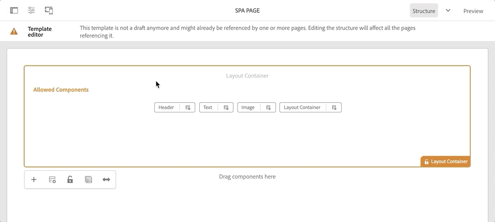

# Navigatie en routering toevoegen {#navigation-routing}

Leer hoe meerdere weergaven in de SPA kunnen worden ondersteund door aan AEM Pagina&#39;s toe te wijzen met de SPA Editor SDK. De dynamische navigatie wordt uitgevoerd gebruikend React Router en toegevoegd aan een bestaande component van de Kopbal.

## Doelstelling

1. Begrijp het SPA model verpletterend opties beschikbaar wanneer het gebruiken van de SPARedacteur.
1. Leer om [Reageer Router](https://reacttraining.com/react-router/) te gebruiken om tussen verschillende meningen van de SPA te navigeren.
1. Voer een dynamische navigatie uit die door de AEM paginahiërarchie wordt aangedreven.

## Wat u gaat maken

In dit hoofdstuk wordt een navigatiemenu toegevoegd aan een bestaande `Header`-component. Het navigatiemenu wordt aangestuurd door de AEM paginahiërarchie en maakt gebruik van het JSON-model dat wordt geleverd door de [Navigation Core Component](https://docs.adobe.com/content/help/en/experience-manager-core-components/using/components/navigation.html).


## Vereisten

Controleer de vereiste gereedschappen en instructies voor het instellen van een [lokale ontwikkelomgeving](overview.md#local-dev-environment).

### De code ophalen

1. Download het beginpunt voor deze zelfstudie via Git:

   ```shell
   $ git clone git@github.com:adobe/aem-guides-wknd-spa.git
   $ cd aem-guides-wknd-spa
   $ git checkout React/navigation-routing-start
   ```

1. Implementeer de basis van de code op een lokale AEM met Maven:

   ```shell
   $ mvn clean install -PautoInstallSinglePackage
   ```

   Als u [AEM 6.x](overview.md#compatibility) gebruikt, voegt u het profiel `classic` toe:

   ```shell
   $ mvn clean install -PautoInstallSinglePackage -Pclassic
   ```

1. Installeer het voltooide pakket voor de traditionele [WKND-referentiesite](https://github.com/adobe/aem-guides-wknd/releases/latest). De afbeeldingen die worden geleverd door [WKND-referentiesite](https://github.com/adobe/aem-guides-wknd/releases/latest) worden opnieuw gebruikt op de WKND-SPA. Het pakket kan worden geïnstalleerd met [AEM Package Manager](http://localhost:4502/crx/packmgr/index.jsp).

   

U kunt de gebeëindigde code op [GitHub](https://github.com/adobe/aem-guides-wknd-spa/tree/React/navigation-routing-solution) altijd bekijken of de code plaatselijk controleren door aan de tak `React/navigation-routing-solution` te schakelen.

## Inspect Header-updates {#inspect-header}

In vorige hoofdstukken werd de component `Header` toegevoegd als een zuivere React component inbegrepen via `App.js`. In dit hoofdstuk is de `Header`-component verwijderd en wordt deze toegevoegd via de [Sjablooneditor](https://docs.adobe.com/content/help/en/experience-manager-learn/sites/page-authoring/template-editor-feature-video-use.html). Hierdoor kunnen gebruikers het navigatiemenu van de `Header` vanuit AEM configureren.

>[!NOTE]
>
> Er zijn al verschillende CSS- en JavaScript-updates aangebracht in de codebasis om dit hoofdstuk te starten. Om zich op kernconcepten te concentreren, niet **wordt al** van de codeveranderingen besproken. U kunt de volledige veranderingen [hier](https://github.com/adobe/aem-guides-wknd-spa/compare/React/map-components-solution...React/navigation-routing-start) bekijken.

1. In winde van uw keus opent het SPA starterproject voor dit hoofdstuk.
1. Onder de `ui.frontend` module inspecteert u het bestand `Header.js` op: `ui.frontend/src/components/Header/Header.js`.

   Er zijn verschillende updates uitgevoerd, waaronder de toevoeging van een `HeaderEditConfig` en een `MapTo` om het mogelijk te maken dat de component wordt toegewezen aan een AEM `wknd-spa-react/components/header`.

   ```js
   /* Header.js */
   ...
   export const HeaderEditConfig = {
       ...
   }
   ...
   MapTo('wknd-spa-react/components/header')(withRouter(Header), HeaderEditConfig);
   ```

1. Controleer in de module `ui.apps` de componentdefinitie van de AEM `Header` component: `ui.apps/src/main/content/jcr_root/apps/wknd-spa-react/components/header/.content.xml`:

   ```xml
   <?xml version="1.0" encoding="UTF-8"?>
   <jcr:root xmlns:sling="http://sling.apache.org/jcr/sling/1.0" xmlns:cq="http://www.day.com/jcr/cq/1.0"
       xmlns:jcr="http://www.jcp.org/jcr/1.0"
       jcr:primaryType="cq:Component"
       jcr:title="Header"
       sling:resourceSuperType="wknd-spa-react/components/navigation"
       componentGroup="WKND SPA React - Structure"/>
   ```

   De AEM `Header` component erft alle functionaliteit van [Navigation Core Component](https://docs.adobe.com/content/help/en/experience-manager-core-components/using/components/navigation.html) via het `sling:resourceSuperType` bezit.

## De koptekst toevoegen aan de sjabloon {#add-header-template}

1. Open browser en login aan AEM, [http://localhost:4502/](http://localhost:4502/). De begincodebasis zou reeds moeten worden opgesteld.
1. Navigeer naar **SPA Paginasjabloon**: [http://localhost:4502/editor.html/conf/wknd-spa-react/settings/wcm/templates/spa-page-template/structure.html](http://localhost:4502/editor.html/conf/wknd-spa-react/settings/wcm/templates/spa-page-template/structure.html).
1. Selecteer de buitenste **Basislay-outcontainer** en klik op het pictogram **Beleid**. Wees voorzichtig **not** om de **Layout Container** niet-vergrendeld voor ontwerpen te selecteren.

   

1. Maak een nieuw beleid met de naam **SPA Structuur**:

   

   Onder **Toegestane componenten** > **Algemeen** > selecteert u de **Indelingscontainer**-component.

   Onder **Toegestane componenten** > **WKND SPA REACT - STRUCTUUR** > selecteert u de **Koptekst** component:

   

   Onder **Toegestane componenten** > **WKND SPA REACT - Content** > selecteert u de **Image** en **Text** componenten. Er moeten in totaal vier componenten zijn geselecteerd.

   Klik **Done** om de wijzigingen op te slaan.

1. Vernieuw de pagina en voeg de **Header** component toe boven de niet-vergrendelde **Layout Container**:

   

1. Selecteer de **component Koptekst** en klik op het pictogram **Beleid** om het beleid te bewerken.
1. Maak een nieuw beleid met een **Beleidstitel** van **WKND SPA Koptekst**.

   Onder **Eigenschappen**:

   * Stel de **Navigation Root** in op `/content/wknd-spa-react/us/en`.
   * Stel **Hoofdniveaus uitsluiten** in op **1**.
   * Schakel **Alle onderliggende pagina&#39;s verzamelen** uit.
   * Stel de **Navigatiestructuurdiepte** in op **3**.

   

   Hierdoor worden de navigatieniveaus 2 diep onder `/content/wknd-spa-react/us/en` verzameld.

1. Nadat u de wijzigingen hebt opgeslagen, ziet u de gevulde `Header` als onderdeel van de sjabloon:

   

## Onderliggende pagina&#39;s maken

Maak vervolgens aanvullende pagina&#39;s in AEM die als de verschillende weergaven in de SPA dienen. We zullen ook de hiërarchische structuur van het JSON-model dat door AEM wordt aangeboden, controleren.

1. Navigeer naar de **Sites**-console: [http://localhost:4502/sites.html/content/wknd-spa-react/us/en/home](http://localhost:4502/sites.html/content/wknd-spa-react/us/en/home). Selecteer **WKND SPA React Home Page** en klik **Create** > **Page**:

   

1. Selecteer **SPA Pagina** onder **Sjabloon**. Voer onder **Eigenschappen** **Pagina 1** in voor de **Titel** en **pagina-1** als naam.

   

   Klik op **Maken** en klik in het dialoogvenster op **Openen** om de pagina te openen in de AEM SPA Editor.

1. Voeg een nieuwe **component Text** aan de belangrijkste **Container voor lay-out** toe. Bewerk de component en voer de tekst in: **Pagina 1** die RTE en het **H1** element gebruiken (u zult volledig-schermwijze moeten ingaan om de paragraafelementen te veranderen)

   

   Voel u vrij om extra inhoud toe te voegen, zoals een afbeelding.

1. Ga terug naar de AEM Sites-console en herhaal de bovenstaande stappen. Er wordt een tweede pagina gemaakt met de naam **Pagina 2** als een pagina op hetzelfde niveau als **Pagina 1**.
1. Maak ten slotte een derde pagina, **Pagina 3** maar als **child** van **Pagina 2**. Na voltooiing zou de plaatshiërarchie als het volgende moeten kijken:

   

1. Open op een nieuw tabblad de API van het JSON-model die wordt geleverd door AEM: [http://localhost:4502/content/wknd-spa-react/us/en.model.json](http://localhost:4502/content/wknd-spa-react/us/en.model.json). Deze JSON-inhoud wordt opgevraagd wanneer de SPA voor het eerst wordt geladen. De buitenste structuur ziet er als volgt uit:

   ```json
   {
   "language": "en",
   "title": "en",
   "templateName": "spa-app-template",
   "designPath": "/libs/settings/wcm/designs/default",
   "cssClassNames": "spa page basicpage",
   ":type": "wknd-spa-react/components/spa",
   ":items": {},
   ":itemsOrder": [],
   ":hierarchyType": "page",
   ":path": "/content/wknd-spa-react/us/en",
   ":children": {
       "/content/wknd-spa-react/us/en/home": {},
       "/content/wknd-spa-react/us/en/home/page-1": {},
       "/content/wknd-spa-react/us/en/home/page-2": {},
       "/content/wknd-spa-react/us/en/home/page-2/page-3": {}
       }
   }
   ```

   Onder `:children` ziet u een vermelding voor elk van de gemaakte pagina&#39;s. De inhoud voor alle pagina&#39;s staat in dit eerste JSON-verzoek. Zodra, wordt het navigatie verpletteren uitgevoerd, zullen de verdere meningen van de SPA snel worden geladen, aangezien de inhoud reeds beschikbare cliënt-kant is.

   Het is niet verstandig om **ALL** van de inhoud van een SPA in het eerste JSON-verzoek te laden, omdat dit de eerste paginalading zou vertragen. Vervolgens kunt u bekijken hoe de hiërarchische diepte van pagina&#39;s wordt verzameld.

1. Navigeer naar de sjabloon **SPA Root** op: [http://localhost:4502/editor.html/conf/wknd-spa-react/settings/wcm/templates/spa-app-template/structure.html](http://localhost:4502/editor.html/conf/wknd-spa-react/settings/wcm/templates/spa-app-template/structure.html).

   Klik op het menu **Pagina-eigenschappen** > **Paginabeleid**:

   

1. De sjabloon **SPA Root** heeft een extra **tabblad Hiërarchische structuur** om de verzamelde JSON-inhoud te beheren. De **Structuurdiepte** bepaalt hoe diep in de sitehiërarchie onderliggende pagina&#39;s onder de **root** worden verzameld. Met het veld **Structuurpatronen** kunt u ook extra pagina&#39;s filteren op basis van een reguliere expressie.

   Werk **Structuurdiepte** aan **2** bij:

   

   Klik **Done** om de wijzigingen in het beleid op te slaan.

1. Open het JSON-model opnieuw [http://localhost:4502/content/wknd-spa-react/us/en.model.json](http://localhost:4502/content/wknd-spa-react/us/en.model.json).

   ```json
   {
   "language": "en",
   "title": "en",
   "templateName": "spa-app-template",
   "designPath": "/libs/settings/wcm/designs/default",
   "cssClassNames": "spa page basicpage",
   ":type": "wknd-spa-react/components/spa",
   ":items": {},
   ":itemsOrder": [],
   ":hierarchyType": "page",
   ":path": "/content/wknd-spa-react/us/en",
   ":children": {
       "/content/wknd-spa-react/us/en/home": {},
       "/content/wknd-spa-react/us/en/home/page-1": {},
       "/content/wknd-spa-react/us/en/home/page-2": {}
       }
   }
   ```

   De weg **Pagina 3** is verwijderd: `/content/wknd-spa-react/us/en/home/page-2/page-3` uit het oorspronkelijke JSON-model.

   Later zullen we zien hoe de AEM SPA Editor SDK dynamisch aanvullende inhoud kan laden.

## Navigatie implementeren

Implementeer vervolgens het navigatiemenu als onderdeel van de `Header`. We kunnen de code rechtstreeks toevoegen in `Header.js`, maar een betere manier is om grote componenten te voorkomen. In plaats daarvan, zullen wij een `Navigation` SPA component uitvoeren die potentieel later opnieuw zou kunnen worden gebruikt.

1. Bekijk de JSON die door de AEM `Header`-component op [http://localhost:4502/content/wknd-spa-react/us/en.model.json](http://localhost:4502/content/wknd-spa-react/us/en.model.json) wordt weergegeven:

   ```json
   ...
   "header": {
       "items": [
       {
       "level": 0,
       "active": true,
       "path": "/content/wknd-spa-react/us/en/home",
       "description": null,
       "url": "/content/wknd-spa-react/us/en/home.html",
       "lastModified": 1589062597083,
       "title": "WKND SPA React Home Page",
       "children": [
               {
               "children": [],
               "level": 1,
               "active": false,
               "path": "/content/wknd-spa-react/us/en/home/page-1",
               "description": null,
               "url": "/content/wknd-spa-react/us/en/home/page-1.html",
               "lastModified": 1589429385100,
               "title": "Page 1"
               },
               {
               "level": 1,
               "active": true,
               "path": "/content/wknd-spa-react/us/en/home/page-2",
               "description": null,
               "url": "/content/wknd-spa-react/us/en/home/page-2.html",
               "lastModified": 1589429603507,
               "title": "Page 2",
               "children": [
                   {
                   "children": [],
                   "level": 2,
                   "active": false,
                   "path": "/content/wknd-spa-react/us/en/home/page-2/page-3",
                   "description": null,
                   "url": "/content/wknd-spa-react/us/en/home/page-2/page-3.html",
                   "lastModified": 1589430413831,
                   "title": "Page 3"
                   }
               ],
               }
           ]
           }
       ],
   ":type": "wknd-spa-react/components/header"
   ```

   De hiërarchische aard van de AEM pagina&#39;s wordt gemodelleerd in JSON die kan worden gebruikt om een navigatiemenu te bevolken. De `Header` component erft alle functionaliteit van [Navigation Core Component](https://docs.adobe.com/content/help/en/experience-manager-core-components/using/components/navigation.html) en de inhoud die via JSON wordt blootgesteld zal automatisch worden in kaart gebracht aan React props.

1. Open een nieuw eindvenster en navigeer aan de `ui.frontend` omslag van het SPA project. Start de **webpack-dev-server** met de opdracht `npm start`.

   ```shell
   $ cd ui.frontend
   $ npm start
   ```

1. Open een nieuw browsertabblad en navigeer naar [http://localhost:3000/](http://localhost:3000/).

   De **webpack-dev-server** moet worden geconfigureerd om het JSON-model te proxyleerd uit een lokale instantie van AEM (`ui.frontend/.env.development`). Op deze manier kunnen we rechtstreeks code schrijven op basis van de inhoud die in AEM in de vorige exercitie is gemaakt. Zorg ervoor dat u in AEM in dezelfde bladersessie bent geverifieerd.

   

   De `Header` heeft momenteel de reeds uitgevoerde functionaliteit van de menuknevel. Implementeer vervolgens het navigatiemenu.

1. Keer terug naar winde van uw keus, en open `Header.js` om `ui.frontend/src/components/Header/Header.js`.
1. Werk de `homeLink()` methode bij om het hard-gecodeerde Koord te verwijderen en de dynamische die steunen te gebruiken binnen door de AEM worden overgegaan component:

   ```js
   /* Header.js */
   ...
   get homeLink() {
        //expect a single root defined as part of the navigation
       if(!this.props.items || this.props.items.length !== 1) {
           return null;
       }
   
       return this.props.items[0].url;
   }
   ...
   ```

   De bovenstaande code vult een URL op basis van het basisnavigatiepunt dat door de component is geconfigureerd. `homeLink()` wordt gebruikt om het logo in de  `logo()` methode te vullen en wordt gebruikt om te bepalen of de achterknop moet worden weergegeven in  `backButton()`.

   Wijzigingen opslaan in `Header.js`.

1. Voeg een lijn bij de bovenkant van `Header.js` toe om de `Navigation` component onder de andere invoer in te voeren:

   ```js
   /* Header.js */
   ...
   import Navigation from '../Navigation/Navigation';
   ```

1. Werk vervolgens de methode `get navigation()` bij om de component `Navigation` te instantiëren:

   ```js
   /* Header.js */
   ...
   get navigation() {
       //pass all the props to Navigation component
       return <Navigation {...this.props} />;
   }
   ...
   ```

   Zoals eerder vermeld, zullen wij in plaats van het uitvoeren van de navigatie binnen `Header` de meerderheid van de logica in `Navigation` component uitvoeren.  De eigenschappen van de `Header` omvatten de JSON-structuur die nodig is om het menu te maken. We geven alle profielen door.
1. Open het bestand `Navigation.js` om `ui.frontend/src/components/Navigation/Navigation.js`.
1. Implementeer de methode `renderGroupNav(children)`:

   ```js
   /* Navigation.js */
   ...
   renderGroupNav(children) {
   
       if(children === null || children.length < 1 ) {
           return null;
       }
       return (<ul className={this.baseCss + '__group'}>
                   {children.map(
                       (item,index) => { return this.renderNavItem(item,index)}
                   )}
               </ul>
       );
   }
   ...
   ```

   Met deze methode wordt een array met navigatie-items gemaakt, `children`, en wordt een niet-geordende lijst gemaakt. Het herhaalt dan over de serie en gaat het punt tot `renderNavItem` over, die daarna zal worden uitgevoerd.

1. Implementeer `renderNavItem`:

   ```js
   /* Navigation.js */
   ...
   renderNavItem(item, index) {
       const cssClass = this.baseCss + '__item ' + 
                        this.baseCss + '__item--level-' + item.level + ' ' +
                        (item.active ? ' ' + this.baseCss + '__item--active' : '');
       return (
           <li key={this.baseCss + '__item-' + index} className={cssClass}>
                   { this.renderLink(item) }
                   { this.renderGroupNav(item.children) }
           </li>
       );
   }
   ...
   ```

   Deze methode geeft een lijstitem weer, met CSS-klassen op basis van de eigenschappen `level` en `active`. De methode roept vervolgens `renderLink` aan om de ankertag te maken. Aangezien de `Navigation` inhoud hiërarchisch is, wordt een recursieve strategie gebruikt om `renderGroupNav` voor de kinderen van het huidige punt te roepen.

1. Implementeer de methode `renderLink`:

   Voeg een de invoermethode voor [Link](https://reacttraining.com/react-router/web/api/Link) component, deel van React router, bij de bovenkant van het dossier met de andere invoer toe:

   ```js
   import {Link} from "react-router-dom";
   ```

   Voltooi vervolgens de implementatie van de methode `renderLink`:

   ```js
   renderLink(item){
       return (
           <Link to={item.url} title={item.title} aria-current={item.active && 'page'}
              className={this.baseCss + '__item-link'}>{item.title}</Link>
       );
   }
   ```

   U ziet dat in plaats van een normale ankertag `<a>` de component [Link](https://reacttraining.com/react-router/web/api/Link) wordt gebruikt. Dit zorgt ervoor dat een volledige pagina verfrist niet wordt teweeggebracht, en in plaats daarvan hefboomwerkingen de router van het Reageren die door de AEM SPA Redacteur JS SDK wordt verstrekt.

1. Sla de wijzigingen op in `Navigation.js` en keer terug naar **webpack-dev-server**: [http://localhost:3000](http://localhost:3000)

   

   Open de navigatie door de menuknevel te klikken en u zou de bevolkte navigatiekoppelingen moeten zien. U zou aan verschillende meningen van de SPA moeten kunnen navigeren.

## Inspect the SPA Routing

Nu de navigatie is uitgevoerd, inspecteer het verpletteren in AEM.

1. Open in winde het dossier `index.js` om `ui.frontend/src/index.js`.

   ```js
   /* index.js */
   import { Router } from 'react-router-dom';
   ...
   ...
    ModelManager.initialize().then(pageModel => {
       const history = createBrowserHistory();
       render(
       <Router history={history}>
           <App
           history={history}
           cqChildren={pageModel[Constants.CHILDREN_PROP]}
           cqItems={pageModel[Constants.ITEMS_PROP]}
           cqItemsOrder={pageModel[Constants.ITEMS_ORDER_PROP]}
           cqPath={pageModel[Constants.PATH_PROP]}
           locationPathname={window.location.pathname}
           />
       </Router>,
       document.getElementById('spa-root')
       );
   });
   ```

   Merk op dat `App` in `Router` component van [Reageer Router](https://reacttraining.com/react-router/) verpakt is. De `ModelManager`, verstrekt door de AEM SPA Redacteur JS SDK, voegt de dynamische routes aan AEM Pagina&#39;s toe die op JSON model API worden gebaseerd.

1. Open een terminal, navigeer aan de wortel van het project, en stel het project in om het gebruiken van uw Geweven vaardigheden te AEM:

   ```shell
   $ cd aem-guides-wknd-spa
   $ mvn clean install -PautoInstallSinglePackage
   ```

1. Navigeer naar de SPA homepage in AEM: [http://localhost:4502/content/wknd-spa-react/us/en/home.html](http://localhost:4502/content/wknd-spa-react/us/en/home.html) en open de ontwikkelaarsgereedschappen van uw browser. Onderstaande screenshots worden vastgelegd vanuit de Google Chrome-browser.

   Vernieuw de pagina en u zou een XHR- verzoek aan `/content/wknd-spa-react/us/en.model.json` moeten zien, wat de SPAWortel is. U ziet dat er slechts drie onderliggende pagina&#39;s zijn opgenomen op basis van de configuratie van de hiërarchiediepte voor de SPA basissjabloon die eerder in de zelfstudie is gemaakt. **Pagina 3** is hier niet in opgenomen.

   

1. Met de open ontwikkelaars hulpmiddelen, gebruik `Header` navigatie om aan **Pagina 3** te navigeren:

   

   Merk op dat een nieuw XHR-verzoek wordt ingediend aan: `/content/wknd-spa-react/us/en/home/page-2/page-3.model.json`

   

   De AEM ModelManager begrijpt dat de **Pagina 3** JSON-inhoud niet beschikbaar is en activeert automatisch het extra XHR-verzoek.

1. Ga verder met het navigeren door de SPA met de verschillende navigatiekoppelingen van de component `Header`. Merk op dat er geen extra XHR-verzoeken worden gedaan en dat er geen volledige pagina-vernieuwingen plaatsvinden. Dit maakt de SPA snel voor de eindgebruiker en vermindert onnodige verzoeken terug naar AEM.

   

1. Experimenteer met diepe koppelingen door rechtstreeks naar: [http://localhost:4502/content/wknd-spa-react/us/en/home/page-2.html](http://localhost:4502/content/wknd-spa-react/us/en/home/page-2.html). Let erop dat de knop Terug van de browser blijft werken.

## Gefeliciteerd! {#congratulations}

U hebt geleerd hoe meerdere weergaven in de SPA kunnen worden ondersteund door de SPA Editor SDK toe te wijzen aan AEM pagina&#39;s. De dynamische navigatie is uitgevoerd gebruikend React Router en toegevoegd aan de `Header` component.

U kunt de gebeëindigde code op [GitHub](https://github.com/adobe/aem-guides-wknd-spa/tree/React/navigation-routing-solution) altijd bekijken of de code plaatselijk controleren door aan de tak `React/navigation-routing-solution` te schakelen.
